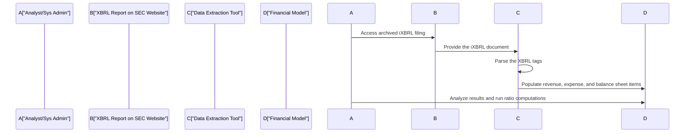

## Overview of XBRL in Modern Financial Reporting

The steady push toward transparency, comparability, and timeliness in financial reporting has propelled XBRL (eXtensible Business Reporting Language) to the forefront of global disclosure standards. Perhaps you’ve heard a classmate or colleague exclaim something like, “Oh, I used to spend ages tapping numbers from PDF reports into Excel, but now I can pull them directly from XBRL data.” That, in a nutshell, reflects the heart of XBRL’s attraction: it transforms how analysts, regulators, and investors consume and analyze financial data.

In this article, we’ll explore the evolution of XBRL, the benefits and challenges of adopting global digital reporting, and practical applications as you cultivate the analytical skill set expected of a CFA Level III candidate. We’ll also highlight relevant best practices and potential exam-question angles, ensuring that you can weave these concepts into a robust portfolio-management or reporting-quality framework.

## Defining XBRL and Its Growing Importance

XBRL is an open, royalty-free specification designed to make the exchange of financial statements more efficient. It assigns machine-readable “tags” to each piece of data within the statements. These tags transform unstructured data (like that found in HTML or PDF documents) into structured data that is easily extracted, compared, and analyzed by machines.

• Enhanced Comparability: When every element of a financial report—like “Revenue” or “Operating Cash Flow”—is mapped to a unique XBRL tag, comparing statements across multiple companies becomes smoother. This is particularly relevant for portfolio managers tracking performance across industries.  
• Improved Efficiency: Automated data collection saves time and reduces manual input errors. Instead of sifting through entire reports line by line, analysts can systematically pull the information needed for ratio analysis or cash flow projections.  
• Regulatory Embrace: Several major regulatory agencies, including the U.S. Securities and Exchange Commission (SEC), the European Securities and Markets Authority (ESMA), and some Asian regulatory bodies, mandate or strongly encourage corporate issuers to file XBRL reports.

XBRL is not just a fancy piece of technology. It complements the push by standard-setters—such as the International Accounting Standards Board (IASB) for IFRS and the Financial Accounting Standards Board (FASB) for US GAAP—toward greater consistency in how companies worldwide disclose financial information.

## Key Concepts and Terminology

Before diving deeper, let’s clarify some fundamental XBRL-related terms:

• Taxonomy: In XBRL, a taxonomy is the hierarchical dictionary of concepts that defines how data should be tagged. Picture a giant reference book specifying tags for “Net Income,” “Accounts Receivable,” “Depreciation,” and hundreds of other items. Regulators and accounting standard-setters often maintain these taxonomies to align with IFRS or US GAAP.  
• Inline XBRL (iXBRL): Traditional XBRL files can be difficult for a layperson (or even a finance pro) to read in raw format. Inline XBRL merges the human-readable HTML (the text we see in a standard report) with embedded XBRL tags (the machine-readable data). This approach simplifies the distribution of a single report that is both visually accessible and automatically extractable.  
• Structured Data: Data that follows a standardized model. With XBRL, each piece of financial data sits in a well-defined slot, making it straightforward to retrieve, compare, and aggregate.

## Regulatory Landscape and Global Adoption

### U.S. SEC Requirements

In the United States, the SEC has systematically mandated XBRL submissions for public companies. Large accelerated filers led the way, and now, essentially all filers use XBRL or Inline XBRL formats for annual and quarterly reports (10-Ks and 10-Qs). For the CFA Level III exam, you might see scenario questions referencing U.S. companies, requiring you to interpret or compare extracted XBRL data. Mastering XBRL-based analysis can sharpen your ability to evaluate industry peers quickly.

### European ESEF

In Europe, the European Single Electronic Format (ESEF) sets forth requirements for companies listed in the European Union to file Inline XBRL reports. This initiative aims to enhance cross-border comparison and reduce complexity so that a Spanish-based bank and a German-based manufacturing conglomerate can be more easily benchmarked, for instance.

### Asia-Pacific Examples

Regulators in Japan, China, Singapore, and other countries in the Asia-Pacific region also encourage or mandate XBRL filings for listed companies. The overarching goal is consistent: use standardized approaches for faster, more accurate data exchange.

### Future Trajectory

The consistent theme across jurisdictions is to phase out purely unstructured reports in favor of structured or partially structured formats (like iXBRL). As an analyst—especially at a Level III standard where you might be constructing multi-asset portfolios, blending best-of-breed companies from around the globe or performing cross-country analysis—the advantage of having all your target firms’ data in a standardized format is invaluable.

## Benefits and Challenges of XBRL Adoption

### Major Benefits

1. Efficiency Gains  
   For portfolio rebalancing, it can be critical to swiftly analyze P/E ratios, liquidity measures, or risk metrics for dozens (or even hundreds) of stocks. XBRL-based data feeds make real-time analysis feasible, letting you scrape or query data electronically without rummaging through each company’s PDF footnotes.

2. Reduced Errors  
   Manual keying of data is error-prone. By using XBRL, the risk of transcription slips or misaligned line items shrinks substantially. This reliability is crucial for deriving accurate projections in advanced portfolio optimization tasks or factor-model applications.

3. Enhanced Transparency  
   XBRL’s granularity can show how a company’s numbers tie back to specific line items. Stakeholders get deeper, more consistent insights into earnings quality, changes in depreciation methods over time, or shifts in revenue recognition. This transparency is also embraced by the CFA Institute Code of Ethics and Standards, which promotes clarity in financial communication.

### Common Challenges

1. Taxonomy Nuances  
   Different jurisdictions might adopt slightly different taxonomies: the IFRS taxonomy, the US GAAP taxonomy, or local variants. Mismatched tags or partial overlap can cause confusion when comparing companies that use different reporting standards. A retail firm under IFRS might use one set of tags for intangible assets; a U.S. firm under US GAAP might label them differently.  
2. Data Quality Issues  
   Even though the XBRL framework aims for consistency, some issuers may tag data inappropriately. New or unusual transactions can be mislabeled, requiring thorough due diligence by the analyst.  
3. Initial Setup and Costs  
   Companies face an initial learning curve: staff must learn how to map line items to the correct tags. External consultants may be needed, which can raise compliance costs.

## Practical Financial Examples

Imagine you’re a portfolio manager constructing a global equity portfolio. You want to identify undervalued consumer staples companies that also maintain healthy liquidity. With XBRL data, you could:

• Pull standardized line items—like revenue, cost of goods sold, total current assets, total current liabilities, and net operating cash flow—for 50 international companies at once.  
• Compute key metrics (e.g., the Current Ratio, Cash Conversion Cycle, Trend in Cash Flow from Operations) using Python code or specialized software.  
• Compare them in a single table, sorted by region, revenue growth, or profitability to identify the most promising undervalued picks.  

Below is a simplified schematic using a Mermaid.js sequence diagram to illustrate how an XBRL-based data retrieval might occur:



In a matter of minutes, you’d have the data structured for ratio analysis, trend analysis, or integration into your asset-allocation model. Contrast that with the old method of manually copying and pasting from PDFs. One slip of the mouse or transposing digits could compromise the entire dataset.

## Practical Steps and Best Practices

1. Get Comfortable with Taxonomies  
   If you’re analyzing IFRS reporters, familiarize yourself with the IFRS taxonomy published by the IFRS Foundation. If it’s a U.S. company, understand the US GAAP taxonomy from the Financial Accounting Standards Board.

2. Leverage Automation Tools  
   Many analytics platforms and data providers already integrate XBRL-based data feeds. You can also build your own scripts. For instance, in Python, libraries such as “sec-edgar-downloader” or specialized XBRL modules can automatically fetch and parse XBRL files from regulatory websites.

   Here’s a tiny snippet to illustrate the concept (though not fully production-ready):

   ```python
   import requests

   # Hypothetical function to parse iXBRL data from a downloaded file
   def parse_ixbrl(file_path):
       # Logic to parse the iXBRL tags
       pass

   # Example usage
   url = "http://www.sec.gov/Archives/edgar/data/0000320193/0000320193-23-000007-index.htm"
   response = requests.get(url)
   if response.status_code == 200:
       with open("apple_10q_ixbrl.html", "wb") as f:
           f.write(response.content)
       data = parse_ixbrl("apple_10q_ixbrl.html")
       # Now 'data' might contain a structure with line items like Revenue, Net Income, etc.
   ```

3. Verify the Data Quality  
   Even if the platform tags data automatically, you should cross-check key figures such as Net Income or Total Assets for plausibility. Odd tagging is relatively rare, but it can happen.

4. Compare Across Filers  
   When analyzing potential M&A targets or setting up an investment thesis, see if the taxonomy usage is consistent across companies to ensure your ratio analysis is on an “apples-to-apples” basis.

5. Keep Abreast of Regulatory Developments  
   XBRL frameworks evolve alongside changes in accounting standards. For example, IFRS 16 (Leases) introduced new balance sheet items, and these had to be tagged appropriately. Monitoring these changes helps avoid potential misinterpretation in real-world analysis.

## Inline XBRL: Convergence of Human and Machine Needs

Inline XBRL represents a significant evolution in digital reporting. Instead of requiring two separate documents—a visually readable report (like HTML) and a separate machine-only XBRL file—issuers embed the tags directly in an HTML document. Users see the normal text but can also run data extraction processes behind the scenes.

### Why Analysts Should Care

• Simplifies Data Retrieval: Data containers are embedded in the core document, so you don’t need to hunt for separate files.  
• Reduces Version Control Issues: The single unified document ensures no mismatch between the “nice” version of the annual report and the “tagged” file.  
• Forensic Analysis: If you suspect a discrepancy in how a number has been reported, you can drill down right there in the inline version.

## Digital Reporting Beyond XBRL

While XBRL is a major part of the conversation, it’s also important to recognize that digital reporting goes beyond plain financial statements. Many issuers—and not just in high-tech industries—produce supplementary data (sustainability metrics, operational KPIs, product pipeline details) in digital-friendly formats. For instance, in some jurisdictions, ESG data submissions also rely on structured digital taxonomies reminiscent of XBRL. That’s a growing focus area in asset management, especially for socially responsible investment strategies.

If you consider data from IFRS vs. US GAAP vs. local GAAP standards, plus potential ESG metrics, plus management commentary, you’ll quickly see how robust digital reporting can drive multifaceted analyses that feed directly into advanced portfolio construction and risk oversight.

## Potential Pitfalls and Common Misconceptions

1. “XBRL Eliminates All Manual Work.”  
   Not entirely. It drastically reduces the grunt work of data gathering, but users still need to verify data completeness and check for inconsistent tagging.  
2. “All Companies Have Identical Tag Structures.”  
   Each region, and sometimes each industry, might come with unique extension tags. XBRL has core tags, but companies can create custom ones if a standard element doesn’t capture what they’re reporting.  
3. “XBRL Replaces Fundamental Analysis.”  
   XBRL speeds up the data collection side of fundamental analysis, but the interpretive aspects—spotting changes in strategies, analyzing intangible assets, or recognizing revenue pattern shifts—still require a skilled analyst’s judgment.

## Personal Reflections: The Early Days of XBRL

I remember, early in my career, rummaging through hundreds of pages in a pharmaceutical company’s annual report to dissect R&D expenses for a potential biotech M&A deal. It felt like searching for a needle in a giant stack of numbers. When the company switched to XBRL-based filings, the difference was night and day: extracting R&D details by quarter, by region, or by project type became so much quicker. Did it make me lazy? Actually, no. It freed me up to do more strategic thinking, like mapping out how R&D changes correlated with pipeline expansions or how these shifts impacted valuations for potential suitors.

## Integrating XBRL Insights into the CFA Level III Curriculum

At the Level III stage, your ability to interpret and combine data from diverse sources is critical, especially for portfolio optimization, risk analysis, and performance measurement. In an item set question, examiners might give you partial XBRL data from two different companies—say, a firm following IFRS and another following US GAAP—and require you to:

• Calculate adjusted metrics, such as free cash flow, using the provided tags.  
• Compare segment-level profitability or liquidity.  
• Discuss how the differences in tagging or taxonomy hamper direct ratio comparison.  

You might also face a constructed-response (essay) question where you have to:

• Propose how to standardize the data for better comparability.  
• Critique the quality of the reported figures based on potential tagging errors or incomplete XBRL disclosures.  
• Suggest enhancements to the firm’s financial reporting process to align with best practices in digital reporting.

Hence, a thorough understanding of how XBRL influences the speed, accuracy, and transparency of disclosures can be a subtle advantage when tackling the more complex data-driven vignettes.

## Exam Tips: Handling XBRL and Digital Reporting on the CFA Level III

1. Familiarize Yourself with Tagging Concepts: You don’t need to memorize every XBRL tag, but you should understand how major line items (Revenue, Net Income, Operating Cash Flow) fit into the tags.  
2. Recognize Potential IFRS and US GAAP Discrepancies: Watch for subtle differences in labeling or the classification of certain items (e.g., interest paid, which can be in operating or financing to IFRS filers).  
3. Practice Cross-Comparisons: Challenge yourself by looking at XBRL-based data from companies in different sectors. Notice how an extension tag might distort comparability or require additional adjustments.  
4. Time Management in the Exam: XBRL topics might appear within a broader “Financial Reporting Quality” or “Performance Evaluation” question. Don’t overspend time on the minor details of XBRL if the question merely wants you to interpret the data quickly.

## References and Further Reading

• XBRL International – Official website: [https://www.xbrl.org](https://www.xbrl.org)  
• SEC Structured Data Resources – [https://www.sec.gov/structureddata](https://www.sec.gov/structureddata)  
• IFRS Foundation Taxonomy – [https://www.ifrs.org/issued-standards/ifrs-taxonomy/](https://www.ifrs.org/issued-standards/ifrs-taxonomy/)  
• “ESEF Reporting” by ESMA – [https://www.esma.europa.eu/esef-reporting-manual](https://www.esma.europa.eu/esef-reporting-manual)  

Feel free to explore how top data vendors (Bloomberg, Thomson Reuters, etc.) incorporate XBRL in their offerings, as these real-world resources mirror the advanced tasks you might face as a practicing analyst.

------------------------------

## Test Your Knowledge: XBRL and Digital Reporting Essentials



### Which of the following best describes the purpose of XBRL in financial reporting?

- [ ] To replace all narrative disclosures in annual reports.
- [x] To standardize and tag financial information for easier extraction and analysis.
- [ ] To eliminate regulatory oversight of financial statements.
- [ ] To enforce mandatory IFRS adoption worldwide.

> **Explanation:** XBRL simplifies financial data extraction and comparison by tagging each line item in standardized formats. It does not replace qualitative disclosures nor enforce IFRS universally.

### What is a key advantage of using Inline XBRL (iXBRL)?

- [x] It embeds machine-readable tags within a human-readable HTML document.
- [ ] It only allows disclosures for intangible assets and lease obligations.
- [ ] It makes the extended taxonomy obsolete.
- [ ] It is accessible to regulators but not to public investors.

> **Explanation:** iXBRL allows the same disclosure file to be both human- and machine-readable. It simplifies maintenance and distribution, ensuring data quality and consistency.

### In the context of XBRL taxonomies, "extensions" are:

- [ ] A universal set of mandatory tags imposed by IFRS.
- [x] Custom tags that companies create to capture unique items not covered by the standard taxonomy.
- [ ] Regulatory platforms used for auditing.
- [ ] Special tags that only apply to pension accounting disclosures.

> **Explanation:** Extensions are user-defined tags used to supplement standard taxonomies when a company’s financial statement items do not fit existing labels.

### How can XBRL reduce the risk of manual data-processing errors?

- [x] By allowing direct electronic extraction of tagged financial data.
- [ ] By removing the need for footnotes in financial statements.
- [ ] By prohibiting management estimates requiring manual inputs.
- [ ] By automatically rewriting the entire annual report in plain text.

> **Explanation:** Once properly tagged, data can be captured and processed electronically. This limits the need for multiple layers of manual transcription, thus mitigating keying or transcription mistakes.

### Which of the following is a challenge when comparing XBRL financial statements from companies following different standards?

- [x] Potential mismatch in taxonomy usage and extension tags.
- [ ] Different languages used in the footnotes.
- [x] The possibility that IFRS and US GAAP define certain line items differently.
- [ ] The complete absence of intangible asset reporting under US GAAP.

> **Explanation:** Different standard-setters publishing different taxonomies can complicate direct comparisons. Companies may also create or use extension tags. IFRS vs. US GAAP differences in how line items are defined add to the challenge.

### A primary regulatory driver behind global XBRL mandates is:

- [x] To enhance the comparability and transparency of financial disclosures.
- [ ] To limit ESG reporting to IFRS filers.
- [ ] To automate internal auditing within each organization.
- [ ] To prohibit private companies from issuing financial data.

> **Explanation:** Regulators seek greater transparency, consistency, and comparability; XBRL addresses these aims by providing a standardized means to communicate financial data.

### An example of a scenario question in the CFA Level III exam might be:

- [x] Assessing the impact of differently tagged inventory methods on liquidity ratios.
- [ ] Discussing local government tax codes with no reference to financial statements.
- [x] Comparing the iXBRL disclosures of two merging companies under different GAAP frameworks.
- [ ] Calculating the entire triple exponential smoothing of stock price data.

> **Explanation:** The exam typically tests cross-company comparisons, IFRS/US GAAP differences, and data extraction from structured reports. Mergers, acquisitions, or cross-border analysis are common contexts.

### A key advantage of structured data is:

- [x] Enhanced machine-readability enabling systematic analysis across large data sets.
- [ ] Complete elimination of financial footnotes.
- [ ] Restriction of comparability to companies in the same industry.
- [ ] Mandatory intangible asset reclassification.

> **Explanation:** Structured data (like XBRL) makes broad, automated comparison feasible, which improves efficiency in analyzing large volumes of financial information.

### Which of the following statements about XBRL is true?

- [x] Regulators worldwide, including the SEC, often mandate XBRL submissions to promote transparency.
- [ ] It is only relevant for technology companies.
- [ ] It exclusively focuses on footnote disclosures, ignoring primary statements.
- [ ] It prevents IFRS filers from creating custom line items.

> **Explanation:** XBRL is widely mandated or encouraged by regulatory agencies. It is relevant across all industries and encompasses both primary statements and footnotes, enabling custom extensions where needed.

### True or False: XBRL can streamline data extraction, but it still requires analysts to interpret the context and quality of the reported figures.

- [x] True
- [ ] False

> **Explanation:** While XBRL helps in automating data collection, analysts must still apply professional judgment and maintain vigilance regarding data consistency, context, and economic meaning.


