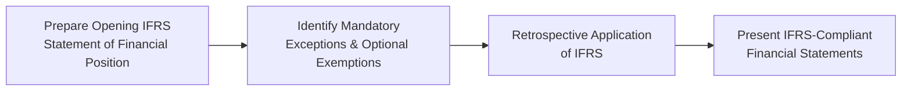

## Introduction and Context

Interim reporting and first-time adoption of International Financial Reporting Standards (IFRS) can occasionally feel like you’re trying to solve a puzzle with missing pieces—especially if your company’s business model is highly seasonal or has complex transactions. I once consulted for a retail chain that sold a big percentage of their products over the holiday season, and you can imagine how their interim financials looked so different from quarter to quarter. It taught me the importance of deeply understanding seasonal patterns and ensuring that quarterly reporting stays consistent but still informative. 

Below, we’ll explore how interim reporting works under IAS 34 and US GAAP, examine the guidance offered by IFRS 1 for first-time adopters, and highlight the analytical nuances that can help you interpret results more effectively, which is all crucial if you’re preparing for advanced financial exams (including the CFA) or working in a role that needs you to analyze financial statements in detail.

## Overview of Interim Reporting

Interim reports generally refer to financial statements for periods shorter than a full fiscal year—often quarterly or semiannual statements. From an investor’s or analyst’s perspective, these statements act like “progress reports” that keep you updated on a company’s performance throughout the year, long before the annual results are published.

### The Purpose of Interim Financial Statements

• Timeliness vs. Comprehensiveness: Interim statements aim to provide timely updates on key financial metrics while avoiding the level of detail typical of annual reports.  
• Decision-Making: Investors, analysts, and regulatory agencies use interim financials to spot trends, detect anomalies, and forecast future performance or risks.

### Interim Reporting Under IAS 34

International Accounting Standard (IAS) 34, “Interim Financial Reporting,” sets out the minimum content that companies must disclose in their interim reports, focusing on updated insights rather than repeating annual disclosures or presenting exhaustive notes. Some key points:  
• Condensed Format: Companies typically provide condensed statements of financial position, comprehensive income, changes in equity, and cash flows.  
• Significant Changes Only: IAS 34 encourages focusing on significant changes in financial position and performance since the last annual reporting date.  
• Consistency Principle: The same accounting policies used in the most recent annual statements should generally be applied to interim reports, ensuring comparability. However, if policies change, a transparent disclosure explaining the rationale is required.  
• Practical Illustrations: Imagine a manufacturing company that changes its revenue recognition policy after an IFRS update. Under IAS 34, the company must clearly disclose the effect of this change in its quarterly or semiannual statements.

### Interim Reporting Under US GAAP

In the US, public companies file quarterly financial statements on Form 10-Q with the Securities and Exchange Commission (SEC). Key guidance for interim reporting is contained in ASC 270 (“Interim Reporting”):  
• Minimum Disclosures: While there isn’t always a requirement for fully audited statements each quarter, consistency in accounting policies and comparability with annual data remain top priorities.  
• Comparative Statements: Typically, Form 10-Q includes comparative financial statements for the equivalent interim period in the prior fiscal year and the preceding year-end balance sheet.  
• Additional SEC Guidance: The SEC often requires more granular disclosures (e.g., management’s discussion and analysis (MD&A)) to give the public a proper understanding of what drives changes in financial performance between reporting periods.

## Key Analytical Considerations for Interim Reporting

### Seasonality and Cyclical Industries

Many companies have seasonal fluctuations—think of retail, hospitality, or agricultural businesses. Analyzing a ski resort’s second-quarter statements might show surprisingly low revenue if the second quarter falls in the off-season. As an analyst, it’s crucial to:  
• Compare the same interim periods across multiple years to identify consistent seasonal patterns.  
• Look at rolling 12-month data or year-to-date totals to neutralize seasonality’s effect when possible.  
• Evaluate working capital changes, especially in cyclical industries that stock up inventory for peak seasons.

### Comparability Across Interim Periods

Another factor is ensuring consistent application of accounting policies across all interim periods. If a company changes its inventory valuation method (for instance, from FIFO to weighted average) in the second quarter, you need to verify how that impacts the comparability of that quarter with earlier quarters. The more consistent the policies, the easier it is to spot real operational trends.

### Emerging Trends and Anomalies

Interim data can reveal early red flags, such as unusual spikes in expenses or abrupt changes in revenue mix. Because you get updates more frequently than once a year, you can catch potential issues sooner—like a sudden decline in gross margin. At the same time, an anomaly might just be a one-off event such as a large legal settlement, so read the footnotes for clues about whether a surprise item is persistent or nonrecurring.

## First-Time Adoption of IFRS (IFRS 1)

Moving on, let’s talk about companies transitioning to IFRS for the first time under IFRS 1, “First-Time Adoption of International Financial Reporting Standards.” If you’ve seen IFRS 1 in action, you know it’s all about ensuring comparability while acknowledging that retrospective application of every single IFRS requirement can be incredibly burdensome.

### Objectives of IFRS 1

• Consistent Application: Companies adopting IFRS for the first time should prepare financials as if they had always followed IFRS.  
• Avoid Overly Complex Hurdles: IFRS 1 provides exemptions (both mandatory exceptions and optional exemptions) to limit the cost or difficulty of full retrospective application.

### Mandatory Exceptions vs. Optional Exemptions

1. Mandatory Exceptions: Certain requirements cannot be applied retrospectively. This might include hedge accounting if the hedge relationships did not exist under previous GAAP.  
2. Optional Exemptions: IFRS 1 offers choices in areas like business combinations, fair value remeasurement of property, plant, and equipment, or certain employee benefits. Taking advantage of these exemptions can simplify the transition process.

Below is a simple flowchart illustrating the typical IFRS 1 transition path:



### Reconciliation and Disclosures

Companies must disclose:  
• Reconciliations: How equity and profit/loss from prior GAAP translate to IFRS at the transition date and at the end of the last period prior to transition.  
• Narrative Explanations: Summaries of main adjustments so that users can understand the reasons behind them.  

For instance, if intangible assets were not recorded under local GAAP but IFRS requires them to be recognized, the reconciliation statement should highlight how equity is increased by the previously unrecognized intangible’s carrying amount.

### Numeric Example of IFRS 1 Adjustments

Suppose Company X is transitioning from Local GAAP to IFRS, effective January 1, 20X5. Under Local GAAP, the company:  
• Did not recognize a customer list acquired in a past business combination (valued at $500,000).  
• Used the completed-contract method for revenue recognition on certain long-term projects, whereas IFRS demands a percentage-of-completion approach.

At the transition date (January 1, 20X5):  
• The opening retained earnings under IFRS might be adjusted upward by $500,000 for the newly recognized intangible asset, offset by deferred tax implications.  
• The revenue recognized for those ongoing projects might be higher or lower depending on how local GAAP timing of revenue recognition differed from IFRS.

A high-level reconciliation could look like:

| Item                                                             | Amount (USD)  |
|------------------------------------------------------------------|---------------|
| Retained Earnings (Local GAAP) at 12/31/20X4                     | 2,000,000     |
| Add: Recognition of acquired customer list                       | +500,000      |
| Less: Deferred tax liability on intangible asset (at 30% rate)   | −150,000      |
| Add/ (Less): Adjustments for long-term revenue contracts         | ± (varies)    |
| Retained Earnings (IFRS) at 1/1/20X5                             | 2,350,000 ±   |

This simplified illustration shows that you have to be vigilant about the impact of IFRS 1 adjustments on equity, income, and deferred taxes.  

## Analytical Insights for First-Time IFRS Adopters

1. **Comparability Over Time**: Analysts must remember that when IFRS is adopted, the historical numbers might be restated, making it tricky to do direct before-and-after comparisons unless the restatement is thoroughly documented.  
2. **Impact on Performance Ratios**: Changes in the classification or measurement of assets and liabilities—especially intangible assets or property, plant, and equipment—can alter leverage, coverage, and profitability ratios.  
3. **Ongoing Policy Choices**: Even after first-time adoption, management can revisit certain policy selections or remeasurements, impacting forward-looking analysis.  
4. **Seasoned vs. New IFRS Preparers**: A first-time adopter might see more volatility in their reported figures as they iron out the complexities of IFRS. Seasoned IFRS practitioners typically have more stable numeric trends.

## Bringing It All Together

### Interim Reporting Meets First-Time Adoption

Occasionally, companies adopt IFRS mid-year, which means their interim financial statements could simultaneously reflect the transitional adjustments of IFRS 1. In such a scenario:  
• You might see footnotes specifying IFRS vs. local GAAP figures for each line item.  
• Analysts should remain alert for unusual “blips” caused by changes in revenue or expense recognition.  
• Consistency is essential. The newly adopted IFRS policies should be applied for all interim periods going forward.

### Pitfalls and Best Practices

• Pitfall: Overlooking Seasonality in Interim Analysis. Failing to compare quarter-to-quarter data on a year-over-year basis can lead to misguided conclusions about performance.  
• Pitfall: Neglecting Disclosure Changes from IFRS 1. If a significant intangible asset or provision wasn’t recognized under previous standards, it might suddenly appear under IFRS—seriously impacting net income or equity.  
• Best Practice: Use internal management reports (if available) to supplement your analysis of interim disclosures and IFRS 1 reconciliations.  
• Best Practice: Validate consistency of key policies—particularly revenue recognition, inventory valuation, and intangible asset treatment—when bridging local GAAP to IFRS.

## Helpful Python Snippet for Financial Comparisons

Occasionally, you may want to automate comparisons of line items between interim and annual statements or even local GAAP vs. IFRS. Here’s a tiny snippet in Python that merges two data sets (e.g., local GAAP and IFRS figures) based on a common key, then computes differences:

```python
import pandas as pd

df_local = pd.DataFrame({
    'Account': ['Revenue', 'COGS', 'Net Income'],
    'Amount': [1000, 600, 200]
})

df_ifrs = pd.DataFrame({
    'Account': ['Revenue', 'COGS', 'Net Income'],
    'Amount': [1100, 610, 220]
})

df_merged = pd.merge(df_local, df_ifrs, on='Account', suffixes=('_local', '_ifrs'))
df_merged['Difference'] = df_merged['Amount_ifrs'] - df_merged['Amount_local']
print(df_merged)
```

Running this might reveal how different IFRS assumptions shift your final tallies—a practical tool for analyzing reconciliations.

## Final Exam Tips: Working with Interim and First-Time Adoption Data

1. **Watch the Footnotes:** Both interim reports and IFRS 1 transitions hinge on disclosures that clarify the “why” behind changes, not just the “what.”  
2. **Practice Seasonal Comparisons:** Especially for industries like retail, tourism, or agriculture, do table-based or chart-based analyses that capture multi-year trends for the same quarter.  
3. **Understand Exemptions in IFRS 1:** Be prepared to discuss how a specific IFRS 1 optional exemption (e.g., revaluing property at fair value) can significantly alter financial ratios.  
4. **Use Systematic Checklists:** If you suspect an interim report might not adhere strictly to consistency or if IFRS adoption is incomplete, a standardized checklist helps you spot missing details.  
5. **Exam Constructed Responses:** On exam day, you could be asked to interpret partial reconciliations or analyze the effect of IFRS 1 on a company’s ROE, leverage, or profitability. Be ready to do quick ratio recalculations.

## Additional References

- IAS 34: Interim Financial Reporting  
- IFRS 1: First-Time Adoption of International Financial Reporting Standards  
- ASC 270 (US GAAP): Interim Reporting  
- ASC 805 for Business Combinations References (helpful if exploring optional exemptions)  
- Official IFRS Foundation Website: https://www.ifrs.org

## Test Your Knowledge: IFRS 1 and Interim Reporting Quiz



### Which of the following is true about IAS 34 and interim reporting?
- [ ] It requires full year-end disclosures in every quarterly report.
- [x] It focuses on significant changes in financial position and performance since the last annual reporting date.
- [ ] It mandates that all footnotes from the annual report be repeated quarterly.
- [ ] It only applies to companies in cyclical industries.

> **Explanation:** IAS 34 aims to provide an update on the latest financial performance without the burden of duplicating full annual disclosures.

### In US GAAP, what is the principal guidance that covers interim reporting requirements for public companies?
- [ ] ASC 810
- [x] ASC 270
- [ ] ASC 606
- [ ] ASC 840

> **Explanation:** ASC 270, “Interim Reporting,” outlines how US public companies should structure their quarterly financial statements.

### Which of the following best describes the term “seasonality” in the context of interim reporting?
- [ ] A consistent trend over multiple annual periods.
- [ ] The effect of inflation on revenue recognition.
- [x] Periodic fluctuations in sales or earnings associated with time-based cycles.
- [ ] A requirement to disclose only certain balance sheet items.

> **Explanation:** Seasonality refers to predictable fluctuations in business operations that occur at certain times of the year, impacting sales and earnings.

### IFRS 1 requires the retrospective application of IFRS. Which statement below is most accurate?
- [ ] There are no exemptions, so complete retrospective restatement is always mandatory.
- [ ] Exemptions only apply to segment reporting.
- [x] Certain optional exemptions are available, easing the burden of retrospective restatement.
- [ ] IFRS 1 allows only prospective application of IFRS.

> **Explanation:** IFRS 1 has both mandatory exceptions and optional exemptions to help companies simplify the transition process.

### Suppose a company transitioning to IFRS under IFRS 1 did not previously recognize an intangible asset worth $400,000 but now must recognize it. What is the primary impact on the company’s equity?
- [x] Equity will increase by the carrying amount of the intangible asset, net of any deferred taxes.
- [ ] Equity remains the same but liabilities increase.
- [ ] Equity and liabilities both remain unchanged.
- [ ] Equity decreases because intangible assets reduce reported profitability.

> **Explanation:** Recognizing an intangible asset typically increases assets and equity, though it may create a related deferred tax liability.

### Under IAS 34, a company typically discloses which of the following in its interim financial statements?
- [ ] Only a condensed statement of profit or loss.
- [x] Condensed statements of financial position, comprehensive income, changes in equity, and cash flows.
- [ ] No comparative information for prior periods.
- [ ] Full notes identical to annual reports.

> **Explanation:** IAS 34 requires condensed versions of core financial statements and selected explanatory notes, focusing on changes since the last annual report.

### Identify one typical pitfall when analyzing companies with strong seasonality:
- [ ] Overreliance on forward guidance from competitors.
- [x] Comparing consecutive quarters without factoring in seasonal fluctuations.
- [ ] Using annual data for trend analysis.
- [ ] Including non-cash items in net income.

> **Explanation:** You usually want to compare similar quarters across years to account for seasonal effects, not back-to-back quarters.

### Under US GAAP’s interim reporting requirements, how often must public companies typically file their condensed financial statements?
- [ ] Monthly
- [x] Quarterly
- [ ] Semiannually
- [ ] Annually

> **Explanation:** US publicly listed firms file on a quarterly basis, typically using Form 10-Q.

### When first adopting IFRS, a company must:
- [x] Present at least one year of comparative IFRS financial statements and an opening IFRS statement of financial position.
- [ ] Present only the current period under IFRS.
- [ ] Rely on local GAAP figures if year-end audited accounts are not available.
- [ ] Use IFRS only for disclosures, not measurement.

> **Explanation:** IFRS 1 requires an opening statement of financial position at the date of transition and comparative figures under IFRS for at least one prior period.

### True or False: Under IFRS 1, a company can elect to use fair value as the deemed cost of certain assets at the date of transition.
- [x] True
- [ ] False

> **Explanation:** IFRS 1 permits an entity to measure certain items of property, plant, and equipment at fair value when transitioning to IFRS, treating that fair value as “deemed cost.”


