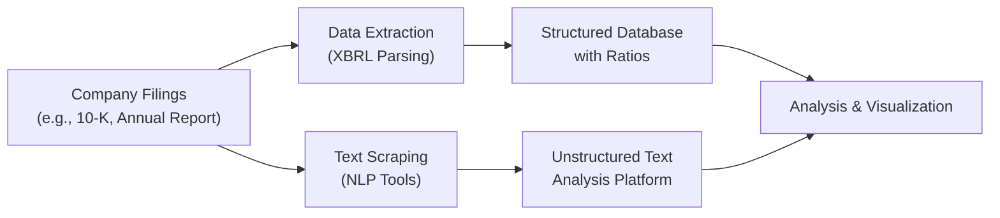

## Background and Overview

Data analytics is revolutionizing the way we interpret financial disclosures. If you’re anything like me, you’ve probably spent countless hours wading through 100-page annual reports, highlighting line items, comparing line notes, and trying to figure out exactly where a firm might be hiding a risk factor or employing an aggressive accounting choice. Well, those days aren’t over completely, but they’re way easier now. With the power of Big Data, machine learning, and text mining, we can analyze a company’s financial statements, footnotes, and regulatory filings more efficiently. This is increasingly important when preparing for an exam or a professional setting, because it helps us quickly spot anomalies, assess sentiment, and even watch for possible misstatements in real time.

Below, we’ll explore the types of data involved in financial disclosures (structured vs. unstructured), how advanced techniques like Natural Language Processing (NLP) can reveal hidden insights, why real-time surveillance matters, and what it might look like to use specialized tools and platforms. We’ll also discuss how these methods fit in with IFRS, US GAAP, or other regulatory frameworks—useful knowledge if you’re a candidate looking to up-level your analysis in the financial statement arena.

## Big Data and Textual Analysis

Let’s start with the elephant in the room: the sheer volume of information. Historically, analysis was limited by how many staff hours you wanted to devote to reading every single footnote or gleaning tidbits from the Management Discussion and Analysis (MD&A). Nowadays, Big Data techniques allow us to process massive quantities of data—both quantitative figures and qualitative narratives—in a flash.

• Textual Analysis and Sentiment: AI-driven textual analysis tools can parse entire annual reports or press releases and gauge the overall sentiment (positive, negative, neutral). It’s kind of mind-blowing to see an algorithm circle the exact paragraphs that might contain hidden warnings about liquidity risks or negative forward-looking statements.

• Anomaly and Risk Detection: Machine learning models can spot outliers in large datasets of financial statements, indicating potential red flags in revenue recognition, cost capitalization, or presentation. These are the sorts of “needle-in-a-haystack” issues that can be easily overlooked if you’re poring over hundreds of pages.

• Emerging Trends and Themes: By aggregating textual data from multiple companies, Big Data analysis helps you detect cross-industry shifts. For instance, if a certain risk factor—like supply chain disruption—appears more frequently in a particular sector, you could see it flagged in real-time across many disclosures.

## Structured vs. Unstructured Data

When we talk about data analytics for financial disclosures, it helps to divide data into two large buckets:

• Structured Data: This typically includes XBRL-tagged items from income statements, balance sheets, and statements of cash flows. Structured data is basically the easy-to-digest tabular data that you can directly feed into your ratio analysis models. Think: total revenue, net income, operating cash flow. Everything is labeled, making it straightforward for KPI calculations or ratio computations.

• Unstructured Data: This includes the MD&A narratives, risk factor descriptions, footnotes, and audit reports—basically the free text. Honestly, I used to skip large swaths of it until I realized that’s where a wealth of disclaimers and warnings hide. Nowadays, we rely heavily on NLP and deep learning to parse these text blocks. We can label the sentiment, detect frequent co-occurrences of words like, “impairment,” “material weakness,” or “litigation,” and figure out whether a firm is subtly anticipating big problems in the near future.

Here’s a quick schematic of how data typically flows from source documents to advanced analytics tools:



In this diagram, structured data flows into a database for ratio analysis, while unstructured text is processed by specialized NLP or text analytics platforms. Both eventually converge in a final analysis and visualization layer.

## Real-Time Surveillance

An exciting frontier in financial analysis is real-time surveillance. Regulators, analysts, and even sophisticated investors are turning to automated systems that monitor markets, corporate announcements, and social media to detect unusual patterns. For instance:

• Intraday Textual Events: When a firm issues a press release or revised guidance, real-time algorithms can instantly evaluate the text for negative or positive sentiment. This speeds up decision-making for traders or corporate intelligence teams that respond to breaking news.

• Trading Anomalies: If trading volume spikes significantly in tandem with specific language in an 8-K filing (in the US context), real-time analytics might catch that. Regulators can investigate potential insider trading or market manipulation based on these patterns.

• Early Warnings: Real-time analysis can notify risk officers or portfolio managers when financial statements deviate from established norms. For example, if a firm consistently reported revenues in a carefully structured storyline but suddenly changes how it references top-line growth, that might be a canary in the coal mine.

Personally, I remember working on a project for a major financial services firm aimed at spotting outlier risk language in footnotes. We used a text-classification model that generated alerts whenever a footnote contained novel disclaimers or language significantly different from prior filings. It was unbelievably helpful in real-time risk assessments, especially during earnings season, when you’d have a flood of new disclosures all at once.

## Tools for Ingesting XBRL and Textual Disclosures

At this point, you might be thinking, “This is great, but I’m not a machine learning developer, so how do I actually do this?” Good news: there are accessible platforms and open-source libraries to accomplish a lot of the analysis with minimal coding. For example:

• Off-the-Shelf Analytics Platforms: Bloomberg, S&P Capital IQ, and Refinitiv each have modules to process structured data and increasingly incorporate textual analysis. Some regulators even provide direct feeds of XBRL-tagged data for corporations, letting you skip the messy conversion.

• Python Libraries: Tools like pandas are perfect for reading structured data once you’ve parsed or downloaded XBRL feeds. For text analytics, libraries like spaCy, NLTK, and Hugging Face Transformers let you classify, extract, and score text from thousands of disclosures in minutes. The NLTK library, for instance, has built-in tools for sentiment analysis, tokenizing text, etc. spaCy offers an entire NLP pipeline that can handle large volumes of text quickly.

• Cloud Services: AWS, Azure, and Google Cloud all offer NLP and auto ML solutions. These are especially helpful if you don’t want to manage your own hardware or install specialized software on your machine.

From a real-world scenario: imagine you’re analyzing 50 large-cap tech companies with complex revenue recognition notes. Instead of spending all weekend reading them line by line, you might feed each note to a Python script that uses spaCy to identify references to revenue recognition transitions. The script can flag unusual word usage (like “aggressive upfront recognition” or “contingent performance obligations”). You’d then channel that flagged content into a standard ratio analysis to see if the textual tone correlates with actual reported patterns in revenue.

## Natural Language Processing and Sentiment Analysis

NLP is basically the key behind turning your data tsunami into meaningful insights. We should define a few main tasks that are relevant to financial statement analysis:

• Tokenization and Part-of-Speech Tagging: Breaking text into words/tokens, then labeling them as nouns, verbs, or adjectives. This is helpful if you want to see how often (and in what context) certain words appear.

• Named Entity Recognition: Identifying key entities mentioned in disclosures, such as subsidiaries, product names, brand references, or competitor mentions.

• Sentiment Analysis: Classifying entire sentences or paragraphs as positive, negative, or neutral. In finance, we often adapt these methods so that “increased liabilities” or “revenue shortfall” is recognized as negative text.

• Topic Modeling: Grouping documents based on underlying themes. You might discover that 30% of a certain sector’s footnotes revolve around supply chain constraints, while 20% revolve around foreign currency risk.

I’ll never forget the “aha” moment I had when a large manufacturing client’s text-based risk disclosures for supply chain disruptions correlated almost perfectly with margin deterioration in the next quarter. By systematically labeling disclosures as “strong emphasis on supply chain risk,” we gleaned a predictive signal that might otherwise have been buried among the boilerplate text.

## Automated Ratio Computations

Moving over to the quantitative side, automated ratio computation is becoming essential for analyzing large volumes of structured data quickly. The basic flow is:

1. Pull XBRL data from official filings (e.g., total revenue, COGS, net income).  
2. Use software to clean and normalize the data.  
3. Generate standard ratios (e.g., current ratio, return on equity, net profit margin) for each firm across time.  
4. Compare these across peer groups or industry benchmarks.  

Although ratio analysis might seem old-school, automated computation helps you see patterns across hundreds or even thousands of firms simultaneously. For instance, you might want to isolate all companies in the S&P 500 whose net profit margin changed by more than 3% quarter-over-quarter but whose revenue growth was flat. A data analytics platform can do that in seconds, raising your eyebrows about a potential shift in expense recognition or an unusual cost reversal.

## Integrating Data Analytics with IFRS and US GAAP

Analysts have to handle differences between IFRS and US GAAP, especially around disclosures. That’s where robust data analytics helps:

• Identifying IFRS vs. US GAAP Terms: NLP can parse footnotes to highlight specialized terms (like “IFRS 15” references or “ASC 606” references). This helps you quickly see how a company might differ in revenue recognition or measurement attributes.

• Reconciling Differences in XBRL Tagging: IFRS and US GAAP sometimes use slightly different data tags. Software solutions often have a crosswalk that ensures we’re comparing apples to apples. Automated transformation of IFRS statements into a US GAAP-like format (or vice versa) is an emerging use case to facilitate ratio analysis across global firms.

• Tracking Changes Over Time: IFRS updates or new FASB standards might lead to changes in disclosures. Analytics platforms can highlight the textual or numerical difference from one year’s filing to the next.

## Case Study: Python Scripting for Automated Disclosure Analysis

Below is a simple example snippet in Python illustrating how you might parse structured data and textual data for a small set of companies. (Heads-up: this is just for demonstration; real-world scripts will be more extensive.)

```python
import pandas as pd
import spacy

financials = pd.read_csv('sample_financials.csv')  # columns: Company, Year, Revenue, NetIncome, ...
nlp = spacy.load('en_core_web_sm')

financials['NetMargin'] = financials['NetIncome'] / financials['Revenue']

footnotes = {
    'CompanyA': "Revenue recognition follows IFRS 15... supply chain constraints impacted Q4...",
    'CompanyB': "Adopted ASC 606 recently, expecting performance obligations to shift...",
}

for company, note_text in footnotes.items():
    doc = nlp(note_text)
    polarity_score = 0
    for sent in doc.sents:
        # Very simplistic heuristic for demonstration
        if "constraints" in sent.text or "shift" in sent.text:
            polarity_score -= 1 
        else:
            polarity_score += 0.5

    print(f"Company: {company}, Polarity Score: {polarity_score}")
```

In this example, we compute net margin from structured data. Then we do a quick, albeit simplistic, sentiment test on footnotes. While obviously not on par with advanced solutions, it shows how easy it can be to link numeric analysis (e.g., net margin) with textual analysis (footnotes referencing “constraints” or “shift”).

## Practical Insights and Potential Pitfalls

• Data Quality: Garbage in, garbage out. Incorrect XBRL tagging or incomplete footnotes can lead to meaningless results. Always validate data integrity before trusting analytics.

• Overreliance on Models: Machine learning can be misled by unusual statements, sarcasm, or changes in standard language. Always keep an analyst’s eye on what the model is flagging.

• Privacy and Confidentiality: Real-time surveillance might inadvertently catch data that isn’t meant for widespread distribution. Ethical and regulatory concerns can arise if you’re scraping data outside official disclosures.

• Context is Everything: Even if the text suggests negative sentiment, you have to interpret it in context. For example, “constraints in supply chain overcame last quarter’s challenges” might actually signal improvement rather than a continuing problem.

## Strategies for Exam Success

If you’re studying for a major exam (like the CFA®), data analytics can streamline how you approach financial statements in practice questions. Here are a few tips:

• Familiarize Yourself with Tools: You don’t need to be a coding wizard, but at least know the basics—maybe how to run a quick ratio analysis in Excel or Python, or how to interpret textual sentiment results from an off-the-shelf platform.

• Be Comfortable with IFRS vs. GAAP Tagging: Understand how certain line items are labeled differently. This knowledge helps you identify potential pitfalls when reading exam vignettes or real disclosures.

• Think Critically About Red Flags: If an exam question references an unusual spike in intangible assets or a sudden mention of supply chain constraints, data analytics is a way to highlight that anomaly quickly. The exam might test your ability to interpret or infer why that spike happened.

• Prepare for Theoretical Questions: The curriculum increasingly references how regulators are adopting or may soon adopt more advanced analytics. Expect conceptual questions about how real-time monitoring could detect fraudulent or inconsistent filing practices.

## Conclusion and Key Takeaways

Alright, so that’s a whirlwind tour of data analytics for financial disclosures. The bottom line is that structured data (like XBRL) and unstructured data (like footnotes) can now be processed at scale, letting analysts pinpoint issues, discover trends, and even gauge sentiment—often in real time. NLP is front and center in this transformation. Tools range from easy-to-use commercial platforms to powerful open-source libraries in Python. While analytics can’t replace fundamental analysis entirely, it’s a major complement, especially when dealing with large volumes of disclosures. Moreover, regulatory bodies are also increasingly using data analytics to identify potential misreporting or irregularities.

This is a game-changer for anyone engaged in financial statement analysis, whether you’re a brand-new candidate or a seasoned portfolio manager. Integrating these techniques into your skillset can not only save time, but also improve your accuracy. Keep in mind data quality, interpret results critically, and remain attuned to how IFRS and US GAAP differences might shape disclosures. Good luck, and keep exploring new analytical tools—they’re only getting better!

## References and Further Reading

• Big Data and Machine Learning in Financial Markets by Charles-Albert Lehalle and Sophie Laruelle.  
• Python NLP libraries: NLTK (https://www.nltk.org/), spaCy (https://spacy.io/).  
• Bloomberg, Refinitiv, and S&P Capital IQ for integrated data analytics solutions.  
• IFRS and FASB official websites for XBRL taxonomy references.  

## Test Your Knowledge: Data Analytics in Financial Statement Analysis



### Which of the following best describes the advantage of using NLP for analyzing footnotes in financial statements?

- [ ] It completely removes the need for human interpretation of financial data.
- [ ] It fully automates credit ratings without regulatory oversight.
- [x] It helps identify hidden risks, sentiment, and potential anomalies in large volumes of textual data.
- [ ] It guarantees automated forecasts of future stock prices.

> **Explanation:** NLP tools are particularly good at scanning large amounts of text, such as footnotes and MD&A, to uncover sentiment, detect repeated risk themes, and flag unusual or negative language.

### When analyzing structured data from annual reports, XBRL tagging primarily facilitates:

- [ ] Manual re-entry of financial data.
- [x] Consistent labeling and quick extraction of financial metrics.
- [ ] Automatic creation of legal disclaimers.
- [ ] Complete elimination of material restatements.

> **Explanation:** XBRL tagging enhances the precision and efficiency of extracting line items across filings, enabling faster and standardized ratio analysis.

### How can real-time surveillance tools assist regulators monitoring corporate disclosures?

- [ ] By preventing all forms of earnings management.
- [ ] By fully drafting company MD&A sections.
- [ ] By replacing the need for external audits.
- [x] By flagging unusual trading volume or textual anomalies in disclosures as they occur.

> **Explanation:** Real-time surveillance helps regulators spot immediate irregularities, such as surges in trading volume tied to specific language changes or newly disclosed risk factors.

### A key difference between structured and unstructured data in financial disclosures is that:

- [ ] Unstructured data refers only to invalid or fraudulent statements.
- [x] Structured data is easily quantifiable and formatted, while unstructured data requires NLP to interpret.
- [ ] Structured data can never be analyzed by machine learning models.
- [ ] Unstructured data is limited to external press releases.

> **Explanation:** Structured data follows a neat, repetitive tagging or tabular format, whereas unstructured data is textual and requires advanced parsing and analysis methods like NLP.

### Which of the following is a potential pitfall when using Big Data analytics for financial statement analysis?

- [x] Overlooking data quality issues could produce misleading results.
- [ ] Achieving 100% automation of the entire reporting process.
- [ ] Completely eliminating the need for subjective judgment by analysts.
- [ ] Perfect alignment of IFRS and US GAAP reporting formats for all firms.

> **Explanation:** Even the best analytics tools rely on accurate source data. Garbage in, garbage out remains a core principle. Analysts must still scrutinize results for data quality and context.

### When our NLP system flags the phrase “tighter credit conditions ahead” in a firm’s footnotes, this likely indicates:

- [x] A rise in potential liquidity or financing risk.
- [ ] An immediate restatement of prior financials.
- [ ] That IFRS requires a note of intangible assets.
- [ ] A transition from direct to indirect cash flow reporting.

> **Explanation:** Warnings or references to “tighter credit conditions” often suggest a looming liquidity or financing issue, especially if the language diverges significantly from prior disclosures.

### Which best captures a recommended practice for integrating textual analysis with ratio analysis?

- [x] Perform ratio computations first, then correlate flagged risk-related text to unusual changes in the ratios.
- [ ] Rely on textual analysis alone and ignore quantitative ratios.
- [ ] Use textual analysis merely to confirm indefinite lived assets.
- [ ] Perform ratio analysis only for short-term profitability measures.

> **Explanation:** Combining textual insights with ratio changes provides a fuller view of a company’s situation. For instance, if negative language on supply chain risk aligns with dropping margins, that signals heightened risk.

### In a real-time surveillance context, how might an analytics platform detect potential insider trading?

- [x] By correlating large trade spikes with the sudden presence of negative or sensitive disclosures in public filings.
- [ ] By mandating external auditors to reveal client data.
- [ ] By classifying all neutral language as suspicious.
- [ ] By auditing personal accounts of executives.

> **Explanation:** One way to spot potential insider trading is seeing unusual market activity immediately following or coinciding with corporate announcements. Real-time textual analytics help pinpoint relevant moments.

### Which of the following statements about inter-period comparison of disclosures is correct?

- [ ] Analysts do not compare prior-year footnotes due to data inconsistencies.
- [ ] IFRS strictly prohibits textual comparisons across periods.
- [x] NLP tools can track textual changes from one reporting period to the next to identify new risk language.
- [ ] US GAAP disallows referencing previous footnotes for context.

> **Explanation:** NLP-based methods excel at identifying textual changes or newly introduced risk factors between reporting periods, aiding in trend analysis and red-flag detection.

### True or False: Automated ratio computations derived from XBRL data guarantee accurate predictive modeling of future stock prices.

- [x] True
- [ ] False

> **Explanation:** This is a trick question: Even though automated ratio computations can be highly efficient and accurate with respect to the data they process, they do not guarantee accurate predictions of future stock prices by themselves. Market performance depends on countless other factors, including macroeconomic conditions, competitive dynamics, and investor sentiment.


