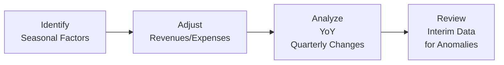

## Overview of Seasonal Influences

I remember once chatting with a friend who, back in college, worked part-time at a popular ski resort. She used to say, “Everyone thinks cash just pours in all winter, but come spring, we’re sweeping tumbleweeds.” That’s basically the idea behind seasonality in business. Seasonal factors—like holiday shopping sprees, back-to-school surges, winter tourism, or even something as niche as the fireworks boom around certain holidays—can hugely affect sales cycles, cost structures, and ultimately the financial results that companies report in their interim statements.

While a ski resort might thrive during cold months and go quiet in the off-season, a landscaping service probably sees the opposite. These seasonal patterns (or cyclical ups and downs) create challenges in interpreting a company’s quarterly data. If we don’t factor in timing—and that’s sometimes tricky—then we might misread a firm’s performance by simply comparing one quarter to the immediately preceding one. That is why IFRS 34 (Interim Financial Reporting) and similar US GAAP guidelines encourage companies to disclose seasonality factors. The aim is to provide investors and analysts with context surrounding those big swings in revenue and expenses.

## Key Concepts and Terminology

• Seasonal Sales Cycles: The idea that many industries have “peak” and “off-peak” demand. Retailers often see spikes around holidays, while tourism-based businesses cash in during summer or winter breaks.  
• Quarterly Earnings Volatility: Rather than a smooth earnings curve across months, these seasonal cycles create bumps on the earnings trajectory. For instance, a toy manufacturer might register most of its sales in the final quarter of the year.  
• Interim Reporting Adjustments: Because IFRS 34 and US GAAP require companies to provide updates through interim (quarterly or semiannual) statements, entities must decide how to account for cyclical patterns. Some attempt to “smooth” expenses or adjust the timing of revenue recognition to reflect seasonality better.  
• Seasonal Adjustment: It’s a method used to remove or reduce predictable, recurring fluctuations so that underlying trends become more apparent.  

## Practical Implications for Analysts

### 1) Comparability

A common pitfall is to compare a company’s Q1 performance with its Q4 performance without considering the holiday or year-end effects that might have inflated Q4. That’s why the “like-to-like” approach (comparing the same quarter in different years) is often more revealing. Or, you might look at rolling 12-month results. Comparing 12-month data across multiple years smooths out the single-quarter lumps and dips, like removing the peaks of the ski resort or the valley of the landscaping service.

### 2) Revenue Recognition Nuances

The IFRS 15 (Revenue from Contracts with Customers) and ASC 606 (US GAAP) frameworks give guidance on when revenue should be recognized. But if your company’s business cycle is highly seasonal, revenues might not arrive in neat monthly increments. Some folks might prorate or defer certain revenues, especially if they relate to multi-month service packages. Others might have bulk shipments that happen only once or twice a year. It’s important to see if management’s revenue recognition choices align with the underlying seasonality.

### 3) Cash Flow Volatility

Seasonal demand can push you to build up significant inventories or ramp up staff for the peak seasons. Then, once the “rush” ends, you might quickly scale back. This leads to large swings in working capital, which in turn affects your operating cash flow. Analysts can’t just assume a company’s operating cash flow in Q2 bears any resemblance to Q1—especially if Q2 is off-season. Keep an eye out for big spikes in Accounts Receivable (AR) or Inventory heading into the busy period, followed by a big jump in Accounts Payable (AP) if vendors need to be paid right after the peak.

### 4) Rolling Averages and Multi-Quarter Averages

Employing rolling averages is a solid trick for seeing the “true” pattern. You might grab data for the trailing 12 months (TTM) at each quarter-end. By overlapping these 12-month periods, you reduce the buzz of short-term fluctuations. Using multi-quarter averages (e.g., a four-quarter rolling sum) can also help you forecast future performance more reliably—particularly in industries where a single quarter is always an outlier.

Here’s a small Python snippet to get a sense of how an analyst might compute a rolling average for monthly sales data:

```python
import pandas as pd

data = {
    'Month': pd.date_range('2023-01-01', periods=12, freq='M'),
    'Sales': [100, 90, 95, 110, 200, 300, 400, 250, 120, 110, 105, 150]
}
df = pd.DataFrame(data)
df['Rolling_3Month_Avg'] = df['Sales'].rolling(window=3).mean()
df
```

Even a simple script like this can show how average sales evolve over time, lowering the distraction of short-term changes in one particular month. If you’re analyzing a real business, you’d likely expand this concept with more complex modeling, but the principle is the same.

### 5) Disclosure Requirements

Under IFRS 34, companies should disclose “seasonal or cyclical factors” that materially affect their financial results. US GAAP also recommends outlining any significant variations caused by seasonality in the quarterly filings (Form 10-Q). These disclosures might come as a dedicated section in the Management Discussion and Analysis (MD&A), highlighting expected and actual seasonal variations in revenue and expenses.

## Analytical Framework

It might be helpful to visualize the typical path an analyst follows when factoring seasonality into interim disclosures:



1. Identify Seasonal Factors: Start by noting known high-demand periods and historical patterns of inventory build-ups or big months for revenue.  
2. Adjust Revenues/Expenses: Check if the company has systematically recognized revenue or deferred expenses in some quarters to account for cyclical patterns.  
3. Analyze Year-over-Year (YoY) Quarterly Changes: Instead of Qx vs. Q(x-1), you compare Q1 this year to Q1 last year, especially in strongly seasonal industries.  
4. Review Interim Data for Anomalies: Watch out for unusual fluctuations that can’t be easily explained by manager commentary or prior-year patterns.

## Segment-Level Considerations

In Chapter 1.8 of this volume, we discussed segment reporting requirements. For seasonal analysis, it’s not uncommon to find large differences in seasonality among segments within the same firm. A global retailer might have a winter-sports segment in northern countries peaking in one quarter versus a southern hemisphere operation that peaks six months later. Breaking down seasonality by segment can be super insightful, helping you see if each segment’s performance lines up with typical seasonal cycles.

## Potential Pitfalls

• Overlooking Offsetting Seasonality: If a conglomerate has divisions whose busiest periods differ, the combined company statement might look fairly stable—even though behind the scenes, each division is on a roller coaster.  
• Ignoring Inventory Mechanisms: Some businesses ramp up production or supply months ahead of the actual sales season. If you don’t connect the dots, you might misinterpret short-term declines in operating cash flow.  
• Blindly Trusting Management’s “Seasonality Explanations”: Yes, managers often have the best vantage point. But you’ll still want to verify disclosures with actual data (like shipping logs, backlog, or historical monthly trends).

## Practical Example: Retail Holiday Season

Consider a retail chain that sells a huge chunk of merchandise in November and December. For the first three quarters, the firm might report modest profits. Then Q4 is monstrous. If you looked only at Q4 earnings and extrapolated that performance for the entire year, you’d risk an unrealistic forecast. Instead, you’d compare Q4 results to the previous Q4 to see if the spike is bigger or smaller than last year’s holiday spree. 

In addition, watch out for instances where the holiday shopping season extends into January (for returns, gift card redemptions, etc.). This can shift part of the revenue recognition or cost responsibilities to the next accounting year. 

## Exam Tip: Tackling Seasonal Vignettes

In the CFA exam context, especially as you progress through different items sets or short-answer questions, you could easily run into a scenario describing a business with dramatic quarterly ups and downs. They may ask you to interpret a table of Q1–Q4 results or to identify the best method for analyzing a seasonal business (rolling 12-month or same-quarter comparisons). Keep these principles in mind:

• Revisit the guidance from IFRS 34 and US GAAP on interim disclosures, focusing on seasonal backgrounds.  
• Emphasize year-over-year, periodic matching to slice out differences that are purely due to timing.  
• Check for consistent reasonableness of any “smoothing” methods to ensure the company’s approach truly reflects the underlying seasonality.

## Further Reading

• IAS 34, Appendix: Offers detailed guidance on recognizing and disclosing seasonal effects in interim statements.  
• The Quarterly Journal of Economics: Various academic research papers delve into how seasonal cycles affect reported earnings and stock price movements.  
• “Financial Statement Analysis” by Jerald E. Pinto and others: A deeper overview of how to evaluate interim financial reports.  

## Final Thoughts

Seasonality in interim disclosures isn’t just an accounting quirk: it reflects the real pulse of the business. By learning to interpret those quarter-by-quarter dips and spikes appropriately, you can unlock clearer insights into a company’s underlying performance. Don’t be lulled into a sense of stability (“everything’s calm, so it must be fine”) or fooled by a short-term upsurge (“wow, earnings soared 300% this quarter—par-tay!”). Instead, gather relevant historical data, look for cyclical patterns, and consistently apply techniques like rolling averages or year-over-year comparisons. It might take a bit of extra time, but the improved accuracy in your analysis is well worth the effort.

## Test Your Knowledge: Seasonality in Interim Disclosures Quiz



### Which of the following best explains why analysts compare the same quarter in different years for seasonal businesses rather than comparing consecutive quarters?

- [ ] Because IFRS 9 requires it explicitly.
- [ ] Because the second quarter is always more profitable.
- [x] Because seasonal factors can distort quarter-to-quarter comparisons.
- [ ] Because external auditors only review annual data.

> **Explanation:** Seasonal factors often make quarter-to-quarter results not comparable (Q4 might be a peak season while Q1 is a trough). Year-over-year comparison for the same quarter helps reduce the distortions caused by cyclical trends.

### When a company discloses that it uses seasonal adjustment for its revenue numbers, what is it most likely doing?

- [ ] Changing its fiscal year-end to match the holiday season.
- [ ] Ignoring any spikes in revenue for peak months.
- [x] Applying statistical measures to remove predictable recurring fluctuations.
- [ ] Disclosing less quarterly data overall to simplify reporting.

> **Explanation:** Seasonal adjustment is a statistical technique to remove predictable, recurring fluctuations, making underlying trends more evident.

### IFRS 34 recommends that entities disclose which of the following concerning seasonality?

- [x] Material seasonal or cyclical factors that affect interim financial results.
- [ ] Only the highest and lowest sales periods of the year.
- [ ] All holidays observed in each reporting period.
- [ ] A standardized smoothing approach for revenues and expenses.

> **Explanation:** IFRS 34 states that if seasonality or cyclicality influences the business materially, those factors should be disclosed to offer context for understanding interim results.

### How might a retailer’s Q1 cash flow be misleading if the bulk of its sales occur in Q4?

- [x] Q1 might show lower collections, causing a temporary cash flow drought.
- [ ] Q1 sales usually include better margins than Q4.
- [ ] Q1 always mirrors Q4 performance because revenue is smoothed.
- [ ] Q1 reports only half the revenue recognized in Q4.

> **Explanation:** Seasonal businesses with heavy Q4 sales frequently collect cash in Q4 or early Q1, so Q1 might show weaker inflows if most of the holiday revenues were recognized and collected in Q4.

### Which of the following is a practical step to smooth out short-term fluctuations in analysis?

- [x] Use rolling 12-month data or multi-quarter averages.
- [x] Compare Q1 of the current year to Q1 of the previous year.
- [ ] Assume every quarter has the same sales and expenses.
- [ ] Ignore the contribution from off-peak season quarters.

> **Explanation:** To deal with seasonality, analysts often use rolling 12-month data and year-over-year same-quarter comparisons so that cyclical variations are put in context.

### Why do some companies “smooth” expenses in interim reporting?

- [x] To better align expenses with the revenue they contribute to, particularly in cyclical industries.
- [ ] To inflate profits and mislead auditors.
- [ ] To avoid violating IFRS 9 reclassification rules.
- [ ] To automatically guarantee higher stock prices in the off-season.

> **Explanation:** Smoothing expenses in interim financial reports can help match costs to the revenue cycles, reducing distortions from one quarter to the next.

### A toy company makes 60% of its sales in Q4 due to holiday demand. How should an analyst interpret its Q3 performance?

- [x] Compare Q3 current year to Q3 prior year, keeping in mind Q4 will likely be much higher.
- [ ] Directly extrapolate Q3 results to predict the entire year.
- [x] Examine inventory build-ups in Q3 in preparation for Q4 demand.
- [ ] There is no reason to pay attention to Q3 results.

> **Explanation:** For a highly seasonal toy company, Q3 is often a ramp-up period in preparation for holiday demand. The analyst should compare Q3 results on a year-over-year basis and watch for inventory changes that foreshadow Q4 sales.

### In analyzing a conglomerate with diverse operations, why might overall seasonality appear subdued?

- [x] Different segments may have offsetting seasonal cycles.
- [ ] Because IFRS 16 effectively eliminates seasonality.
- [ ] Larger companies are less affected by cyclical factors.
- [ ] Seasonal disclosures are not required for conglomerates.

> **Explanation:** If separate divisions have different peak times, strong sales in one segment might coincide with a trough in another, making the overall company seem less seasonal than each part actually is.

### What is the biggest benefit of using rolling 12-month totals for interim analysis?

- [x] It evens out the distortions caused by short-term or seasonal fluctuations.
- [ ] It ensures compliance with IFRS 17.
- [ ] It doubles the reported revenue in the final quarter.
- [ ] It limits the data needed for a full analysis.

> **Explanation:** Rolling 12-month totals help reduce the noise from quarterly seasonality and provide a smoother trendline to assess performance.

### True or False: Interim seasonality disclosures are purely optional under IFRS 34.

- [x] True
- [ ] False

> **Explanation:** While IAS 34 encourages adequate disclosure of seasonal factors, the specific implementation can vary by jurisdiction. Public companies typically follow the spirit of disclosure to maintain transparency, but certain details may not be strictly mandated if they are not material.


