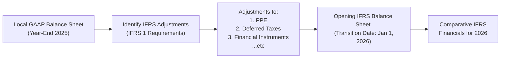

## Overview and Rationale

When an entity moves from local GAAP—or any other existing accounting framework—to International Financial Reporting Standards (IFRS), IFRS 1, “First-time Adoption of International Financial Reporting Standards,” provides the rules of the road. In essence, IFRS 1 guides first-time adopters in preparing an opening IFRS balance sheet and sets the stage for consistent, comparable financial statements going forward. This transition can involve quite a bit of heavy lifting: reevaluating the classification and measurement of assets and liabilities, dealing with new disclosures, adjusting for differences in revenue and expense recognition, and perhaps the most challenging part—explaining all these changes to investors, regulators, and other stakeholders.

Sometimes you’ll hear folks say, “Oh, IFRS 1, that’s just about re-labeling the financial statements.” Um, no, definitely not. I remember working alongside a colleague who was in charge of the IFRS transition for a mid-sized manufacturing firm. She spent weeks consulting with auditors, going back and forth on the optional exemptions for property, plant, and equipment (PPE) revaluation, not to mention the deferred tax nuances. It was basically a puzzle, and each piece had to fit just right for the opening IFRS balance sheet to tie out. And you know what? She said afterward that the biggest challenge wasn’t even the mechanical revaluations; it was ensuring that everyone—from the CFO to the operations managers—understood how and why the numbers were evolving. IFRS 1 is a big deal, as it sets the tone for future financial reporting clarity and credibility.

Below, we’ll walk through the fundamentals of IFRS 1, provide a structured example of what the reconciliation statements might look like, and highlight the optional exemptions that can drive material differences in the final outcome. We’ll also examine the effect on common financial ratios—like profit margins, coverage ratios, or leverage metrics—and discuss best practices for exam day and real-world application.

## Transition Reconciliation Under IFRS 1

IFRS 1 requires a new IFRS adopter to present:

• An opening IFRS balance sheet at the date of transition.  
• Reconciliations of equity under local GAAP to equity under IFRS (both for the date of transition and the end of the latest period reported under the previous framework).  
• A reconciliation of total comprehensive income under local GAAP to IFRS for the latest annual or interim period.  
• Explanations of the material adjustments made in restating local GAAP to IFRS.

The idea is that users of financial statements—investors, analysts, regulators—should see exactly how a company’s reported financial position and performance changed under the new recognition and measurement rules. And they shouldn’t have to guess: IFRS 1 prescribes explicit disclosure requirements so that no major differences go unexplained.

## Common IFRS 1 Adjustments

Let’s consider some typical areas where you might see big swings or reporting differences as a result of IFRS 1’s requirements:

Property, Plant, and Equipment (PPE).  
Under local GAAP, an entity could use a certain depreciation method or might capitalize certain overhead costs differently. IFRS might mandate a revised approach to useful lives, or it might allow revaluation of assets to fair value (provided the entity elects that revaluation policy). So you end up with a different carrying amount for PPE on Day 1 of IFRS adoption, which in turn drives changes in depreciation expense going forward.

Deferred Taxes.  
The fun never ends with deferred tax accounting. IFRS draws a line between temporary differences (those that arise from differences in tax bases of assets/liabilities and their carrying amounts) and permanent differences. The recognition of deferred tax assets might be more restrictive or more liberating, depending on your local GAAP. Then factor in IFRS standards on uncertain tax positions or tax effect from revaluation gains—these changes can alter both the statement of financial position (balance sheet) and the statement of profit or loss.  

Financial Instruments.  
Some frameworks classify financial instruments in a manner that is drastically different from IFRS 9 or IAS 39 (the older standard, if you still reference pre-IFRS 9 contexts). Under IFRS, classification and measurement revolve around the entity’s business model and contractual cash flow characteristics. This can lead to:  
• Reclassifications from “held-to-maturity” or “available-for-sale” to IFRS categories such as “fair value through profit or loss” or “fair value through other comprehensive income.”  
• Remeasurement of carrying values, plus the need to adjust for expected credit losses under IFRS 9, which can differ from any local “incurred loss” or alternative approach.

## Optional Exemptions

IFRS 1 acknowledges that a full, back-to-birth retrospective application of IFRS might be too complicated or even impossible. So it offers certain optional exemptions. Entities can choose some of these “one-time deals” to mitigate the cost or complexity of adopting IFRS for the first time. A few examples:

• Exemption for Business Combinations. Instead of restating all prior acquisitions to comply with IFRS 3’s measurement and recognition criteria (e.g., goodwill, intangible assets, etc.), an entity may choose to apply IFRS 3 prospectively from the date of transition.  
• Deemed Cost Exemption. A company can elect to measure items of property, plant, and equipment, intangible assets, or investment property at fair value on the transition date. This becomes the “deemed cost” going forward, avoiding the need for retrospective calculations of depreciation or revaluation.  
• Leases. Under IFRS 16, all leases are recognized on the balance sheet by the lessee (with limited exceptions). Numerous transitional reliefs or exemptions exist to simplify the measurement of lease liabilities and right-of-use assets upon first adoption.

## Visualizing an IFRS 1 Transition

To illustrate the logic of presenting an opening balance sheet, plus how local GAAP amounts shift into IFRS, consider the conceptual flow in the diagram below. This is a simple way to envision the transformation from local GAAP to IFRS for a hypothetical company, “ABC Manufacturing.”



As you can see, the first step is identifying all relevant IFRS adjustments. Next, those adjustments feed into the opening IFRS balance sheet. Finally, the company moves forward preparing IFRS-based comparative financials.  

## Illustrative Example of Transition Effects

Let’s do a simple numeric example where a company transitions on January 1, 2026. We’ll assume local GAAP had certain line items, and IFRS adjustments shift amounts at the transition date. You’ll see how the IFRS 1 reconciliation statement might look.

### Local GAAP vs. IFRS Opening Figures

Here are the hypothetical local GAAP balances for “XYZ Corporation” on December 31, 2025 (the last reporting date under local GAAP), along with the IFRS 1 adjustments (in thousands of currency units):

| Account                                           | Local GAAP (12/31/25) | IFRS 1 Adjustments | IFRS Opening (1/1/26) |
|---------------------------------------------------|-----------------------|--------------------|-----------------------|
| Property, Plant, and Equipment                    | 50,000               | +1,000            | 51,000               |
| Accumulated Depreciation                          | (20,000)             | +800              | (19,200)             |
| Deferred Tax Liability                            | (2,000)              | -500              | (2,500)              |
| Financial Assets (Held-to-Maturity)               | 5,000                | +300 (FV adj.)     | 5,300                |
| Share Capital                                     | 10,000               | —                  | 10,000               |
| Retained Earnings                                 | 15,000               | +1,600            | 16,600               |

**Explanations of Adjustments:**  
• **Property, Plant, and Equipment**: Under local GAAP, the entity had historically used straight-line depreciation but had not fully unbundled certain component parts. IFRS requires component depreciation for significant parts, which effectively lengthened the remaining useful life of some major components. That triggered a net increase in PPE’s carrying amount (and a partial reversal of accumulated depreciation).  
• **Deferred Tax**: The partial reversal of depreciation also changed the temporary differences for tax bases, increasing deferred tax liabilities by 500.  
• **Financial Assets**: Reclassified from “held-to-maturity” to “fair value through other comprehensive income” under IFRS, resulting in a 300 fair value gain.  
• **Equity Adjustments**: The net effect of these adjustments (1,000 net increase in PPE minus 800 for accumulated depreciation plus 300 gain on financial assets minus 500 additional deferred tax liability) flows through to retained earnings, giving a net 1,600 boost there.

### Reconciliation of Equity and Comprehensive Income

You might then see a formal statement such as:

• **Equity Under Local GAAP (12/31/25)**: 25,000 (Share Capital of 10,000 + Retained Earnings of 15,000).  
• **Adjustments for IFRS Adoption**: 1,600 (PPE + financial assets gains – deferred tax changes).  
• **Equity Under IFRS (1/1/26)**: 26,600.

### Effect on Key Ratios  

After adoption, certain headline ratios will shift. If your depreciation expense is lower under IFRS, you might see a higher operating margin. If revaluation of PPE leads to a bigger asset base while you keep the same capital structure, your leverage (e.g., Debt-to-Equity) might go down. Meanwhile, changes to recognized deferred tax liabilities or intangible assets could impact the quick ratio or other coverage metrics.  

These swings can be confusing to external stakeholders. That’s why IFRS 1’s robust reconciliation and disclosure requirements are so valuable. They give analysts the clarity they need to recast historical financial statements and evaluate trends more consistently.

## IFRS 1 Reconciliation Statement

When presenting an IFRS 1 reconciliation, keep in mind:

• **Narrative Explanation**: You’ll typically see footnotes or notes to the financial statements specifying exactly how the numbers changed, the rationale for adopting certain optional exemptions, and the method used to estimate fair values.  
• **Comparative Period**: First-time adopters must generally produce at least one year of comparative IFRS financial statements. This includes restating local GAAP financials into IFRS for that prior period.  
• **Reconciliation Format**: Entities often disclose a table that starts with local GAAP equity or profit, then columns reflecting adjustments for major items (e.g., intangible assets, leases, deferred taxes), culminating in the IFRS figure.

## Impact of Optional Exemptions

Selecting or foregoing certain IFRS 1 exemptions can dramatically change the opening balance sheet and future financial statements. A couple of real-world examples:

• **Deemed Cost for PPE**: If an airline opts to use fair value as deemed cost for its fleet, the carrying value of all aircraft might jump significantly, with an enormous offset to retained earnings. Alternatively, if the airline chooses not to revalue, it might retain lower historical costs.  
• **Business Combinations**: If a holding company decides not to restate prior acquisitions, it can avoid re-recognizing intangible assets or adjusting goodwill. This approach can reduce complexity but might limit comparability with peers who adopt IFRS with more retrospective rigor.

## Case Study Narrative

I recall an instance—this was at a consumer goods firm—where an optional exemption significantly shaped the story investors saw. The management team elected the deemed cost exemption for a major property that had appreciated significantly. In local GAAP, that building was still recognized at a 1980s-era cost. Under IFRS, they took one look at the fair value and basically went, “Wow, that’s a major difference.” The revaluation soared by 75%, and the company’s opening IFRS equity jumped by about 25% overnight. The CFO told me that while it was great for the balance sheet optics, they also had to think carefully about future depreciation expense and the impact on key metrics. So making these elections is not just an accounting exercise but also a strategic one.

## Data Analytics Considerations

With IFRS 1 transitions generating reams of new data—adjustments to thousands of fixed assets or recalculations of intangible asset values—data analytics can be used to identify the biggest divergences. This is often done by scanning large asset registers for items that show massive measurement shifts between local GAAP and IFRS assumptions (e.g., different residual values, revalued intangible assets, etc.). If you’re preparing for the exam, it’s good to note that IFRS 1 is often tested in short item-set or mini-case scenarios that require knowledge of typical adjustments and the rationale behind them.

## Best Practices and Common Pitfalls

• **Documentation**: Document the reasons for each IFRS 1 adjustment. Not only is this essential for the external audit, but it also helps your finance teams replicate the logic in future years.  
• **Communication**: Don’t forget the investor call or press release explaining major changes. IFRS 1 can be disorienting to non-accountants if left unexplained.  
• **Exemption Overload**: Be cautious when adopting multiple exemptions. If you rely on too many short-cut approaches, you might hamper the comparability of your own financial statements over time.  
• **Tax Implications**: Revaluation adjustments might trigger current or deferred tax liabilities. Always cross-check with local tax regulations to see if IFRS-based remeasurements create or dissolve any tax differences.  
• **Systems Upgrades**: Make sure your accounting information systems are up to the challenge. IFRS can require more granular detail. “Component depreciation,” for instance, needs robust asset management software.

## Demonstration of a Simple Reconciliation Calculation Using Python

Occasionally, a CFO or controller might want to quickly confirm the net effect of IFRS adjustments. Below is a trivial Python snippet that sums up adjustments and prints the IFRS opening values, just to illustrate how some teams do a quick data check.

```python
local_gaap = {
    'PPE': 50000,
    'AccDep': -20000,
    'DefTaxLiab': -2000,
    'FinancialAssets': 5000,
    'ShareCap': 10000,
    'RE': 15000
}

adjustments = {
    'PPE': 1000,
    'AccDep': 800,
    'DefTaxLiab': -500,
    'FinancialAssets': 300
}

ifrs_opening = {}
for item in local_gaap:
    if item in adjustments:
        ifrs_opening[item] = local_gaap[item] + adjustments[item]
    else:
        ifrs_opening[item] = local_gaap[item]

adjustments_sum = sum(adjustments.values())
ifrs_opening['RE'] = local_gaap['RE'] + adjustments_sum

print("IFRS Opening Balances:")
for key, val in ifrs_opening.items():
    print(key, val)
```

If you run this snippet, you’d see IFRS opening PPE, accumulated depreciation, deferred tax liability, and so on. This is oversimplified, but it can be helpful for internal spot checks.

## Exam Tips for CFA Candidates

• **Focus on the Mechanics**: The exam will often give you local GAAP numbers, list a set of IFRS 1 adjustments, and ask for the IFRS opening equity or net income. Make sure you track each item carefully; watch for the offset in retained earnings.  
• **Identify IFRS 1 Optional Exemptions**: If a question references a revaluation of PPE or intangible assets, that might be an IFRS 1 “deemed cost” type of scenario. Look for the practical reasons and the effect on the balance sheet.  
• **Watch Ratios and Trend Analysis**: Keep your eye on how the IFRS changes affect solvency and profitability metrics. The exam could ask how these changes differ from local GAAP so you can identify if those changes are beneficial or detrimental to an analyst’s view of the company.  
• **Comprehensive Reconciliation**: Practice a step-by-step approach: Start with local GAAP equity → sum the IFRS adjustments → verify the final IFRS equity. Then separately reconcile the statement of comprehensive income if needed.  
• **Keep an Eye on Disclosures**: IFRS 1 requires robust disclosures explaining the nature and amounts of adjustments. Don’t forget that narrative explanations are a big deal in IFRS 1.

## Additional Resources

To drill deeper into IFRS 1 transitions and see real-life examples of first-time adoption, consider:  
• The IFRS 1 Transition Examples on the official IFRS website (https://www.ifrs.org).  
• Steven E. Shamrock’s “IFRS and US GAAP: A Comprehensive Comparison.”  
• Historical SEC filings of companies that switched from local GAAP to IFRS—these can sometimes be found in cross-listed companies’ annual reports.

## Final Thoughts

IFRS 1 transitions can initially feel like a labyrinth of asset revaluations, deferred tax recalculations, and recalibrated financial instruments. But once you understand the fundamental building blocks of first-time adoption—opening balance sheet, reconciliations of equity, and total comprehensive income (plus the optional exemptions)—it all starts to make sense. The result is a set of financial statements that align with IFRS standards and hopefully aid in cross-border comparability.  

If you’re tackling this topic for the CFA exam or for a real business scenario, remember: bridging the gap between local GAAP and IFRS isn’t just about the mechanics. It’s about telling a coherent story of how the company’s financial position, performance, and risk profile have changed under IFRS. Clarity and transparency will always be your best allies.

## Test Your Knowledge: IFRS 1 Transition Adjustments Quiz



### In preparing an opening IFRS balance sheet, which of the following statements best describes a key requirement under IFRS 1?

- [x] The entity must present all assets and liabilities in accordance with IFRS as if it had always applied IFRS, subject to certain optional exemptions.
- [ ] The entity must restate only the most recently completed reporting period.
- [ ] The entity is not required to reconcile prior-year equity because IFRS only looks forward.
- [ ] The entity must always use full retrospective application with no exemptions allowed.

> **Explanation:** IFRS 1 generally requires an entity to measure all assets and liabilities using IFRS policies retrospectively, but it allows certain exemptions (e.g., deemed cost), making a complete, “from inception” reapplication unnecessary.

### Which of the following optional exemptions under IFRS 1 can significantly increase an opening balance sheet’s carrying values for long-lived assets?

- [ ] Retrospective application of IFRS 3 for all past acquisitions.
- [x] Utilizing fair value as “deemed cost” for property, plant, and equipment on the transition date.
- [ ] Adopting IFRS 15 for only the most recent year of revenue transactions.
- [ ] Deferring the recognition of all deferred tax liabilities.

> **Explanation:** One of the most impactful optional exemptions is the ability to measure PPE at fair value as the “deemed cost” on the transition date, which can dramatically increase carrying values compared to historical cost under local GAAP.

### A company adopting IFRS 1 discovers that its local GAAP depreciation on machinery was calculated using a simplified method. Under IFRS, the machinery must be componentized and depreciated accordingly. How might this change affect the entity’s first IFRS balance sheet?

- [x] The carrying value of the machinery might increase, and accumulated depreciation could decrease, adjusting retained earnings upward.
- [ ] The carrying value of the machinery will always decrease, lowering retained earnings.
- [ ] There would never be a change in the carrying value because depreciation equals net book value under all frameworks.
- [ ] The transition adjustment must be recognized entirely in share capital.

> **Explanation:** If an entity identifies that its local GAAP depreciation overstated the decrease in asset value, IFRS’s component depreciation can extend asset life, thereby raising the net carrying value and retained earnings.

### Which of the following best explains why IFRS 1 mandates detailed reconciliations of equity and total comprehensive income?

- [x] It provides transparency on how and why reported performance and financial position change as a result of IFRS adjustments.
- [ ] It allows companies to eliminate disclosures that might conflict with local GAAP.
- [ ] It reduces the need for auditor involvement in the transition process.
- [ ] It helps IFRS adopters avoid restating prior periods.

> **Explanation:** IFRS 1’s reconciliation requirement is about ensuring clear communication with stakeholders regarding the transformation in reported figures and the reasons for those changes.

### On the transition date, an entity’s revaluation of an office building results in a large gain compared to local GAAP carrying value. This gain is directly credited to equity and affects retained earnings. Which IFRS 1 exemption did the company most likely use?

- [x] Deemed cost exemption for property, plant, and equipment.
- [ ] Early adoption of IFRS 2 on share-based payments.
- [ ] Prospective application of IFRS 3 for business combinations.
- [ ] Retrospective restatement of IFRS 15 for all prior contracts.

> **Explanation:** Under IFRS 1, the deemed cost exemption lets entities measure items (like an office building) at fair value and recognize that difference in equity, often heading straight to retained earnings or revaluation surplus, depending on elections.

### Which scenario most clearly illustrates a tax-related IFRS 1 adjustment?

- [x] Recalculation of deferred tax liabilities due to revised carrying amounts of revalued machinery.
- [ ] Renegotiation of lease terms in preparation for IFRS 16 adoption.
- [ ] Elimination of intangible assets recognized in a prior business combination.
- [ ] Immediate recognition of all derivative gains in retained earnings.

> **Explanation:** The revaluation of assets often modifies the difference between their tax base and carrying amount, necessitating changes in deferred tax liabilities or assets.

### An entity that adopts IFRS 1 chooses not to restate prior business combinations. What is the primary accounting effect of this decision?

- [x] Goodwill from past acquisitions remains at its local GAAP carrying amount, and intangible assets recognized at acquisition are not re-measured.
- [ ] Deferred taxes from prior acquisitions must be eliminated in the opening IFRS balance sheet.
- [ ] The company must fully restate intangible assets under IFRS 3 and remeasure them retroactively.
- [ ] It must re-measure the fair value of subsidiary net assets on every prior acquisition date.

> **Explanation:** By electing not to restate under IFRS 3, the entity effectively “grandfathers in” the previous GAAP carrying values of goodwill and other intangible assets from those acquisitions.

### If a financial instrument was classified as “held to maturity” under local GAAP but now is measured at “fair value through profit or loss” under IFRS 9, what is the most likely impact on the transition?

- [x] An increase or decrease in the carrying amount with a corresponding adjustment to retained earnings, reflecting the new fair value measurement.
- [ ] No change is permitted under IFRS 9 because reclassifications from local GAAP are prohibited.
- [ ] It becomes automatically designated as “loans and receivables.”
- [ ] The instrument must be written off entirely on adoption of IFRS.

> **Explanation:** Under IFRS 9, a reclassification to fair value through profit or loss often triggers an adjustment to the carrying amount and a one-time hit to retained earnings at transition.

### Which IFRS 1 disclosure is most crucial for users wanting to reconcile local GAAP net income to IFRS net income?

- [x] The line-by-line reconciliation statement, explaining material variances by category (e.g., PPE depreciation, deferred taxes, etc.).
- [ ] A brief footnote that says “differences arose due to IFRS requirements.”
- [ ] A listing of immaterial differences only.
- [ ] A memo that IFRS 1 does not require a net income reconciliation.

> **Explanation:** IFRS 1 explicitly requires a thorough reconciliation of net income (and total comprehensive income) so investors can see the specific sources of the differences.

### True or False: Under IFRS 1, an entity must present its opening IFRS balance sheet only if it chooses to exercise the optional exemptions.

- [x] True
- [ ] False

> **Explanation:** Actually, IFRS 1 always requires an opening IFRS balance sheet at the date of transition, regardless of whether the entity uses optional exemptions. This is a key part of the first-time adoption process.


