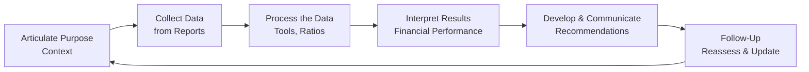
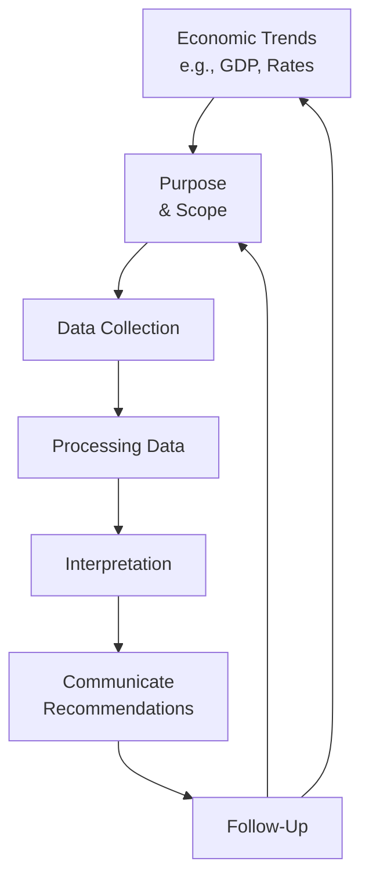

## Overview of the Financial Statement Analysis Framework

You know, when I first got my hands on a company’s 10-K filing (the massive annual report required in the U.S.), I felt a bit overwhelmed: tables everywhere, endless footnotes, disclaimers, rating agency commentary, plus half a dozen accounting policies I'd never heard of. But that’s exactly why a solid Financial Statement Analysis Framework is so important. It’s basically your “roadmap” for how to work through all that information—step by step—to reach a meaningful conclusion about a company’s financial health. In a sense, you’re building a story, but it’s a story told through numbers, disclosures, and market context.

This framework is especially central for those of us studying for the CFA® exams, whether at Level I or managing the complexities of exam-level III portfolio management. Indeed, advanced portfolio decisions rely on strong financial analysis fundamentals. And by using a systematic approach, you can keep your analysis consistent and defensible, which really matters when you’re making critical calls—like whether to invest in an equity or not, whether to approve a loan, or even how to hedge certain risks in a multi-asset portfolio (a big deal for Level III candidates).

Below is a simple graphical representation of how the process flows in an iterative loop:

It might look straightforward, but each step can be nuanced. Let’s piece it all together.

## Purpose and Context

When you begin, the first question is: Why am I doing this analysis? Maybe it’s for equity valuation (you want to figure out if Company X is undervalued or overvalued) or for a credit assessment (you need to determine if an entity is a good candidate for a loan). The purpose will shape everything else. For a credit assessment, you’re probably more interested in liquidity ratios and debt coverage. For equity valuation, you’ll likely focus on earnings quality, competitive position, and forward-looking growth.

In portfolio management at higher CFA levels, you might even bring in cross-asset considerations, economic conditions, or the synergy of a potential target in a merger scenario. But all of that is anchored on understanding precisely what question you must answer in the first place.

Quick personal note: I remember analyzing a retail start-up once, purely to see if it was worth investing in. Halfway through, a friend asked if the firm could realistically service its debt. Turned out, I needed a whole different set of metrics for that. So yes, it’s absolutely essential to articulate the objective first, so you use the right toolkit for the job.

## Collecting Data

Once you know why you’re analyzing the company, the next step is to gather the information. This may include:

• Annual reports (Form 10-K in the U.S.) and interim filings (Form 10-Q).  
• IFRS-based financial statements, which might have subtle differences compared to U.S. GAAP.  
• Notes to the financial statements that clarify accounting practices like revenue recognition (see Chapter 2) or intangible asset valuation (see Chapter 3).  
• Macro-level data: interest rates, GDP trends, commodity prices, or industry-specific factors.  
• Industry publications and specialized sources like regulatory filings or websites that track key performance indicators.

If you’re comparing multiple companies in the same industry, try to ensure your data is consistent—watch out, for instance, if one firm uses IFRS and another uses U.S. GAAP. You might have to adjust certain line items to get them on the same footing. That’s especially relevant at advanced levels where comparability is crucial for portfolio decisions.

## Processing the Data

Now the real fun starts—making sense of the data you just collected. This is where you do ratio analysis, common-sizing (turning everything into percentages of sales or assets, for instance), or running trending analyses across periods. Under IFRS, you might classify interest paid as operating or financing cash flow (depending on management's choice), while under U.S. GAAP it’s almost always operating. Those details can lead to differences that matter for your overall interpretation of, say, the company’s ability to generate operating cash flow.

Key tools in processing the data can include:

• Ratio Calculations: Think liquidity ratios (current ratio), solvency ratios (debt-to-equity), profitability ratios (net margin), and valuation ratios (P/E).  
• Trend Analysis: Checking how a ratio or line item has evolved over time.  
• Segment Analysis: Some firms have multiple lines of business. You might be amazed how a single segment could drive most of the company’s operating profits. (See Segment Reporting Requirements in Section 1.8.)  
• Benchmarking: Comparing a company’s ratios against those of peers or industry benchmarks.

Be prepared to dig deeper if something looks off. If receivables are growing faster than sales, for instance, investigate management’s credit policies or the types of customers they have. This can signal a potential earnings quality issue.

## Interpreting Results

Processing the data is just the “what.” Interpreting the results is the “why” and “so what.” This is where you apply judgment—an essential skill for advanced CFA levels. You might discover that a firm’s profitability is increasing, but maybe that’s because they changed how they capitalize research and development costs (see Chapter 2 for expensing vs. capitalization). Or perhaps their revenue soared, but you notice big changes in the notes regarding one-time gains or the adoption of a new IFRS standard. 

Interpretation typically involves:

• Looking at the bigger economic environment: Are we in a recession or a boom phase?  
• Considering competitive pressures: Is the firm’s margin growth sustainable, or will new entrants drive it down soon?  
• Considering changes in accounting principles or estimates: Did the firm adjust its depreciation methods (straight-line vs. declining balance)? Did that artificially inflate or deflate reported results?  
• Checking management guidance for forward-looking statements.

In short, always ask: Are these results real and repeatable, or are they artificially inflated/deflated by short-term or cosmetic factors?

## Communicating Conclusions or Recommendations

Communication can be a separate art form altogether. Whether you're writing a formal equity research report or just giving a quick investment memo, the goal is to convey your findings in a clear, persuasive way. Typically, your final output might include:

• An overview of the company’s fundamental strengths and weaknesses.  
• Projected outlook for revenue, margins, or liquidity needs (often linking to or referencing a pro forma model—see “Building a Company Financial Model” in Chapter 16).  
• A valuation section if your analysis is for equity investing, or a creditworthiness summary if your analysis is for lending or bond investing.  
• A final recommendation (“Buy,” “Hold,” “Sell,” or a target price) for equity. For credit, maybe you highlight recommended contract terms or covenants to mitigate certain risks.  

Pro Tip: Use visuals (tables, charts) to back up your points—you want your audience to grasp the key data quickly. Don’t bury the important details in endless paragraphs. If you do, the decision-maker might miss your critical point on how the firm has a large chunk of variable-rate debt that’s about to reset in a rising interest rate environment.  

## Follow-Up and Iteration

After concluding your analysis, you’re not exactly done. Markets can shift, companies can release a new product, or inflation might spike, changing the cost structure. That means you revisit your assumptions, re-check your valuation model, update your ratio analysis, and consider any new disclosures. In the real world, especially in institutional investing or risk management at a global bank, you might have to maintain ongoing coverage of dozens of companies simultaneously. Modern data analytics tools can help track changes in real time, but the principle remains the same: keep iterating because conditions move fast.

On a personal note, I once analyzed a mining company right before commodity prices took a nosedive. My recommendation was “Buy,” but merely two months later the macro environment had completely changed. Without a structured follow-up step, I would have looked silly leaving that recommendation on the table while the commodity cycle turned negative. Lesson learned.

## Common Pitfalls and Best Practices

• Overreliance on a Single Ratio: A low P/E ratio doesn’t mean a stock is a bargain if the underlying earnings are about to crumble. Use multiple angles.  
• Failing to Adjust for One-Off Items: Nonrecurring items can distort net income. Dig into the footnotes.  
• Ignoring Reporting Differences: IFRS vs. U.S. GAAP variances, especially for revenue recognition (IFRS 15 vs. ASC 606) or lease reporting (IFRS 16 vs. ASC 842), can lead to misleading comparisons.  
• Poor Communication: You might have brilliant insights, but if you can’t communicate them clearly, your analysis won’t be acted upon.  
• Neglecting Follow-Up: A static analysis ages quickly with changing economic or corporate events.

## Exam Relevance and Practical Implications

For the CFA® Program, demonstrating a mastery of this framework shows you understand not only how to calculate a ratio but how to interpret it in context. Level I candidates might see more multiple-choice questions about collecting data or the differences between IFRS and U.S. GAAP. By the time you’re at Level III, you’ll be asked to integrate these findings into portfolio-level decisions, address client objectives, or propose a policy statement capturing the risk/return profile that depends partly on your company-level analyses.

Make sure to practice with real financial statements as you study. If you’ve only read about IFRS vs. U.S. GAAP differences in theory, you’ll be surprised how quickly the lines blur when you open an actual annual report. Repetition and hands-on exercises are key.

## Additional Diagram: Iterative Feedback Loop

We’ve seen the flowchart for the framework steps, but let’s also illustrate how economic indicators and macro forecasts feed back into your analysis in an ever-evolving process:

In other words, changes in the broader economic picture might cause you to refine your analysis scope or gather more data. This integrated perspective is particularly vital for advanced portfolio management.

## References & Further Reading

• CFA Institute, “Equity Asset Valuation.”  
• “Financial Statement Analysis” by Leopold A. Bernstein and John J. Wild.  
• IFRS 15 (Revenue from Contracts with Customers) vs. ASC 606 for revenue recognition details.  
• IFRS 16 (Leases) vs. ASC 842 for lease accounting.  
• See Chapter 16 in this volume for building robust financial models that incorporate scenario analysis and forecasting.

## Final Exam Tips

• Time Management: Whether facing a constructed-response question at Level III or a multiple-choice item at Level I, stick to the framework to structure your answer.  
• Don’t Ignore the Footnotes: They often reveal crucial details like changes in accounting policy or contingent liabilities.  
• Provide Support for Your Conclusions: In constructed responses, reference specific ratios, trending data, or IFRS/GAAP clarifications. Don’t just say, “I recommend a Sell.” Show the numeric rationale.  
• Think About the “What If?”: If the environment changes, how would that alter your analysis or final recommendation?  
• Practice With Past Exams: Usually, older exams contain scenario-based questions requiring you to apply these steps to a real-life situation.

-----

## Test Your Knowledge: The Financial Statement Analysis Framework Quiz



### 1. A major benefit of using a structured Financial Statement Analysis Framework is:
- [x] Consistency in evaluating different companies over time.
- [ ] Eliminating the need to review footnotes and disclosures.
- [ ] Guaranteeing identical conclusions across all industries.
- [ ] Avoiding the complexity of macroeconomic factors.
> **Explanation:** A framework ensures step-by-step consistency and thoroughness. It doesn’t remove the need for footnotes, guarantee the same outcome for every company, or ignore macro factors.

### 2. When an analyst’s primary purpose is to assess credit risk, they are most likely to focus on:
- [ ] Trend analysis of P/E ratios.
- [ ] Valuation multiples in the equity market.
- [x] Liquidity and coverage ratios.
- [ ] Future dividend growth.
> **Explanation:** Credit risk assessment emphasizes a firm’s short-term liquidity and its ability to meet debt obligations (coverage ratios). Valuation multiples or dividend growth have less direct relevance.

### 3. Data collection under IFRS vs. U.S. GAAP often requires:
- [x] Adjusting certain figures for comparability between standards.
- [ ] Ignoring the most recent interim filings.
- [ ] Favoring IFRS statements for better clarity.
- [ ] Prioritizing the direct method of the cash flow statement only.
> **Explanation:** IFRS and U.S. GAAP can differ in areas such as revenue recognition or lease accounting, and adjustments are commonly made for apples-to-apples comparisons.

### 4. Which step best describes calculating and comparing ratios, trend analysis, and common-sizing?
- [x] Processing the data.
- [ ] Communicating conclusions.
- [ ] Articulating the purpose.
- [ ] Performing follow-up.
> **Explanation:** Processing the data is the “nuts and bolts” part: doing ratio analysis, comparing changes over time, etc.

### 5. Interpreting financial results primarily involves:
- [ ] Solely confirming the data is correct.
- [x] Assessing earnings drivers, sustainability, and economic context.
- [ ] Automatically forecasting next quarter’s sales.
- [ ] Focusing only on the footnotes, ignoring the income statement.
> **Explanation:** Interpretation goes beyond validating correctness; it requires context and judgment about sustainability and the bigger economic picture.

### 6. In communicating conclusions, best practice would be:
- [x] Presenting a concise argument supported by data and visuals.
- [ ] Submitting only raw data tables, letting readers draw their own conclusions.
- [ ] Refraining from explaining your assumptions in detail.
- [ ] Omitting management disclosures for brevity.
> **Explanation:** Effective communication includes a clear argument, visuals, and acknowledgment of assumptions. It is key to building a persuasive recommendation.

### 7. Why is follow-up important in the Financial Statement Analysis Framework?
- [ ] Once a conclusion is reached, it does not change.
- [ ] Ratios remain stable regardless of market changes.
- [x] Economic conditions and new data may alter earlier assumptions.
- [ ] It is the last step and can be generally skipped.
> **Explanation:** Because companies, markets, and the economy evolve, analysts must periodically revisit and update conclusions.

### 8. A structured approach to financial analysis typically:
- [ ] Replaces the need for qualitative assessment.
- [x] Emphasizes both quantitative and qualitative elements.
- [ ] Avoids collecting macroeconomic data.
- [ ] Focuses only on deriving a buy/sell recommendation.
> **Explanation:** Good analysis integrates both data-driven results and a qualitative perspective (like management quality, economic trends, etc.).

### 9. Under the framework, one key reason to review segment disclosures is:
- [ ] They are typically irrelevant for valuations.
- [x] Different segments can have varying profitability and growth prospects.
- [ ] They only provide operational-level data, not suitable for analysis.
- [ ] They are mandated by regulators but hold little practical value.
> **Explanation:** Segment disclosures reveal how different lines of business perform, which is essential for in-depth analysis and forecasting.

### 10. True or False: After concluding an analysis and issuing a recommendation, an analyst can safely disregard changes in market conditions.
- [ ] True
- [x] False
> **Explanation:** Market conditions, regulatory changes, and company strategies evolve over time, so ongoing monitoring and iterative updates remain critical.


