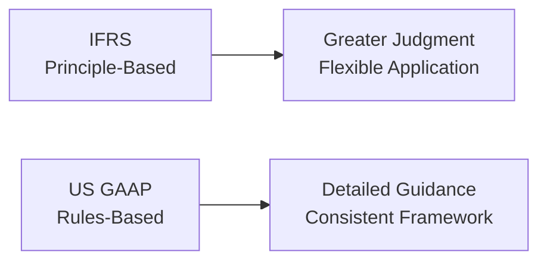

## Overview

If you’ve ever tried to compare the financial statements of a U.S.-based company to one using International Financial Reporting Standards (IFRS), you probably noticed interesting (and sometimes frustrating) differences. I remember the first time I attempted to align a set of IFRS financials with a U.S. GAAP version—my initial reaction was something like, “Uh, wait…where did their lease liabilities go?” or “Why are inventories valued so differently?” These small variations can actually create big differences in reported profits and other ratios, adding complexity to your analysis.

In this section, we’ll go in-depth on IFRS vs. US GAAP, two major frameworks used worldwide. While both sets of standards aim to provide high-quality, transparent, and comparable financial statements, they frequently take different routes to get there—IFRS being largely principle-based and US GAAP being relatively rules-based. We’ll talk about why these frameworks differ, how this can affect ratio analysis, and how to monitor ongoing developments so your analyses stay relevant.

## Principle-Based vs. Rules-Based Approach

IFRS, issued by the International Accounting Standards Board (IASB), is considered principle-based. This means it provides broad guidelines and conceptual frameworks rather than prescriptive rules for every single transaction. Management and auditors often have more discretion when interpreting how best to reflect the economic reality of a situation. Some folks love the flexibility because it allows companies to reflect the substance of a transaction more freely. Others feel that such discretion can lead to less uniform application across organizations.

US GAAP, overseen by the Financial Accounting Standards Board (FASB), is comparatively rules-based. It lays out more explicit instructions for specific transactions. This approach can reduce ambiguity—an accountant can usually find a clear set of rules for a complicated transaction. However, there’s also the perception that it can encourage “box-checking” rather than thoughtful consideration of the underlying economic reality.

Here’s a quick visual snapshot of these conceptual differences:

## Key Differences Affecting Financial Analysis

### Revenue Recognition

• IFRS uses IFRS 15, and US GAAP uses ASC 606 for revenue recognition. Both standards actually converged quite a bit here, calling for a five-step model:
1. Identify the contract(s) with a customer  
2. Identify performance obligations  
3. Determine the transaction price  
4. Allocate the price to the performance obligations  
5. Recognize revenue when (or as) the performance obligation is satisfied  

Although IFRS 15 and ASC 606 are very similar, subtle variances still exist. For example, IFRS stresses the concept of “control” transferring to the customer, which might sometimes be interpreted slightly differently than in U.S. GAAP if there are region-specific regulatory nuances. Also, contract modifications, variable consideration, and licensing arrangements can be treated with small differences in timing or measurement.

As an analyst, differences in revenue recognition policy might affect:  
• Timing of revenue (especially near quarters’ ends)  
• Classification of contract-related assets and liabilities  
• Ratio analysis (e.g., gross margin, asset turnover) depending on how much revenue is recognized in each period  

### Inventory Valuation

Inventory is one area where IFRS and US GAAP historically diverged quite a bit:

• Under IFRS, the last-in-first-out (LIFO) method is prohibited. Commonly, companies will use first-in-first-out (FIFO) or weighted-average cost methods.  
• Under US GAAP, LIFO is permitted if the company consistently applies it.  

In inflationary environments, a U.S. company using LIFO might report lower taxable income (since the newer inventory costs are higher and recognized earlier), but that also means lower net income might appear on its financial statements, all else being equal. IFRS-reporting entities usually can’t use LIFO, so that difference alone can hamper direct earnings or margin comparisons.

Additionally, IFRS typically requires inventory to be carried at the lower of cost or net realizable value (NRV), and if a write-down is reversed in a subsequent period, IFRS allows that reversal (to the extent of the original write-down). Under US GAAP, once inventory is written down, it generally can’t be reversed. This could mean that IFRS-based companies might see a slight bump in future periods if market conditions change and previously written-down inventory recovers value.

### Lease Accounting

Lease accounting also has some differences. From 2019 onward, IFRS 16 requires recognizing nearly all (with few exceptions) leases on the balance sheet for lessees—creating a right-of-use asset and a corresponding lease liability. Meanwhile, in the U.S. market, ASC 842 has a similar approach for lessees to recognize right-of-use assets and lease liabilities. However, US GAAP still distinguishes between finance leases and operating leases in a slightly more pronounced way on the income statement. IFRS lumps nearly all leases into a single recognition pattern, generally reflecting interest and depreciation separately.

Analytically, your focus might be on:  
• Debt-to-equity ratios, which can increase as lease liabilities are brought onto the balance sheet  
• EBITDA margin—because the new standard reclassifies some expenses that might have been “rent expense” into depreciation and interest  
• Cash flow classification differences, as IFRS and US GAAP occasionally differ on whether certain elements of lease payments are operating vs. financing  

### Impairment Testing

IFRS uses a one-step impairment test for assets. When the carrying amount is higher than recoverable amount (the higher of fair value less costs to sell—or value in use), an impairment is recognized. For goodwill, IFRS requires an impairment-only approach (no amortization). Reversals of certain impairment losses (other than goodwill) are possible under IFRS if circumstances change.

US GAAP uses a slightly more detailed approach for long-lived asset impairment, typically including undiscounted cash flow tests before measuring an impairment. Goodwill also has a different approach, where companies have a qualitative assessment or a two-step impairment test. Another difference: IFRS often emphasizes discount rates and future projections a bit more (value in use calculation). Under US GAAP, once an impairment is taken (apart from equity securities in certain circumstances), it can’t generally be reversed.

In terms of ratio analysis, differences in impairment rules might cause variations in how intangible assets or goodwill remain on the books, thus affecting return on assets (ROA), debt covenants, or even net income if large impairment charges show up unexpectedly.

## Monitoring Developments in Reporting Standards

Now, here’s the thing: accounting rules definitely aren’t static. They change, sometimes swiftly. New pronouncements, revisions, and convergence efforts can significantly alter the way numbers appear on financial statements. This might feel slightly exhausting, but staying current is non-negotiable if you want to be a sharp analyst. We can’t just rely on “I learned it this way back in 2020.” 

Recent major changes include:  
• IFRS 16 (Leases) replaced IAS 17, changing how leases are recognized.  
• ASC 606 (Revenue from Contracts with Customers) significantly revamped U.S. revenue recognition.  
• IFRS 15 mirrored ASC 606’s revenue model to a large extent (some differences remain).  
• The ongoing IFRS-FASB convergence project periodically releases discussion papers or exposure drafts.  

A practical tip is to rely on updated sources: regularly consult the IASB (ifrs.org), FASB codification (asc.fasb.org), and professional publications. Every year, there might be small clarifications or big leaps—like when IFRS 9 replaced IAS 39 for financial instruments, or when IFRS 17 introduced new insurance contract guidelines.

## Practical Impact on Analysis and Best Practices

• Ratio Comparability: Suppose you’re analyzing two international companies, one reporting under IFRS and the other under US GAAP. You might see artificially inflated or deflated profit margins, return on equity, or interest coverage ratios just because of small differences in how items are measured. Always check the notes to the financial statements and standard references.  
• Adjustments for Cross-Border Investing: If you’re building a valuation model for a multinational firm or comparing peers globally, consider restating certain items to create an “apples-to-apples” comparison.  
• Watch for Convergence: Convergence efforts sometimes close the gap, but differences remain for items like intangible recognition, R&D, revaluation of fixed assets, and more. So, keep an eye on updates from the IASB and FASB.  
• Professional Judgment: Under IFRS, there’s more emphasis on management’s assumptions. If you see big leaps in revenue recognition estimates (like variable consideration or contract modifications), or intangible asset valuations, be sure to question whether those judgments align with prior periods and industry norms.  

## Example Case: Lease Classification and Ratios

Let’s say you’re analyzing two competitors in the airline industry—one using IFRS, another using US GAAP. Both comply with the new lease standards, leading them to recognize right-of-use assets and lease liabilities on the balance sheet. In IFRS statements, the operating statement might show a single lease expense line, allocated between depreciation of the right-of-use asset and an interest component on the liability. In U.S. GAAP statements, you could still see “operating lease expenses” vs. “finance lease interest and amortization.”  

If you’re calculating EBITDA, the IFRS airline might have higher EBITDA compared to a legacy US GAAP approach in the past, because reducing rent expense (part of operating costs) can push up operating profit. IFRS also doesn’t let you classify any lease as entirely off-balance sheet (except short-term or low-value leases), so you may see a larger liability base in IFRS statements. This difference in the capital structure can drastically alter your perceived solvency or leverage ratios.

## Conclusion

While IFRS and US GAAP serve similar objectives—transparency, comparability, and faithful representation of a company’s financial position—analysts should be keenly aware of the subtle but very real differences. These differences can affect key metrics like revenue, expenses, inventory valuations, or liabilities. And, as we all know, a 2% difference in reported net profit or a slight shift in operating margin can change an investment decision.

We shouldn’t forget that both frameworks constantly evolve. Keeping an eye on the pronouncements of the IASB and FASB, reading implementation guides, and analyzing the notes to financial statements can really help. The bottom line: never assume financial statements prepared under IFRS are 100% identical to those under US GAAP. Take the time to understand the stories behind the numbers. You’ll be better equipped to spot opportunities—and avoid unexpected pitfalls.

## Exam Tips for CFA Level I Candidates

• Carefully read footnotes: IFRS often allows more discretionary interpretations. The footnotes reveal how management arrived at certain estimates or recognized certain transactions.  
• Focus on fundamentals: Understand the principle-based approach of IFRS vs. the rules-based approach of US GAAP, especially for revenue, inventory, and lease accounting.  
• Practice restating financials: Try sample exercises where you convert small sections of IFRS-based statements to US GAAP or vice versa. This can help you see how ratio analysis might shift.  
• Keep track of new standards: Even though you’re studying for the exam, the exam itself might reference new IFRS and US GAAP changes, especially for revenue recognition and leases.  
• Remember the big divergences: LIFO is not allowed under IFRS, IFRS permits certain impairment reversals, and IFRS 16 vs. ASC 842 can affect how you classify lease expenses.  

## References and Further Reading

• “Wiley IFRS 2023 Interpretation and Application of IFRS Standards.”  
• FASB Codification: <https://asc.fasb.org>  
• IFRS Foundation: <https://www.ifrs.org>  
• IFRS 16, IAS 16, ASC 842, and ASC 606 official pronouncements 

## IFRS vs. US GAAP: Test Your Knowledge



### In comparing IFRS and US GAAP, which of the following statements is most accurate?

- [ ] Under IFRS, LIFO is permitted only for certain industries.
- [ ] US GAAP disallows the use of LIFO entirely.
- [x] IFRS prohibits LIFO altogether, while US GAAP may allow its use.
- [ ] IFRS and US GAAP have fully converged on inventory methods.

> **Explanation:** IFRS prohibits LIFO, while US GAAP allows it. This difference can create a gap in reported costs and net income during inflationary periods.

### Under IFRS 15 and ASC 606, companies must follow a five-step model to recognize revenue. Which of the following steps is unique only to IFRS 15 and not present in ASC 606?

- [ ] Identify the contract with a customer.
- [ ] Determine the transaction price.
- [ ] Allocate the transaction price to performance obligations.
- [x] None; both IFRS 15 and ASC 606 use essentially the same five steps.

> **Explanation:** IFRS 15 and ASC 606 mirror each other in their five-step approach, reflecting a major convergence effort.

### Under IFRS, when an inventory write-down is recognized and later the net realizable value increases, how is this treated?

- [x] The write-down can be reversed in subsequent periods, up to the original write-down.
- [ ] IFRS does not allow the reversal of inventory write-downs.
- [ ] The entire inventory is restated at fair value less cost to sell with no further disclosures.
- [ ] Reversals are only permitted for branded goods.

> **Explanation:** IFRS allows reversals of inventory write-downs (except for certain categories like goodwill), while US GAAP does not.

### For analysts evaluating a firm’s solvency, which of the following is the most likely result of IFRS 16 compared to older lease accounting standards (IAS 17)?

- [x] Higher debt-to-equity ratio because previously off-balance-sheet leases are now recognized as liabilities.
- [ ] Lower interest expenses as leases are relocated to shareholders’ equity.
- [ ] Reduced transparency related to leasing transactions.
- [ ] Consistent treatment of lease liabilities under IFRS and old standards.

> **Explanation:** Under IFRS 16, nearly all leases are brought on the balance sheet, increasing recognized liabilities and typically boosting the debt-to-equity ratio.

### Which statement best describes how goodwill impairment is handled under IFRS?

- [ ] Goodwill is amortized over its useful life.
- [x] Goodwill is tested for impairment at least annually; impairment losses are not reversed.
- [ ] Goodwill can be written back up if market conditions improve.
- [ ] Goodwill is tested for impairment only when intangible assets are fully depleted.

> **Explanation:** Under IFRS, goodwill is impairment-only (no amortization). If an impairment occurs, it typically cannot be reversed.

### Under US GAAP (ASC 606), how is revenue for a modified contract treated?

- [x] Revenue is recognized based on whether the contract modification creates a separate performance obligation or not.
- [ ] All previously recognized revenue is reversed.
- [ ] The modification has no impact on revenue timing.
- [ ] Management can opt to treat the contract as if nothing changed.

> **Explanation:** US GAAP requires analyzing contract modifications to determine whether a new and separate performance obligation exists or if it adjusts existing obligations.

### Which of the following differences might analysts see in lease accounting between IFRS 16 and ASC 842?

- [x] IFRS 16 generally has a single lease classification for lessees, while ASC 842 distinguishes between operating and finance leases.
- [ ] IFRS 16 and ASC 842 are fully identical.
- [x] ASC 842 retains a bifurcation of lease expense in the income statement for operating versus finance leases, while IFRS 16 generally treats all leases similarly.
- [ ] Neither IFRS 16 nor ASC 842 requires right-of-use asset recognition.

> **Explanation:** Both IFRS and US GAAP bring leases on the balance sheet, but IFRS 16 uses a single lessee model, whereas ASC 842 has two models (operating vs. finance).

### When comparing an IFRS-reporting firm and a US GAAP-reporting firm, which of the following statements is most relevant for ratio analysis?

- [x] The method of inventory valuation (LIFO vs. FIFO) can significantly affect margins and net income in inflationary periods.
- [ ] There are no material differences in revenue recognition that would affect any common ratio.
- [ ] Lease accounting differences never impact solvency ratios.
- [ ] Goodwill accounting is identical across both frameworks.

> **Explanation:** LIFO vs. FIFO in inflationary periods can lead to big differences in reported expenses, revenues, and thus profitability ratios.

### Which of the following is a practical step an analyst should take when comparing IFRS and US GAAP statements?

- [x] Review footnotes to understand how management applied judgment under IFRS.
- [ ] Always restate IFRS financials to US GAAP line by line without exception.
- [ ] Disregard any intangible assets recognized under IFRS.
- [ ] Assume that IFRS 15 and ASC 606 no longer imply major differences in revenue timing.

> **Explanation:** Reviewing footnotes and notes to financial statements is crucial for understanding management’s assumptions, especially in principle-based systems like IFRS.

### True or False: A primary distinction between IFRS and US GAAP is that IFRS tends to be rules-based, while US GAAP tends to be principle-based.

- [x] True
- [ ] False

> **Explanation:** Actually, this is false in the usual sense. IFRS is generally thought of as principle-based, requiring more judgment. US GAAP is comparatively rules-based. Trick question! The statement you see is reversed—but it’s presented here as True or False to illustrate how easy it is to mix up the two. The correct approach is that IFRS is principle-based, and US GAAP is rules-based.


