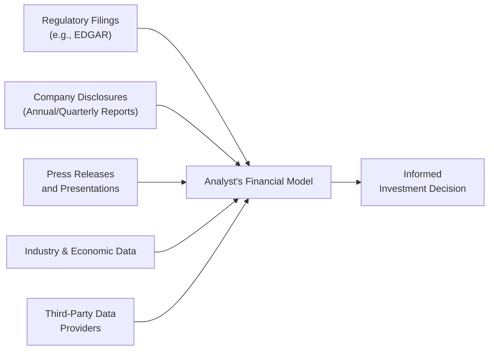

## Introduction and Relevance

Let’s be honest: When I first cracked open a company’s financial statements, I thought everything I needed to know would just pop out of the income statement and balance sheet. (Spoiler alert: that was a bit naïve!) Sure, the numbers in those documents are critical, but as we advance through financial analysis—particularly in preparing for higher-level CFA exam topics—it becomes crystal clear that you need more context. Why did the CFO mention a spike in short-term debt? Are there new regulations in their sector about to change how they recognize revenue? Could supply chain snags or macroeconomic factors be altering next quarter’s outlook? 

That’s precisely why we must go beyond just the reported figures. The following sections will walk you through the major—and extremely helpful—sources of information that complement traditional financial statements. Let’s dig in.

## Key Public Filings: Annual and Interim Reports

Anyone deep into financial analysis will frequently check companies’ annual reports (Form 10-K for U.S. firms, or annual filings in other jurisdictions) and interim reports (Form 10-Q in the U.S., or quarterly/half-yearly filings in other markets). These documents are often brimming with:

• Management’s Discussion and Analysis (MD&A) – The MD&A is somewhat like the CFO’s or CEO’s personal narrative of the company’s situation. If you’re curious about changes in capital structure, they might share the deeper reasons. Or if you’re worried about the firm’s ability to refinance upcoming debt, the MD&A can provide management’s perspective (whether grounded in reality or occasionally over-optimistic).

• Footnotes – Let’s say you see a huge intangible asset on the balance sheet. Should you treat it seriously, or is it fluff? Footnotes can be your best friends. They detail accounting policies, segment revenues, legal contingencies, and the nitty-gritty about intangible assets or fair value measurements.

• Auditor’s Opinion – The presence (or absence) of a clean audit opinion can be a big indicator of potential risk. If you spot a “qualified” or “adverse” opinion, you’d better investigate further.

Interim reports are slightly condensed but can reveal big shifts between annual statements. Products might be seasonal (think retail around the holidays), so looking at interim data helps you dodge the unpleasant surprise of a big Q4 slump that the annual statements alone may mask. For more on how seasonality can impact a firm’s financials, you might reference Seasonality in Interim Disclosures in the broader curriculum.

## Press Releases and Investor Presentations

Let’s say you’re analyzing a major tech company’s stock. All of a sudden, they announce a huge acquisition—maybe they’re buying a cutting-edge AI startup. You can bet that the financial statements won’t immediately show the impact. Press releases and investor presentations become your best bet for timely updates. Presentations are often posted on the company’s investor relations website or on widely used data platforms.

Press releases frequently detail:

• Mergers & Acquisitions – The rationale behind the purchase, the projected synergy, and potential changes to strategy.  
• Executive Changes – CFO resignations can trigger major stock-price moves.  
• Product Launches – New product lines can reshape a company’s revenue mix.

Sometimes, these documents can feel a bit like marketing—management is obviously going to put an optimistic spin on their announcements. Even so, reading between the lines is an integral skill in financial statement analysis.

## Industry Reports and Economic Data

Many factors you see on the financial statements are driven by broader industry and macroeconomic trends. Let me illustrate with a personal anecdote: Years ago, I was analyzing a metals and mining firm. Its revenues looked stable at first glance—until I factored in how global commodity prices had shifted. Commodity cycles, interest rates, GDP growth, and new environmental regulations can drastically alter forecasts and valuations.

Industry white papers, analyst reports, and aggregated economic data can reveal:

• Market Growth Rates – If your company’s growth expectations outpace the entire sector, you might wonder if management’s projections are realistic.  
• Regulatory Environment – Stricter environmental, social, and governance (ESG) regulations can change cost structures or open new revenue streams.  
• Consumer Behavior – Everything from disposable income data to consumer sentiment surveys can hint at future demand.

Combining macro trends with a firm’s public disclosures can help you see if the company is in sync with industry realities—or if it’s missing something big. Cross-reference with the sections on ESG Considerations (Chapter 15) to understand how factoring in environmental and social risks can be critical for a holistic viewpoint.

## Regulatory Databases

Using a robust regulatory database is every serious analyst’s bread and butter. In the U.S., for instance, the Securities and Exchange Commission (SEC) hosts EDGAR—Electronic Data Gathering, Analysis, and Retrieval system. That’s a fancy way of saying: it’s a big online library of filings from thousands of public companies.

• EDGAR (U.S.) – Not only can you pull annual and interim filings, but you can also see insider transactions, ownership changes, and specific corporate events (Forms 8-K, 13D, 13G, etc.).  
• SEDAR+ (Canada) – Similar to EDGAR, but for Canadian markets.  
• Other Global Registries – The disclosure in Europe or Asia might differ, but you’ll generally find a national or regional repository of financial filings.

A lot of folks may skip reading the tricky footnotes, but that’s often where hidden gems or red flags lurk—like a single line about impending litigation that could balloon into a massive liability. 

Speaking of potential pitfalls, you might recall from earlier chapters that reliance on a single, unverified data source can be dangerous. Regulatory filings, though, are typically the official and most reliable records, so they’re essential. For advanced scenario-based exam questions, you’ll often be expected to comb through these filings to support your assumptions in a deep-dive equity or credit analysis.

## Third-Party Data Providers

Let’s talk real-time data. If a central bank unexpectedly cuts interest rates, or if there’s a supply chain disruption in a major commodity, you might want immediate insight. That’s where third-party providers shine:

• Bloomberg – Known for a robust terminal that gives you real-time quotes, analytics, news, and even curated research. The terminal’s chat function is a giant community of finance nerds (myself included) discussing everything from fx rates to the latest Fed announcements.  
• Thomson Reuters (Refinitiv) – Another powerhouse, especially adept at providing historical data sets that might help you correlate certain macro events with a stock’s performance.  
• S&P Capital IQ – Delivers equity, credit, and macro data, plus screening tools that let you parse big data sets to find companies with certain trends (like a high debt-to-equity ratio, or maybe a low price-to-book ratio).

One nice perk of these platforms is they’ll often standardize data. For example, companies might break down cost of goods sold differently, so you can’t always just compare Apple to a pharmaceutical firm at face value. However, these data providers attempt to harmonize financial statement line items to allow easier cross-company comparisons. But fair warning: There can still be slight discrepancies, so be sure to read the fine print when you see figure variation.

## Visual Overview of Information Flow

Below is a simplified Mermaid diagram illustrating how various information sources funnel into an analyst’s overall viewpoint:

These various streams feed into an integrated financial model (highlighted in Chapter 16 on building a company financial model), which is ultimately used to make buy, sell, or hold decisions—or to assess creditworthiness and risk.

## Why Holistic Perspective Matters

It might seem like overkill: “Do I really need to check macroeconomic indicators? I’m just looking at a single company!” But ignoring the broader environment is a classic mistake. For instance, you might be bullish on a car manufacturer for its innovative electric vehicles—without realizing a new environmental regulation could hamper battery imports or a major competitor might be undercutting prices. 

A thorough approach includes:

• Benchmarking – How does the company’s ratio of R&D expense to revenue compare with industry norms?  
• Revenue Sensitivity – Macroeconomic data can tell you how sensitive consumer spending might be to interest rate changes.  
• Compliance & Risk – Press releases often hint at regulatory hurdles. A quick check of official regulatory databases can confirm the seriousness.

## Illustrative Example: Integrating Multiple Sources

Imagine you’re analyzing BioFuture, a pharmaceutical firm:

• From the Annual Report – You learn about a new cancer drug in late-stage clinical trials.  
• MD&A – Management’s tone is quite hopeful, but footnotes mention upcoming patent expirations for older drugs.  
• Press Releases – They recently announced promising trial results, but hidden in the fine print is mention of an unfavorable side-effect discovered during the trial.  
• Industry Report – The pharma sector is grappling with intense competition from generic manufacturers.  
• Macroeconomic Data – Healthcare budgets in major economies face cost-cutting measures, meaning future reimbursements might be lower than initially expected.  
• EDGAR – A separate 8-K filing reveals the CFO sold a large chunk of shares. (Is he just diversifying, or does he suspect trouble?)

Weaving this together, you might adjust your revenue forecast downward. Sure, the new cancer drug is promising, but generic competition plus cost-containment measures might hamper long-term margins. That’s how a multi-sourced approach to analysis can drastically alter your valuation.

## Best Practices and Pitfalls

• Stay Current. Checking press releases only once a quarter might cause you to miss major developments.  
• Don’t Rely on a Single Source. A flashy investor presentation might gloss over unfavorable details. Regulatory filings, however, are less likely to do so.  
• Compare Notes. If third-party data providers show a mismatch with official filings, investigate. It could be a simple data standardization issue—or it could be your first clue of an inconsistency.  
• Maintain Objectivity. It’s easy to get swept up in management’s optimism. But as candidate analysts and future charterholders, we must keep a keen, professional eye on the numbers and the narrative.

## Practical Tips for the CFA Exam

1. Document Citations. If a vignette references “the company’s latest press release” or “the MD&A,” expect to glean crucial updates or clarifications for adjusting your analysis.  
2. Time-Value Nuances. The exam may incorporate changes between annual and interim data. Keep track—some exam questions specifically test your ability to note divergences.  
3. Ethical Considerations. In line with the CFA Institute Code and Standards, using multiple data sources can reduce misinterpretation or bias. Over-reliance on unverified data is a no-no.  
4. Integration. At Level III, you’ll see scenario-based questions requiring integrated findings: from high-level macro data, to industry analysis, down to the micro details of the footnotes.

## Final Thoughts

So, yes, financial statements remain the backbone of any analysis. But they’re by no means the only story in town. In a fast-moving financial world, press releases, regulatory databases, industry reports, and real-time data streams can collectively help you spot opportunities—and avoid pitfalls. This holistic approach may feel like a lot of work in the beginning (and it can be!), but over time, it becomes second nature and can be the deciding factor in whether you uncover a hidden gem or dodge a disastrous investment.

Keep exploring Chapter 1 for a broader overview of how to interpret financial statements. Then move on to more in-depth topics like Analyzing Income Statements (Chapter 2) and Balance Sheets (Chapter 3). And if you’re building your own financial model, you’ll definitely want to bookmark Chapter 16, which ties together everything you’ve learned.

## References and Further Reading

• SEC EDGAR Database:  
  https://www.sec.gov/edgar.shtml  

• Bloomberg Terminal & Training Materials:  
  https://www.bloomberg.com/professional/

• S&P Capital IQ, Thomson Reuters (Refinitiv), and Other Data Providers (case-specific usage)  

• CFA Institute Code of Ethics and Standards of Professional Conduct:  
  https://www.cfainstitute.org/en/ethics-standards/ethics/code-of-ethics-standards-of-conduct  

• “Financial Analysis Techniques” (Chapter 13 in this volume) – for deeper ratio and trend analysis.  

• “Data Analytics for Financial Disclosures” (Section 1.13 in this volume) – for advanced ways to parse and visualize large data sets.

---

## Test Your Knowledge: Essential Sources of Financial Analysis Quiz



### Which of the following statements best describes the purpose of Management’s Discussion & Analysis (MD&A) in annual reports?

- [ ] It provides audited financial results and independent audit opinions.
- [x] It offers management’s perspective on financial and operational performance, risks, and forward-looking information.
- [ ] It serves as a required statement solely summarizing revenue recognition.
- [ ] It reports strictly on segment disclosures and intangible assets.

> **Explanation:** The MD&A is un-audited and reflects management’s viewpoint, often providing forward-looking statements, risk assessment, and broader context behind the numbers.

### A technology firm announces a critical new partnership in a press release. Why is it important to analyze the press release in addition to the firm’s annual report?

- [x] The press release can contain real-time updates not yet reflected in annual or interim reports.
- [ ] Press releases are the only valid source of a firm’s long-term debt obligations.
- [ ] Press releases always detail intangible asset impairment charges more accurately than filings.
- [ ] Press releases are legally binding documents offering the same disclosures as the annual report.

> **Explanation:** Press releases typically share instantaneous corporate updates—e.g., major deals, executive changes—well in advance of official annual or interim report filings.

### Which of the following is a primary advantage of using regulatory databases, such as EDGAR?

- [ ] They are updated only once a year so data remains consistent.
- [ ] They contain only historical data and do not include current filings.
- [ ] They allow users to modify reported financial data for better cross-company comparisons.
- [x] They consolidate official filings, providing a reliable, centralized source of information.

> **Explanation:** Regulatory databases like EDGAR capture all relevant filings for public companies, ensuring analysts have timely, reliable, and comprehensive documents for evaluation.

### If you notice discrepancies between a company’s financial statements in its annual report and the standardized data from a third-party provider, which of these actions is most advisable?

- [x] Investigate the underlying methodologies and footnotes in both sources to confirm accuracy.
- [ ] Disregard standardized data altogether and rely solely on annual report figures.
- [ ] Assume the standardized data is correct and update all your calculations accordingly.
- [ ] File a formal complaint with the regulatory authority immediately.

> **Explanation:** It’s crucial to compare methodologies and footnotes when discrepancies arise. Standardized data might aggregate line items differently from the firm’s direct disclosures.

### Press releases should be viewed with caution because:

- [x] They may emphasize positive developments while glossing over risks or negative performance indicators.
- [ ] They include false financial information to manipulate investor sentiment.
- [x] They could be marketing tools and lack comprehensive regulatory scrutiny compared to filings.
- [ ] They only focus on asset impairments and share buyback programs.

> **Explanation:** Press releases are not always balanced. They serve as immediate corporate communications that can be selective or subject to marketing spin, meaning analysts must corroborate details with official filings.

### How do industry reports and macroeconomic data help analysts?

- [x] They provide context on external factors that could affect a company’s performance.
- [ ] They replace the need for detailed company financial statements.
- [ ] They are only necessary for investment banking roles, not for equity research.
- [ ] They serve as official references for the company’s board of directors and are not accessible to external analysts.

> **Explanation:** Industry reports and macro data enable an analyst to gauge whether a company’s performance is in line with broader market trends or impacted by economic cycles.

### Which resource can be most helpful for obtaining confidential internal financial metrics that have not been publicly disclosed?

- [ ] Press releases from the investor relations website
- [ ] Form 10-K filings on EDGAR
- [x] None of these; obtaining confidential information not publicly disclosed can violate CFA Institute ethical standards
- [ ] Quarterly earnings calls

> **Explanation:** Using confidential nonpublic information is a direct violation of the CFA Institute Code of Ethics. Public documents do not include confidential metrics.

### Exam vignettes often present third-party data (e.g., from Bloomberg or S&P Capital IQ). Which is the most appropriate approach for candidates?

- [x] Verify key figures against the firm’s regulatory filings if possible, and understand how third-party providers normalize data.
- [ ] Assume third-party data is entirely accurate and rely solely on it for the analysis.
- [ ] Ignore any footnote references and focus on the main figures in the data set.
- [ ] Disregard the data if it does not match management’s estimates.

> **Explanation:** Third-party data can differ from official filings due to normalization. Cross-verifying helps maintain accuracy.

### A CFO’s sudden stock sale is revealed through a regulatory filing. Why is this noteworthy for an analyst?

- [x] It might signal lack of confidence or personal diversification, prompting deeper investigation.
- [ ] It’s entirely irrelevant, as insider trading is never permitted.
- [ ] It indicates a positive outlook for the firm’s future due to new regulation.
- [ ] It means the market is perfectly pricing in all relevant information.

> **Explanation:** Insider transactions can be a red flag or a benign personal decision. The analyst should dig deeper into corporate announcements and footnotes for context.

### True or False: Analysts should rely exclusively on the annual report for accurate and thorough financial analysis.

- [x] True  
- [ ] False  

> **Explanation:** This is a trick question: while the annual report is a crucial piece, it is not enough on its own to provide a full picture. Press releases, interim filings, industry reports, and regulatory databases are also vital. As an analyst, you need all the relevant sources. However, if you’re forced to categorize such an absolute statement as “true” or “false,” you’d see it as “False” in normal circumstances. But the question’s text (“true or false: rely exclusively”) ironically states it’s workable to rely exclusively. This is intentionally paradoxical—demonstrating the importance of reading carefully. In standard practice, we never rely solely on annual reports.


