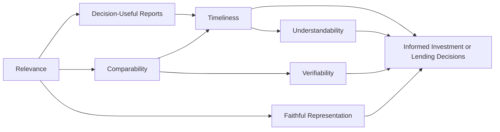

## Introduction

So, let’s be real for a second: reading a giant stack of financial statements for the first time can be…well, intimidating. You’ve got rows of numbers, complicated footnotes, and sometimes even a few disclaimers that make you wonder if you’re reading a corporate finance novel instead of a straightforward financial report. But you know what? The actual blueprint that guides how these statements should be put together—the "why" behind all those disclaimers—is the set of qualitative characteristics that underpin financial reporting. These characteristics are meant to ensure that the information you’re looking at is not just a jumble of data, but rather a coherent picture that helps you make good decisions.

In this section, we’ll explore the key qualitative characteristics of financial statements—Relevance, Faithful Representation, Comparability, Verifiability, Timeliness, and Understandability—as set out by the International Accounting Standards Board (IASB) and the Financial Accounting Standards Board (FASB). We’ll also chat a bit about materiality, neutrality, and completeness along the way. My first personal story with these concepts happened when I was analyzing two telecom companies; the data was so dense that, without an understanding of these characteristics, I might have missed signals about one firm’s weaker revenue recognition approach. That’s how important these principles are.

## Relevance

Any financial information you see in a company’s statements should actually matter to your decisions. You know that feeling when you’re about to buy a car, and you only want to focus on the brand’s reliability record and total mileage rather than some obscure detail like the trunk handle design? That’s basically Relevance. Information is considered relevant if it has the potential to influence users’ decisions—be it about predicting future performance or confirming or correcting previous expectations.

In a more technical context, Relevance ties in closely with materiality. Financial details that could sway an investor’s or creditor’s decision are considered material. If it’s not material, it’s probably not relevant—and might not need to be front and center in the statements. A real-life scenario is when a small, one-time expense is overshadowed by the firm’s multi-billion-dollar revenue stream. If that expense is inconsequential to understanding the business, you won’t see it broken out in extensive detail.

## Faithful Representation

Faithful Representation is like making sure a photograph is an unedited reflection of reality—free of filters, not overexposed, and definitely not manipulated. In the world of financial statements, faithful representation implies that the information is complete, neutral, and free from material error.

• Completeness: All details necessary to understand the firm’s financial condition should be in the report. If a major obligation or liabilities from an ongoing lawsuit are left out, the portrayal is incomplete.  
• Neutrality: There shouldn’t be any bias. You don’t want management to hide certain aspects just to improve the look of their performance metrics.  
• Freedom from Material Error: It’s not realistic to expect perfection. But the big stuff must be accurate enough that your decisions aren’t misled.

One time, I was consulting for a small manufacturing client that inadvertently left out a crucial note about pending product return obligations. Oh, boy—when we discovered that, it drastically changed how we assessed the firm’s short-term liquidity. That’s exactly why faithful representation is vital: it ensures statements actually mirror economic reality rather than an idealized version of events.

## Comparability

Have you ever tried to compare two things that are not aligned—like your grocery list from one month to your sibling’s from three years ago? You might see categories like "household items," "snacks," or "toiletries," but the data is basically useless without consistency. That’s Comparability: ensuring that similar transactions and events are accounted for consistently across reporting periods and across different companies.

Comparability helps users identify trends (is revenue growing or stagnating over time?), spot anomalies (why did the company change its revenue recognition method mid-year?), and differentiate performance drivers among peers. In Chapter 2 (Analyzing Income Statements), you’ll see how certain classification or nonrecurring items can heavily impact comparability. Ultimately, consistent application of accounting policies fosters comparability—but be aware that changes in estimates or methods should be transparently disclosed so the market understands what’s going on.

## Verifiability

Verifiability means that independent observers can reach a consensus that the numbers and disclosures are supported by evidence. A straightforward example is inventory valuation: if you arrive at the same sum for inventory, using the same generally accepted method and evidence, as an external auditor would, that’s verifiability in action. This characteristic often involves documentation, confirmations, or other forms of backup that support the financial data.

One of my favorite recent anecdotes is about a real estate firm that attempted to place a higher-than-market valuation on a small property by referencing future hypothetical developments. However, an external appraisal firm came in with a completely different estimate. The final solution was to rely on more standardized (and verifiable) measures, which led to a fair representation of the property’s value. So, yes, it matters that numbers can be checked, validated, and agreed upon by knowledgeable parties.

## Timeliness

Timeliness is pretty self-explanatory: the faster you get the statements, the more useful they are in influencing decisions. Information that arrives too late—think about quarterly results released six months after the quarter’s end—loses much of its capacity to influence decisions. This is especially important for investors tracking a firm’s performance in real time. In Chapter 1.12 (Interim Reporting), you’ll see how interim disclosures help ensure data is provided at frequent intervals to keep stakeholders updated on the firm’s trajectory.

Regulatory bodies often impose deadlines for filing financial statements already, ensuring that general-purpose financial reports come out regularly. If a company is habitually late with publishing, that raises a red flag: either they’re dealing with internal control issues, or some data might be too stale to reflect the current reality.

## Understandability

Accounting can be dense—no question about that—but it should be presented in a reasonably understandable form. This doesn’t mean simplifying so far that major details are left out; rather, it means using clear language, logical structure, and consistent classifications. Of course, there is an assumption that the user has "a reasonable knowledge of business and economic activities," so reporters don’t have to drop every bit of technical language. But if the statements or footnotes read like an advanced rocket-science text, you might question if the company is meeting the Understandability requirement.

This was definitely a lesson I learned early on. I once prepared a pitch for a new investor and loaded it with so many technical ratios and disclaimers that the prospective investor was totally bewildered. After some adjustments—like adding a high-level summary and clarifying footnotes—the same investor found the pitch much more approachable. Understandability in financial reporting has that same effect on a broader audience.

## Assessing Qualitative Characteristics in Practice

When you’re analyzing a set of financials, keep an eye out for disclosures that mention why certain details are included (or excluded). If you see a major transaction without enough explanation in the notes, it could affect both Relevance and Faithful Representation. If every footnote is so jargon-heavy that you need a legal dictionary, it might be failing Understandability. And if a firm’s statements appear significantly different in format or approach compared to prior periods—or to peers in the same industry—Comparability might be compromised.

One approach is to create a mini-checklist, especially useful if you’re doing a deep-dive industry analysis:

• Relevance: Are big events disclosed? Do the numbers matter for forecasts?  
• Faithful Representation: Is there any bias or obvious omission?  
• Comparability: Same methods over time? Peer alignment?  
• Verifiability: Could I replicate these figures if I had the same data?  
• Timeliness: Did the company file on time?  
• Understandability: Are important attributes explained in a reasonably clear way?

## Practical Example and Case Study

Imagine a tech startup, NovaCode Inc. They reported a massive revenue spike in Q4 but failed to emphasize that the spike mainly came from a one-time licensing arrangement with a single, short-term client. If you’re not paying attention, you might interpret this as "NovaCode’s revenue is skyrocketing," which in turn influences your forecast.

• Relevance: The detail of how revenue was generated is crucial for predicting future earnings. If it’s not highlighted, you lack relevant data.  
• Faithful Representation: If the startup lumps that one-time revenue into "Recurring Sales," the financial statements won’t faithfully represent the nature of that revenue.  
• Comparability: If earlier periods didn’t have big one-time deals, the statements might suddenly become difficult to compare over time, unless the company discloses the change.  
• Verifiability: If the licensing contract can be independently confirmed, then the revenue recognized is verifiable.  
• Timeliness: If the company reports these results six months late, it’s losing much of the impetus for investors who want to gauge growth in real time.  
• Understandability: If the footnotes are super technical, you may never glean that a single licensing deal drove the entire "mega" revenue figure.

Below is a simple mermaid diagram showing the interplay between these qualitative characteristics:

In this diagram, we see how each characteristic contributes to better-informed decisions. Relevance, Comparability, Faithful Representation, Verifiability, Timeliness, and Understandability individually and collectively drive the ultimate goal: decision-useful information.

## Key Best Practices and Potential Challenges

• Best Practices:  
  - Companies should prioritize the most relevant data and present it in a clear format.  
  - Use plain language in footnotes, while still meeting professional accounting guidelines.  
  - Adopt consistent measurement principles, but if a change is needed, disclose clearly why it’s made.  

• Potential Challenges:  
  - Overly Complex Disclosures: It’s not unusual for certain derivatives or pension obligations to be hyper-technical, so a balance between detail and clarity is essential.  
  - Delayed Reporting: This undermines timeliness and can signal deeper internal issues.  
  - Aggressive Bias: Management might want to paint a rosy picture, compromising neutrality.  

## Conclusion

Qualitative characteristics are the backbone of financial statement reliability. Whenever you crack open a set of financials, keep these attributes on your radar. Watch for consistent treatment, relevant details, faithful depiction of economic reality, verifiability of important figures, timely delivery, and clarity. Without them, you’re basically fumbling around in the dark when trying to make investment or credit decisions. And let’s face it—nobody wants that. 

---

## References and Further Reading

- IASB Conceptual Framework for Financial Reporting  
- FASB Conceptual Framework: https://www.fasb.org  
- CFA Institute, 2025 Level 1 Curriculum, Volume 4: Financial Statement Analysis  
- Chapters 2 (Analyzing Income Statements) and 13 (Financial Analysis Techniques) for deeper insights related to comparability and ratio implications  

---

## Test Your Knowledge: Qualitative Characteristics of Financial Statements



### Which of the following best describes the characteristic of Relevance?

- [ ] The information is comparable over different reporting periods.  
- [x] The information can influence a user’s decision or assessment of a firm.  
- [ ] The information is free from bias and error.  
- [ ] The information can be checked by an independent auditor.  

> **Explanation:** Relevance focuses on the capacity of the information to affect users’ decisions, either by helping them predict outcomes or confirm past evaluations.

### Which of the following components is necessary for Faithful Representation?

- [x] Completeness, neutrality, and freedom from material error  
- [ ] Materiality, timeliness, and consistency  
- [ ] Comparability, verifiability, and transparency  
- [ ] Verifiability, prudence, and performance obligations  

> **Explanation:** Faithful Representation requires that data be neutral (unbiased), complete, and free from material error. These three elements ensure the depiction reflects actual economic events.

### How does Comparability enhance the decision-usefulness of financial statements?

- [ ] It ensures that footnotes are written in everyday language.  
- [ ] It requires statements to be published within a strict deadline.  
- [x] It lets users evaluate similar transactions across companies and over time.  
- [ ] It focuses on confirming whether the figures are free from material error.  

> **Explanation:** Comparability helps stakeholders identify consistencies and differences in financial performance or position across different reporting periods or entities, aiding informed decision-making.

### A company does not disclose a material environmental liability in its financial statements. This is most likely a violation of:

- [ ] Comparability  
- [x] Faithful Representation  
- [ ] Timeliness  
- [ ] Verifiability  

> **Explanation:** Omitting a significant liability undermines Faithful Representation because the financial statements are incomplete and potentially misleading.

### Which statement about Timeliness is most accurate?

- [x] Financial data should be presented quickly enough to be relevant to users’ decisions.  
- [ ] Financial data should adhere to a single consistent accounting regulation.  
- [ ] Financial data should only be released if guaranteed free from error.  
- [ ] Financial data should be disclosed simultaneously with competitor data.  

> **Explanation:** Timeliness means promptly providing users with the information so that it can still influence their decisions.

### Under the Understandability characteristic, which of the following is essential for effective financial analysis?

- [x] Clear presentation that assumes users have a basic understanding of business.  
- [ ] Exclusion of technical terms so that all readers, regardless of background, can fully grasp the information.  
- [ ] Providing all disclosures in one large table.  
- [ ] Hiding complicated derivative disclosures in a separate appendix.  

> **Explanation:** Understandability assumes a reasonable knowledge of business and finance, but also requires that the presentation be structured and phrased to be accessible, without obscuring key data.

### When two independent auditors can arrive at the same conclusion about an inventory’s valuation, which characteristic is being upheld?

- [ ] Timeliness  
- [x] Verifiability  
- [ ] Comparability  
- [ ] Relevance  

> **Explanation:** Verifiability means that different informed parties can measure or check the same data and obtain a consistent result.

### A sudden change in a firm's revenue recognition policy without explanation in the financial statements most impacts:

- [ ] Relevance  
- [ ] Verifiability  
- [x] Comparability  
- [ ] Timeliness  

> **Explanation:** Not explaining the change in accounting policy hampers stakeholders’ ability to compare results with previous periods or with other firms using consistent methods.

### Given the qualitative characteristics, which of the following scenarios is most likely acceptable according to IASB or FASB frameworks?

- [x] Excluding an immaterial transaction that would not influence a user’s decision.  
- [ ] Delaying the release of earnings beyond mandated deadlines to gather perfect data.  
- [ ] Omitting notes that explain a change in the depreciation method.  
- [ ] Maintaining a revenue policy that is knowingly biased in management’s favor.  

> **Explanation:** Excluding information that is immaterial is permissible since it does not affect decision-making. The other options either violate timeliness, faithful representation, or comparability.

### True or False: Neutrality implies that data in financial statements can be selectively presented to favor better performance metrics as long as the information is accurate.

- [ ] True  
- [x] False  

> **Explanation:** Neutrality means the information is presented without bias. Even accurate data can be misleading if it’s selectively chosen to favor certain outcomes.


