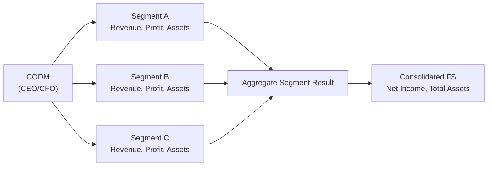

## Segment Reporting: A Practical Exploration

Segment reporting frequently sparks questions and curiosity among analysts—especially those just getting their feet wet in dissecting financial statements. Maybe you’ve wondered why a big global retailer breaks down performance by region or product group. Or why a tech giant chooses to highlight its cloud services separately from its hardware sales. These breakdowns are not just extra details: they're essential. With segments disclosed, we get an insight into which parts of the business drive profits—and which might be dragging it down. Here, we’ll discuss key practical details surrounding segment reporting requirements, guided by IFRS 8 (Operating Segments) and US GAAP’s ASC 280. Let’s roll up our sleeves and see what all the fuss is about.

## Why Segment Reporting Matters

Think about a diversified manufacturing conglomerate. One of its divisions might produce heavy-duty machinery for industrial customers, another might make consumer-facing electronics, and it might also have a small consulting services branch. Each part of the enterprise has different revenue sources, cost structures, and risk profiles. Examining the consolidated financial statements alone might obscure which lines of business are flourishing (or floundering). Segment reporting helps break down that overall performance, ensuring that we, as analysts, don’t end up basing our judgments on an oversimplified “average.”

From an investor or portfolio manager’s perspective, segment disclosures feed directly into:
• Risk Assessment: Segments cater to different markets and macroeconomic conditions, so segment data can reveal vulnerabilities and hedgeable exposures.  
• Capital Allocation Strategy: Understanding which segments are more profitable or more asset-intensive can guide buy-or-sell decisions, as well as inform valuation models.  
• Performance Benchmarks: Certain metrics, such as return on sales or growth rates, can swing wildly if a company lumps dissimilar businesses together. Segmentation clarifies performance drivers.

## Definition of an Operating Segment

Under IFRS 8 and US GAAP (ASC 280), a segment is essentially a component of an entity that:
1. Earns revenues and incurs expenses (including those from transactions with other segments).  
2. Has discrete financial information available.  
3. Is regularly reviewed by the company’s chief operating decision maker (CODM) to evaluate performance and allocate resources.

The CODM can be the company’s CEO, CFO, or a management committee—whoever has ultimate responsibility for deciding where to pour money and how to monitor operational outcomes.

### A Quick Spotlight on CODM

The role of “Chief Operating Decision Maker” might sound fancy, but it simply describes the people who have the power to shape strategic direction. If you think about a large retail chain, for instance, the CODM might look at store performance by region—perhaps sales in North America vs. Asia vs. Europe—and decide how many new stores to open or close in each location. The segments the CODM uses to make these decisions typically become the basis for segment reporting.

## Key Disclosure Requirements

Both IFRS 8 and ASC 280 require that companies provide certain data for each reportable segment. Let’s call it the “what, how, and why” of segment reporting.

• Revenues: You’ll see both external segment sales and inter-segment sales. Inter-segment revenue can matter when the divisions trade among themselves—useful for spotting potential transfer pricing issues.  
• Profit or Loss Metrics: Often shown as segment operating profit (or a similar measure). Companies must clearly define which measure they’re using—EBIT, EBITDA, or something else.  
• Assets and Liabilities: Where relevant, total segment assets (and sometimes liabilities) need disclosure. Not every company includes liabilities if the CODM doesn’t look at those details.  
• Basis of Segmentation: A description of how management identifies segments—by geography, product line, customer type, or any other logic.  
• Reconciliations: A key part of segment reporting ties the sum of segment results to the consolidated financial statements. For example, all segments combined might show an “aggregate segment profit” that differs from net income on the main income statement due to corporate overhead, inter-segment eliminations, or adjustments.  

Disclosures help you connect the dots from each segment’s figures to the final totals in the consolidated financial statements. This step is crucial for a consistent, credible picture.

## Segment Aggregation and Thresholds

Not every business unit or subsidiary is automatically classified as a separate reportable segment. IFRS 8 and ASC 280 set thresholds:
1. 10% or More Rule: If a segment’s revenues (or profits, or assets) are 10% or more of the combined total, it typically must be separately reported.  
2. Aggregation Criteria: Companies can combine segments that share similar economic characteristics, products, processes, customers, or distribution methods. But regulators want to ensure that such aggregation doesn’t muddy your ability to differentiate key aspects of performance.

Sometimes, management might aggregate smaller segments into a single “all other” category if individually they don’t pass the 10% threshold. Still, “all other” is not meant as a dumping ground for crucial data.

## Segment Reporting in Action

I once helped a friend analyze a large pharmaceutical company. They grouped their operations into “human health,” “animal health,” and a small “divestitures” line. This breakdown was golden for us. It allowed us to see that while the human health side contributed the majority of revenue, the animal health segment produced a surprisingly higher operating margin. Without that insight, we might have missed how reliant that company was on its animal health business for stable cash flow—something that significantly impacted our valuation approach.

## Analytical Use: Unmasking the Story Behind Segment Data

So how can we, as analysts, leverage these disclosures in a cohesive way?

• Profitability Drivers: Some segments might look unstoppable, while others are flatlined. For instance, if Segment A has 25% year-over-year revenue growth but Segment B is shrinking, it’s a big clue about resource allocation.  
• Growth Rates: Take a few years of segment data and compare growth. If a once-sleepy business line is now in a growth spurt, that might explain a big chunk of the overall top-line expansion.  
• Risk Exposure: Segment data reveal dependencies. What if one segment is an 80% revenue contributor in a volatile region? That’s a risk for revenue stability.  
• Cost Structure Differences: You might notice that certain segments have different operating leverage or fixed vs. variable cost mixes—key info for stress testing or scenario analysis.  

Also, watch for how management reclassifies or reorganizes segments over time. Shifting segments around can sometimes make comparisons tricky. It’s certainly not illegal; sometimes the business genuinely changes. But it can also be a “fog machine” to make year-over-year results look better (or worse) under certain definitions.

## Reconciliations: Bridging Segment Totals to Consolidated Figures

A hallmark of IFRS 8 and ASC 280 is the requirement to reconcile reported segment amounts to what’s actually shown in the primary financial statements. These “Segment Reconciliations” typically cover:

• Total segment revenue to the consolidated revenue  
• Total segment profit or loss to the consolidated net income  
• Total segment assets to consolidated assets  

Reconciling items might include corporate overhead, intercompany eliminations, and adjustments to adopt consistent policies across segments. Reading the footnotes carefully here is essential to fully map out what is or isn’t included in each segment.

Here’s a small conceptual diagram to visualize how data from multiple segments eventually tie into the consolidated results:

In this flowchart:
• Each segment calculates its own results.  
• The segments combine into an aggregate figure.  
• Reconciling and adjustments ensure that the aggregate lines up with the consolidated financial statements.  

## Potential Challenges and Pitfalls

• Over-Aggregation: Sometimes management lumps distinct businesses together, claiming they have “similar economic characteristics.” Analysts might lose the nuances of each component.  
• Reclassification of Segments: Keep an eye on changes in reporting structure. A new segment grouping from one year to the next can distort your historical trend analysis if you’re not careful.  
• Non-Standard Profit Measures: A company might define segment profit in a non-GAAP or non-IFRS manner, requiring you to track down how that definition differs from net profit or EBIT.  
• Large “Corporate” Bucket: The dreaded “corporate and other” category might house big corporate overheads or intangible items. If it’s too large or vague, you might want to parse out more detail or question management during an earnings call.

## Best Practices for Analysts

1. Compare Segment Data over Multiple Periods: Don’t rely on one snapshot. Look for patterns or trends—maybe a segment’s sales are stagnant even though overall revenue grows.  
2. Relate Segment Performance to Economic Events: If a software subsidiary is losing money just as a competitor’s new product is launched, perhaps that’s the cause.  
3. Add a Vertical or Horizontal Analysis: Compute segment contribution margins, segment growth rates, or common-size statements at segment level to see how each piece affects the business over time.  
4. Investigate Transfers Between Segments: If inter-segment transactions are significant, consider how the transfer pricing might influence reported segment profits. Sometimes, management can shift profits from an underperforming segment to a “star” segment (or vice versa) via transfer pricing.

## A Brief Example: A Hypothetical Company

Let’s say ABC Corporation has three major business segments:
• Manufacturing (segment revenue = \$2.0 billion, profit = \$250 million)  
• Services (segment revenue = \$1.2 billion, profit = \$190 million)  
• Retail (segment revenue = \$800 million, profit = \$40 million)  

They also have a “Corporate/Eliminations” line that houses \$50 million in overhead. The consolidated net income might come to \$430 million (\$250m + \$190m + \$40m – \$50m overhead). By reviewing this structure, you could notice that even though Manufacturing is the largest revenue generator, Services has a higher profit margin. That might suggest that management should funnel more capital into the Services business—or it might reveal that Manufacturing has a cyclical capital expenditure cycle, and there could be long-term growth potential once production ramp-ups finish.

## Viewing Segment Reporting Through a Portfolio Manager’s Lens

Many CFA candidates are already well-versed in portfolio construction. So, you might be scratching your head and thinking: “How does segment reporting help me if I’m focusing on portfolio allocations or risk management?” Well, analyzing segments can:

• Highlight Industry-Specific Cyclicality: If the manufacturing segment is heading into a downturn, that may give you signals for broader cyclical moves.  
• Improve Valuation Accuracy: A sum-of-the-parts (SOTP) valuation approach becomes possible when you have segment-level data, helping you decide if the stock appears undervalued.  
• Offer Clarity on Strategic Shifts: If a conglomerate invests heavily in a new segment, analyzing the segment’s historical performance can help assess the viability of that pivot.

## Common Segment Reporting Differences Between IFRS and US GAAP

While IFRS 8 and ASC 280 are largely convergent, some subtle differences can pop up:

• IFRS 8 often provides slightly more flexibility in presenting segment liabilities—if the CODM does not review segment liabilities, IFRS does not require them to be disclosed.  
• Under US GAAP, quantitative thresholds and definitions are spelled out in ASC 280. IFRS 8 also references the 10% threshold, though IFRS sometimes allows more judgment in aggregation decisions.  
• Certain geographic and major customer disclosures can differ slightly between the two frameworks, but in practice, the overall structure is similar.

## Keeping an Eye on Management’s Narrative

Segment reporting is one area where the story management tells often meets the numbers. In conference calls or annual reports, executives might highlight new segment structures or reclassify certain product lines under different segments. While these disclosures are typically well-intentioned, they’re also opportunities for management to showcase success stories or hide trouble. The wise analyst stays objective, reading the footnotes carefully and verifying that any reclassifications make sense.

## Conclusion: Harnessing the Benefits of Segment-Level Visibility

Segment reporting requirements might feel like another batch of disclosures to slog through, but they’re actually a gift to analysts and investors. By giving us more granular data—profits, revenues, assets, or liabilities by segment—we can better understand a company’s risk, growth, and profitability. And sure, you might run into comparisons that become tricky when segments shift. But that’s part of the analytical treasure hunt. Keep your eye out for the real performance signals, and remember to reconcile those segmented numbers with the consolidated results. Before you know it, you’ll be making sharper, more nuanced calls about the companies you track.

## Further Resources

• IFRS 8 (Operating Segments):  
  https://www.ifrs.org  
• ASC 280 (Segment Reporting):  
  https://asc.fasb.org  
• CFA Institute Official Curriculum: Check out additional examples on segment disclosures.  
• Academic Articles on Segment Reporting Manipulations and how they affect investor perception.

Anyway, that about wraps up our tour of segment reporting. Keep referencing your knowledge from other sections throughout Volume 4—like when analyzing key ratios (Chapter 13) or discussing potential off-balance-sheet items in Chapter 9. The interconnected nature of segment data underscores how strategic decisions swirl together to form the big, consolidated picture.

---

## Test Your Knowledge: Segment Reporting Essentials



### Which of the following best describes the chief operating decision maker (CODM) under IFRS 8 and ASC 280?

- [ ] The chairman of the board who signs annual financial statements.
- [x] The individual or group responsible for allocating resources and evaluating segment performance.
- [ ] The external auditor who reviews the company’s overall financials.
- [ ] The investor relations officer who communicates with shareholders.

> **Explanation:** IFRS 8 and ASC 280 define the CODM as the role or body that decides how resources are allocated and evaluates performance, typically the CEO, CFO, or senior executive committee.

### A segment is reportable under IFRS 8 and ASC 280 if it:

- [x] Has revenues, profit or loss, or assets equal to or greater than 10% of the entity’s totals.
- [ ] Sells exclusively to external customers, not inter-segment customers.
- [ ] Shows at least 5% of the consolidated revenues.
- [ ] Is defined by the board as a separate operational unit.

> **Explanation:** Both standards use a 10% threshold rule for revenue, profit, or assets. If a segment meets or exceeds any of these thresholds, it is deemed reportable.

### When management lumps several small segments into a single “all other” category:

- [ ] They violate IFRS 8 if any single segment is above the 5% threshold.
- [x] They may do so if each individual segment is below the reporting threshold and they share similar economic characteristics.
- [ ] They are not required to disclose revenues for that category.
- [ ] They must always provide full financial details for the “all other” category.

> **Explanation:** Companies sometimes combine segments that do not meet the 10% threshold into an “all other” group; however, IFRS 8 and ASC 280 still require certain disclosures for this aggregate category.

### Which of the following is not typically disclosed under segment reporting?

- [x] Detailed trade receivable aging schedules for each segment.
- [ ] External revenue generated by each segment.
- [ ] Segment profit or loss measures.
- [ ] A reconciliation of segment totals to consolidated figures.

> **Explanation:** While IFRS 8 and ASC 280 mandate segment-level revenues, profits, and reconciliations, they usually do not require a detailed breakdown of certain balance sheet items like trade receivables by segment, unless needed to understand segment performance.

### One key difference between IFRS 8 and ASC 280 is that:

- [ ] IFRS 8 has no mention of a 10% rule.
- [ ] ASC 280 completely disallows aggregation of segments.
- [x] IFRS 8 may not require segment liabilities if the CODM does not regularly review them.
- [ ] ASC 280 provides less guidance on materiality thresholds than IFRS 8.

> **Explanation:** While both frameworks converge in many respects, the IFRS 8 approach sometimes permits exclusion of segment liabilities if those measures are not regularly reviewed by the CODM.

### A prime benefit of segment-level data for investors is:

- [ ] Making the consolidated statement of financial position unnecessary.
- [x] Gaining insight into profitability and risk drivers of distinct business lines.
- [ ] Reducing the amount of disclosures management must produce.
- [ ] Ensuring that intangible assets are never capitalized.

> **Explanation:** Segment data illuminate how a business’s different parts perform in isolation, helping uncover risk, profitability, and growth drivers that might be obscured in consolidated figures.

### If a company frequently changes its internal reporting structure for segments:

- [ ] It indicates that the business has violated IFRS 8.
- [ ] It is prohibited to restate historical data according to the new structure.
- [x] Analysts should carefully track the changes to make meaningful period-to-period comparisons.
- [ ] The company must cease all future segment disclosures until stable structures are established.

> **Explanation:** A company may reorganize segments due to strategic shifts or acquisitions. Analysts should track changes to maintain consistency in performance comparisons.

### When reconciling segment totals to the consolidated financial statements, you might see:

- [ ] Reductions due to intangible asset impairments only.
- [x] Corporate overhead expenses and intercompany eliminations.
- [ ] A direct match with no differences in each line item.
- [ ] Gains recognized in every period.

> **Explanation:** Reconciling items typically include corporate (unallocated) overhead and intercompany eliminations, ensuring that segment data align with the consolidated statements.

### What is a common challenge or pitfall in segment reporting?

- [ ] There are no thresholds to determine if a segment is reportable.
- [ ] Companies must always break down intangible assets segment by segment.
- [x] Over-aggregation of segments can obscure important differences in profitability or risk.
- [ ] Companies may only report geographical segments, never product segments.

> **Explanation:** Over-aggregation can hide material differences among business units, limiting clarity for investors and analysts.

### Is it true that segment reporting often aids sum-of-the-parts (SOTP) valuation analyses?

- [x] True
- [ ] False

> **Explanation:** By laying out separate financial data for each major line of business, analysts can apply different valuation multiples or methods, thus making a sum-of-the-parts approach more accurate.


