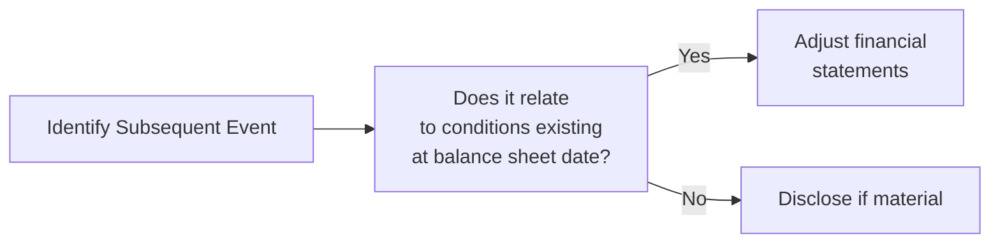

## Overview and Context

Sometimes, life surprises us right after we’ve wrapped up our financial statements. There might be a big event—like a court ruling or a swath of customer defaults—that happens after the reporting date but before our beloved financial statements are officially issued. These episodes are what we call “subsequent events,” and they can seriously shake up how we read and interpret those final numbers.

In practice, subsequent events are like proof that financial analysis doesn't end the moment you see the balance sheet date. Instead, you hang on to see what can pop up between the reporting date and the statement issuance date. In this section, we explore how to identify and classify these events, illustrate them with practical examples, and highlight implications for your analysis under both IFRS (IAS 10) and US GAAP (ASC 855).

## Definition of Subsequent Events

Under both IAS 10 (Events after the Reporting Period) and US GAAP (ASC 855, Subsequent Events), a subsequent event is any event—favorable or unfavorable—that occurs between:

• The end of the reporting period (the balance sheet date), and  
• The date the financial statements are authorized for issuance.

The primary idea is to ensure that financial statements reflect the most relevant information at the time they’re officially released. However, not all subsequent events lead to changes in the financial statements. Instead, events are classified into two main categories:

• Adjusting events  
• Non-adjusting events  

The difference? Adjusting events have a direct bearing on conditions that already existed at the balance sheet date. Non-adjusting events, however, are the product of conditions that arose after that key date.

## Categories of Subsequent Events

### Adjusting Events

Adjusting events require the entity to adjust amounts or disclosures in the financial statements. These typically provide additional evidence about conditions that existed at the balance sheet date. For instance, imagine you’re analyzing a company that was embroiled in litigation at year-end. If the lawsuit’s settlement comes shortly after the reporting date, but the lawsuit itself commenced before the year-end, that settlement clarifies the extent of the obligation at the reporting date. It’s an adjusting event, so the company must adjust its liabilities (and possibly other accounts) to reflect the settlement outcome accurately.

Some common adjusting events:  
• Settlement of litigation that confirms a pre-existing obligation at year-end  
• Evidence of asset impairment conditions existing at year-end (e.g., a customer’s insolvency soon after the reporting date)  
• Discovery of errors or fraud that show conditions existed at the reporting date  

### Non-Adjusting Events

Non-adjusting events refer to situations that arise due to conditions after the balance sheet date. These do not necessitate a restatement or adjustment to the prior period financials, though additional disclosure may be required if the event is considered material.

For example, maybe a company announces a major business combination three weeks after the reporting date—negotiations might have started post-year-end, making it a non-adjusting event. It won’t affect the recognition or measurement of items in the year-end statements but would require the company to disclose the nature, financial impact, and other relevant details in the notes.

Some classic non-adjusting events:  
• A merger or acquisition announced after the reporting date  
• Decline in market value of investments due to conditions arising post-year-end  
• Natural disasters occurring after the reporting date  

## Practical Timeline Visualization

To visualize the critical period for subsequent events, let’s look at a simple mermaid diagram that maps the timeline:

• The “Balance Sheet Date” marks the end of the reporting period (e.g., December 31).  
• The “Subsequent Period” is the window where subsequent events may occur.  
• The “Date of Authorization” is when management (and auditors, if applicable) finalizes these financial statements for issuance.

## Importance in Financial Analysis

From an analyst’s perspective, subsequent events are a huge deal. They can change how relevant, reliable, and timely the reported information is:

• Adjusting Events: If something major—like a litigation settlement—materializes and clarifies pre-existing conditions, you would want to revisit the company’s stated risk exposures and see how they’ve updated their numbers. Failing to adjust or notice these outcomes might lead to misinterpretation of the company’s financial position.

• Non-Adjusting Events: Even if the numbers don’t shift, a big post-balance sheet event such as a major acquisition or a catastrophic flood at a key manufacturing site can transform your view of future cash flows, operational risk, and growth prospects.

I remember a time early in my career when an otherwise healthy software company I was analyzing issued financials on January 15 without adjusting for a large supplier’s bankruptcy that happened January 2. The company technically complied—they just disclosed it—but that info completely changed how I evaluated the company’s credit risk. So be diligent, especially when you see disclaimers about “events evaluated through [some date].”

## IFRS vs. US GAAP: A Brief Contrast

While IAS 10 (IFRS) and ASC 855 (US GAAP) largely converge in this area, there are nuanced differences in language and specific disclosure requirements. Nonetheless, both frameworks fundamentally agree that:

• Adjusting events provide evidence of conditions existing at the end of the reporting period.  
• Non-adjusting events do not.  
• Appropriate disclosure is mandatory if a non-adjusting event is material enough to influence the decisions of users of the financial statements.  

## Examples

Below is a quick table highlighting typical adjusting vs. non-adjusting events:

| Event                                 | Adjusting (A) or Non-Adjusting (N)? | Commentary                                                   |
|--------------------------------------|------------------------------------|--------------------------------------------------------------|
| Settlement of pre-year-end litigation | A                                  | Condition (litigation) existed before year-end              |
| Bankruptcy of a major customer due to preexisting financial difficulties | A | The cause existed before year-end                            |
| Major fire destroying factory on January 10 (factory was fully operational at year-end) | N | The condition arose after year-end                          |
| Business combination negotiated entirely post-year-end | N                                  | Conditions did not exist or materialize until after year-end |
| Final settlement of a tax dispute relating to prior year’s taxes         | A                                  | Condition existed before year-end                            |

## Impact on Financial Statement Items

### Income Statement

- Adjusting events can alter revenue, expense, or profit figures if they relate to uncertainties that existed at year-end.  
- Non-adjusting events don’t change historical results but might be disclosed in the notes.  

### Balance Sheet

- Adjusting events might modify asset valuations (e.g., an impairment triggered by conditions already in place) or liabilities (e.g., resolution of lawsuits).  
- Non-adjusting events would not alter recognized amounts but could signal future liquidity or solvency changes.  

### Cash Flow Statement

- A subsequent event that clarifies a pre-existing condition might re-cast how certain inflows or outflows are presented or recognized.  
- Non-adjusting events are typically not recognized in the cash flow statement but might warrant disclosure about future cash flows.  

## Analytical Considerations

• Always read the footnotes or the notes accompanying the financial statements to see if any convertible debt issuance, new financing, or significant operational changes happened after the reporting date.  
• If revenue or earnings appear rock solid but you see a note about a major disaster soon after year-end, you should factor that into forward-looking analyses.  
• Evaluate the “Date of Authorization for Issuance.” If the audit or review process was delayed, it might indicate the existence of complicated events requiring deeper scrutiny.  

## Common Pitfalls

• Overlooking note disclosures about subsequent events that do not adjust the accounts. Sometimes these can be more important strategically than adjusting events (e.g., big acquisition).  
• Confusing adjusting and non-adjusting events. If a condition arose after year-end, you do not adjust the accounts.  
• Failing to appreciate the implications of subsequent events for ratio analysis (e.g., a major non-adjusting event might still make historical ratios less relevant going forward).  

## Short Case Study

Imagine a manufacturing firm, ToolMakers Inc., with a balance sheet date of December 31. On January 15, ToolMakers’ main warehouse is flooded during a freak storm. The pipeline of deliverable orders is severely disrupted.

• Because the condition (the storm) didn’t exist on December 31, no adjusting entry is required.  
• Nonetheless, you might see a major note in the financial statements referencing this event. It could tell you that the flood might hamper deliveries for the next quarter, possibly leading to decreased future revenues.  
• As an investor or analyst, you’d definitely keep an eye on how ToolMakers recovers from the flood, even though it doesn’t alter the prior year’s numbers.

## Diagram: Process of Evaluating a Subsequent Event

Below is a simple flowchart showing how companies typically figure out if an event is adjusting or non-adjusting:

## Strategies for Exam Preparation

• Familiarize yourself with specific examples of adjusting vs. non-adjusting events, as exam questions often revolve around classification.  
• Understand how these events modify or do not modify the recognized amounts but still must be assessed for disclosures.  
• Be ready to apply these rules to real-life scenarios where some detail about the event date is intentionally ambiguous.  
• Practice analyzing footnotes to determine their implications for your analysis or forecast.

## Additional References

• IAS 10 Events after the Reporting Period  
• ASC 855 Subsequent Events  
• IFRS Foundation Education Materials  
• AICPA Audit and Accounting Guides  

## Final Exam Tips

• Look out for hints in a scenario that the condition existed before the reporting date. If you see a mention that the litigation was “ongoing” or the customer already showed “extreme liquidity difficulties,” that’s a clue pointing to an “adjusting event.”  
• Don’t neglect the content of the notes. Non-adjusting events often require robust disclosures if they are big game-changers, like major acquisitions or natural disasters.  
• On exam day, take a moment to confirm the timeline of events. The difference in classification hinges almost entirely on whether conditions arose before or after the balance sheet date.  

--------------------------------------------------------------------------------

## Test Your Knowledge: Subsequent Events and Their Implications



### 1. Which of the following is considered an adjusting event?

- [ ] A new union agreement reached two months after the balance sheet date for employees.
- [x] Customer bankruptcy in early January following year-end, where the customer’s financial struggles predated year-end.
- [ ] Announcement of a merger with a competitor in mid-January.
- [ ] Plans to issue new equity shares finalized one week after the balance sheet date.

> **Explanation:** A customer’s bankruptcy that reflects pre-existing financial woes at year-end is classified as an adjusting event. It provides evidence that the receivable was impaired before the reporting date.

---

### 2. Which standard addresses subsequent events under IFRS?

- [ ] IFRS 9
- [ ] IFRS 16
- [ ] IFRS 17
- [x] IAS 10

> **Explanation:** IAS 10 outlines the requirements and guidance for events after the reporting period.  

---

### 3. Which of the following best describes a non-adjusting event?

- [ ] A subsequent event that reveals fraud happening before the balance sheet date.
- [x] A business combination negotiated entirely after year-end.
- [ ] A settlement of a lawsuit that began prior to year-end.
- [ ] A pre-year-end customer default discovered in January.

> **Explanation:** An event that arises from conditions completely after the balance sheet date (such as a new combination) is non-adjusting.

---

### 4. Company X discovered an error in its inventory count, revealing overvaluation at year-end. This discovery took place two weeks after the reporting date but relates to pre-existing conditions. How should the company proceed?

- [x] Adjust the financial statements for the overvaluation.
- [ ] Disclose only, with no adjustments required.
- [ ] Omit changes since it was discovered after the balance sheet date.
- [ ] Restate only operating expenses.

> **Explanation:** Since it relates to a pre-existing condition (incorrect inventory count), the event is an adjusting event and requires adjustment to the year-end figures.

---

### 5. Under US GAAP (ASC 855), when is disclosure of a non-adjusting event necessary?

- [ ] Disclosure is never required for non-adjusting events.
- [ ] Only if the event has no significant financial impact.
- [x] When the event is material enough to influence the users of financial statements.
- [ ] Only when the external auditors demand disclosure.

> **Explanation:** Non-adjusting events that are material and could affect the decisions of users must be disclosed, even if they do not require changes to the financial statements.

---

### 6. Which of the following would most likely be considered a non-adjusting event?

- [ ] Litigation settlement that commenced prior to the balance sheet date.
- [x] A hurricane damaging the company’s main manufacturing plant just after year-end with no prior indicators.
- [ ] A resolution of uncertain tax positions related to the prior year.
- [ ] A known default by a major customer on December 31.

> **Explanation:** The hurricane event is new, arising fully after the balance sheet date. No adjusting entries are needed, although disclosure might be.

---

### 7. True or False? An event that provides new information about conditions that existed before the reporting date should always lead to a restatement of the financial statements.

- [x] True
- [ ] False

> **Explanation:** Adjusting events require updating statement amounts. Hence, if the condition pre-existed, it affects the recognized amounts.

---

### 8. Which statement about subsequent events is correct?

- [ ] Only negative subsequent events need to be considered.
- [ ] Subsequent events are always non-adjusting.
- [ ] The date the financial statements are authorized for issuance is irrelevant.
- [x] Some events result in an adjustment to financial statements, while others require only disclosure.

> **Explanation:** Subsequent events can either adjust recognized amounts (if the condition existed pre-year-end) or merely be disclosed (if the condition arose after year-end).

---

### 9. For which of the following instances should a company revise its year-end asset valuation?

- [ ] A major transaction for expansion that took place after year-end.
- [x] Discovery that several receivables outstanding at the balance sheet date are uncollectible because of a known pre-year-end customer credit crisis.
- [ ] Purchase of inventory at a discounted price two weeks after year-end.
- [ ] Negotiations for a new contract with a major customer post-year-end.

> **Explanation:** The discovery of uncollectible receivables that ties back to existing conditions at year-end is an adjusting event.

---

### 10. Regarding a major acquisition announced after the reporting date (with no prior discussions or negotiations at year-end), how should it be treated?

- [x] Non-adjusting event requiring disclosure only.
- [ ] Adjusting event that modifies balance sheet values.
- [ ] Adjusting event that impacts both balance sheet and income statement.
- [ ] No disclosure is needed because it occurred post-year-end.

> **Explanation:** Because the acquisition is a brand-new condition that arose after the balance sheet date, it is non-adjusting but material enough to require disclosure.


