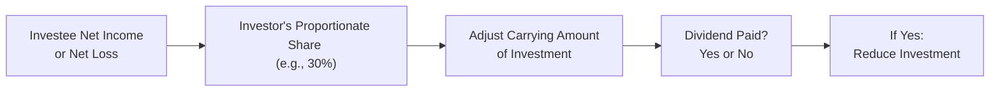
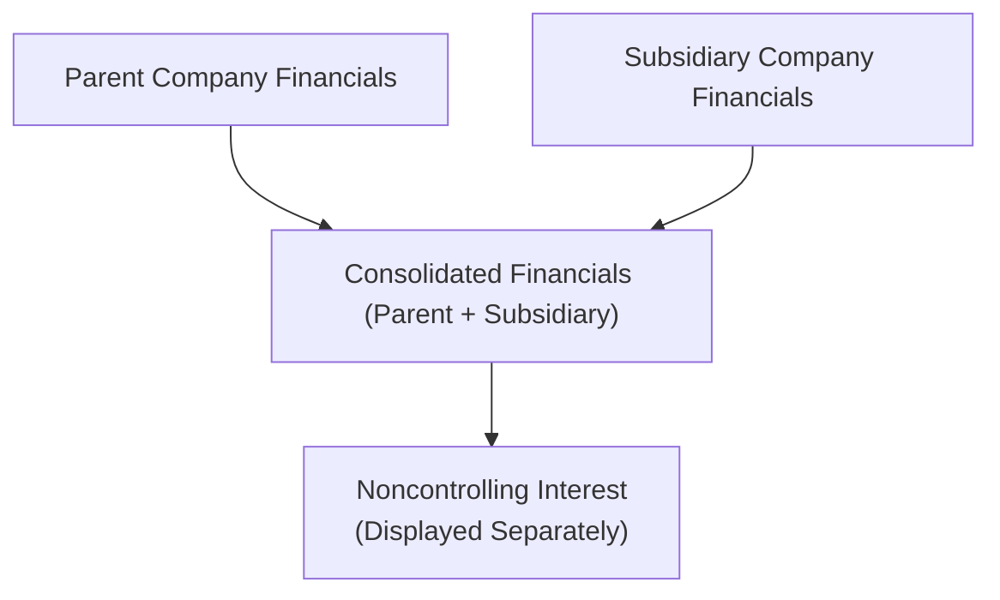
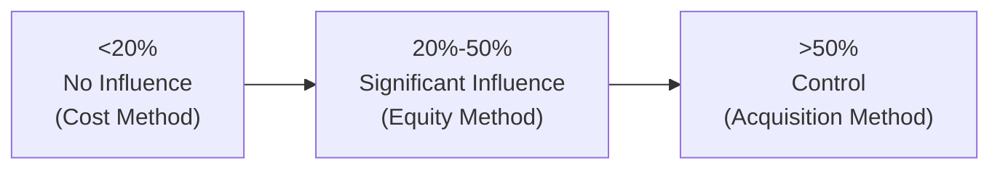

## Overview

Sometimes, when analysts first encounter intercorporate investments, they think: "Surely an investment is just an investment—how complicated can it get?" Well, as soon as ownership percentages and levels of influence enter the picture, things start getting, um, interesting. 

In this section, we'll go through three major accounting treatments for intercorporate investments:  
• Cost Method  
• Equity Method  
• Acquisition Method  

Whether an investor is passive (with little to no influence) or has total control (entirely running the investee), you'll see how the investor’s financial statements reflect that relationship. We’ll also discuss how to identify significant influence vs. control, what happens with potential voting rights, and how to treat transitions (like moving from a small ownership stake to full control).

Let’s do a quick introduction:  
- The cost method is used when an investor has a passive stake, typically <20% ownership and no significant influence.  
- The equity method is for significant influence without outright control, often in the 20%–50% ownership range.  
- The acquisition method involves consolidating the entire subsidiary when control is established (commonly >50% ownership, but can be lower if certain contractual agreements grant effective control).  

Understanding these distinctions is crucial for analyzing and interpreting financial statements properly. Let’s walk through each method in more detail.

--------------------------------------------------------------------------------

## The Cost Method

### Key Concepts

Under the cost method, the investor records the investment at its original purchase price (i.e., “cost”). Dividends received from the investee are recognized as dividend income. However, there’s no ongoing recognition of the investor’s share of the investee’s earnings. In other words, the carrying amount on the balance sheet doesn’t change unless there’s an impairment or the investor receives additional shares or capital distributions that affect the investment basis.

Cost Method is typically applied when:
- Ownership is small (usually <20%).
- No significant influence over the investee’s operations.
- The investor is basically a passive stockholder.

### Example Illustration

Let’s say I (the investor) buy 5% of Company A’s shares for $100,000. Because I own only 5% and have no board seat or any other formal or informal influence, I’d likely use the cost method, recording an “Investment in Company A” at $100,000. Any dividends from Company A show up as dividend income on my income statement when received.

If Company A’s stock doubles or halves in market value, I don’t adjust the carrying value on my books under traditional cost method rules—unless there’s a requirement to mark to market under certain fair value or IFRS/US GAAP classification. However, if there’s a permanent impairment (for instance, Company A goes bankrupt), I’d then reduce the carrying value to comply with impairment rules.

### Common Pitfalls

1. Forgetting Impairment: Even if there’s no direct share of net income recognized, you can’t just hold the investment at cost if a permanent decline is evident.  
2. Dividend Over-Reliance: Dividends are recognized as income, but the timing and nature of dividends can be volatile.

--------------------------------------------------------------------------------

## The Equity Method

### Basic Framework

The equity method steps things up a notch. Here, the investor has significant influence but not control, which is most commonly represented by ownership of roughly 20%–50%. However, the precise percentage is not the only factor; having board representation or other contractual rights can also confer significant influence.

Under the equity method:
- The investment is initially recorded on the balance sheet at cost.  
- Each reporting period, the carrying amount is adjusted for the investor’s proportionate share of the investee’s net income or net loss.  
- Dividends received reduce the carrying amount of the investment (they are considered a return of investment, not purely income).  

In simpler terms:  
Carrying Value at Period End = Initial Cost + (Investor’s Share of Investee Net Income) – (Investor’s Share of Dividends)

### Additional Details

If the investee earns a profit, the investor’s carrying value goes up. If the investee pays out a dividend, the carrying value goes down. This method recognizes that the investor exerts enough influence to effectively share in the investee’s results. 

### Small Anecdote for Clarity

I once worked with an organization that owned 25% of a local telecommunications startup. Because the startup’s strategy was heavily influenced by that 25% stakeholder—our folks even had a seat on the board—this was definitely an equity-method scenario, not just a passive investment. Every quarter, we’d gather the startup’s financials, calculate our share of their net income, and adjust the investment’s carrying amount accordingly.

### Potential Adjustments for Fair Value

Under both IFRS and US GAAP, if there’s evidence of impairment, we have to record an appropriate write-down. Additionally, certain fair value options exist if the standard setter’s guidelines permit or require it. But typically, the classic equity method is straightforward: track your portion of net income and dividends.

### Diagram Example

Below is a simple Mermaid diagram illustrating how losses or income flow to the investor under the equity method:

### Common Pitfalls

1. Misclassification of Dividends as Income: Under the equity method, dividends reduce the investment’s carrying value. Recognizing them fully as income is an error.  
2. Overlooking Influence Indicators: Even if ownership is under 20%, other factors like board seats, technology licenses, or other contractual rights could create significant influence.  
3. Proper Summation of Losses: With repeated investee losses, the carrying value can approach zero. Further losses might need special disclosure if continuing to bear those losses is committed.

--------------------------------------------------------------------------------

## The Acquisition Method

### Overview

The acquisition method kicks in when an investor has control—often more than 50% of voting shares, but potentially less if certain conditions or contractual powers provide control. Under IFRS and US GAAP, “control” is broadly defined. There’s also the concept of special-purpose entities or variable interest entities (VIEs) where an investor can control the entity’s activities without traditional majority ownership. 

### Line-by-Line Consolidation

With control comes the need to consolidate the investee’s financials with the investor’s. This means we:
- Combine the subsidiary’s assets and liabilities with the parent’s, line by line.  
- Combine revenues and expenses in the income statement, again line by line.  
- Report any portion of ownership belonging to others as noncontrolling interest in equity and on the income statement.

### Goodwill and Purchase Price Allocation

When an acquisition occurs:
1. We measure the consideration paid (including cash, stock, assumed liabilities, etc.).  
2. Identify and measure assets acquired and liabilities assumed at fair value.  
3. Any excess of purchase consideration over the net fair value of assets and liabilities becomes goodwill.  

This goodwill remains on the consolidated balance sheet and is tested for impairment rather than amortized. 

### Real-World Analogy

Think about it like cooking soup with various ingredients: Once you’re in total control (you have the pot, the vegetables, the water, the spices), the entire outcome—taste, aroma, color—belongs to you. If someone else has a small share of that pot, we track them as a “noncontrolling interest.” But you still present the soup in one big bowl.

### Diagram

Below is a simplistic look at how consolidation might stack up:

### Potential Voting Rights and VIEs

A tricky corner in these standards is potential voting rights and variable interest entities. If, for instance, you have stock warrants or convertible debt that can be exercised anytime (and that exercise would give you a majority stake), you may effectively have control right now, depending on IFRS/US GAAP guidelines. 

Similarly, with a VIE, you might control the entity’s most significant activities through contractual terms (like controlling the majority of the variable returns), even if you hold a small equity interest. In that scenario, you’d consolidate the VIE.

### Common Pitfalls

1. Overlooking Additional Control Mechanisms: Don’t assume 50% is the only threshold for consolidation; scrutinize all agreements to see who truly drives the bus.  
2. Inaccurate Purchase Price Allocation: Properly fair-valuing intangible assets, property, or contingent considerations can be challenging.  
3. Ignoring Noncontrolling Interests: For many new analysts, it’s easy to forget a portion of net income not belonging to the parent. Make sure your consolidated statements reflect NCI accurately.

--------------------------------------------------------------------------------

## Transition Between Methods

Sometimes, an investor’s ownership changes over time. For instance, you might start with a 15% stake and then acquire enough shares to jump over the 20% mark. Here’s how it generally goes:

- Moving from Cost to Equity Method: Remeasure your prior stake at fair value. Recognize any gains or losses in the income statement. Then use the equity method from that point forward.  
- Moving from Equity to Acquisition Method: Again, you remeasure the previously held interest to fair value, recognize gains/losses, and then consolidate.  

The logic behind these adjustments is that any previous carrying amounts may no longer reflect the economic reality once your degree of influence or control changes.

--------------------------------------------------------------------------------

## Practical Example: From 15% to 55%

Let’s say you hold 15% of a small robotics company at a cost of $200,000, using the cost method. That stake’s fair value at the last reporting date is $220,000. Suddenly, you purchase additional 40% for $800,000, bringing total ownership to 55%. Now you have control, so you move to the acquisition method.

Steps:  
1. Remeasure the 15% previously held at its $220,000 fair value. The difference of $20,000 ($220,000 – $200,000) is recognized as a gain.  
2. Your total new investment is the older stake remeasured ($220,000) plus the additional purchase ($800,000) = $1,020,000.  
3. Consolidate the robotics company, allocating the fair value of net assets among tangible assets, intangible assets (like patents), liabilities, and any goodwill.

The result is a single consolidated statement, with any noncontrolling interest recognized if you don’t own 100%.

--------------------------------------------------------------------------------

## Diagram of Ownership Thresholds

To visualize the ownership thresholds and the associated accounting methods:

Of course, these thresholds are rules of thumb, and actual influence or control can arise at different percentages based on contractual or legal rights.

--------------------------------------------------------------------------------

## Common Pitfalls and Best Practices

• Pitfall: Mixing Dividends and Earnings Under the Equity Method  
  – Always remember: under equity method, dividends reduce the investment account.  

• Pitfall: Overlooking VIE Arrangements  
  – Even if your equity stake is small, you might have control contractually. Carefully check if your “small stake” is actually a big control situation.  

• Pitfall: Incorrect Purchase Price Allocation in Consolidations  
  – Precisely measure the fair value of intangible assets, liabilities, and contingent liabilities. Overlooking intangible brand value, for instance, can lead to a misstatement of goodwill.  

• Best Practice: Keep an Eye on Potential Voting Rights  
  – Options, warrants, or convertibles can instantly tilt the scale from “no control” to “full control” if they’re exercisable and in the money.  

• Best Practice: Document Transition Steps Thoroughly  
  – Whenever changes in ownership occur, note the remeasurement and the fair-value thresholds in your workpapers or schedule to ensure transparency and compliance.

--------------------------------------------------------------------------------

## Conclusion

Understanding cost, equity, and acquisition methods is pivotal for accurate financial statement analysis. It’s not just about memorizing thresholds—it’s about recognizing the substance of the relationship between an investor and an investee. Always follow these steps:  
1. Identify the level of influence or control.  
2. Apply the correct accounting framework.  
3. Revisit the arrangement regularly for changes in ownership or influence.  

This knowledge will help you read through corporate structures, interpret consolidated statements, and evaluate whether a holding should be considered just a line item or part of a bigger, consolidated picture.

--------------------------------------------------------------------------------

## References and Further Reading

- International Accounting Standard (IAS) 28 – Investments in Associates and Joint Ventures  
- IFRS 3 – Business Combinations  
- ASC 323 (US GAAP) – Investments—Equity Method and Joint Ventures  
- “Intermediate Accounting” by Kieso, Weygandt, and Warfield  
- IFRS Foundation’s official site:  
  https://www.ifrs.org/  
- FASB Codification:  
  https://asc.fasb.org/  

--------------------------------------------------------------------------------

## Test Your Knowledge: Cost, Equity, and Acquisition Methods



### An investor owns 5% of a company’s common stock and has no influence. Which accounting method typically applies?

- [x] Cost method
- [ ] Equity method
- [ ] Acquisition method
- [ ] Consolidated method with noncontrolling interest

> **Explanation:** A 5% stake with no influence is best reflected via the cost method, as the investor neither exerts significant influence nor holds control.

### An investor recognizes its share of the investee’s net income on its own income statement. Which accounting method is the investor most likely using?

- [ ] Cost method
- [x] Equity method
- [ ] Acquisition method
- [ ] Fair value method

> **Explanation:** Under the equity method, the investor’s share of the investee’s income increases the investment account and shows up on the investor’s income statement.

### When an investor acquires more than 50% voting interest, typically it must:

- [ ] Continue the equity method
- [x] Consolidate the subsidiary using the acquisition method
- [ ] Revalue existing investment to fair value and continue cost method
- [ ] Recognize the investee as a joint venture

> **Explanation:** A controlling stake (generally over 50%) triggers the consolidation requirement, reflecting the acquisition method.

### If a company holds 25% of another and has a seat on the board, which method is most likely?

- [ ] Cost method
- [x] Equity method
- [ ] Acquisition method
- [ ] Proportionate consolidation

> **Explanation:** A 25% stake and board seat typically implies significant influence, indicating the equity method.

### Moving from cost to equity method requires:

- [ ] No adjustment; just start using the equity method
- [x] Remeasurement at fair value at the date significant influence is acquired
- [ ] Recording a prior-period restatement
- [ ] Ignoring dividends received to date

> **Explanation:** When switching to equity method, prior holdings are remeasured at fair value, with any gain/loss recognized in income.

### Noncontrolling interest is:

- [ ] The portion of net income and equity no longer recognized
- [ ] Only recognized under the equity method
- [x] The share of a consolidated subsidiary’s net assets not owned by the parent
- [ ] A classification under cost method

> **Explanation:** In the acquisition method, noncontrolling interest reflects the share of the subsidiary’s equity not owned by the parent.

### An investor that has control through contractual agreements, despite owning only 10% of an entity, must:

- [ ] Use the equity method
- [ ] Use the cost method but disclose the arrangement
- [x] Consolidate the entity’s financials because of effective control
- [ ] Use fair value remeasurement at each period end

> **Explanation:** If contractual rights grant control, consolidation is required (potentially a VIE scenario).

### Under the equity method, dividends received from the investee:

- [ ] Increase the carrying amount of the investment
- [ ] Do not impact the investment account
- [x] Decrease the carrying amount of the investment
- [ ] Are recognized as revenue separate from the investee’s profit

> **Explanation:** Dividends are a return of investment under the equity method, reducing the investment account.

### In the acquisition method, the excess of purchase consideration over the fair value of net assets acquired is:

- [ ] Recognized as retained earnings
- [ ] Expensed immediately
- [ ] Recorded as negative goodwill
- [x] Recorded as goodwill

> **Explanation:** The excess purchase price is recognized in goodwill, subject to regular impairment testing.

### A company acquired 30% in Year 1 and used the equity method. In Year 2, it acquired an additional 40% stake. True or False: The company now consolidates the investee under the acquisition method.

- [x] True
- [ ] False

> **Explanation:** Owning a majority stake (70%) implies control; thus, consolidation is required using the acquisition method.


