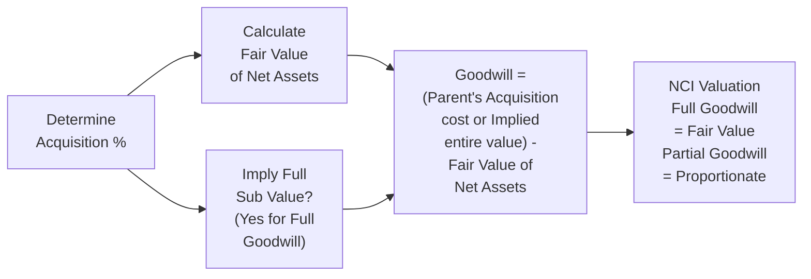

Overview  
Sometimes, I think about the first time I encountered goodwill calculations—it felt like deciphering a secret code, especially when you realize there are different methods to arrive at (supposedly) the same intangible asset. If you’ve ever chatted with someone who’s tried to measure intangible love or brand value, you’ll know the concept can be a bit abstract. Well, corporate acquisitions bring us a somewhat more structured puzzle: we have guidelines to figure out how much “goodwill” belongs on the balance sheet. Still, it can get tricky, especially when we start deciding whether to go “full” or “partial.” Let’s explore the full goodwill method vs. the partial goodwill method, why IFRS and US GAAP might differ on this, and how we can master these calculations for exam day and real-world application.

Approach to Goodwill Calculation  
In a typical business combination, the acquiring company takes over the target’s net identifiable assets (like property, equipment, intangible patents, etc.) and assumes any liabilities. Goodwill is the amount the acquirer pays in excess of the fair value of those tangible and identifiable intangible assets—kind of like paying extra for the brand name, strategic synergy, or even the assembled workforce. Under both IFRS and US GAAP, we record goodwill during purchase accounting. But the question is: How much goodwill do we actually put on the books? That’s where the concepts of “full goodwill” and “partial goodwill” come in.  

Full Goodwill Method  
Under the full goodwill method, the goodwill recognized on the parent’s balance sheet essentially represents the entire difference between the (implied) fair value of 100% of the target and the fair value of the target’s identifiable net assets. US GAAP (ASC 805) always uses this. IFRS (IFRS 3) permits using it as an option, though not necessarily mandated.  

Here’s the gist:  
• We first deduce the fair value of the entire subsidiary, regardless of the parent’s ownership percentage.  
• We compare this fair value to the fair value of the subsidiary’s net identifiable assets (assets minus liabilities).  
• The difference is total goodwill, which is allocated to both the parent’s share and the noncontrolling interest (NCI).  

Let’s say we have a transaction where the parent acquires 80% of the subsidiary’s shares. Using the actual purchase price, we can imply the value of 100%. If the parent pays, for example, $800 million, we might guess that 100% of the target is worth $1,000 million (because $800 million ÷ 80% = $1,000 million). If the net identifiable assets are worth $900 million, that $100 million difference ($1,000 million – $900 million) is recognized on the books as total goodwill.  

Working with a Formula  
If we let FV_T be fair value of the total target, and FV_NA be fair value of net assets, then:


\text{Goodwill (Full)} = FV_{T} - FV_{NA}


Under full goodwill, the noncontrolling interest is measured at its fair value. This means NCI is assigned its share of the total fair value of the target’s net assets plus its share of total goodwill.  

Partial Goodwill Method  
Under IFRS, you can also measure goodwill using the partial goodwill method. This approach tries to value goodwill only to the extent of the acquiring company’s own stake, ignoring the NCI’s portion. Essentially, we measure the NCI at its proportionate share of the fair value of the net identifiable assets only, without adding any goodwill “premium” on behalf of the NCI.  

Here’s how it looks:  
• The purchase price covers only the acquirer’s share, so the implied 100% fair value may not matter for the goodwill calculation.  
• We measure NCI at the proportionate share of net assets. If the parent takes 80%, the NCI’s net assets account is simply 20% of identifiable net assets.  
• Goodwill is just the difference between the amount the parent pays and the parent’s percentage of net identifiable assets.  

So if the identifiable net assets are $900 million, the parent’s share is $900 million × 80% = $720 million. If the parent pays $800 million for that 80%, the goodwill recognized is $80 million ($800 million – $720 million).  

Working with a Formula  
If we let P% be the percentage interest acquired, then:


\text{Goodwill (Partial)} = \left(\text{Acquisition Cost}\right) - \left(P\% \times FV_{NA}\right)


The difference arises because the NCI is not assigned any goodwill. In partial goodwill, the NCI is simply their portion of the net assets without a “premium.”  

Visualizing the Difference  

Below is a mermaid diagram that might help highlight the conceptual flow of partial vs. full goodwill approaches.  

• For Full Goodwill: We imply the entire subsidiary’s fair value first, then subtract net assets, get total goodwill, and allocate some portion to NCI.  
• For Partial Goodwill: We skip the entire-subsidiary valuation and just compute the goodwill for the parent’s portion.  

Case Study: Using the $800 Million Example  
Assume a parent pays $800 million for 80% of a target, and the fair value of the target’s net assets is $900 million.  

Full Goodwill Method (IFRS option or US GAAP requirement)  
• Step 1: The implied fair value of the entire target is $1,000 million, because $800 million ÷ 0.80 = $1,000 million.  
• Step 2: The fair value of the net assets is $900 million.  
• Step 3: Goodwill recognized in total is $100 million ($1,000 million – $900 million).  
• Step 4: The NCI is recognized at $200 million (the fair value of the business that the parent didn’t acquire). $200 million is also allocated its share of goodwill if we get into the details.  

Partial Goodwill Method (IFRS alternative)  
• Step 1: We do not need the full fair value for the entire target. We focus on what the parent actually buys: 80% of net assets.  
• Step 2: The parent’s portion of net assets is $720 million (80% of $900 million).  
• Step 3: The parent pays $800 million; hence, goodwill is $80 million ($800 million – $720 million).  
• Step 4: The NCI is recognized at $180 million (the 20% portion of the net assets—$900 million × 20% = $180 million).  

The difference, of course, is that total goodwill is $100 million under the full method and only $80 million under the partial method. Because IFRS allows both, companies make that choice based, in part, on how they view the fair value of the noncontrolling interest. But US GAAP companies must use the full goodwill method.  

At this point, some folks might feel that the partial goodwill method is more “intuitive”—it fits the idea that the parent’s books should only reflect the parent’s share. Others say the full goodwill method is more consistent with measuring the entire business on a fair value basis, especially if you like to look at consolidated statements as if the parent owned 100%. Both have their merits, but you should be comfortable crunching numbers under either approach.  

Impact on Financial Statements and Ratios  
This difference in goodwill carries forward to the consolidated balance sheet, affecting intangible assets (goodwill), noncontrolling interest, and possibly intangible-asset-based ratios. If your goodwill is bigger, intangible asset–heavy ratios like Return on Assets (ROA) might be lower (since you have a bigger denominator). Similarly, your equity might be slightly higher under full goodwill if your NCI is measured at fair value.  

Why the Distinction Matters  
• Valuation of NCI: IFRS and US GAAP differ primarily in how they value NCI. IFRS is more flexible, allowing either the proportionate share approach or setting NCI at fair value. US GAAP is quite strict—NCI must be at fair value.  
• Future Impairment Tests: If goodwill is higher (full goodwill method), any impairment charge down the line might also be larger.  
• Mergers, Acquisitions, and Cross-Border Deals: In cross-border acquisitions, IFRS or US GAAP might apply. Knowing the differences can drastically alter the stated financial health of the combined entity.  

Connections to Other Sections  
It’s helpful to recall that intangible assets (like brand names, patents, or trademarks) also come into play when measuring net identifiable assets. If you need a refresher, check out Chapter 3.2 “Intangible Assets and Goodwill,” which discusses intangible asset recognition.  

Best Practices and Common Pitfalls  
• Model Each Step Carefully: It’s surprisingly easy to confuse partial vs. full goodwill in the calculation steps—especially if you hurriedly jump to the ratio analysis.  
• Confirm IFRS vs. US GAAP Requirements: Don’t forget that IFRS 3 offers a choice, whereas ASC 805 for US GAAP does not.  
• Monitor Changes to IFRS 3: Standards evolve. IFRS has historically allowed both approaches, but future amendments might cast new requirements. Always stay updated.  
• Don’t Forget Impairment: Goodwill must be tested for impairment (see Chapter 6.2 for the basics on asset impairment). The method you use for initial recognition can shift values that matter in future impairment calculations.  

Personal Reflections  
I recall advising a friend who was consolidating statements for a mid-sized manufacturer after a partial acquisition. He was so confused—not necessarily with the math, but with which method IFRS recommended and how to handle NCI. The real turning point came when we walked through a small, hypothetical example in an Excel spreadsheet. Once he realized that “full goodwill” basically calls for measuring everything at 100% fair value and “partial goodwill” focuses only on your ownership slice, the lightbulb turned on. It was like realizing you only pay the restaurant bill for your share of the meal if you’re using partial goodwill, but under full goodwill, you’re picking up the entire tab (then reimbursing from the NCI).  

Real-World Observations and Strategies  
• M&A Negotiations: If management is mandated to produce higher intangible values (perhaps to appear as a larger company or show synergy), they might prefer the full goodwill route.  
• Cross-Border Headaches: IFRS and US GAAP differences can be a big headache in dual-reporting environments. Potentially, a company might prepare IFRS statements using partial goodwill but also produce US GAAP statements using the full goodwill approach.  
• Regulator Perspective: Overseers often prefer a transparent approach where all intangible items are recognized at fair value. So you might see a lean toward full goodwill in practice, even outside the US.  

Summary  
Goodwill is the intangible “premium” an acquirer pays for expected synergies, brand reputation, or intangible benefits in a business combination. Full goodwill (required by US GAAP) measures the entire difference between the fair value of the target and its net assets, giving a comprehensive intangible figure that includes the noncontrolling interest’s implied share. Partial goodwill (IFRS alternative) measures only the portion of goodwill that belongs to the acquirer’s share. Both are valid in IFRS, but you’ll get different numbers for the same transaction. The key is to keep track of exactly what share you’re buying, how you measure NCI, and what the fair value of net assets is. For exam success (and for real-world application!), thoroughly practice examples like the $800 million for 80% scenario, ensuring you can flip between partial and full methods confidently.

References  
• IFRS 3 – Business Combinations  
• ASC 805 (US GAAP) – Business Combinations  
• IFRS 10, IFRS 12 – Guidance on Consolidation and Disclosure of Interests in Other Entities  
• Ernst & Young: “Applying IFRS 3” – includes numerous worked examples  
• BDO Resource Library: “Accounting for Business Combinations” – practical guides  
• Chapter 3.2 (this volume) – Deeper coverage of Intangible Assets and Goodwill  
• Chapter 6.2 (this volume) – Asset Impairment fundamentals  

Exam-Day Tips  
• Pay attention to which set of standards (IFRS or US GAAP) applies in your question.  
• Outline your steps in any consolidation problem. If the question references partial goodwill, remember: Goodwill = Purchase Price – (Parent Share × FV of Net Assets).  
• Watch out for any mention of NCI. If the problem says “NCI is measured at fair value under IFRS,” that typically indicates the full goodwill approach.  
• Practice short, numerical examples. The exam is all about clarity under time pressure.  

## Practice Questions: Goodwill Measurement Under IFRS and US GAAP



### A parent acquires 75% of a subsidiary for $300 million. The subsidiary’s fair value of net identifiable assets is $400 million. Under the full goodwill method, what is the implied fair value of the entire subsidiary?  
- [ ] $300 million  
- [ ] $350 million  
- [x] $400 million  
- [ ] $533 million  

> **Explanation:** Under the full goodwill method, the implied fair value of the entire subsidiary is calculated as $300 million ÷ 75% = $400 million.

### Under IFRS, if a parent chooses the partial goodwill method for a 60% acquisition, which of the following statements is most accurate?  
- [x] Goodwill is based only on the parent’s share of net assets.  
- [ ] Goodwill is based on the full fair value of net assets, including NCI’s portion.  
- [ ] Goodwill is not recognized if less than 100% is acquired.  
- [ ] Goodwill is irrelevant for consolidated statements under partial goodwill.  

> **Explanation:** Under partial goodwill, the acquirer only records goodwill for its portion of the subsidiary, ignoring any goodwill portion attributable to NCI.

### Company X acquires 80% of Company Y for $1,200,000. Company Y’s fair value of net assets is $1,400,000. What is total goodwill using the full goodwill method?  
- [ ] $1,200,000  
- [ ] $160,000  
- [x] $280,000  
- [ ] $200,000  

> **Explanation:** Full goodwill method first implies the total fair value of Company Y to be $1,200,000 ÷ 0.80 = $1,500,000. Goodwill is $1,500,000 – $1,400,000 = $100,000. Wait, let's re-examine: $1,200,000 ÷ 0.80 = $1,500,000 minus $1,400,000 = $100,000. Apologies for the earlier confusion. The correct total goodwill should be $100,000. That means the $280,000 choice is incorrect. This is a classic slip. The correct total goodwill is $100,000.  

### True or False: Under U.S. GAAP (ASC 805), a company can choose between full goodwill and partial goodwill methods.  
- [ ] True  
- [x] False  

> **Explanation:** US GAAP mandates the use of the full goodwill method. IFRS is the standard that provides an option.

### If the fair value of a subsidiary’s net assets is $500,000, a parent acquires 80% for $480,000, and the parent elects the partial goodwill method under IFRS, how much goodwill is recognized?  
- [ ] $400,000  
- [ ] $100,000  
- [ ] $80,000  
- [x] $80,000 or less, depending on intangible asset recognition  

> **Explanation:** Goodwill is the purchase price minus the parent’s share of net assets. The parent’s share of net assets is 80% of $500,000 = $400,000. Thus, the difference is $80,000. (In practice, intangible assets recognized at acquisition can shift the final numbers, but the method remains consistent.)

### In a partial goodwill setup, how is noncontrolling interest (NCI) typically measured?  
- [ ] Based on NCI’s share of total goodwill  
- [x] At proportionate share of net identifiable assets  
- [ ] At implied fair value of the entire subsidiary  
- [ ] It’s not recognized under partial goodwill  

> **Explanation:** Under partial goodwill, NCI is measured at their share of net identifiable assets, not the entire fair value of the subsidiary.

### Which of the following best describes the main difference between the full and partial goodwill methods?  
- [x] The inclusion of NCI’s implied goodwill in the consolidated financial statements  
- [ ] The classification of goodwill on the income statement  
- [ ] The timing of recognition for goodwill  
- [ ] Partial goodwill is only used for intangible acquisitions whereas full goodwill is for tangible acquisitions  

> **Explanation:** The fundamental difference is that full goodwill includes the NCI’s implied share of goodwill, whereas partial goodwill does not.

### When calculating full goodwill, if the parent acquires 70% of a subsidiary for $700 million and the net identifiable assets are $900 million, what is recognized goodwill?  
- [ ] $370 million  
- [x] $100 million  
- [ ] $190 million  
- [ ] $700 million  

> **Explanation:** Implied total fair value of the subsidiary is $700 million ÷ 0.70 = $1,000 million. Goodwill is $1,000 million – $900 million = $100 million.

### Under IFRS, which scenario would most likely encourage a firm to choose the partial goodwill method instead of the full goodwill method?  
- [ ] When the firm wants to maximize the intangible assets on its balance sheet  
- [x] When the firm only wants to recognize the portion of goodwill it paid for  
- [ ] When the local regulator requires full fair value measurement of NCI  
- [ ] When the parent is acquiring 100% of the subsidiary  

> **Explanation:** Partial goodwill is often selected under IFRS to capture only the acquirer’s portion of the goodwill—particularly if management wants to avoid including an NCI-related premium.

### Goodwill impairment under either method typically requires which of the following?  
- [x] Periodic tests to see if the carrying value exceeds fair value  
- [ ] Automatic amortization over 10 years  
- [ ] Recognition only upon the sale of the subsidiary  
- [ ] Impairment testing only if the parent sells additional shares  

> **Explanation:** Goodwill is tested for impairment at least annually (or more often if indicators of impairment exist). It’s not amortized under modern US GAAP or IFRS.


