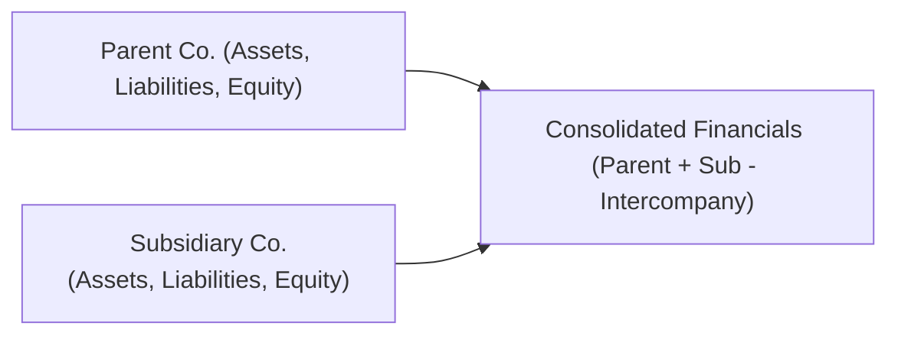

## Overview and Context  

Consolidation is one of those topics that can cause a bit of head-scratching, right? The first time I tried to piece together financial statements from a parent company and its subsidiary, I remember gazing at the line items and thinking, “Wait, whose intangible assets are we talking about here?” Don’t worry—it gets easier with practice. In this section, we’ll untangle the concepts behind consolidation, explore how noncontrolling interests (NCI) fit into the equation, and discuss the recognition and subsequent testing of goodwill under both IFRS and US GAAP.  

This discussion corresponds to “10.2 Consolidation, Noncontrolling Interests, and Goodwill Implications” within Chapter 10 of our broader conversation on Intercorporate Investments and Business Combinations. While the core idea is straightforward—combine financial statements to reflect the entire economic entity—there are many subtle details. So, let’s carefully explore them.  

## The Consolidation Concept Under the Acquisition Method  

Under both IFRS (IFRS 3 – Business Combinations) and US GAAP (ASC 805 – Business Combinations), the acquisition method typically governs the accounting for business combinations. The fundamental premise is that when Company A (the parent) gains control over Company B (the subsidiary), the parent must “consolidate” all of the subsidiary’s assets, liabilities, revenues, and expenses on a line-by-line basis into the parent’s financial statements.

### Key Steps in Consolidation  

1. Determine the Acquisition-Date Fair Values.  
   The parent measures the fair value of all identifiable assets acquired and liabilities assumed at the acquisition date. This includes tangible assets like property, plant, and equipment, as well as intangible assets that might have been unrecognized on the subsidiary’s balance sheet (like brand names, customer lists, or proprietary technology).

2. Identify and Measure Noncontrolling Interests (NCI).  
   Any ownership interest in the subsidiary not directly held by the parent is considered NCI. IFRS and US GAAP generally converge on treating NCI as a separate component of equity in the consolidated balance sheet. You’ll often see it in the equity section labeled “Noncontrolling Interests.”

3. Recognize Goodwill (or a Bargain Purchase Gain).  
   Goodwill is the excess of (i) the sum of the consideration transferred, any NCI, and any previously held equity interest at fair value over (ii) the fair value of the subsidiary’s net identifiable assets. If you end up paying less than that fair value, it’s called a bargain purchase, and you recognize a gain in the income statement. (Those are rare, but they do happen!)

4. Combine Financial Statements.  
   Subsidiary assets and liabilities are added to the parent’s balance sheet line by line, while subsidiary revenues and expenses appear in the parent’s income statement. Intercompany transactions (e.g., sales from parent to sub, loans from sub to parent) are eliminated so we don’t double count them.

Below is a simple conceptual diagram of consolidation:

In practice, you sum up A and B, adjusting for any intercompany transactions or balances, to arrive at C, the consolidated statements.

## Noncontrolling Interests (NCI)  

### Definition and Presentation  

Noncontrolling Interest represents the portion of the subsidiary’s equity that belongs to other shareholders (not the parent). Under current IFRS and US GAAP guidance, NCI is usually shown in the consolidated statement of financial position as a separate component of consolidated equity.  

Why do we do this? Because, from a consolidated standpoint, the economic entity includes that other ownership. We’re basically saying, “Look, we control the sub, but 30% (or however much) belongs to others, so that share of net assets and net earnings is not truly ours.”  

### Measurement: Partial vs. Full Goodwill Methods  

Depending on the standard, you might be able to measure NCI in different ways:  
• Full Goodwill Method: Under US GAAP (and optionally under IFRS), NCI is measured at fair value, meaning that goodwill recognized includes both the parent’s share and the NCI’s share of goodwill.  
• Partial Goodwill Method: Under IFRS (as a choice in specific cases), NCI can be measured as the NCI’s proportional share of the subsidiary’s identifiable net assets. In this method, goodwill recognized only includes the parent’s portion and is generally smaller.  

I once worked for a company that used the partial goodwill method for a 60% stake in a European tech startup. The difference in recognized goodwill compared to the full goodwill method was sizable—almost 40% less. You can imagine how that might affect the statement of financial position and future impairment tests!

## Goodwill Implications  

### Goodwill Recognition  

At acquisition, goodwill is computed as follows:

(1) Sum up:  
• Consideration transferred for the subsidiary (e.g., cash, shares, liabilities assumed by the parent).  
• Fair value of any previously held equity interest.  
• Noncontrolling interest measured either at fair value (full goodwill) or as the proportion of net assets (partial goodwill).  

(2) Subtract:  
• Fair value of the net identifiable assets of the subsidiary (which includes tangible and intangible assets net of liabilities).  

The remainder, if positive, is goodwill. If negative, it’s a bargain purchase gain.

Mathematically, you might see it structured as:

Goodwill = (Purchase Consideration + Fair Value of NCI + Fair Value of Previously Held Interest) – Fair Value of Net Identifiable Assets

### Goodwill Impairment Testing: IFRS vs. US GAAP  

Goodwill is not amortized but tested for impairment at least annually (or whenever indicators of impairment arise).

• Under IFRS:  
  – Goodwill is allocated to “cash-generating units” (CGUs).  
  – A CGU is the smallest identifiable group of assets that generates independent cash inflows.  
  – If the recoverable amount (the higher of fair value minus costs to sell or value in use) of the CGU is below its carrying amount, an impairment loss is recognized.  
  – The loss is first allocated to reduce goodwill and then to other assets in the CGU pro rata.

• Under US GAAP:  
  – Goodwill is assigned to a “reporting unit,” typically an operating segment or one level below an operating segment.  
  – There’s an option to perform a qualitative assessment to see if goodwill is likely impaired. If not, no further testing is needed. If yes, or if you bypass the qualitative step, you move to a quantitative test.  
  – The one-step quantitative test compares the fair value of the reporting unit to its carrying value. If the carrying value is higher, the difference is recognized as impairment.  

### Practical Examples  

Let’s say you acquire 80% of a target’s shares for $800,000. The target’s net identifiable assets (at fair value) are $900,000. Assume you measure the NCI at fair value and find that it’s $200,000, so:

• The total fair value of the subsidiary = $800,000 (parent share) + $200,000 (NCI) = $1,000,000.  
• Fair value of net identifiable assets = $900,000.  
• Goodwill recognized = $1,000,000 – $900,000 = $100,000.  

That $100,000 would show up as an intangible asset on the consolidated balance sheet. If later on, the subsidiary performs poorly, we test that $100,000 for impairment, either under IFRS CGU guidelines or US GAAP reporting unit guidelines.

## Partial Acquisitions and Full Consolidation  

An interesting twist is that you can technically own less than 100% (like 60% or 70%) of a subsidiary, but if you exert control, you still consolidate 100% of its assets and liabilities. The difference is that the portion you do not own is recognized as the NCI. This practice sometimes raises eyebrows: “Wait, if we only own 60%, why are we showing 100% of the sub’s assets in our statements?” But remember, from a control perspective, the subsidiary’s entire resources and obligations are effectively at the parent’s direction. The 40% that belongs to others is accounted for in equity as NCI.

## Best Practices and Common Pitfalls  

• Watch Out for Unrecognized Intangible Assets: One subtlety is that a subsidiary’s intangible assets might not appear on its own books if internally generated. During a business combination, you measure them at fair value and include them in net assets.  
• Eliminate Intercompany Transactions Thoroughly: Make sure you remove any sales of inventory, intercompany debt, or other items between parent and subsidiary so you don’t overstate revenue or double count liabilities.  
• Assess Goodwill for Impairment Annually: Oversight here can lead to a delayed recognition of impairment losses.  
• Distinguish Between Full and Partial Goodwill Approaches: Understand how each choice affects the carrying amount of NCI and goodwill—and future impairment losses.  

## Final Exam Tips  

1. Remember the Formula for Goodwill: Keep that “Fair value of consideration + NCI – Fair value of net assets” formula front of mind.  
2. Identify the IFRS vs. US GAAP Nuances: Be ready to highlight differences in impairment testing steps and partial vs. full goodwill treatments.  
3. Practice Consolidation Entries: Solve a few problems where you do line-by-line consolidation. Double-check how you record the NCI and goodwill.  
4. Impairment Under IFRS vs. US GAAP: IFRS uses the CGU approach; US GAAP uses a reporting unit approach (with optional qualitative step).  
5. Keep an Eye on Intercompany Transactions: They love to test your ability to eliminate “artificial” gains or losses between affiliates.

## References and Further Reading  

• IFRS 3 – Business Combinations.  
• ASC 805 – Business Combinations.  
• ASC 810 – Consolidation, including guidance on Noncontrolling Interests.  
• “Financial Reporting & Analysis” by Revsine, Collins, Johnson, and Mittelstaedt.  
• EY’s “Goodwill impairment” guide: https://www.ey.com/en_gl/ifrs-technical-resources  
• FASB Accounting Standards Codification: https://asc.fasb.org/  

--------------------------  

## Test Your Knowledge: Consolidation, Noncontrolling Interests, and Goodwill Quiz



### Under the acquisition method, how are the assets and liabilities of a subsidiary included in the consolidated financial statements?  
- [ ] They are recognized at their historical book values.  
- [x] They are recognized on a line-by-line basis at their fair values on the acquisition date.  
- [ ] They are recognized only for the percentage ownership the parent holds.  
- [ ] They are omitted if the parent does not own 100% of the subsidiary.  

> **Explanation:** Under the acquisition method, all identifiable assets and liabilities of the subsidiary are consolidated at their fair values at the acquisition date and included line by line in the consolidated statements.

### Which of the following best describes Noncontrolling Interest (NCI)?  
- [ ] A year-end adjustment account for unrealized gains.  
- [ ] A liability account recognized at cost.  
- [x] The equity in a subsidiary not attributable to the parent.  
- [ ] An off-balance sheet transaction required by IFRS and US GAAP.  

> **Explanation:** NCI represents the equity in a subsidiary not held by the parent. It’s shown as a separate component of consolidated equity.

### Suppose a parent company acquires 90% of a subsidiary for $900,000, and the fair value of the subsidiary’s identifiable net assets is $800,000. If NCI is measured at fair value and that fair value is $100,000, how much goodwill is recognized?  
- [x] $200,000  
- [ ] $100,000  
- [ ] $1,000,000  
- [ ] $900,000  

> **Explanation:** The total fair value of the subsidiary is $900,000 (parent) + $100,000 (NCI) = $1,000,000. Subtract the fair value of net assets ($800,000), yielding $200,000 in goodwill.

### Under IFRS, goodwill impairment testing is primarily conducted at the level of:  
- [ ] The entire group of consolidated companies.  
- [x] Cash-generating units (CGUs).  
- [ ] Reporting units.  
- [ ] Individual intangible assets.  

> **Explanation:** Under IFRS, goodwill is allocated to CGUs and impairment testing is conducted at that CGU level.

### Under US GAAP, which best describes the initial step in assessing goodwill impairment?  
- [x] A qualitative assessment to determine if it is more likely than not that goodwill is impaired.  
- [ ] An immediate write-down to the net realizable value.  
- [ ] A two-step process requiring a fair value calculation of the legal entity.  
- [ ] A review of all intangible assets and immediate disposal if assets are underperforming.  

> **Explanation:** US GAAP allows a qualitative assessment (often called “Step 0”) to see if a quantitative test is required. If there’s no indication of impairment, no further test is done.

### Which of the following statements is correct about the partial goodwill method?  
- [x] It calculates goodwill based only on the parent’s proportionate share of the net identifiable assets.  
- [ ] It calculates NCI at its fair value.  
- [ ] It always leads to a higher recognized goodwill amount.  
- [ ] It is only allowed under US GAAP.  

> **Explanation:** The partial goodwill method, typically used under IFRS, calculates goodwill based on the parent’s share of net identifiable assets. It generally leads to a lower recognized goodwill than the full goodwill approach.

### How are intercompany transactions treated in the consolidation process?  
- [ ] They are reported as external transactions.  
- [ ] They are reclassified as part of other comprehensive income.  
- [x] They are eliminated so that no profit or loss is recognized on intragroup transactions.  
- [ ] They are retained but disclosed separately.  

> **Explanation:** Intercompany transactions (such as sales between parent and subsidiary) are eliminated to avoid double counting revenues, expenses, or profits.

### In a partial acquisition scenario (less than 100% ownership), which of the following is correct with respect to consolidated financial statements?  
- [ ] Only the percentage of subsidiary assets and liabilities corresponding to the parent’s ownership is consolidated.  
- [ ] The subsidiary’s financials are not consolidated unless the parent has 100% control.  
- [x] The entire subsidiary’s assets and liabilities are consolidated, with NCI representing the portion not owned by the parent.  
- [ ] The subsidiary’s income statement is consolidated, but not its balance sheet.  

> **Explanation:** Even with less than 100% ownership, if the parent has control, 100% of the subsidiary’s assets and liabilities are consolidated, and the unowned portion is shown as NCI.

### Which of the following is a potential risk if goodwill impairment testing is not conducted carefully or often enough?  
- [x] Overstated asset values and delayed recognition of declines in fair value.  
- [ ] Understatement of NCI resulting in an overstatement of comprehensive income.  
- [ ] Early recognition of intangible asset losses.  
- [ ] Inflated liabilities that reduce equity.  

> **Explanation:** If goodwill impairment is not recognized in a timely manner, the carrying value of assets can be overstated relative to their recoverable amount, incorrectly boosting reported equity and possibly net income.

### True or False: When negative goodwill arises because the purchase price is below the fair value of net identifiable assets, it is recorded as an asset in the balance sheet.  
- [ ] True  
- [x] False  

> **Explanation:** Negative goodwill (bargain purchase) is typically recognized as a gain in the income statement rather than an asset on the balance sheet.


