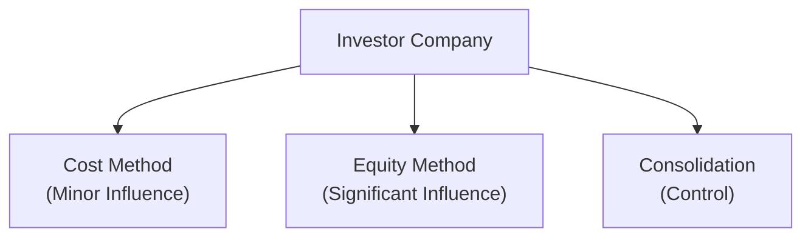

## Overview of Intercorporate Investment Methods

It’s easy to get tangled up in the different ways companies report their investments in other entities—especially if you’re combining one firm’s debts with another’s earnings and trying to keep your ratios straight. In this section, we’ll explore how each accounting method (cost, equity, and acquisition) affects a firm’s financial statements and the resulting implications for ratio analysis. You’ll realize pretty quickly: two companies can have practically the same underlying economics but look very different on paper simply because they’re using different consolidation approaches. And that can feel a bit surprising, right?

Below is a simple flowchart to help visualize the three main accounting methods:



Under IFRS, these methods are guided by standards like IFRS 9 (for certain financial instruments), IAS 28 (investments in associates), and IFRS 10/IFRS 3 (consolidated financial statements and business combinations). Under US GAAP, you’d see parallels in ASC 320/321 (investments), ASC 323 (equity method), and ASC 810 (consolidation), plus ASC 805 (business combinations). Let’s delve a little deeper.

## Cost Method: Minimal Influence, Minimal Transparency

When an investor has an insignificant influence—often presumed when ownership is less than 20% (though professional judgment can override this threshold)—the cost method typically applies. On the investor’s balance sheet, this investment shows up simply at cost or fair value. Income is recognized only when dividends are declared by the investee.

• Balance Sheet: Shows only the cost (or fair value) of the investment as a noncurrent asset.  
• Income Statement: Dividend income is recorded when dividends are received or declared. No ongoing share of the investee’s profit or loss is recognized.  
• Ratios: The investor’s leverage and profitability metrics often remain unchanged by the day-to-day business of the investee (beyond dividend inflows). Because you’re not picking up the investee’s liabilities or revenues, your own leverage and coverage ratios might look lower or higher than truly representative of the total “economic risk.”

### Potential Distortions

Imagine a heavily indebted investee: under the cost method, the investor doesn’t record any portion of that debt. The investor’s debt-to-equity ratio might look modest, even though the underlying risk from the investee could be substantial. Similarly, the investor’s return on equity (ROE) may not reflect the investee’s performance, making the parent look less or more profitable relative to peers who use different methods.

## Equity Method: Reflecting a Share of Actual Performance

Under the equity method, the investor recognizes its proportionate share of the investee’s net income (or loss). This method applies when the investor can exert significant influence but does not have full control—often indicated by 20%–50% ownership.

• Balance Sheet: The investor’s carrying amount of the investment increases by their share of the investee’s income and decreases by their share of the investee’s losses or dividends.  
• Income Statement: A single line item typically labeled “Equity Income from Affiliates” (or similar) appears, capturing the investor’s share of the investee’s net income.  
• Detailed Impact:  
  – The investor’s **retained earnings** and **net income** reflect partial results from the investee.  
  – Dividends from the investee reduce the carrying value of the investment instead of being recognized purely as income (contrast this with the cost method).  

### Effect on Ratios

1. Return on Equity (ROE):  
   Under the equity method, net income includes the investee’s proportional net earnings. This can improve ROE if the investee is profitable. On the flip side, if the investee is losing money, the investor’s ROE can drop.  
2. Debt-to-Equity (D/E):  
   The investee’s liabilities do not appear on the investor’s consolidated statements in a line-by-line fashion, so the overall leverage ratio for the investor might appear moderate—much like in the cost method. However, the investment asset on the balance sheet grows over time if the investee is profitable. Depending on the magnitude, this can influence equity calculations (the denominator in D/E).  
3. Coverage Ratios (e.g., Interest Coverage):  
   Because interest expense associated with the investee’s debt is not consolidated, coverage ratios reflect only the investor’s direct interest expense, not that of the investee.  

Equity accounting, in many ways, provides a more representative snapshot of the investor’s “stake” in the investee’s ongoing performance compared with the cost method. However, it still omits the investee’s individual assets and liabilities, which can matter a lot if you’re analyzing overall risk.

## Acquisition Method: Full Consolidation When There’s Control

When an investor has a controlling stake (usually more than 50% ownership or some other manifestation of control), IFRS 10 and ASC 810 require consolidation. Under the acquisition method, you combine essentially all the subsidiary’s assets, liabilities, revenues, and expenses with those of the parent.

• Balance Sheet: Subsidiary assets and liabilities are merged into the parent’s statements. Even noncontrolling interests appear in the equity section.  
• Income Statement: The subsidiary’s revenues and expenses are included in full. If there is a partial ownership, the portion not attributable to the parent is separated out as “noncontrolling interest.”  
• Goodwill: If the acquisition price exceeds the fair value of the subsidiary’s net assets, that difference is recognized as goodwill.  

### Substantial Ratio Implications

1. Debt-to-Equity (D/E):  
   Once you consolidate, the subsidiary’s debt is reported on the parent’s balance sheet, often pushing total liabilities up significantly. This can cause a notable rise in the consolidated D/E ratio, indicating higher leverage on the parent’s books than would be shown under cost or equity.  

2. Return on Equity (ROE):  
   Now the parent’s net income (numerator) includes the entire subsidiary’s net income (minus the noncontrolling interest, if applicable), whereas equity (denominator) includes the combined equity of both. Sometimes consolidation can dilute ROE if the subsidiary is less profitable than the parent, or it can amplify ROE if the subsidiary is quite profitable.

3. Coverage Ratios (e.g., Interest Coverage, Fixed-Charge Coverage):  
   Because consolidated income statements capture the subsidiary’s interest expense as well, these coverage ratios can look very different compared to a standalone parent.  

If you’ve ever peeked at a consolidated balance sheet and thought, “Wow, I didn’t realize how much debt this company actually had,” you’ve encountered the consolidation effect in action. 

### Small Python Snippet for Ratio Computations

In practice, analysts often gather financial data in spreadsheets or quickly run ratio calculations with programming tools. Here’s a trivial Python snippet demonstrating how you might compute a debt-to-equity ratio both before and after consolidation:

```python
import pandas as pd

df = pd.DataFrame({
    'Company': ['Parent', 'Subsidiary'],
    'TotalDebt': [1000, 800],
    'TotalEquity': [2000, 300]
})

parent_DE = df.loc[df['Company']=='Parent', 'TotalDebt'].values[0] / df.loc[df['Company']=='Parent', 'TotalEquity'].values[0]
print("Parent D/E (standalone):", parent_DE)

consolidated_DE = df['TotalDebt'].sum() / df['TotalEquity'].sum()
print("Consolidated D/E:", consolidated_DE)
```

In this toy example, you’d easily see the difference between the parent’s standalone D/E ratio and the consolidated figure that includes the subsidiary’s leverage.

## Cautions and Best Practices

• Always Check the Method of Accounting: Before you even start ratio analysis, pinpoint how the investee or subsidiary is presented on the financial statements. This drastically affects the meaningfulness of your results.  
• Adjust for Comparability: When benchmarking two companies, consider normalizing the ratios if one uses consolidation and the other uses the equity method. Chapter 13 (“Financial Analysis Techniques”) discusses ways to recast or adjust statements in cross-company comparisons.  
• Look Out for Hidden Leverage: Nonconsolidated entities might carry significant debt off the investor’s reported balance sheet, so analyze notes to the financials carefully.  
• Evaluate Performance and Control Implications: The equity method is more transparent about the investor’s share of the investee’s net income, while the cost method can obscure performance. Consolidation can illuminate total leverage but can also muddy the waters if the subsidiary’s business is vastly different from the parent’s.

## Common Pitfalls

• Overlooking Minority Investments: Analysts often treat less-than-20% stakes as immaterial. In reality, those stakes might represent large absolute dollar values with meaningful risk.  
• Double Counting Dividends: Under the equity method, dividends reduce the carrying value of the investment—some newly minted analysts mistakenly treat them as income.  
• Misreading Consolidated Metrics: It can be easy to overstate or understate a parent’s operational performance by ignoring the impact of a newly acquired subsidiary’s numbers.  
• Failing to Identify Noncontrolling Interests: Noncontrolling interests (NCI) can materially alter returns for the controlling interest. Watch how net income and equity are split.  

## Key Formulas in Ratio Analysis

When analyzing intercorporate investments and consolidation, the following are commonly referenced. The definitions can shift a bit depending on local GAAP vs. IFRS, but the broad idea remains consistent:

Debt-to-Equity Ratio (D/E):  
$$
D/E = \frac{\text{Total Debt}}{\text{Total Equity}}
$$

Return on Equity (ROE):  
$$
\text{ROE} = \frac{\text{Net Income (attributable to controlling shareholders)}}{\text{Average Equity (controlling interest)}} 
$$

Coverage Ratios (e.g., Interest Coverage):  
$$
\text{Interest Coverage} = \frac{\text{EBIT}}{\text{Interest Expense}}
$$

Under full consolidation, you’d include the subsidiary’s EBIT and interest expense in these calculations. Under the cost or equity methods, you don’t.

## Illustrative Example

Let’s look at a quick example that sometimes pops up in exam scenarios:

• Parent “P” acquires 30% of “S,” which has total assets of $1 million, total liabilities of $800k, and net income of $100k annually.  
• Under Equity Method:  
  – P records an investment of $300k (30% × $1 million net assets), with adjustments over time for share of profits and dividends.  
  – P’s net income now reflects 30% × $100k = $30k.  
• Under Cost Method (if it qualified, which in practice might not if P truly has significant influence, but let’s assume so for demonstration):  
  – P’s balance sheet just shows $300k as an investment.  
  – P’s net income does not change unless S declares dividends.  
• Under Consolidation (assuming 80% ownership or some controlling stake scenario):  
  – All of S’s $1 million in assets and $800k in liabilities merge into P’s statements.  
  – P’s net income includes S’s entire $100k, with $20k allocated to noncontrolling interest if only 80% is owned.  

Look at how drastically the leverage, profitability, and coverage metrics might differ depending on the reporting method.

## Final Thoughts

No single method is superior in all circumstances; each approach is governed by the degree of influence or control. But as analysts, we must carefully interpret the reported numbers to grasp the real economic substance behind an investment. Earnings, leverage, and coverage ratios can all shift substantially once you move from cost to equity to full consolidation. If you’ve ever gazed at a consolidated statement that looks drastically different from a parent’s standalone statements, that’s a sign: you gotta ask yourself which version best reflects the real risk and return.

For a more comprehensive discussion on ratio adjustments, see Chapter 13, “Financial Analysis Techniques.” If you’re curious about the unique scenarios that pop up under partial acquisitions, see Section 10.5 in this same chapter on step acquisitions and partial disposals.

---

## References for Further Exploration

• CFA Institute Curriculum Readings on Intercorporate Investments (most current level references).  
• IFRS 10, IFRS 3, IAS 28, and US GAAP (ASC 805, ASC 810, ASC 323) for conceptual frameworks.  
• “Financial Statement Analysis” by Fridson and Alvarez for deeper insights into ratio impacts under consolidation.  
• ACCA Technical Articles on Consolidated Statement Implications:  
  https://www.accaglobal.com/  

## Test Your Knowledge: Intercorporate Investments and Ratio Impacts



### Which accounting method generally provides only dividend income on the investor’s income statement?

- [ ] Equity Method
- [x] Cost Method
- [ ] Acquisition Method (Full Consolidation)
- [ ] Proportionate Consolidation

> **Explanation:** With the cost method, the investor records dividend income when declared by the investee, rather than a proportional share of the investee’s earnings.

### Under the equity method, how does the investor typically record dividends received from an investee?

- [ ] As dividend income in the income statement
- [x] As a reduction in the carrying value of the investment
- [ ] As income that directly increases shareholders’ equity
- [ ] As a liability in the balance sheet

> **Explanation:** Under the equity method, the investor recognizes a share of net income in its income statement. Dividends received reduce the investment account on the balance sheet rather than being recognized as separate income.

### In full consolidation, which of the following items from the subsidiary is most likely to appear on the parent’s balance sheet?

- [x] The subsidiary’s total liabilities
- [ ] Only the parent’s portion of the subsidiary’s liabilities
- [ ] No liabilities from the subsidiary
- [ ] A single “investment” line item

> **Explanation:** Once control exists, the parent consolidates the subsidiary’s entire assets and liabilities on its balance sheet. Part of equity may be classified as noncontrolling interest.

### If Company X uses the cost method to report its 10% investment in Company Y, which ratio might be understated relative to using the equity method (assuming Y is profitable)?

- [x] Return on Equity (ROE)
- [ ] Debt-to-Equity
- [ ] Quick Ratio
- [ ] Price-to-Earnings (P/E)

> **Explanation:** There is no share of net income included under the cost method. If Y is profitable, including a proportion of Y’s net income would increase X’s net income under the equity method, thus raising X’s ROE.

### Which statement is true regarding the effect of consolidation on a parent’s interest coverage ratio?

- [ ] It decreases the interest coverage ratio because total interest expense is lower.
- [x] It may reduce the ratio if the subsidiary has significant interest expense.
- [ ] It increases the ratio because the subsidiary’s EBIT is excluded.
- [ ] It does not affect the interest coverage ratio.

> **Explanation:** Consolidation adds the subsidiary’s interest expense (and EBIT) to the parent. If the subsidiary’s interest burden is large, it could reduce overall coverage.

### Which of the following describes a key limitation of using the cost method?

- [x] It does not reflect changes in the underlying net assets of the investee.
- [ ] It forces recognition of all subsidiary liabilities on the balance sheet.
- [ ] It must recognize a share of losses from the investee.
- [ ] It merges the investee’s revenues with the investor’s revenues.

> **Explanation:** The cost method only recognizes the investment at cost (or fair value) and dividend income. It doesn’t track the ongoing changes in the investee’s net assets.

### When an analyst compares two companies, one using the equity method for a 30% stake and the other using consolidation for an 80% stake, what should the analyst be particularly cautious about?

- [x] The differences in reported leverage and profitability due to full consolidation vs. partial recognition
- [ ] Identical interest coverage ratios across both companies
- [x] The possibility of changes in IFRS vs. US GAAP for intangible accounting
- [ ] The timing of share-based compensation expenses

> **Explanation:** The analyst should note that under consolidation, the parent’s balance sheet and income statement include the subsidiary’s items in full, potentially making leverage and profitability look very different from a company using the equity method.

### Which of the following is included in consolidated shareholders’ equity under the acquisition method?

- [x] Parent’s equity plus subsidiary’s equity, with noncontrolling interests shown separately
- [ ] Only parent’s equity at the date of acquisition
- [ ] Parent’s equity plus a single “investment” line item
- [ ] The subsidiary’s entire equity recorded as goodwill

> **Explanation:** Consolidated equity consists of the parent’s equity plus the subsidiary’s equity, with the portion not owned by the parent classified as noncontrolling interest. Goodwill is presented as an asset if acquisition cost exceeds fair value of net assets.

### If a subsidiary is highly leveraged, which accounting method is most likely to reveal that leverage on the parent’s financial statements?

- [x] Acquisition method (full consolidation)
- [ ] Equity method
- [ ] Cost method
- [ ] None of the above

> **Explanation:** Consolidation brings all the subsidiary’s liabilities onto the parent’s consolidated balance sheet, fully displaying the associated leverage.

### True or False: Under the equity method, the investor’s balance sheet reflects both the investee’s total assets and total liabilities in proportion to ownership.

- [x] True
- [ ] False

> **Explanation:** While assets and liabilities are not listed line by line, the investor’s balance sheet investment account implicitly includes the proportionate share of the investee’s net assets. This is often phrased differently, but effectively the investor’s equity-method carrying amount represents its share of the investee’s assets minus liabilities.


