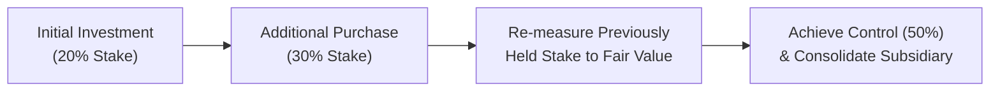
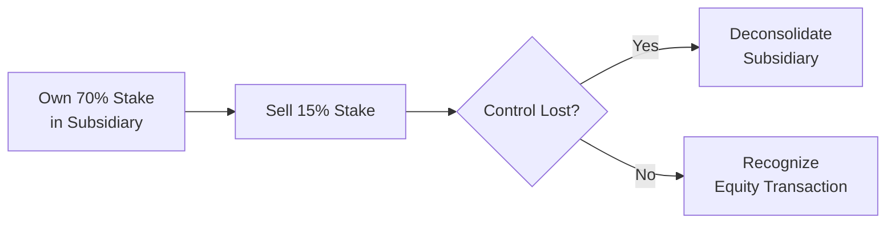

## Introduction

Step acquisitions and partial disposals of investments can be tricky topics, no doubt. Even seasoned professionals sometimes find themselves scratching their heads over the fair value adjustments, changes in goodwill, and calculations around possible gains or losses. I, for one, still remember the first time I tackled a step acquisition scenario. It was a late-night session with one of my colleagues—coffee cups strewn around the conference table—trying to pin down exactly how to handle a previously held 30% stake that suddenly became a 60% controlling interest. It was messy, but oh boy, did I learn the difference between losing countless hours and systematically breaking down IFRS 3 and ASC 805 requirements.

This section aims to help you avoid those 2 a.m. coffee-fueled standoffs with your Excel spreadsheet by clarifying the accounting for incremental acquisitions that lead to control (step acquisitions) and disposals that may or may not result in the loss of control (partial disposals). By the end, you’ll feel much more confident about remeasurement to fair value, how to treat changes in noncontrolling interest, and recognizing the difference between a deconsolidation event and an equity transaction. Let’s dive in.

## Key Concepts of Step Acquisitions

A step acquisition happens when an investor accumulates equity interests in a target company over multiple transactions. Initially, you might have only a small stake—say 20%—with your investment accounted for under the equity method or fair value through profit or loss (depending on the degree of influence and your chosen accounting policy). Later, you acquire additional shares and suddenly gain control—perhaps by hitting or surpassing 50% voting interest, or obtaining other forms of controlling power like board majority.

Under both IFRS 3 (Business Combinations) and US GAAP (ASC 805: Business Combinations), once you achieve control, you remeasure any previously held equity interests to fair value. The difference between the carrying amount of the old stake and its new fair value is recognized in current earnings. This remeasurement can be a major event in the acquirer’s financial statements because big swings in fair value can produce significant gains or losses.

### Remeasurement to Fair Value

The reason for this remeasurement is pretty straightforward in concept: once you move from having a noncontrolling interest to control, the nature of your investment changes completely. You’re no longer just an outside investor; you’re now in charge of the entity’s operating and financial policies—meaning your older piece of the pie is now also considered part of a controlling interest and must be restated to reflect current fair value. That ensures a consistent valuation basis for your newly consolidated subsidiary.

The gain or loss on remeasurement flows through the income statement in the period you obtain control. It’s essentially the difference between:
  
(1) the fair value of your previously held interest, and  
(2) the carrying amount of that previously held interest.

If you’re aiming for a succinct formula:

 \text{Remeasurement Gain or Loss} = \text{Fair Value of Previously Held Interest} - \text{Carrying Amount of Previously Held Interest} 

Where does one get the fair value? Typically, it’s the acquisition date fair value—i.e., the price a market participant would pay/receive in an orderly transaction as of the date control is obtained.

Below is a small illustration of a step acquisition path:

## Goodwill Calculation and Noncontrolling Interests

When you acquire control, you also have to figure out goodwill. Remember, goodwill in a business combination is calculated somewhat differently under IFRS 3 and ASC 805. However, the broad principle is the same:

  
Goodwill = Purchase Consideration + Fair Value of Previously Held Interest + (Fair Value of Noncontrolling Interests if Full Goodwill Method) - Fair Value of Net Identifiable Assets

A quick note: IFRS 3 allows two possible approaches for goodwill measurement:

• Full Goodwill Method: Noncontrolling interest (NCI) is measured at fair value, so goodwill includes the portion attributable to both the controlling and noncontrolling shareholders.  
• Partial Goodwill Method: NCI is measured at its share of the subsidiary’s net identifiable assets. Goodwill is recognized only in proportion to the controlling shareholders’ interest.

Under US GAAP, typically only the full goodwill method is permitted. Therefore, in a step acquisition, you recalculate goodwill on the date you gain control, factoring in the new fair value of all the pieces. This means you take into account:

1. The fair value of the consideration you pay in that final step to gain control.  
2. The fair value of any previously held interest (which might have been carried at historical cost or remeasured in your financial statements).  
3. The fair value (or proportionate share of net assets) of noncontrolling interest, if any.  
4. The fair value of identifiable net assets.  

Yes, it can be a bit of a beast to keep it all straight—especially at 2 a.m.—but a systematic approach will save you from loads of confusion.

## Partial Disposals: A Tale of Losing Control, or Not

Partial disposals come in many flavors, but the guiding question is always: Did you lose control or did you stay in control?

• If you lose control, you must deconsolidate the subsidiary. Any retained equity interest is remeasured to fair value and recognized as an investment in the new financial statements.  
• If you do not lose control, the transaction is typically treated as an equity transaction, with no gain or loss recognized in profit or loss. Instead, any difference between consideration received and the adjustment to noncontrolling interests is recognized directly in equity.

### When Control Is Lost: Deconsolidation

Losing control can be triggered by many different events. You could dispose of enough shares to drop below 50%. Or perhaps the governance structure changes in a way that strips you of your controlling rights. Regardless, once you lose control, IFRS 10 (Consolidated Financial Statements) and ASC 810 (Consolidations) say: “Deconsolidate that entity, remove its assets and liabilities from your consolidated statements, and measure any retained interest at fair value.”

Under IFRS, the gain or loss on disposal is calculated as:

 
\text{Gain (Loss) on Disposal} = \text{Fair Value of Consideration Received} + \text{Fair Value of Retained Interest} - \text{Carrying Amount of Subsidiary's Net Assets} 


Similarly, the difference flows through earnings, and the newly retained interest is recognized in accordance with whatever accounting method is appropriate (like equity method, fair value through profit or loss, or available-for-sale under older standards).

### When Control Is Retained: Equity Transaction

If you sell a portion of shares but hang on to enough to maintain control—maybe you drop from 80% to 60%—the transaction is typically accounted for as equity. The rationale? You’re still controlling the subsidiary, so we recognize no gain or loss in the income statement. Instead, the difference between the proceeds of the sale and the decrease in the carrying amount of the noncontrolling interests is recognized directly in equity.  

Below is a visual crash course:

## IFRS vs. US GAAP: Step Acquisitions and Partial Disposals

Although there are small differences in how IFRS and US GAAP handle goodwill (full vs. partial methods) or measure noncontrolling interests, both sets of standards converge on the idea that:

• At the point of obtaining control, you remeasure previously held stakes to fair value through the income statement.  
• At the point of losing control, you remeasure any remaining stake to fair value and recognize a gain or loss in the income statement.  
• If a transaction doesn’t lead to a change in control, it’s usually treated as an equity transaction.

## Comprehensive Example of a Step Acquisition

Let’s try out a simplified numeric example—just enough to lock in these concepts:

• You initially acquire 20% of Entity B for $200,000 in 20X3. At this time, you account for it as an investment in associate (equity method). The carrying amount after shares of profit is $210,000 right before you make an additional purchase.  
• On December 31, 20X4, you acquire an additional 40% for $500,000, thus obtaining control with a total of 60%.  
• The fair value of your previously held 20% at the acquisition date is $250,000, which means you recognize a remeasurement gain of $40,000 ($250,000 fair value – $210,000 carrying amount). This $40,000 goes to the income statement.  
• Assume the fair value of net identifiable assets in Entity B is $900,000 at the time of the new purchase. You choose the full goodwill method under IFRS 3. The fair value of noncontrolling interests (the remaining 40%) is $600,000.  

Goodwill, then, is calculated as:

  
Goodwill = Consideration Paid (Second Purchase) + Fair Value of Previously Held Interest + Fair Value of NCI – Fair Value of Net Identifiable Assets

  
= $500,000 + $250,000 + $600,000 – $900,000 = $450,000

This $450,000 is recognized as goodwill in the consolidated statement of financial position. The previously held 20% is now remeasured at $250,000, with the $40,000 difference recognized in your income statement.

## Partial Disposal Example

Imagine that after a couple of years, you decide to sell off 15% of Entity B. After the sale, you still hold 45%, so you lose control (because you’re now below a controlling threshold). Let’s say the 45% retained stake is measured at $400,000 fair value at disposal date. The carrying amount of the net assets of the subsidiary in your consolidated financial statements was $1,200,000 at that point, which includes $450,000 of goodwill.

If you sold the 15% stake for $300,000, your total consideration is $300,000, plus the fair value of the retained interest of $400,000. If your share (60%) of the subsidiary’s net assets was $720,000 at the time of disposal (that is, 60% of $1,200,000), then:

  
Gain (Loss) on Disposal = (Fair Value of Consideration + Fair Value of Retained Interest) – Carrying Amount of Net Assets Being Disposed

But be careful here: you’re effectively disposing the entire 60% controlling stake. The $300,000 is for 15% out of your ownership, but because you are losing control, IFRS says treat it as a disposal of the entire 60% chunk, with the remainder being re-acquired at fair value. Summing up:

• Fair Value of your total “disposal transaction” = $300,000 (cash proceeds from 15% sale) + $400,000 (retained 45% at fair value) = $700,000.  
• Carrying Amount of the net assets you “control” = $720,000 (i.e., your 60% portion of $1,200,000).  

So, your net disposal results in a $20,000 loss ($700,000 – $720,000). You remove Entity B’s assets and liabilities from your consolidation. Now, your 45% stake goes back in at its fair value of $400,000, presumably subject to equity method (or fair value IFRS 9) going forward, because you no longer control the subsidiary.

## Real-World Challenges

In practice, step acquisitions and partial disposals create an extra layer of complexity. Transaction structures in the real world often involve options, convertible securities, or mandatory buy-sell arrangements that can cause incremental expansions or contractions in ownership over time. Moreover, if you think about the wide variety of ways some deals are structured (like earn-out provisions or contingent consideration), it can get complicated fast.

It’s also vital to maintain solid documentation around how you determine fair value. Auditors—and regulators—tend to pay close attention to the assumptions and methods used. You want to ensure your valuations are robust, especially given that remeasurement gains or losses can significantly affect reported profits or losses.

## Best Practices for Exam and Real-Life

• Carefully track ownership changes to figure out exactly when you gain or lose control.  
• If you do a step acquisition, always remeasure your previously held interest to fair value. That resulting gain or loss goes to the income statement.  
• Losing control means scrubbing the subsidiary from your books and recognizing the new stake—if any—at fair value. If you still hold some shares, remeasure them to fair value.  
• If you reduce your stake but keep control, treat it as an equity transaction.  
• For goodwill calculation, especially in IFRS, decide whether you’re using the full goodwill or partial goodwill method. Keep track consistently once you make that policy election.  
• Keep a checklist or flowchart. (Believe me, it reduces tons of mental overhead.)

## Additional Thoughts

I always tell my students: step acquisitions and partial disposals are about changing the plane you’re flying. Think of it like going from a pilot to being an airline owner or vice versa. Once you “start piloting the plane,” you have full responsibility and your accounting changes drastically. If you “lose control,” you’re handing the pilot seat to someone else, and it’s time to account for your seat as just a passenger (or not even on the plane at all). That shift demands remeasurement—like it or not.

## References

• IFRS 3 – Business Combinations  
• IFRS 10 – Consolidated Financial Statements  
• ASC 805 – Business Combinations  
• ASC 810 – Consolidations  
• KPMG Mergers & Acquisitions Accounting Guide  
• Deloitte, "Mergers & Acquisitions: Carve-Out Transactions"  
• EY “Financial Reporting Developments: Business Combinations”  

## Step Acquisitions and Partial Disposals: Exam-Style Questions



### A company increases its ownership in an investee from 25% to 55%. Under IFRS 3, what must it do for its previously owned 25% interest at the moment control is obtained?

- [x] Remeasure it to fair value and recognize any gain or loss in earnings.
- [ ] Leave it at its existing carrying amount.
- [ ] Transfer the difference to other comprehensive income (OCI).
- [ ] Defer the recognition of any remeasurement until the investment is sold.

> **Explanation:** IFRS 3 requires previously held interests to be remeasured to fair value when control is obtained. The resulting difference between fair value and carrying amount goes to profit or loss.

### In a step acquisition scenario under US GAAP (ASC 805), the carrying amount of the existing interest is $200,000, while its fair value is $280,000 at acquisition date. What is the correct accounting treatment?

- [x] Recognize a $80,000 gain through the income statement.
- [ ] Recognize a $80,000 increase in equity.
- [ ] Recognize a $80,000 goodwill adjustment.
- [ ] Defer the $80,000 until final disposal.

> **Explanation:** Similar to IFRS, US GAAP also mandates that upon obtaining control, previously held interests are remeasured to fair value. The gain or loss—the $80,000 difference here—goes through the income statement.

### Suppose a parent’s ownership in a subsidiary moves from 60% to 45% due to a share disposal. The parent has lost control. Which statement is true?

- [x] The subsidiary is deconsolidated, and the retained interest is remeasured at fair value.
- [ ] The entire difference between sales proceeds and carrying amount is recorded in other comprehensive income.
- [ ] No gain or loss is recognized since the entity still has an investment in the subsidiary.
- [ ] The disposal is treated as a change in equity, with no impact on the income statement.

> **Explanation:** Losing control triggers a deconsolidation event. The retained interest is measured at fair value, and any resulting gain or loss goes to profit or loss.

### If the parent retains control after selling a portion of its stake in a subsidiary, how is the transaction recognized?

- [x] As an equity transaction.
- [ ] As a gain or loss in the income statement.
- [ ] As a partial business combination.
- [ ] As an extraordinary item.

> **Explanation:** When control is retained, IFRS and US GAAP typically view it as an equity transaction. No gain or loss is recognized in net income.

### Under IFRS 3, the full goodwill method results in:

- [x] Noncontrolling interests measured at fair value of the subsidiary’s net assets.
- [ ] Noncontrolling interests measured at the proportionate share of the subsidiary’s net assets.
- [x] Goodwill attributable to both the controlling and noncontrolling interests.
- [ ] Goodwill recognized only for the controlling interest’s share.

> **Explanation:** Full goodwill means measuring the NCI at its fair value and thus recognizing goodwill for the entire entity, including NCI’s portion.

### What is the primary impact of remeasurement to fair value of previously held interests in a step acquisition?

- [x] It ensures the acquirer’s entire controlling interest is recognized on a consistent valuation basis at acquisition date.
- [ ] It decreases the reported goodwill to zero.
- [ ] It reduces the net assets of the subsidiary.
- [ ] It’s recognized directly as an adjustment to equity, bypassing net income.

> **Explanation:** By remeasuring the existing investment to fair value, the acquirer ensures that both the previously held stake and the newly acquired stake are recorded at the same basis when consolidation begins.

### Which of the following statements best describes partial disposal when control is lost?

- [x] The parent deconsolidates the subsidiary, recognizes a gain/loss in the income statement, and reclassifies the remaining stake, if any, at fair value.
- [ ] The parent continues to consolidate the subsidiary.
- [x] The difference between the consideration received and carrying amount is recognized as an equity transaction.
- [ ] No valuation adjustment is necessary because the new ownership remains higher than 20%.

> **Explanation:** Losing control means deconsolidation and remeasurement to fair value. Any resulting gain or loss goes into earnings. If, on the other hand, control had been retained, it would have been an equity transaction.

### Under the partial goodwill method (allowed under IFRS 3), how is NCI measured?

- [x] At the proportionate share of the subsidiary’s net identifiable assets.
- [ ] The same as the full goodwill approach.
- [ ] Not recognized at all.
- [ ] At the carrying value of the parent’s original investment.

> **Explanation:** Under the partial goodwill method, NCI is measured at its proportionate share of the subsidiary’s net identifiable assets, leading to a smaller recognized goodwill amount.

### A parent sells 10% of its 80% interest in a subsidiary but still keeps control. How is the transaction gain or loss treated?

- [x] Recognized in equity, not in profit or loss.
- [ ] Recognized in the income statement as a realized gain.
- [ ] Classified as an extraordinary item.
- [ ] Booked to other comprehensive income (OCI).

> **Explanation:** Because the parent still retains control, the transaction is treated as an equity transaction, with no income-statement impact.

### The remeasurement of retained interest following a partial disposal that results in loss of control will most likely produce:

- [x] A gain or loss recognized in the current period’s income statement.
- [ ] A reclassification of retained interest directly to owners’ equity.
- [ ] A reclassification of retained interest to other comprehensive income.
- [ ] A deferral of any gain or loss until the final disposal of all interests.

> **Explanation:** Upon losing control, the retained interest is remeasured to fair value, with the resulting gain or loss recognized immediately in profit or loss.


