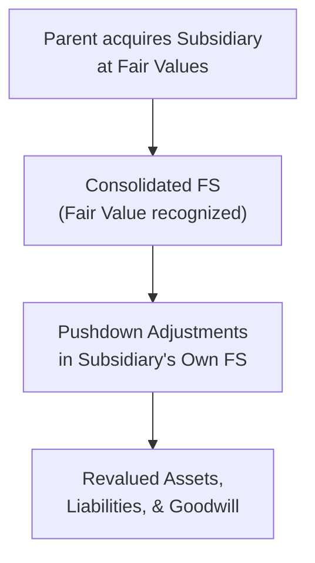
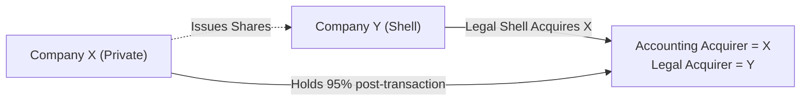

### An Informal Look at Pushdown Accounting

Pushdown accounting might sound complicated, but think of it like this: a parent company acquires a subsidiary and assigns fair values to the subsidiary’s assets and liabilities on acquisition date. These fair values aren’t just for fun—someone has to record them somewhere, right? Under pushdown accounting, that “somewhere” becomes the subsidiary’s own financial statements. Essentially, the new fair values are “pushed down” so they show up on the books of the entity being acquired (the acquiree).

I remember a previous client situation—years ago, I helped a mid-sized tech firm that got acquired by an international conglomerate. We had to revalue their specialized lab equipment at acquisition date. Suddenly, those old, heavily depreciated machines on the subsidiary’s balance sheet got a new lease on life for reporting purposes because the parent’s purchase price implied a higher fair value. Everyone in the subsidiary’s finance team was like, “Wait, so our assets are now worth way more?” We had to explain that this revaluation isn’t a magical free pass—it just reflects the parent’s perspective of the fair value at the time of acquisition.

Under US GAAP, pushdown accounting might be optional depending on certain ownership thresholds. Sometimes the subsidiary can apply it if there’s a significant change in control. Under IFRS, the standards don’t explicitly discuss “pushdown accounting” in the same way, but in practice, IFRS financial statements of acquired subsidiaries also must reflect fair value adjustments, albeit through consolidation or other remeasurement rules under IFRS 3 (Business Combinations).

#### Key Points to Remember

• Pushdown accounting is most directly relevant when a subsidiary remains a separate legal entity that issues its own standalone financial statements.  
• Under US GAAP, if the parent obtains control (e.g., over 95% ownership), pushdown accounting can be elected. If that threshold isn’t met, the subsidiary often continues using historical cost basis in its stand-alone books.  
• For IFRS preparers, while there is no explicit “pushdown accounting” standard, IFRS still requires that assets and liabilities be measured at acquisition-date fair values in the group’s consolidated statements.  
• The carryover basis might persist in the subsidiary’s own statutory ledger if local regulations do not mandate revaluation.  

In practical terms, pushdown accounting can simplify consolidated financial reporting: both parent and subsidiary speak the same language on initial measurement. However, it can also create additional complexities—like higher depreciation or amortization expenses in the subsidiary’s future income statements due to the revalued assets.

### Using a Quick Example

If a parent acquires 100% of a subsidiary for a purchase price of USD 500 million, the fair values of the subsidiary’s net assets might be set at USD 450 million. That difference of USD 50 million may be recognized as goodwill on the parent’s consolidated balance sheet—and, if applying pushdown accounting, the subsidiary’s own statements will also reflect the updated asset values and corresponding goodwill.

In a typical scenario under pushdown accounting:

1. The subsidiary revalues its assets to the acquisition-date fair values.  
2. It recognizes goodwill if the price paid exceeds the fair value of net identifiable assets.  
3. Future depreciation, amortization, or impairment are based on these new amounts.  

To visualize, here’s a quick Mermaid diagram illustrating the flow of “pushing down” values:

It might look straightforward, but watch out for local statutory rules. In some jurisdictions, pushdown accounting is not recognized. In the United States, the SEC offers specific guidance, which filers should follow if they want to apply pushdown accounting after a certain ownership level is met.

---

### Reverse Acquisitions: Flipping the Script

Now let’s talk about reverse acquisitions, which can feel a bit like you’re watching a movie backwards. In a typical acquisition, the entity issuing shares (the parent or legal acquirer) is treated as the “accounting acquirer.” But in a reverse acquisition, that story is upended: the legal acquirer is actually the “accounting acquiree.”

Imagine you have Company A, a private company, merging with Company B, a shell public company that’s merely an empty legal structure with no real operations (like a SPAC). On paper—the legal side—Company B might be acquiring Company A. However, for accounting purposes, we can see that the private company (A) is the one truly in control. Therefore, Company A is the accounting acquirer even though Company B is the legal acquirer. The result is that the private company’s financial statements effectively carry over as the continuing business in the combined entity’s consolidated statements.

#### Why Reverse Acquisitions Happen

• SPAC transactions. A SPAC is formed, goes public, and then merges with a private operating company. Although the SPAC (public entity) is technically the “acquirer,” the private operating company’s shareholders often end up controlling the majority of shares, making the private company the accounting acquirer.  
• Shell or “blank-check” companies. Similar story: a shell is used as a vehicle for regulatory or listing reasons.  
• Legal form vs. Economic Substance. IFRS 3 and ASC 805 both emphasize that identifying the “accounting acquirer” is about using the substance of who obtains control, not just reading legal documents.

#### An Illustration of a Reverse Acquisition
Let’s say Company X is a small but promising biotech (privately held), while Company Y is a public shell with minimal operations. Company Y “buys” Company X by issuing 95% of its shares to X’s shareholders in exchange for ownership of X. After the deal closes, guess who effectively controls the new combined entity? Company X’s shareholders do, because they hold 95% of the total shares. So, from an accounting perspective, Company X is the real acquirer, while Y—despite existing as the official “public entity” or “legal parent”—is just the acquiree. The newly combined entity’s continuing operations and historical financial statements come from X, not Y.

Here is a Mermaid diagram to illustrate the flow in a simple reverse acquisition:

From that point forward, the consolidated financial statements basically look like X continuing to exist (with X’s historical results) plus any new net assets and share structure from Y.  

---

### The Accounting Framework

Both IFRS 3 (Business Combinations) and ASC 805 (Business Combinations) lay out guidelines for determining the accounting acquirer. Common key factors include deciding which entity:

• Selects the management team of the combined entity.  
• Dominates the board’s representation.  
• Controls the combined entity’s strategies.  
• Issues the majority stake of voting rights post-merger.  

Once the accounting acquirer is identified, you apply standard acquisition accounting to measure identifiable assets, liabilities, and any noncontrolling interest at fair value. In a reverse acquisition, the legal “acquiree” (which is the larger or controlling party in reality) uses the normal acquisition method as if it had purchased the shell entity. The shell entity’s net assets are measured at fair value, even though legally it appears as though the shell bought the private company.

#### Effects on Consolidated Financial Statements

• The combined entity’s statement of financial position is basically the accounting acquirer’s (the real controlling entity).  
• Historical financial results of the legal parent (shell company) are typically replaced by the historical financials of the accounting acquirer, since the acquirer is deemed to have continued operations.  
• The equity structure often needs adjustments to reflect the legal capital of the shell but the substance of the private company’s ownership. Under IFRS, you might see an offset to a reverse acquisition reserve in equity.

---

### Why All This Matters

Analysts looking at pushdown accounting need to understand that the subsidiary’s stand-alone statements might suddenly show large asset or liability revaluations and new intangible assets. If you’re comparing historical trends within that subsidiary, you’ll see a break in continuity—profit margins might change simply because of new depreciation or amortization. It’s not necessarily that the subsidiary’s operations changed; from one day to the next, its “book values” got recalibrated.

For reverse acquisitions, if you’re analyzing a SPAC deal, you might see how the “acquirer” from a legal standpoint isn’t the one controlling the business long-term. So you’d want to pay attention to who truly holds the reins. Many new SPACs that started trading are basically the private operating companies (the so-called “targets”) now listed on an exchange. Yet the historical financial statements are the ones from the target, not from the shell (because the target is the accounting acquirer).

---

### Implementation Pitfalls

• Overlooking pushdown triggers: Some companies might apply pushdown when it isn’t appropriate or skip it when ownership changes are large enough to require it.  
• Not carefully distinguishing the legal form from the economic substance: Reverse acquisitions can be confusing, especially if each party’s legal counsel is presenting the transaction in a certain way.  
• Complex debt or equity structures: Determining control can get complicated when preference shares, warrants, convertible debt, or contingent consideration are involved.  
• Misapplication of IFRS 3 or ASC 805: If management incorrectly identifies the acquirer, the entire consolidation could be misstated.  

---

### Practical Tips for Analysts and Finance Teams

• Investigate the ownership structure pre- and post-acquisition. Who’s really in control?  
• Watch out for new intangible assets (like brand names, patents, or customer lists) that appear due to pushdown accounting or a reverse acquisition. These can alter profitability ratios and leverage metrics.  
• If analyzing trends, adjust for the “step up” in basis. Many financial ratios might show big swings if you forget about the accounting adjustments.  
• For reverse acquisitions with SPACs, scrutinize pro forma statements carefully to see how the capitalization and historical results are re-presented.  

---

### Additional Real-World Usage

The proliferation of SPAC mergers in recent years has highlighted how often reverse acquisitions pop up. This can be especially relevant for equity research analysts who want to figure out a company’s “true” historical performance. If you’re analyzing a post-SPAC entity, you’ll typically see disclaimers in the first few footnotes in the consolidated financial statements, clarifying that the private operating company (Target Co.) is deemed to be the accounting acquirer. The “shell” (SPAC) gets consolidated in from the date of the transaction, and shareholders of the target hold the majority of the new entity’s shares.

---

### Best Practices and Ethics

Per the CFA Institute’s Global Investment Performance Standards (GIPS) and the Code and Standards, being transparent in how transactions are accounted for is essential. If your firm is analyzing or reporting on a combination, you should ensure:

• Full disclosure of revaluations: Show in footnotes and management commentary how pushdown accounting or reverse acquisition adjustments have been recorded.  
• Consistency: Stick with the same approach unless a significant change in control or regulation requires reassessment.  
• Integrity: Reflect the economic substance, not just the legal form.  

Ultimately, failing to identify the correct acquirer or incorrectly applying pushdown accounting can lead to misrepresentations in financial statements—something the CFA Program Code of Ethics tries to guard against.

---

### References and Further Reading

Below are some sources you might want to explore for more technical detail or official guidance:

• SEC guidance on pushdown accounting for US registrants.  
• IFRS 3 Business Combinations, particularly Appendix B on reverse acquisitions.  
• ASC 805 (US GAAP), especially the subtopic 805-40 for reverse acquisitions.  
• PwC’s “Mergers & Acquisitions: Accounting and Reporting” manual, which provides case studies and illustrative examples.

If you get a chance to dive deeper, it’s always helpful to read real-world SEC filings or IFRS-based financial statements that mention pushdown accounting or reverse acquisitions. Nothing beats seeing how theory is applied in practice.

---

### Final Exam Tips

• Work through the steps of identifying the accounting acquirer—look to who truly controls the combined entity post-transaction.  
• Be ready to handle sketches of journal entries or basic calculations of new fair values in pushdown accounting.  
• Remember to check how any newly recognized intangible assets or goodwill might affect ongoing impairment tests and financial ratios.  
• During the exam, watch out for “trick” scenarios where the legal acquirer is not the accounting acquirer. It’s a common test topic.  

If you keep these principles in mind, you’ll be in a great position to analyze these transactions—so good luck, and remember: substance over form will always rule the day when it comes to acquisitions.

---

## Test Your Knowledge: Pushdown Accounting and Reverse Acquisitions



### Which statement best describes pushdown accounting?

- [x] It involves recording the acquisition-date fair values in the acquiree’s stand-alone financial statements.
- [ ] It requires that only the parent recognizes any fair value adjustment for the subsidiary’s assets.
- [ ] It mandates a total reversal of all intangible assets not previously recognized.
- [ ] It allows partial recognition of fair value adjustments at the subsidiary level at management’s discretion.

> **Explanation:** Pushdown accounting “pushes down” the fair values established by the parent into the subsidiary’s own financial statements.

### Under US GAAP, when may a subsidiary apply pushdown accounting in its separate financial statements?

- [x] When a sufficient change in ownership (often 95% or more) prompts remeasurement at fair values.
- [ ] Only if there is no goodwill recognized on the parent’s consolidated financial statements.
- [ ] When the subsidiary is publicly traded.
- [ ] Whenever the subsidiary chooses, regardless of ownership percentage changes.

> **Explanation:** US GAAP offers optional application of pushdown accounting when a major ownership change triggers new acquisition accounting at the parent level (often close to 95% or more ownership).

### Which entity is the accounting acquirer in a reverse acquisition?

- [ ] The entity that pays cash consideration for the other.
- [ ] Always the larger entity by total assets or revenues.
- [x] The entity that obtains control of the combined entity, even if it’s the legal subsidiary.
- [ ] Whichever entity is listed on a public exchange.

> **Explanation:** In a reverse acquisition, the accounting acquirer is the entity that actually controls the combined entity’s operations, regardless of legal form.

### What typically happens to the historical financial statements of the legal parent in a reverse acquisition?

- [x] They are replaced by the legal subsidiary’s (accounting acquirer’s) historical financial statements.
- [ ] They remain in place but include offsetting intangible asset write-offs.
- [ ] They must be presented side by side with the legal subsidiary’s in perpetuity.
- [ ] They are restated using the old cost basis without further disclosures.

> **Explanation:** The accounting acquirer’s financials continue post-merger in a reverse acquisition, effectively replacing the legal parent’s historical statements.

### A Company X merges with a SPAC (Company Y). Company Y is the legal acquirer, yet Company X gets 80% of the combined entity’s voting rights. Which scenario applies for accounting?

- [x] Company X is the accounting acquirer, because it holds the controlling stake.
- [ ] Both X and Y record themselves as separate acquirers.
- [x] Company Y is the legal acquirer, but not the accounting acquirer.
- [ ] Neither entity is recognized as the acquirer under IFRS 3 or ASC 805.

> **Explanation:** Because Company X’s shareholders end up controlling (80% stake), X becomes the accounting acquirer. Y is merely the legal acquirer.

### Which of the following is a key characteristic of pushdown accounting?

- [x] The subsidiary’s assets and liabilities reflect the acquisition-date fair values recognized by the parent.
- [ ] The subsidiary only revalues tangible assets, ignoring intangible assets.
- [ ] The method can only be applied under IFRS 3 but not under US GAAP.
- [ ] It eliminates all historical cost records in the parent’s statements.

> **Explanation:** A hallmark of pushdown accounting is that the subsidiary’s stand-alone statements adopt the parent’s acquisition-date fair values.

### In a reverse acquisition, what generally triggers the application of IFRS 3 or ASC 805?

- [x] A business combination where economic control differs from legal ownership.
- [ ] Any merger involving two parties with equal voting rights.
- [ ] Only transactions structured as stock swaps under IFRS.
- [x] Situations where no fair value adjustments need to be recorded.

> **Explanation:** IFRS 3 and ASC 805 require that management identify the accounting acquirer based on control, not just legal form. Reverse acquisitions often meet the definition of a business combination, mandating these standards.

### One potential pitfall of pushdown accounting is:

- [x] Confusion in trend analysis due to changed asset values and new depreciation/amortization.
- [ ] It reduces the transparency of intangible asset recognition.
- [ ] It has no impact on the subsidiary’s future earnings.
- [ ] It obviates the need for consolidated financial statements.

> **Explanation:** Pushdown accounting can break consistency in financial trend analysis, as asset revaluations can significantly alter future depreciation and earnings.

### In a reverse acquisition involving a shell entity:

- [x] The shell entity is the legal acquirer but the accounting acquiree.
- [ ] The shell’s financials always form the basis for future reporting.
- [ ] The transaction does not qualify as a business combination.
- [ ] The shell entity’s intangible assets always fully offset any goodwill.

> **Explanation:** The classic example is a private company using a shell or SPAC to go public, with the shell as the legal acquirer but the private company as the accounting acquirer.

### True or False: Under reverse acquisition accounting, the legal acquirer’s historical financial statements become the primary financial statements after the merger.

- [ ] True
- [x] False

> **Explanation:** The historical financial statements of the accounting acquirer (often the legal subsidiary) become the continuing financial statements of the combined entity. The legal acquirer’s historical financials largely drop away post-merger (or appear in very limited comparative references).


