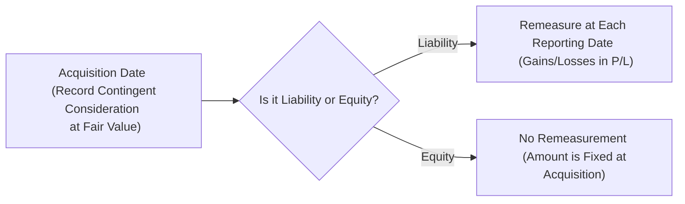

## Introduction

So, fancy hearing about those M&A deals where part of the purchase price depends on some future performance target? That’s basically what we call contingent consideration. In everyday language, you might have heard of it as an “earn-out,” which means the seller only gets part of the proceeds if the acquired company meets certain milestones—like revenue goals or patent approvals—after the deal closes. Contingent consideration isn’t just a footnote in business combinations; it’s actually a pretty big deal in advanced financial reporting. In this section, we’ll explore how companies account for these earn-outs under IFRS and US GAAP, paying special attention to how changes in estimated payouts can cause volatility in reported earnings. We’ll also have a few personal anecdotes from practitioners who have seen how ignoring contingent liabilities can come back to bite you later on.

## Why Contingent Consideration Exists

Sometimes I like to think of contingent consideration as a handshake deal sweetener—sort of like, “Hey, you think your company’s going to gain 50% more market share next year? Prove it, and we’ll pay you extra.” Acquirers use earn-outs to align incentives. If the acquired entity turns out to be more profitable than expected or hits certain strategic goals, the seller reaps additional rewards. This approach can mitigate some of the risk for the buyer at the time of acquisition (no overpayment if the synergy targets don’t materialize) and leaves upside potential for sellers who’re confident in their business’s future.

From a high-level finance perspective, though, once that handshake is codified, you need to measure it and book it. That’s where IFRS 3 (for IFRS reporters) and ASC 805 (for U.S. GAAP filers) come into play. Let’s dive into the nuts and bolts.

## Initial Recognition: The Fair Value Approach

In a business combination, the acquirer recognizes and measures contingent consideration at its fair value as of the acquisition date. Essentially, you’re saying, “Given what we know right now, how much is that future potential payment worth?” Even though the payment depends on uncertain future events, the acquirer must calculate a probability-weighted present value of all possible outcomes. This is no small task.

### Fair Value Measurement Techniques

Modeling the fair value of contingent consideration often involves either a probability-weighted scenario approach or option-pricing-like models (especially if the trigger is tied to market variables or share prices). Typically, finance teams will do something along these lines:

1. Identify possible outcomes (e.g., zero payout, partial payout, full payout, or anything in between).  
2. Assign probabilities to each outcome (like 30% chance the milestone is achieved, 70% chance it’s missed).  
3. Convert each outcome to its present value using an appropriate discount rate.  
4. Sum the probability-weighted present values to get the fair value of the contingency.  

If the calculations seem complicated, that’s because they are. One CFO friend of mine once said, “Valuing earn-outs is like trying to forecast the weather three years out in a place that has four distinct seasons.” It can be done systematically with robust data, but there’s always an element of judgment.

## Subsequent Measurement and Remeasurement

Here’s the part that can trip up even seasoned accountants. After the acquisition, the way you keep track of that contingent consideration depends on whether it’s classified as a liability or equity:

• If the contingent consideration is classified as a liability, then changes in its fair value after the acquisition date typically flow through the income statement in subsequent periods.  
• If it’s classified as equity, there is no remeasurement—meaning once you set it up at acquisition date fair value, you’re done recording changes to it in future periods.  

### IFRS vs. US GAAP Differences

Under IFRS (IFRS 3):

• Contingent consideration must be recognized at fair value on Day 1.  
• If it meets the definition of a financial liability (e.g., it’s settled in cash or another financial instrument), the acquirer remeasures it at fair value each reporting period, with changes recognized in profit or loss.  
• If it’s classified as equity (e.g., the acquirer settles by issuing a variable number of its own shares without a further obligation to deliver cash), no subsequent remeasurement is required.

Under US GAAP (ASC 805-30):

• Similar to IFRS, contingent consideration is initially recognized at fair value at the acquisition date.  
• Contingent consideration classified as a liability is remeasured at each reporting date, with changes going through the income statement.  
• Contingent consideration classified as equity is not remeasured.  

As you can see, both frameworks largely converge on the principle of fair value measurement for contingent consideration. The big difference tends to be in some nitty-gritty classification rules or in subsequent measurement detail—though, in practice, IFRS and US GAAP treatments are fairly similar in concept.

## Practical Example of an Earn-Out

Let’s walk through a simplified scenario: Suppose the acquiring company, Skyline Inc., buys ControlCo for a total consideration of $10 million upfront. The purchase agreement states that if ControlCo’s net income in the next fiscal year exceeds $2 million, Skyline Inc. will pay an additional $3 million to the sellers.

### Calculating Fair Value at Acquisition

During the acquisition, Skyline Inc. management estimates a 40% probability that ControlCo’s net income will surpass $2 million. Based on this:

• Probability-weighted payout = $3 million × 40% = $1.2 million.  
• Discount this amount for one year at (say) 5% if they expect to pay in one year.  
• Present value = $1.2 million / (1.05) ≈ $1.14 million.  

So Skyline Inc. records an $11.14 million purchase price on Day 1 ($10 million cash + $1.14 million contingent consideration at fair value). 

### Future Remeasurement

If the contingent consideration is classified as a liability, Skyline Inc. will remeasure that $1.14 million each reporting date. 
- If updated forecasts or actual performance shows a higher probability of meeting the target, the liability increases, and the offset is a loss in the income statement. 
- If it becomes less likely that ControlCo meets the target, the liability decreases, causing a gain in the income statement.  

If, however, the arrangement is set up such that Skyline Inc. issues a fixed number of shares upon meeting the milestone, and that issuance meets the criteria for equity, Skyline Inc. does not remeasure at all. No gains or losses arise from changes in estimated performance.

## Considering Key Assumptions

The overarching factor in contingent consideration is the set of assumptions used in the valuation model:

- Projected revenue growth or net income targets  
- Probability of achieving certain R&D milestones  
- Time horizons, discount rates, and volatility assumptions for risk-based scenarios  

When changes in fair value flow through profit or loss, you can get remeasurement gains or losses that fluctuate significantly from one quarter to the next. I once worked with a biotech client for whom the entire success of the earn-out hinged on FDA approval. As each regulatory step was met, the probability soared, so the liability soared too, impacting the bottom line. 

## Equity vs. Liability Classification

It’s critical to get the classification right at the very start because it drives whether you’re going to face future earnings volatility. Some key considerations:

- If settlement is in cash or other assets, it is almost certainly a liability.  
- If settlement is in a variable number of shares, that might still be a liability if the arrangement compels the company to pay cash if certain conditions aren’t met.  
- If settlement is in a fixed number of shares, it’s more likely to be equity (with no subsequent remeasurement).

Pay close attention to the exact settlement provisions stated in the acquisition agreement. A small nuance—like the presence of a cash alternative—can flip your classification from equity to liability.  

## Diagram of Recognition and Measurement

Below is a Mermaid diagram illustrating how contingent consideration moves from initial recognition to subsequent measurement:

As you can see, your accounting life is a lot simpler if it’s classified as equity. No remeasurement means fewer hits to the bottom line each quarter. But that also means you can’t adjust if the business environment shifts, which can be a headache if your assumptions were off.

## Considerations for Financial Analysis

From an analyst’s viewpoint, contingent consideration can muddy the waters when you’re evaluating the true cost of an acquisition or assessing management’s ability to forecast synergy. Some tips to keep in mind:

• Understand how big the earn-out portion is relative to the total purchase price. If it’s significant, watch out for potential hits or boosts to earnings in future periods if it’s classified as a liability.  
• Check the footnotes for those probability assumptions. Are they realistic, or do they look overly optimistic/pessimistic?  
• Don’t just look at the reported goodwill. The reconsideration or remeasurement of contingent payments can sometimes make goodwill changes seem small in comparison to the big fluctuations you might see in the liability.  

## Implications for Ratio Analysis

If the contingent consideration is recognized as a liability, it can affect solvency and leverage metrics—like the debt-to-equity ratio—depending on how large the liability is. Also, earnings-based ratios, such as return on equity (ROE) or earnings per share (EPS), might be distorted if the remeasurement gains or losses are material. This can generate confusion during comparative analysis, especially if each period’s reported results are impacted by big changes in probability assumptions. 

## Common Pitfalls

• Underestimating the Probability: Companies might be tempted to downplay the likelihood of paying out (to keep liability low). If this changes dramatically, they can get hammered later by a big jump in the recognized liability.  
• Incorrect Classification: If an arrangement seems to settle in shares but also offers a fallback cash alternative, that might push it into liability territory.  
• Poor Disclosure: Sometimes management doesn’t provide enough detail on how it valued the contingent consideration. Analysts and investors need clarity on assumptions.  

## A Brief Personal Reflection

I remember once hearing from a CFO who was super-excited about an upcoming post-acquisition milestone. She told me, “We’re definitely going to blow past that revenue target.” But, for fair value calculation at the time, they had assigned only a 10% probability to meeting it. Well, guess what happened when reality caught up with them about six months later? The estimated liability ballooned, triggering a massive remeasurement loss. Investors were not pleased, and the CFO had to explain on the earnings call why they had such a “surprise.” In short, do not discount professional skepticism, especially around contingent consideration. 

## IFRS 3, ASC 805, and Other Regulatory Guidance

Under IFRS 3 (revised), paragraphs 39+ provide the main framework for recognizing and measuring contingent consideration. In the U.S., you’ll find the relevant guidance in ASC 805-30, specifically focusing on business combinations and subsequent measurement. Both IFRS and U.S. GAAP require robust disclosures, including:

1. The valuation techniques employed.  
2. The assumptions, ranges, and discount rates.  
3. Significant changes in recognized amounts from period to period.

Given how complicated these calculations can get, it’s also common to see references to IFRS 13 (for IFRS) or ASC 820 (for U.S. GAAP) for guidance on fair value measurements.

## Additional Subtleties

• Earn-outs tied to the seller’s continued employment: In some cases, you might run into a situation where the contingent consideration is effectively compensation expense rather than part of the purchase price. That’s a whole different conversation, but be mindful that not all performance-related payouts automatically go under “contingent consideration.”  
• Overly Complex Instruments: Some earn-outs might have multiple triggers (like revenue, profit margin, share price, and so on). The more triggers, the more you’ll rely on advanced modeling techniques.  
• External Valuations: Entities often hire external valuation specialists to handle complicated earn-outs—especially if they involve intangible R&D milestones or foreign-currency-related performance hurdles.

## Analyst Best Practices

• Look for consistency between management’s forecast in the contingent consideration and the overall synergy claims made at the time of the acquisition.  
• Track changes in the recognized liability or equity over time; it can serve as a temperature check on how well the acquired business is delivering on synergy expectations.  
• If possible, dissect footnotes from prior acquisitions to see if management historically overshoots or undershoots in these estimates—it can reveal biases.

## Exam Tips

For your CFA exam (particularly at Level III, but also relevant for Level I’s introduction to financial statements), keep these in mind:

• Be prepared to do a quick probability-weighted calculation under both IFRS and U.S. GAAP.  
• Understand the effect on net income if the value changes for a liability classification.  
• Watch out for classification pitfalls and the rationale behind each classification.  
• If a question scenario says, “The earn-out is settled in a fixed number of shares,” you should be thinking: equity classification, no subsequent remeasurement.  
• If a question states, “It’s settled in a variable number of shares or can be settled in cash at the acquirer’s option,” your mental antenna should go up: that’s probably a liability.  

Time and again, exam questions love to test your knowledge of subtle differences in classification and measurement. Also, be sure you can do quick, straightforward discounting. 

## Conclusion

Contingent consideration adds a layer of complexity and is something that any serious analyst or CFO needs to keep on their radar. For exam success, focus on the fundamentals of fair value measurement, classification (liability versus equity), and the subsequent treatments (remeasurement or not). From a practical standpoint, do not underestimate the power of accurate forecasting and consistent disclosure. Earn-outs can be an elegant way to align buyer and seller incentives in an acquisition—but if not properly measured and monitored, they can significantly impact a company’s reported earnings and create confusion among investors.

## References

- IFRS 3: Business Combinations, paragraphs 39–40 and related guidance.  
- ASC 805-30 (U.S. GAAP)  
- IFRS 13 for fair value measurement guidance, parallel to ASC 820.  
- “M&A Accounting: Contingent Considerations,” Deloitte.  
- Various practice exam questions and official CFA Program curriculum materials.

## Test Your Knowledge: Contingent Consideration in Business Combinations



### Which of the following best describes contingent consideration in a business combination?

- [ ] A form of debt instrument issued by the acquiree.  
- [x] A future payment contingent on the acquired company’s post-acquisition performance.  
- [ ] A type of forward contract used to hedge currency risk.  
- [ ] An immediate cash payment made at the acquisition date.  

> **Explanation:** Contingent consideration (often called an earn-out) is that portion of the purchase price in a business combination tied to certain future performance benchmarks of the acquired business.

### On the acquisition date, how is contingent consideration generally measured under IFRS 3 and ASC 805?

- [ ] At nominal value to be paid in the future.  
- [x] At its fair value, considering probability-weighted outcomes and discount rates.  
- [ ] At face value if it is settled with shares.  
- [ ] At historical cost unrelated to future outcomes.  

> **Explanation:** Both IFRS 3 and ASC 805 require initial recognition at fair value. This typically involves assigning probabilities to expected outcomes and discounting them to a present value.

### If contingent consideration is classified as a liability, subsequent changes in its estimated fair value:

- [ ] Are never recognized in the income statement or profit or loss.  
- [ ] Are recognized as an adjustment to equity.  
- [x] Flow through the income statement or profit or loss.  
- [ ] Flow only through other comprehensive income (OCI).  

> **Explanation:** When classified as a liability, the fair value is remeasured at each reporting date, with any gains or losses flowing through profit or loss (IFRS) or the income statement (US GAAP).

### Under what scenario would contingent consideration typically be classified as equity?

- [x] When settlement is in a fixed number of the acquirer’s own shares with no alternative to settle in cash.  
- [ ] When the contingent consideration is highly likely to be paid.  
- [ ] When the acquirer can choose to pay cash or shares.  
- [ ] When the earn-out relates to intangible assets.  

> **Explanation:** If the payment is a fixed number of shares without a cash settlement option, the instrument ordinarily meets the definition of equity. No remeasurement in subsequent periods is required.

### Which of the following is a key advantage for acquirers who use contingent consideration (earn-outs) in an M&A deal?

- [ ] It entirely eliminates the risk of overpaying.  
- [x] It helps align incentives and mitigates some initial risk of overpayment.  
- [ ] It permanently avoids financial statement volatility.  
- [ ] It makes the acquisition intangible-asset-free.  

> **Explanation:** Earn-outs help align the seller’s and acquirer’s interests, reducing the immediate risk of paying too much if the acquired entity doesn’t meet performance goals.

### Which statement about subsequent measurement is correct if contingent consideration is classified as equity?

- [x] No remeasurement is required after initial recognition.  
- [ ] Revaluation occurs semiannually and is recognized in OCI.  
- [ ] Remeasurement occurs, but only in certain years.  
- [ ] Remeasurement occurs only when the entity’s share price changes significantly.  

> **Explanation:** If an arrangement is classified as equity, you “set it and forget it.” All changes after the acquisition date are ignored from an accounting standpoint, as per IFRS 3 and ASC 805.

### If the fair value of contingent consideration liability increases due to a higher probability of hitting performance milestones, how does this affect the acquirer’s financial statements?

- [ ] It decreases assets on the balance sheet.  
- [x] It raises the liability with a corresponding loss in the income statement.  
- [ ] It raises the liability with a corresponding gain in the income statement.  
- [ ] It reduces equity directly through retained earnings.  

> **Explanation:** A higher probability leads to an increased contingent liability, which is recognized as a loss in profit or loss (IFRS) or in the income statement (US GAAP).

### A common modeling approach for determining the fair value of contingent consideration includes which of the following steps?

- [ ] Determining a single best guess for the likely performance outcome.  
- [ ] Using historical cost data with no discounting.  
- [x] Developing multiple scenarios, assigning probabilities, and discounting the payout for each scenario.  
- [ ] Using only a risk-free rate for discounting.  

> **Explanation:** Typically, you assign probabilities to each potential outcome, discount each outcome to present value, and then sum the results. This best captures the range of possible future payouts.

### Which IFRS standard provides further guidance on measuring fair value for contingent consideration?

- [ ] IFRS 9 Financial Instruments  
- [x] IFRS 13 Fair Value Measurement  
- [ ] IFRS 16 Leases  
- [ ] IFRS 17 Insurance Contracts  

> **Explanation:** IFRS 13 covers fair value measurement guidance, which applies to a wide range of assets and liabilities, including contingent consideration.

### True or False: Under both IFRS and US GAAP, changes in the fair value of a contingent consideration liability are recognized in other comprehensive income (OCI).

- [ ] True  
- [x] False  

> **Explanation:** Under both frameworks, changes in the fair value of a contingent consideration liability are generally recorded in the income statement (IFRS: profit or loss; US GAAP: net income statement).


