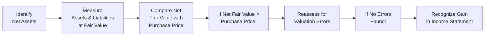

## Overview and Key Concepts

Imagine stumbling upon a luxury item at a flea market—something normally worth thousands of dollars but offered to you for a fraction of that price. You’d probably double-check the authenticity, right? Because it’s so unusual that something is sold that far below its fair value. That’s basically a “bargain purchase” in the world of mergers and acquisitions. 

In formal accounting terms, a “bargain purchase” (often referred to as “negative goodwill”) occurs when the fair value of the net assets acquired in a business combination exceeds the consideration you pay. In other words, you just got a deal that’s too good to be true—unless it actually is accurate!

Under IFRS 3 (International Financial Reporting Standard 3, Business Combinations) and ASC 805 (Topic 805 in US GAAP), the first reaction to identifying a bargain purchase is: “Wait up—did we correctly measure all the assets, liabilities, intangible assets, and contingent liabilities at fair value?” Both IFRS and US GAAP demand that you undertake that thorough reassessment. If after re-checking everything, the fair value of net assets still legitimately exceeds your purchase price, you recognize that difference as a gain (literally, a line item in the income statement). 

## Distinguishing Features of Bargain Purchases

• Excess of Net Assets over Purchase Price: This is the hallmark sign of a bargain purchase.  
• Regulatory Emphasis on Fair Value: Bargain purchases often highlight IFRS 13 (Fair Value Measurement) or ASC 820 guidelines, which require robust fair value measurement frameworks, particularly for intangible or hard-to-value assets.  
• Immediate Gain Recognition: Once confirmed, the “negative goodwill” is recognized as a one-time gain in the acquirer’s income statement.  
• Frequent in Distressed Situations: A bargain purchase commonly arises in distressed or forced liquidation scenarios, where the seller is under pressure to sell rapidly—think bankruptcies, economic downturns, forced reorganization, or strategic exit.

## Step-by-Step Accounting Treatment

### Reassess the Fair Value of Assets and Liabilities
The first big step is ensuring there’s no miscalculation. IFRS 3 and ASC 805 specifically instruct acquirers to double-check whether they:  
1. Correctly identified all identifiable assets, including any intangible assets such as patents, customer relationships, or technology.  
2. Determined fair values accurately, using accepted valuation models (comparables, discounted cash flow, or other recognized methods under IFRS 13 / ASC 820).  
3. Comprehensively included and fairly measured all liabilities and contingent liabilities.

Sometimes, in the heat of a distressed acquisition, there’s a rush to close. Overlooking intangible assets or underestimating contingency costs can lead to an erroneous conclusion that you got a bargain. Indeed, any undervaluation of intangible assets—like brand names or IP—can mistakenly produce the illusion of negative goodwill.

### Confirm It’s Truly a Bargain
Once you’ve confirmed that the measurement of all assets and liabilities was done properly, compare the net identifiable assets (at fair value) to the purchase price. If the net asset value indeed exceeds what you paid, you’re allowed to recognize that difference as an immediate gain.  

In IFRS language, IFRS 3 paragraphs 34-36 describe the process. In US GAAP, check out ASC 805-30-25. The logic is consistent: negative goodwill (or “bargain purchase”) does not represent an intangible asset that must be recorded on the balance sheet; instead, it is recognized as income, usually in the period in which the acquisition occurs.

### Record the Day-One Gain
After the dust settles and the transaction is consummated, the net difference goes right to your income statement. It appears typically in the “other income” or similar revenue classification, though accountants often note the separate line item for transparency. This approach ensures stakeholders can see that the acquirer recognized a one-time gain from the purchase itself.

### Continued Monitoring
A bargain purchase gain is exceptional. Therefore, in subsequent periods, you do not “amortize” or systematically reduce that gain—unlike positive goodwill, which is subject to ongoing impairment testing. Nonetheless, keep an eye on the acquired assets and liabilities to ensure that any post-acquisition impairment or subsequent revaluation is recorded following relevant accounting standards (e.g., impairment testing under IAS 36 or ASC 350).

## Why Bargain Purchases Happen

### Distressed Sales
Let’s say a business is at the edge of bankruptcy. Its lenders or courts might force a quick sale to salvage some value. In that fire-sale environment, the purchase price might be drastically lower than the theoretical fair value of the net assets. The buyer effectively gets a “bargain,” all because the seller has no other choice but to let go of the business at a depressed price.

### Regulatory or Market Constraints
Sometimes, specific industries or jurisdictions freeze out potential buyers, limiting the competition for an acquisition target. With fewer competing bids, the acquirer can make a lower offer. Additionally, regulatory bodies might block or discourage certain transactions that could have boosted the sale price.

### Synergies or Strategic Benefits Overlooked
Occasionally, a seller might have overlooked intangible synergies or strategic benefits that the buyer finds valuable. For instance, if the target has intangible synergy potential (like proprietary technology that the seller doesn’t fully monetize), the buyer can quietly realize that synergy—leading to a lower purchase price relative to the hidden potential. After thorough fair value work, that intangible synergy might still be recognized at substantial worth, resulting in a net asset figure surpassing the purchase price.

## Practical Example

Suppose Company A acquires Company B for a total consideration of $8 million. After IFRS 3–compliant measurement, the identifiable net assets (tangible plus intangible) of Company B are valued at $9.2 million. As the acquirer, you ask: “Did we identify everything properly? Are these intangible assets measured per IFRS 13 guidelines?” Let’s assume all checks out. That means the net identifiable assets exceed the purchase price by $1.2 million.

Under IFRS 3 or ASC 805, you classify that $1.2 million as a bargain purchase gain. This $1.2 million will appear in the consolidated income statement of Company A in the period of acquisition as, say, “Gain on Bargain Purchase.” Analysts typically view it as a nonrecurring gain because it doesn’t reflect usual operating performance.

## Assessing Measurement Under IFRS 13 and ASC 820

IFRS 13 and ASC 820 provide robust fair value frameworks. For a bargain purchase, it’s extra important to confirm:

• Did you use the right valuation approach (market, income, or cost approach)?  
• Are intangible assets with no active market properly accounted for via a Level 3 fair value technique (discounted future cash flows with best estimates of intangible asset longevity, growth, and discount rates)?  
• Are there any measurement uncertainties or sensitivities going unreported?

Under IFRS 13 and ASC 820, fair value measurements are categorized into three levels:
- Level 1: Quoted prices in active markets for identical assets.  
- Level 2: Observable inputs other than quoted prices. For instance, quoted prices for similar, though not identical, items.  
- Level 3: Unobservable inputs, typically used for intangibles or custom assets that don’t trade in an active market.  

In a bargain purchase scenario, if you rely heavily on Level 3 inputs (e.g., intangible assets without a quoted market valuation), thorough documentation and justification are crucial—especially if you wind up with a big negative goodwill number.

## Informal Thoughts and Common Pitfalls

You might be thinking, “Wow, a free gain—sign me up!” But watch out for:  
1. Valuation Errors: This is the most common reason for incorrectly recording negative goodwill. Perhaps intangible assets are double-counted or systematically overstated, leading to artificially high net asset values.  
2. Forced Liquidation: In a distressed sale, there’s a real possibility the price is genuinely way below fair value. They do happen. But always ensure it is indeed a forced liquidation scenario rather than an error.  
3. Overlooked Liabilities: Don’t forget intangible liabilities or contingent liabilities, such as litigation exposure or environmental cleanup obligations. Failure to reflect them can inflate the net asset figure.  
4. Timing of Events: IFRS 3 requires that any intangible assets (like R&D in-progress) must be recognized at fair value if they can be reliably measured at the time of acquisition. Missing or underestimating these intangible assets could artificially create a bargain purchase scenario.  

A bit of personal confession here: I once worked on a deal where the team found a sweet acquisition target. The initial numbers hinted at a huge bargain purchase gain. Everyone was thrilled—until we discovered that the target had major environmental cleanup liabilities not properly disclosed! Once we factored those in, the “bargain purchase” vanished, and we ended up with a small amount of goodwill instead.

## Analyzing Bargain Purchases as an Investor

For those analyzing a company’s financial statements, consider:

• Nonrecurring Nature: Gains from bargain purchases are typically one-shot deals. If you’re assessing the acquirer’s ongoing performance, you might exclude that gain to get a clearer view of recurring earnings.  
• Transparency of Fair Value Steps: The notes to the financial statements often describe how the acquirer valued intangible assets and contingent liabilities. This can give you clues about how robust (or not) the reported fair value estimates might be.  
• Potential Red Flags: A large negative goodwill figure might be a red flag if the fair values were superficially determined or if critical liabilities are undisclosed.

## Best Practices and Strategies

• Build a Thorough DCF Model for Intangibles: If intangible assets or unique technologies are present, rely on a robust discounted cash flow (DCF) model that properly accounts for demand, cost synergies, technology obsolescence, etc.  
• Document All Judgments: IFRS 3 and ASC 805 acquisitions often require professional judgement. Detailed documentation ensures that regulators, auditors, and stakeholders can follow your reasoning for any bargain purchase.  
• Communicate with Auditors Early: Bring external auditors into the conversation promptly, especially if you suspect a large bargain purchase gain. They’ll likely want third-party valuations and meticulous calculations.  
• Evaluate the Business Rationale: Why is the seller accepting such a low price? Is it truly a forced disposal? Could there be hidden liabilities or intangible impairments not recognized?

## Illustrative Mermaid Diagram

Below is a simplified workflow that shows how accountants typically identify and record a bargain purchase under IFRS 3 or ASC 805:

## Conclusion and Final Reminders

Bargain purchases are relatively rare but can significantly impact the acquirer’s reported income. Under IFRS 3 and ASC 805, you’re required to check the fair value of all identifiable assets and liabilities to ensure there’s no mistake. After confirming the validity of the measurements, that difference goes straight into the income statement as a gain. 

From an analyst’s perspective, a bargain purchase should raise questions: “Is this truly the deal of the century, or might some intangible liabilities be lurking?” Keep in mind that in real-world scenarios, a legitimate bargain purchase often arises from distressed sales. You can’t simply assume free money without verifying all the underlying assumptions.

References for further exploration:  
• IFRS 3, paragraphs 34-36  
• IFRS 13, for fair value measurement principles  
• ASC 805-30-25, US GAAP guidance on bargain purchases  
• ASC 820, US GAAP fair value measurement framework  
• “International GAAP” by EY for extensive coverage and examples  

-----

## Test Your Knowledge: Bargain Purchase Scenarios



### A Key Characteristic of a Bargain Purchase

- [ ] Purchase price is lower than the book value of the target’s assets.
- [ ] The acquired company has net losses in recent years.
- [x] The fair value of the net assets acquired exceeds the consideration paid.
- [ ] The acquirer must recognize additional goodwill on the balance sheet.

> **Explanation:** A bargain purchase exists only when the net fair value of the target’s identifiable assets exceeds the purchase price, leading to a gain (negative goodwill).  

### Reassessment Requirement

- [ ] Requires immediate revaluation of the acquirer’s existing assets.
- [x] Mandates that the acquirer re-check the fair value of the target’s assets and liabilities before recognizing a gain.
- [ ] Only applies when the acquirer has intangible assets.
- [ ] Results in no adjustments as the gain is automatically recognized.

> **Explanation:** Both IFRS 3 and ASC 805 require re-checking each fair value allocation for accuracy to ensure no measurement errors before recording a bargain purchase gain.  

### US GAAP Reference for Bargain Purchases

- [x] ASC 805
- [ ] ASC 350
- [ ] ASC 606
- [ ] ASC 715

> **Explanation:** In the US GAAP framework, ASC 805 covers business combinations and addresses the treatment for bargain purchases (negative goodwill).  

### IFRS 3 Guidance

- [ ] Defines intangible assets but does not address bargain purchases.
- [ ] Prohibits recognizing any gain from acquiring a business.
- [x] Requires the acquirer to confirm measurement accuracy; if any excess remains, it is recognized as a gain.
- [ ] Eliminates assets previously recognized by the acquired company.

> **Explanation:** IFRS 3 specifically instructs acquirers to confirm the accuracy of fair value measurements and warns against misclassification before accepting a bargain purchase gain.  

### Impact on the Acquirer’s Income Statement

- [ ] The acquirer must distribute the gain evenly over five years.
- [ ] The gain is deferred until the target’s liabilities are fully settled.
- [x] The gain is recorded as a one-time income in the period of acquisition.
- [ ] The gain is recorded as an addition to equity reserves.

> **Explanation:** Once validated, the bargain purchase (negative goodwill) is recognized immediately in the income statement, typically as a nonrecurring gain.  

### Typical Bargain Purchase Scenario

- [ ] When the buyer intentionally inflates intangible assets.
- [ ] When there are multiple bidders willing to pay market price.
- [x] In a forced liquidation or distressed sale environment.
- [ ] When intangible assets are not recognized at all.

> **Explanation:** Bargain purchases most often arise in distressed or forced transactions where the seller accepts a price below net fair value.  

### Fair Value Under IFRS 13 / ASC 820

- [ ] Is determined solely by book values.
- [ ] Ignores intangible assets unless they are Level 1 instruments.
- [x] Focuses on measuring assets (and liabilities) at an exit price based on an active or hypothetical market.
- [ ] Relies exclusively on the cost approach without referencing market data.

> **Explanation:** IFRS 13 and ASC 820 require an exit-pricing model, considering market-based inputs (Level 1 or 2) and, if necessary, unobservable inputs (Level 3).  

### Rationale for Reassessment

- [x] Ensures no misstatement or overlooked liabilities artificially inflates net assets.
- [ ] Reduces the purchase price at final closing.
- [ ] Allocates the bargain purchase gain to intangible assets.
- [ ] Is only useful for intangible asset valuation.

> **Explanation:** Reassessment (IFRS 3 / ASC 805) protects against overestimating assets or underestimating liabilities, preventing the misreporting of negative goodwill.  

### Analyst Consideration

- [x] Bargain purchase gains typically appear as nonrecurring items and can distort profitability trends.
- [ ] Gains should always be included in recurring earnings.
- [ ] Bargain purchase gains must be recognized over multiple reporting periods.
- [ ] Investors typically ignore bargain purchases as immaterial items.

> **Explanation:** Analysts often classify bargain purchase gains as nonrecurring, so they’re excluded from measures of the firm’s sustainable earnings.  

### True or False:  
A bargain purchase gain signals that a company always underpaid for the acquisition.

- [x] True
- [ ] False

> **Explanation:** By definition, if it’s a legitimate bargain purchase, the fair value of net assets truly exceeds the purchase price. However, this may result from forced liquidation or distress—so always verify the situation’s context.


