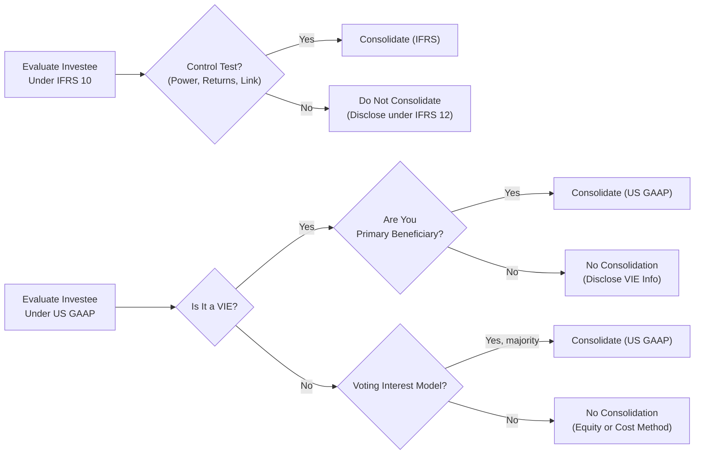

## Overview and Context

It’s funny—when I was first studying financial reporting standards years ago, I remember thinking, “Okay, IFRS 10, IFRS 11, IFRS 12, plus all the US GAAP codifications. How different can they really be? Surely the world’s standards should converge by now, right?” Well, so many of us have faced that moment of realization that, in practice, these standards do align to a large degree, yet they also have notable differences that can trigger some pretty big financial statement impacts. This section aims to guide you through the key similarities and differences among IFRS 10, IFRS 11, IFRS 12, and the corresponding US GAAP requirements, focusing on the definition of control, joint arrangements, joint ventures, and disclosure of interests in other entities.

Below, we’ll take you step by step through the critical aspects. We’ll also look at variable interest entities (VIEs), investment entity exceptions, pushdown accounting elections, and other topics that sometimes trip up advanced learners. By the end, you should have a stronger sense of how to interpret and consolidate financial statements across different frameworks—especially relevant for those of you who may have to explain these differences in the exam or in real-life cross-border transactions.

## IFRS 10: Consolidated Financial Statements vs. US GAAP (ASC 810)

Under IFRS 10, an entity is required to consolidate all investees it controls. “Control,” in IFRS 10, is broadly defined by three elements:
• Power over the investee (through voting rights or relevant activities).  
• Exposure, or rights, to variable returns from its involvement with the investee.  
• The ability to use power over the investee to affect the amount of the investor’s returns.

In contrast, US GAAP primarily uses ASC 810 (Consolidation) to address similar topics but sometimes splits them into different frameworks, especially regarding VIEs under ASC 810-10. Let’s break down a few of the big differences and similarities.

### Single Consolidation Model in IFRS 10

IFRS 10 features a single consolidation model with a focus on investor–investee relationships, anchored mostly around the concept of control. In IFRS, once you find that an investor has control—whether the entity is a typical equity structure or some complex special purpose arrangement (like a structured entity)—it is consolidated following the same backbone of principles.

### Multiple Approaches in US GAAP

US GAAP, on the other hand, takes a two-tier approach:  
1. Voting interest model (traditional approach).  
2. Variable interest entity model (applicable when certain risk or reward structures suggest an entity is, in effect, controlled even if voting control is not established through equity shares).

It’s not uncommon that the VIE rules under US GAAP lead to consolidation of an entity that might not be consolidated if one were to follow purely the IFRS 10 single model. That said, IFRS 10’s “structured entity” concept often ends in a similar result in practice, though the conceptual route might differ slightly.

### Investment Entity Exception

Under IFRS 10, if a parent qualifies as an investment entity (i.e., it obtains funds from investors to invest, measures and evaluates performance on a fair-value basis, etc.), it does not consolidate subsidiaries that are themselves investments. Instead, it measures those subsidiaries at fair value through profit or loss. US GAAP has a similar idea, but with narrower definitions and certain additional conditions. In some cases, an entity might meet IFRS 10’s definition of an investment entity yet fail to meet the US GAAP counterpart—this difference triggers distinct reporting outcomes.

### Example: Assessing Control with Preferred Shares

Imagine an investor holds preferred shares in a structured finance vehicle that do not carry voting rights but entitle the holder to 90% of the entity’s returns. Under IFRS 10, if the investor also can direct the activities that significantly influence returns (perhaps via a management agreement), it would consolidate. Under US GAAP, you’d check whether the entity is a VIE. If it’s determined that the entity is a VIE and the investor is the primary beneficiary (it’s absorbing the majority of expected losses or receiving the majority of the benefits), then consolidation is required. Notice how the underlying principle is similar— “who’s really in charge and at risk?”—but the steps differ.

## IFRS 11: Joint Arrangements vs. US GAAP (ASC 323, ASC 810)

IFRS 11 addresses how to account for entities under joint control, dividing them into:
• Joint Operations (proportionate consolidation).  
• Joint Ventures (equity method).

In US GAAP, joint ventures are typically accounted for using the equity method (ASC 323). But joint “operations,” in the IFRS sense, do not have a direct stand-alone counterpart in US GAAP. Instead, if a contract or legal arrangement confers direct rights to assets and obligations for liabilities to the venturers, US GAAP may still proceed with proportionate consolidation in certain, more limited circumstances—though US GAAP generally defaults to the equity method for joint ventures. Let’s unravel that a bit more.

### Joint Operations: IFRS 11

IFRS 11 calls for direct recognition of the joint operator’s share of assets, liabilities, revenue, and expenses in the financial statements. You’re, in effect, slicing up the statement of financial position and statement of comprehensive income line by line for your portion. In the exam context, you might see a question requiring you to calculate consolidated assets when one portion is from a joint operation accounted for proportionately.

### US GAAP: Equity Method Tends to Prevail

Under US GAAP, you typically record a single line item (equity method investment) for your stake in a joint venture and recognize your proportionate share of net income in one line on your income statement. Separate line-by-line consolidation for a “joint operation” scenario is relatively rare unless you truly meet the “undivided interest” concept or certain specialized industries (like oil and gas) that sometimes apply proportionate consolidation. This difference in approach can lead to significant ratio discrepancies—particularly in leverage or coverage metrics—between IFRS reporters and US GAAP reporters with the same ownership stakes in a joint arrangement.

## IFRS 12: Disclosure of Interests in Other Entities vs. US GAAP

IFRS 12 sets out comprehensive disclosure requirements for subsidiaries, joint ventures, associates, and unconsolidated structured entities. IFRS 12 disclosures are designed to paint a more transparent picture of:
• Nature of, and risks associated with, an entity’s interests in other entities.  
• Effects of those interests on the entity’s financial position and performance.  

In US GAAP, you’ll consult various sections (ASC 805 for business combinations, ASC 810 for consolidation, ASC 815 for derivative impacts, ASC 323 for equity method, etc.). The general objective—like IFRS 12—is consistent: provide clarity on how your investments might affect your risk and performance. But IFRS 12 tends to centralize these concepts, requiring one aggregated set of disclosures that can sometimes be more exhaustive than the topic-by-topic approach under US GAAP.

### Disclosures for Structured Entities (Investment Vehicles)

Under IFRS 12, companies must reveal key judgments made in determining whether they control a structured entity, plus any exposure to losses or rights to returns that arise from that structured entity. In US GAAP, you have the VIE footnote disclosures mandated by ASC 810, plus additional risk disclosures if derivatives or other off-balance-sheet instruments are involved. These are crucial for analyzing the potential risk in an investment structure, especially for private equity funds, hedge funds, or real estate investment vehicles that might or might not show up on a balance sheet.

### Example: Footnote Disclosures for an SPE

Consider a scenario where a parent invests in a special-purpose entity to securitize receivables. Under IFRS 12, the parent must disclose:
• The terms of the securitization.  
• Whether it consolidates the SPE (and why).  
• The risk exposures it retains (e.g., subordinated tranche, residual interest).  

Under US GAAP, you’d find a similar discussion in the variable interest entity note. If the parent is not the primary beneficiary, you might see an unconsolidated VIE footnote that details the maximum exposure to loss, terms of support, etc.

## Spotlight on Variable Interest Entities (VIEs) Versus Structured Entities

One of the more commonly tested areas is the alignment (or lack thereof) between IFRS 10/IFRS 12 structured entities and US GAAP variable interest entities. Although the frameworks aim to capture the same fundamental economic scenarios—where control is exercised through means other than traditional equity—the gating questions differ.

Under IFRS 10, you test for control by looking at:
• Purpose and design of the entity,  
• Rights that give you power over relevant activities,  
• Potential returns you receive from the entity (including negative returns).

Under US GAAP (VIE rules), consolidation is required if:
• The entity is a VIE (equity invested is insufficient, or equity holders lack typical decision rights).  
• The reporting entity is the primary beneficiary (it has power to direct the significant economic activities and is exposed to the majority of losses/benefits).

Practically, the results align more often than not—but watch out for borderline cases where IFRS says no consolidation while US GAAP demands it, or vice versa. If you see a test question presenting an entity that’s heavily financed by debt, lacking typical voting equity, and revealing a single major sponsor who reaps 80% of the returns, you should carefully evaluate both IFRS 10’s consolidation criteria (power, returns, link) and US GAAP’s VIE approach. Always remember that the exam might expect you to know precisely which standard drives the requirement to consolidate.

## Pushdown Accounting Elections

Under US GAAP, pushdown accounting is optional (under specific circumstances) within ASC 805. This means that when a controlling entity acquires a subsidiary, the subsidiary’s financial statements can reflect the new “step-up” in basis. Under IFRS, though, pushdown accounting is not explicitly permitted as a general rule. IFRS typically requires the subsidiary to maintain its historical carrying amounts. So, in cross-border contexts, a newly acquired subsidiary might show different asset values under IFRS consolidated reporting than it would under US GAAP consolidated reporting (if pushdown was elected). This difference can alter post-acquisition financial statement comparisons, especially for intangible assets like brand names, patents, or customer lists.

## Real-World Pitfalls and Best Practices

• Inconsistent Definition of Control: An entity might need consolidation under IFRS 10 but not under US GAAP’s VIE rules, or vice versa. Analysts often have to rework the numbers to ensure apples-to-apples comparisons.  
• Partial Ownership Arrangements: When multiple parties share control, ensure you know if it’s a joint venture (equity method) or a joint operation (proportionate consolidation). US GAAP might treat the same scenario differently by defaulting to the equity method.  
• Disclosure Overload vs. Omission Risks: IFRS 12 packs a major punch in terms of disclosures; US GAAP has a broader patchwork of standards. Failing to read footnotes carefully can hide big exposures.  
• Investment Entities: If a firm is labeled as an investment entity under IFRS 10 but not under the US GAAP guidance, you might see drastically different financial statement presentations.  
• Pushdown Accounting Surprise: Some acquisitions could significantly affect the subsidiary’s standalone statements under US GAAP if pushdown is elected, which is not an IFRS routine.

## Practical Example of Consolidation Differences

Let’s consider a cross-border company, Galaxy Holdings, which invests in a software start-up, CodeSpark. Galaxy Holdings obtains 60% of the voting rights but also issues a convertible debt instrument to external investors. The terms effectively transfer a portion of economic risk, though Galaxy can unilaterally decide CodeSpark’s strategic direction. Under IFRS 10, Galaxy would likely consolidate CodeSpark because it directly controls CodeSpark’s relevant activities and obtains the majority of variable returns. Under US GAAP, you might see a deeper analysis under ASC 810. If CodeSpark is not a VIE, then consolidation is straightforward via the voting interest model. If CodeSpark is determined to be a VIE, you proceed to see if Galaxy is the primary beneficiary. The ultimate outcome is typically consolidation as well, but the procedure to get there can differ.

Now add a twist: Suppose Galaxy is an investment management company that invests purely to hold these shares for capital appreciation. Under IFRS 10, if Galaxy meets the investment entity criteria, it might not consolidate CodeSpark at all—recording it at fair value instead. US GAAP might or might not reach the same conclusion, depending on whether Galaxy qualifies under the narrower “investment company” guidance. If Galaxy fails that test in US GAAP, it ends up consolidating CodeSpark. Hence, an investor analyzing Galaxy’s share price or credit risk under IFRS-based reports versus US GAAP-based might see very different balance sheets.

## Diagram: Aligning IFRS 10 and VIE Requirements

Below is a simplified diagram that might help you visualize how IFRS 10 and US GAAP’s VIE approach overlap. Don’t mind if it feels a bit condensed—my personal cheat sheet used to be three times this size!

## Exam Relevance

During the CFA Level III exam, scenario-based questions may require you to:
• Identify whether an entity should be consolidated under IFRS or US GAAP.  
• Recompute financial ratios if IFRS 10 or IFRS 11 is used, instead of US GAAP’s approach.  
• Interpret footnotes under IFRS 12 or US GAAP disclosures to reveal hidden liabilities or off-balance-sheet exposures.  

Given that consolidation policy directly affects leverage ratios, coverage ratios, and even profitability metrics, you will likely find a multi-part constructed response question trying to trip you up on an entity’s classification. Mastery here ensures you’re ready for real-world deals and the exam’s curveballs.

## Practical Tips for the Exam

• Practice “Definition of Control”: Have a quick mental flowchart for deciding whether IFRS 10’s concept of control is satisfied or if US GAAP’s “primary beneficiary” test for VIE applies.  
• Understand Joint Arrangements Thoroughly: The difference between a joint venture and a joint operation can sometimes be subtle in exam questions. IFRS 11 might require proportionate consolidation for a joint operation, leading to big changes in reported assets and liabilities.  
• Carefully Read Footnotes: IFRS 12 and US GAAP require extensive disclosures. Watch for special clauses, put options, or convertible instruments that give the investor the power to direct relevant activities.  
• Mind the Investment Entity Exception: If your question involves an investment fund or a private equity sponsor, check if the standard’s definitions of “investment entity” or “investment company” are triggered.  
• Quick Ratio Adjustments: The exam might ask you to recalculate debt-to-equity if an entity is consolidated or not. This is where memorizing the key differences in approach can save time.

## References for Further Study

• IFRS 10, IFRS 11, IFRS 12 – Official standards available at IFRS Foundation’s website.  
• US GAAP references: ASC 805 (Business Combinations), ASC 810 (Consolidation), ASC 323 (Equity Method), ASC 815, and related subtopics on VIEs.  
• KPMG’s “Comparison of IFRS and US GAAP” is an excellent resource for a high-level overview.  
• PricewaterhouseCoopers’ “IFRS and US GAAP: similarities and differences” offers deeper dives into practical case studies.

----

## Test Your Knowledge on IFRS 10, IFRS 11, IFRS 12 Alignment with US GAAP



### In IFRS 10, which factor is not explicitly part of determining control over an investee?

- [ ] Exposure or rights to variable returns  
- [ ] The ability to use power to affect returns  
- [x] Preferred dividend payment requirements  
- [ ] Power over relevant activities  

> **Explanation:** IFRS 10 focuses on (1) power over the investee’s relevant activities, (2) exposure or rights to variable returns, and (3) the ability to use that power to affect returns. Preferred dividend payment requirements alone do not directly determine control.

### Which of the following is a key outcome of IFRS 11’s treatment of joint operations?

- [x] Proportionate consolidation is required for joint operations  
- [ ] No disclosure is required for joint operations  
- [ ] All joint operations must use the equity method  
- [ ] Pushdown accounting is mandated for joint operations  

> **Explanation:** IFRS 11 prescribes that joint operations must generally be accounted for through proportionate consolidation, where the investor recognizes its share of each asset, liability, revenue, and expense.

### Under US GAAP, which statement best describes the treatment of a newly acquired subsidiary under pushdown accounting?

- [x] The subsidiary itself may elect to revalue its assets/liabilities to fair value  
- [ ] The parent must eliminate all intangible assets in the subsidiary’s financials  
- [ ] The subsidiary and parent must maintain historical cost of acquired assets  
- [ ] No revaluation adjustments can flow through the subsidiary’s books  

> **Explanation:** In US GAAP, pushdown accounting allows the acquired subsidiary to reflect the new step-up basis from the acquisition. However, IFRS does not generally allow this approach.

### A structured entity that lacks traditional voting equity but confers most of its returns to a single sponsor is assessed under IFRS 10. If the sponsor has the power to direct relevant activities, what is the likely outcome?

- [x] The sponsor will consolidate the entity  
- [ ] The sponsor will never consolidate since it lacks voting rights  
- [ ] The sponsor will treat it as a joint venture  
- [ ] The sponsor must apply pushdown accounting  

> **Explanation:** IFRS 10 focuses on power over relevant activities, exposure to variable returns, and the ability to use that power to affect those returns. In a structured entity scenario, the sponsor generally consolidates if these criteria are met, irrespective of traditional voting rights.

### Under IFRS 11, when is the equity method required?

- [x] For joint ventures  
- [ ] For joint operations  
- [x] For associates  
- [ ] For all subsidiaries  

> **Explanation:** IFRS 11 uses the equity method for joint ventures, while IFRS requires the equity method for associates under IAS 28 (not a direct IFRS 11 requirement but linked in practice). Joint operations apply proportionate consolidation.

### What is one potential drawback in comparing IFRS-based financial statements to US GAAP-based financial statements regarding joint arrangements?

- [x] Differences in the use of proportionate consolidation can alter leverage ratios  
- [ ] Both IFRS and US GAAP always require the equity method  
- [ ] IFRS is more permissive in consolidating minority-owned subsidiaries  
- [ ] US GAAP does not allow the equity method of accounting  

> **Explanation:** Joint operations (IFRS 11) can employ proportionate consolidation under IFRS, whereas US GAAP often relies on the equity method. This difference can significantly affect assets, liabilities, and thus financial ratios.

### Under the US GAAP variable interest entity framework, which of the following conditions triggers consolidation?

- [x] The reporting entity is the primary beneficiary of the VIE  
- [ ] The VIE has no assets  
- [x] The reporting entity absorbs the majority of expected losses or benefits  
- [ ] Equity owners have a majority voting stake  

> **Explanation:** Under US GAAP, a key step in VIE assessment is determining whether the reporting entity is the primary beneficiary. This typically means it both (1) has the power to direct the VIE’s significant activities and (2) absorbs the majority of the VIE’s variability in returns.

### Which disclosure approach is emphasized in IFRS 12 but spread out under various ASC sections in US GAAP?

- [x] A single, consolidated disclosure package for interests in other entities  
- [ ] No disclosures for immaterial structured entities  
- [ ] Disclosure of intangible asset impairment losses  
- [ ] Disclosure of pushdown accounting elections  

> **Explanation:** IFRS 12 mandates comprehensive, centralized disclosures about investments in subsidiaries, joint ventures, associates, and structured entities. In US GAAP, these are generally found in multiple ASC sections rather than in a single, unified standard.

### When an investment entity exemption applies under IFRS 10, what is the most likely accounting treatment for majority-owned subsidiaries?

- [x] They are measured at fair value through profit or loss  
- [ ] They are fully consolidated  
- [ ] They are recognized through proportionate consolidation  
- [ ] They are recorded via the equity method  

> **Explanation:** IFRS 10’s investment entity exemption requires the parent to measure substantially all investments at fair value through profit or loss, rather than fully consolidating them.

### True or False: US GAAP and IFRS rules for consolidation can never lead to the same conclusion on whether an entity must be consolidated.

- [x] True  
- [ ] False  

> **Explanation:** While often the rules do converge in practice, there are scenarios—particularly for borderline structured entities, VIEs, and certain investment vehicles—where the two frameworks reach different consolidation outcomes. So yes, it can happen.


