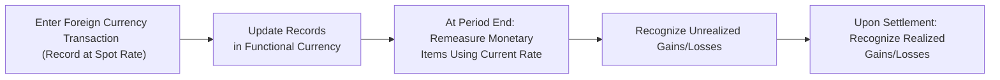

## Overview and Key Concepts

Have you ever traveled abroad with a bunch of your home currency, only to realize that buying power changes the moment you land? Or maybe you used your credit card overseas and gasped at the final conversion rate on your statement. That’s essentially foreign currency transaction risk. Companies dealing in multiple currencies face that risk every day—but at a far bigger scale than a quick vacation purchase. In corporate finance, it’s crucial to know how to measure and record these transactions properly. 

Under accounting standards like IAS 21 (IFRS) and ASC 830 (US GAAP), foreign currency transactions must be recorded and then remeasured into the entity’s functional currency. Any differences—both realized and unrealized—can show up in profit or loss, potentially impacting reported results. This section dives into how these standards work, why consistency and clarity matter, and some best practices to keep in mind for exam day (and the real world).

## Spot Rates, Functional Currency, and Initial Recognition

When an entity enters into a transaction denominated in a currency other than its functional currency, we record it using the spot exchange rate at the transaction date. Functional currency is basically the currency of the primary economic environment in which the entity operates—the currency that influences sales prices, labor costs, and other core financial elements. 

For instance, if you’re based in the United States, and your functional currency is USD, but you purchase inventory from a supplier in Europe with an invoice in EUR, you’ll translate that euro invoice into USD using the spot rate on the day the purchase is recognized.

## Monetary vs. Non-Monetary Items

• Monetary items: Amounts that can be received or paid in a fixed or determinable number of currency units (e.g., trade receivables, trade payables, loans).  
• Non-monetary items: Items that do not give rise to a claim for (or obligation to deliver) a fixed or determinable amount of money (e.g., inventory carried at cost, intangible assets at cost, PPE at cost).

Accounting frameworks require that, at each subsequent reporting date, monetary items must be remeasured to the current exchange rate. If the position remains open—unsettled—at the date of the financial statements, the difference between the new measurement and the prior measurement is reported as a foreign currency gain or loss in the income statement. Non-monetary items measured at historical cost keep their historical rate, so exchange rate changes don’t directly affect their carrying amounts. But if non-monetary items are carried at fair value, you would then use the exchange rate on the date that fair value is determined.

## Realized vs. Unrealized Gains or Losses

It’s easy to blur the line between realized and unrealized. Realized gains or losses occur when the transaction is settled—for instance, when you pay off that foreign invoice or you receive the foreign currency from a customer. Unrealized gains or losses pop up when you revalue your still-open monetary balances at the end-of-period exchange rate. These unrealized differences can swing your income statement from one quarter to the next if exchange rates fluctuate frequently.

A quick anecdote: I once worked with a tech company that had major euro-denominated receivables. They were thrilled one month because the euro had strengthened, making their future dollar proceeds bigger in USD terms. But by the next quarter, the rates went in the opposite direction, so most of that ephemeral gain evaporated—reflected in a negative reversal in the next set of unrealized positions. That’s a classic illustration of how foreign currency remeasurement can shift earnings from one reporting period to another.

## Example of Remeasurement

Imagine a U.S. company purchases inventory from a European supplier at €10,000. The spot rate on the transaction date is USD 1.20 per EUR (so the purchase is recorded as $12,000). At period-end, that liability remains unpaid, and the new exchange rate is USD 1.25 per EUR. The liability is now measured at $12,500, creating an unrealized foreign exchange loss of $500 for that period. When the invoice is finally paid—say at an exchange rate of USD 1.22 per EUR—an additional realized gain or loss will manifest, based on the difference between the last time it was recorded in the books ($12,500) and the new settlement amount ($12,200).

Below is a short Python snippet showing how one might simulate this effect:

```python
spot_rate_at_transaction = 1.20  # USD/EUR on transaction date
invoice_amount_eur = 10000

initial_recording_usd = invoice_amount_eur * spot_rate_at_transaction
print(f"Initial USD value recorded: {initial_recording_usd}")

spot_rate_period_end = 1.25
period_end_value_usd = invoice_amount_eur * spot_rate_period_end
unrealized_fx_difference = period_end_value_usd - initial_recording_usd
print(f"Unrealized FX difference at period end: {unrealized_fx_difference}")
```

Try it out on your own to see how the numbers line up—this can be a neat way to train your mind.

## Visualizing the Process

The steps for handling foreign currency transactions can be laid out in a process flow as follows:



Just remember this flow: Record → Remeasure → Recognize Gains/Losses. Repeat as needed until settlement.

## IFRS vs. US GAAP: Main Considerations

Though IAS 21 (IFRS) and ASC 830 (US GAAP) share a lot of common ground, especially regarding remeasurement of monetary items at period-end, there are occasional nuances to watch:

• Certain definitions and terms may vary slightly (e.g., functional currency determination criteria).  
• Disclosures might differ in level of detail under IFRS vs. US GAAP—particularly regarding derivative hedging instruments.  

In practice, these differences usually aren’t huge for basic transactions. But for exam purposes, do understand that IFRS tends to emphasize the “functional currency” concept heavily, while US GAAP does as well but sometimes phrases it differently in underlying guidance.

## Hedging and Risk Management

Many multinational companies use forward contracts or other derivatives to stabilize or mitigate foreign exchange volatility. For example, if you know you’ll have a euro payment in three months, you might lock in a forward exchange rate to remove the guesswork on how many dollars you’ll need. When a company does this, there’s a second layer of accounting for the hedging instruments themselves, which can be designated as fair value hedges, cash flow hedges, or net investment hedges—each demanding unique accounting treatment. 

Though hedge accounting is an extensive topic beyond just transaction-level foreign currency risk, it’s worth noting that if a hedge effectively neutralizes your currency exposure, you can reduce earnings volatility. That said, hedge ineffectiveness sometimes creeps in, which must be recorded in profit or loss.

## Common Pitfalls and Best Practices

• Using Spot vs. Average Rates: While we use the spot rate for the transaction date, sometimes companies try to use average exchange rates for income statement items, especially if transactions happen daily. But key events must still be accounted for at the correct spot rates.  
• Maintaining Clear Historical Cost Records: For non-monetary items carried at historical cost, rummaging around for the original rate can be a pain if not tracked properly.  
• Transparent Reporting: Some entities keep foreign exchange gains and losses lumped into “Other operating income” or “Financial income/expense.” Separating them provides users with better insight into what’s truly going on operationally vs. what’s simply an effect of currency fluctuations.

## Extended Real-World Case

Let’s say a global retailer based in Canada sells high-end winter gear to a U.S. customer, denominated in USD. Although the retailer’s functional currency is CAD, monthly or weekly sales can fluctuate widely in CAD terms as the USD/CAD exchange rate bounces around. It might adopt a policy to hedge 50% of all expected monthly USD receipts once a month in the forward market. If done effectively, the unpredictability of exchange rate changes is reduced, smoothing reported net income. Of course, if the exchange rate swings in a favorable direction after you’ve locked in your hedge, you may have an opportunity cost, but at least you’ve avoided the rollercoaster.

## Exam Relevance and Final Tips

Foreign currency accounting is all about detail and consistency—two areas that CFA examiners love to probe. Keep the following in mind:

• Precisely identify monetary vs. non-monetary items.  
• Understand which exchange rate to use and when.  
• Be able to distinguish realized from unrealized gains or losses—important for both the income statement and assessing the entity’s performance.  
• If the question references hedging, know that derivatives themselves carry separate accounting treatments (beyond the scope of this single section, but definitely relevant for advanced questions).

When you see a CFA-style item set offering data on exchange rates at transaction date, period-end, and settlement, it’s usually a clue for you to calculate remeasurement differences. Stay alert for any references to the functional currency. Finally, watch out for any sign that the question might be testing your knowledge of IFRS vs. US GAAP remeasurement differences.  

## References and Further Reading

• IAS 21: The Effects of Changes in Foreign Exchange Rates (IFRS)  
• ASC 830: Foreign Currency Matters (US GAAP)  
• IFRS Foundation (www.ifrs.org)  
• FASB (www.fasb.org)  
• “International Accounting” by Frederick D. Choi and Gary K. Meek  

Stick to these references for a deeper dive, especially if you’re working on complex hedging scenarios or advanced consolidations involving multiple currencies.

---

## Practice Questions: Foreign Currency Transaction Accounting



### A company's functional currency is CAD. It purchases machinery denominated in USD. At transaction date, the CAD/USD spot rate is 1.30, and the cost in USD is 50,000. What amount in CAD is initially recorded for the machinery?

- [x] 65,000
- [ ] 50,000
- [ ] 38,462
- [ ] 78,000

> **Explanation:** Multiply the USD amount (50,000) by the spot rate (1.30 CAD/USD) = 65,000 CAD.  

### At year-end, the USD-based payable for the machinery remains unpaid, and the new spot rate is 1.25 CAD/USD. Which of the following best describes the effect on the Canadian company's financial statements?

- [x] A foreign exchange gain in the income statement due to the payable being revalued at a lower CAD cost.
- [ ] No impact, since it's a non-monetary item.
- [ ] A foreign exchange loss in comprehensive income.
- [ ] A prior-period adjustment is needed.

> **Explanation:** A USD-denominated payable is a monetary liability. It gets remeasured at the new lower rate, resulting in a gain because fewer CAD are needed to settle the liability.  

### Which of the following typically does NOT get remeasured at the period-end exchange rate?

- [ ] Accounts receivable denominated in a foreign currency.
- [ ] A foreign currency loan payable.
- [x] Land carried at historical cost.
- [ ] A bond investment payable in a foreign currency.

> **Explanation:** Land is a non-monetary item if carried at cost, so its carrying amount is not adjusted for exchange rate changes at period end.  

### A realized foreign exchange gain arises when:

- [ ] A forward exchange contract is entered into.
- [x] A foreign currency transaction is settled.
- [ ] The currency exchange rate changes after the balance sheet date.
- [ ] The functional currency changes within the same reporting period.

> **Explanation:** Realized gains or losses occur upon the actual settlement of the foreign currency-denominated transaction.  

### Under IFRS, foreign currency transactions should initially be recorded using:

- [x] The spot exchange rate on the transaction date.
- [ ] An average rate for the reporting period.
- [ ] Any forward rate agreed in a commercial contract.
- [ ] The rate at the date of payment if the transaction will be settled within 30 days.

> **Explanation:** IAS 21 says transactions are recorded using the exchange rate at the date of the transaction (the spot rate).  

### If a company’s functional currency is EUR, but the transaction currency for a sale is USD, which statement is correct regarding recognition of revenue and cost of sales?

- [x] Both revenue and cost of sales should be translated into EUR at their respective transaction date rates.
- [ ] Recognize the revenue in USD and cost of sales in EUR.
- [ ] Wait until settlement to determine the final revenue figure in EUR.
- [ ] Recognize revenue at the average monthly rate.

> **Explanation:** Each component must be translated into the functional currency (EUR) at the date of each transaction.  

### A firm in Singapore (functional currency: SGD) sells merchandise to a client in Japan, denominated in JPY. The invoice remains unpaid at period end. How is this transaction reported?

- [x] The sales are recorded at the spot rate on the date of sale; the unpaid receivable is remeasured at the period-end spot rate.
- [ ] Both the sale and the receivable are measured at the date of sale and never revalued until settlement.
- [ ] Recognize the sale at the average monthly rate and do not remeasure the receivable.
- [ ] Defer any recognition until the invoice is paid because the currency is foreign.

> **Explanation:** Monetary items (the receivable) are remeasured at period-end. Sales revenue is recognized initially at the transaction date rate.  

### Under ASC 830 (US GAAP), an exchange difference arising from the remeasurement of a trade payable denominated in a foreign currency is recognized:

- [x] In the income statement in the period it arises.
- [ ] As an adjustment to retained earnings.
- [ ] Directly in accumulated other comprehensive income.
- [ ] Only when it qualifies for hedge accounting.

> **Explanation:** Remeasurement gains or losses on monetary items generally go to profit or loss under US GAAP in the period incurred.  

### A foreign currency gain or loss is considered unrealized when:

- [ ] It appears in the statement of comprehensive income instead of profit or loss.
- [x] The underlying transaction remains open at the balance sheet date.
- [ ] The currency transaction occurred in a country without a stable exchange rate.
- [ ] It arises from translation of non-monetary items at fair value.

> **Explanation:** An unrealized gain or loss arises from remeasuring open monetary positions at period end, rather than settling them.  

### True or False: A forward exchange contract to hedge a foreign currency payable may eliminate all volatility in reported foreign exchange gains or losses.

- [x] True
- [ ] False

> **Explanation:** A properly designated forward contract can eliminate or significantly reduce volatility in foreign currency gains or losses, assuming it is effective and perfectly offsets the underlying exposure.  


