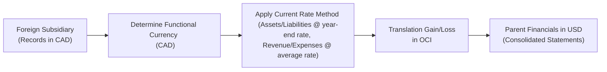

## Overview and Key Concepts

If you’ve ever traveled abroad and tried to figure out how much something costs in your local currency, you’ve already tackled a mini-version of foreign currency translation—albeit in a very casual sense. In the corporate world, though, the reality is more complex. When a multinational company prepares consolidated financial statements, it must translate the financials of all foreign subsidiaries from each subsidiary’s functional currency into the parent’s presentation currency. Getting this right under IFRS (IAS 21) and US GAAP (ASC 830) is no small task. But don’t worry, we’ll walk through each major step, highlight the pitfalls, and give you some helpful examples along the way.

Before diving deeper, here are some essentials:
• Each foreign operation typically has a functional currency—the currency of the primary economic environment in which it operates.  
• The parent company usually has a different presentation currency for its consolidated financial statements.  
• The choice of translation method (Current Rate Method vs. Temporal Method) heavily depends on the determination of each entity’s functional currency, as well as any special conditions like hyperinflationary economies.  

It’s a mouthful, I know. I remember being completely mystified when I first tried to reconcile how, say, a South American subsidiary’s sales in Argentine pesos could be consolidated with a parent based in Japan using Japanese yen as the presentation currency. Honestly, the translation approach felt complicated at first. But once you see the guidelines spelled out and practice a few examples, it starts to make more sense.

## The Current Rate Method

### When to Use It
Under both IFRS and US GAAP, the Current Rate Method (sometimes called the Translation Method) is used when the foreign entity’s functional currency (the one it really operates in) is different from the parent’s functional (or reporting) currency. In other words, the foreign entity is somewhat independent in its day-to-day economic environment. Think of a French subsidiary of a U.S. company that sells mostly in euros, pays employees in euros, finances operations with local euro-based debt—clearly, it’s operating with the euro as its functional currency, but the parent may present its group financials in U.S. dollars.

### How It Works
1. Assets and Liabilities:  
   All assets and liabilities of the foreign subsidiary are translated at the current or “spot” exchange rate as of the balance sheet date.  
2. Income Statement Items:  
   Typically translated at the average exchange rate for the reporting period. If you want to be precise, you might use the actual exchange rate on the transaction date for big or unique transactions, but an average rate is a solid proxy in most cases.  
3. Equity Items:  
   Common stock, additional paid-in capital, and other equity items (except retained earnings) are translated at the historical exchange rate (the rate in effect on the date those equity items were issued or arose). Retained earnings become a bit trickier because they represent accumulated net income over multiple periods, each with its own exchange rate.  
4. Recognition of Translation Adjustments:  
   Under the Current Rate Method, the resulting gains or losses from re-expressing the subsidiary’s assets and liabilities at the current rate go to Other Comprehensive Income (OCI). There they remain—outside of net income—until a triggering event (e.g., sale or liquidation of the subsidiary) might require reclassification to the income statement.

People often ask, “Why do we stick the gains or losses in OCI? Isn’t that hiding them from net income?” Well, the short answer is that those gains or losses might never be realized in cash. They reflect changes in exchange rates that can move up or down, so IFRS and US GAAP generally say: keep them in the equity bucket for now.  

Let’s illustrate with a streamlined example:

• Parent’s Reporting Currency: US dollars (USD)  
• Subsidiary’s Functional Currency: Euros (EUR)  
• Exchange Rates:  
   – Year-end: 1 EUR = 1.20 USD  
   – Average for the year: 1 EUR = 1.15 USD  

Subsidiary’s French Balance Sheet (EUR in millions)  
• Assets = 100 EUR million  
• Liabilities = 40 EUR million  
• Equity = 60 EUR million  

Using the Current Rate Method:  
• Translate assets: 100 * 1.20 = USD 120 million  
• Translate liabilities: 40 * 1.20 = USD 48 million  
• Equity:  
  – Historical for common stock: Suppose that stock was issued back when 1 EUR = 1.10 USD. If that portion of equity was EUR 10 million at issuance, that translates to USD 11 million.  
  – The rest of equity (including retained earnings) will complete the puzzle so total USD equity lines up with total USD assets minus total USD liabilities.  
• The difference in translation goes to the cumulative translation adjustment (CTA) in OCI.

## The Temporal Method

### When to Use It
If the foreign entity’s functional currency is the same as the parent’s currency, or if local records aren’t kept in what IFRS/US GAAP define as the functional currency, the Temporal Method is typically used. Also, under US GAAP, hyperinflationary economies (generally meaning a cumulative inflation rate of around 100% over three years) require remeasurement under the Temporal Method.

Why? Because in a hyperinflationary economy, the local currency faces such dramatic losses in value that it doesn’t reflect a stable measure of purchasing power. The idea is that certain assets and liabilities—like cash or receivables—should be updated to the current rate to reflect their “real” value.

### How It Works
1. Monetary Assets and Liabilities:  
   Monetary items such as cash, accounts receivable, and bonds payable are remeasured at the current exchange rate on the balance sheet date.  
2. Non-Monetary Assets and Liabilities:  
   Those recorded at historical cost—like property, plant, and equipment—are remeasured at the exchange rate on the dates the assets were acquired or the liabilities incurred (the historical rate).  
3. Income Statement Items:  
   • Revenue and most expenses are translated at the average exchange rate for the period.  
   • However, expenses related to non-monetary items (e.g., depreciation of fixed assets, amortization of intangibles) are translated at the historical rates applicable to those assets.  
4. Treatment of Remeasurement Gains or Losses:  
   Any resulting gain or loss from remeasurement is recognized immediately in net income on the income statement. This can introduce volatility in reported earnings whenever exchange rates significantly fluctuate.

A quick example:  
Imagine a foreign subsidiary that keeps local books in Argentinian pesos, but the parent’s functional currency is the U.S. dollar (USD). If the local environment is considered hyperinflationary, or if management concludes the functional currency is actually the U.S. dollar, the subsidiary’s statements must be remeasured under the Temporal Method. If the subsidiary has a building on its books at ARS 100 million from years ago, and back then the rate was 1 ARS = 0.70 USD, you’d continue using 0.70 USD for that building’s historical cost portion. Meanwhile, if the subsidiary has ARS 20 million in cash at year-end and the year-end rate is 1 ARS = 0.50 USD, we remeasure that cash at USD 10 million. The difference in total net assets from remeasurement flows straight into net income (not OCI).

## Comparing the Two Methods

A common question: “What’s the big difference in financial outcomes between Current Rate vs. Temporal?” Well, beyond the difference in which exchange rates you use for certain line items, your translation adjustments end up in different spots:
• Current Rate Method: Gains and losses land in equity (through OCI).  
• Temporal Method: Gains and losses hit the income statement in the period they occur.  

That can create some confusion in ratio analysis, too. For instance, if remeasurement losses go directly to net income under the Temporal Method, the subsidiary’s profitability ratios might look worse compared to a scenario where you use the Current Rate Method and push the adjustments to OCI.

Here’s a quick table that summarizes key contrasts:

|                    | Current Rate Method                              | Temporal Method                           |
|--------------------|--------------------------------------------------|-------------------------------------------|
| Mostly Used When   | Different functional currency than the parent    | Same functional currency as the parent, or hyperinflationary environment |
| Assets & Liabilities | Translate all at current (year-end) rate          | Monetary at current rate; non-monetary at historical rates |
| Income Statement Items | Translate at average rate generally              | Mostly average rate, but cost of goods sold, depreciation use historical rates |
| Exposure           | Net investment in foreign operations             | Net monetary assets or net monetary liabilities |
| Gains/Losses       | Reported in OCI (equity section)                 | Reported in Earnings (income statement)  |

## Impact on Consolidated Equity and Ratios

Translation can significantly affect shareholders’ equity—particularly if the foreign operations are large. Under the Current Rate Method, a big currency depreciation might lower the translated assets and liabilities, and the cumulative translation adjustment in OCI would reflect this. Under the Temporal Method, part of that currency movement would flow directly to the income statement.

This can sway solvency ratios, too. For instance, if your translation causes a big drop in translated assets, your debt-to-equity ratio might rise, or your return on assets (ROA) might jump. As a savvy analyst (and future CFA charterholder!), it’s crucial to isolate these translation impacts when assessing a company’s performance.

## Functional Currency Choice

One area that can sometimes lead to confusion—or even manipulation—is which currency management designates as the “functional currency.” According to IFRS (IAS 21) and US GAAP (ASC 830), the functional currency selection hinges on factors like:
• The currency that mainly influences sales prices for goods and services.  
• The currency of the country whose competitive forces and regulations determine pricing.  
• The currency that mainly influences labor, materials, and other costs.  
• The currency in which most financing and receipts from operating activities are denominated.  

In principle, the functional currency is supposed to reflect the real economic environment of that entity. But occasionally, management might be tempted to “choose” a functional currency that yields more favorable translations. Regulators and auditors keep an eye out for such shenanigans, but it’s important for analysts to be attuned to it as well.

## Practical Example and Mermaid Diagram

Let’s piece together a simplified scenario using a short flow diagram to illustrate how a foreign entity’s statements get converted into the parent’s presentation currency.

Imagine you’re analyzing ACME Global, Inc. (parent in USD), which has a subsidiary in Canada whose functional currency is CAD. The subsidiary’s income statement and balance sheet are kept in CAD. At year-end, ACME must consolidate the Canadian subsidiary’s financials into USD. The steps:

1. Identify the functional currency of the foreign entity (here, CAD).  
2. Decide whether to use the Current Rate or Temporal Method (since CAD is different from USD and business is self-contained in Canada, Current Rate is used).  
3. Translate the Canadian financials into USD.  
4. Consolidate and record any translation adjustments (in OCI for the Current Rate Method).

Below is a simple flow diagram using Mermaid.js:

Notice how translation adjustments—arising from exchange rate differences—go to OCI under the Current Rate Method. If this were a Temporal Method scenario, that box would read “Translation Gain/Loss in Income Statement.”

## Common Pitfalls

• Mixing “Average Rate” and “Current Rate”: Sometimes, you’ll see folks accidentally translating the entire income statement at the year-end rate, which is incorrect under either method (unless the rate was relatively constant all year).  
• Overlooking Historical Rates: Depreciation, cost of goods sold, and other expenses tied to non-monetary assets or inventory should use historical rates if you’re using the Temporal Method.  
• Missing Disclosures: IFRS and US GAAP require explicit notes explaining the foreign currency translation methods used. Failing to study those disclosures can lead to misunderstanding the results.  
• Hyperinflationary Economies: IFRS has specialized guidelines (IAS 29) separate from IAS 21, while US GAAP triggers the Temporal Method if highly inflationary conditions are present. Don’t forget to check this detail when analyzing emerging markets.

## Lessons from Practice

When I was working on consolidations for a multinational conglomerate, we once had a 10% year-over-year swing in net income purely because of exchange rate changes under the Temporal Method for a hyperinflationary subsidiary. The operating performance was actually stable, but the remeasurement losses hammered reported earnings. If you didn’t look at the footnotes, you might think we had a terrible year. The key was clarifying to stakeholders that underlying operations were fine; the currency just took a dive.

## Exam Relevance and Best Practices for Analysis

From a CFA exam perspective, you can expect to see item sets that give you exchange rates at different points in time, some data about subsidiary operations, and then ask you to compute the effect on consolidated statements under either method. They might also test your conceptual understanding: “Under which method do translation adjustments go to net income vs. OCI?” or “How does a change in exchange rates affect sales or equity?”

A solid approach to these questions:
1. Identify the functional currency.  
2. Determine the correct translation method.  
3. Translate step by step.  
4. Pay attention to where gains/losses go (OCI vs. net income).  
5. Re-check your average vs. historical vs. current rate usage.  

Keep the footnotes, disclosures, and IFRS/US GAAP differences in mind. In real-world practice, you’d also look at management commentary and decide if you agree with the classification of the functional currency, ensuring no manipulation or playful “functional currency” designations are at work.

## Conclusion

Translating foreign currency financial statements is both a technical exercise and an art. You gather the data—exchange rates, historical costs, and so forth—but how you put it all together depends critically on whether you’re using the Current Rate Method or the Temporal Method. As you progress in your CFA journey, keep in mind that translation can obscure the true operational performance, especially when big swings in exchange rates occur. Always examine disclosures and footnotes carefully to see how these translations might distort key metrics or paint an overly rosy or grim picture.

You’ve got this! Once you’re comfortable with the fundamentals of identifying the functional currency, picking the right translation approach, and knowing exactly where the gains or losses end up (OCI vs. net income), you’ll be ready for the real-world challenges and any exam questions thrown your way.

## Additional References

• IAS 21: The Effects of Changes in Foreign Exchange Rates (IFRS).  
• ASC 830: Foreign Currency Matters (US GAAP).  
• IAS 29: Financial Reporting in Hyperinflationary Economies (IFRS guidance).  
• “Advanced Accounting,” Debra Jeter and Paul Chaney—Chapters on consolidated financial statements and foreign currency translation.  
• Professional publications from the Big Four accounting firms (Deloitte, EY, KPMG, PwC) for detailed application notes.

## Final Exam Tips

• Practice short numeric examples: This helps you keep track of which exchange rates to use for which accounts.  
• Watch for hyperinflation: Under US GAAP, that triggers the Temporal Method. Under IFRS, you might see additional inflation-related adjustments (IAS 29).  
• Check footnotes for “Functional Currency” choice: This can change everything about how items get translated.  
• Understand the impact on ratios: Keep separate track of translation adjustments so you don’t get confused by big currency swings in reported results.  

## Test Your Knowledge: Foreign Currency Translation and Consolidation



### Which of the following statements about the Current Rate Method is most accurate?
- [x] Assets and liabilities are translated at the exchange rate prevailing on the balance sheet date.
- [ ] All balance sheet items are translated at a historical exchange rate.
- [ ] Depreciation is translated at historical exchange rates.
- [ ] Translation gains or losses are reported in net income.

> **Explanation:** With the Current Rate Method, assets and liabilities use the current (year-end) exchange rate, and translation gains or losses are charged to OCI, not net income.

### Under the Temporal Method, which items are typically translated using the historical exchange rate?
- [x] Non-monetary assets and liabilities such as inventories and fixed assets.
- [ ] Cash and short-term investments.
- [ ] Accounts payable and accounts receivable.
- [ ] Monetary liabilities like bonds payable.

> **Explanation:** Under the Temporal Method, non-monetary items (e.g., PP&E, inventory at cost, intangible assets) are measured at historical exchange rates because they are carried at historical cost.

### Where are translation gains and losses recorded when using the Temporal Method?
- [x] In the income statement.
- [ ] In Other Comprehensive Income (OCI).
- [ ] Amortized over the life of the related asset.
- [ ] Directly adjusted to retained earnings.

> **Explanation:** The Temporal Method takes remeasurement gains or losses straight into net income. By contrast, the Current Rate Method places translation adjustments in OCI.

### For an entity operating in a hyperinflationary economy under US GAAP, which method is typically used for foreign currency translation?
- [x] Temporal Method.
- [ ] Current Rate Method.
- [ ] Fair Value Method.
- [ ] There is no specific method required by US GAAP.

> **Explanation:** US GAAP requires the use of the Temporal Method for entities in hyperinflationary economies, recognizing the severe volatility in currency values.

### When is the Current Rate Method most appropriately applied to a foreign subsidiary?
- [x] When the subsidiary’s functional currency is different from the parent’s currency.
- [ ] When the subsidiary’s financial statements are maintained in the parent’s currency.
- [x] When the subsidiary’s local currency is used for most business transactions.
- [ ] When the global economy experiences disinflation.

> **Explanation:** The Current Rate Method generally applies to foreign entities that are economically self-contained, where the local currency is their functional currency.

### Under IFRS, how is the functional currency determined for a foreign operation?
- [x] Based on the currency influencing key operating activities (pricing, costs, financing).
- [ ] Decided arbitrarily by management for convenience.
- [ ] Defined strictly as the local currency of the country where the subsidiary is registered.
- [ ] It never changes once established at inception.

> **Explanation:** IFRS (IAS 21) looks at various factors, including the currency that influences sales prices, competitive forces, and costs, to identify the functional currency.

### Which item is typically translated at the average exchange rate under the Current Rate Method?
- [x] Income statement items such as sales and operating expenses.
- [ ] All balance sheet items like long-term debt.
- [x] Depreciation of tangible fixed assets.
- [ ] Common stock.

> **Explanation:** Revenues and expenses are generally translated at the average rate for the reporting period. Common stock, on the other hand, is translated at historical rates.

### Under the Temporal Method, which of the following would be measured at the current exchange rate?
- [x] Monetary assets like cash, accounts receivable, and monetary liabilities.
- [ ] Intangible assets based on historical cost.
- [ ] Inventory measured at cost.
- [ ] Land measured at historical cost.

> **Explanation:** Under Temporal, monetary items (like cash, A/R, and A/P) use current rates; non-monetary items rely on historical rates.

### Which best describes accrued translation gains or losses under the Current Rate Method?
- [x] They are recorded in the equity section within Other Comprehensive Income.
- [ ] They are recorded as part of earnings in the period they arise.
- [ ] They are never reported under IFRS or US GAAP.
- [ ] They are recognized only if the subsidiary is dissolved.

> **Explanation:** The Current Rate Method defers these translation differences to OCI until a disposal or liquidation event triggers reclassification.

### True or False: Changes in exchange rates under the Temporal Method can directly affect net income in each accounting period.
- [x] True
- [ ] False

> **Explanation:** Because the Temporal Method flows remeasurement gains or losses directly to the income statement, any fluctuation in exchange rates can immediately impact net income.


