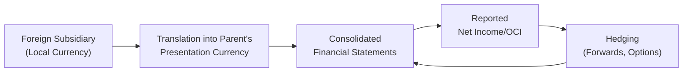

## Introduction

Have you ever picked up a multinational’s annual report and wondered, “Wait, are these massive revenue swings really because the company is suddenly more efficient, or did exchange rates just change?” I remember, early in my career, being absolutely stunned when a client’s reported earnings soared—turns out nearly half the gain was from a favorable shift in currency exchange rates. Trust me, it’s easy to misinterpret these numbers if you’re not used to the nuances of exchange-rate impacts.

In this section, we unravel how foreign exchange (FX) fluctuations affect a firm’s performance and reported numbers, and why that effect often prompts you (and many analysts) to break out a calculator to figure out the “real” performance. Our focus is on translation exposures that arise in the consolidation of foreign subsidiaries, as well as transaction exposures related to actual cash flows. By the time we finish, you should be able to separate operational improvements from mere currency gains or losses—a crucial distinction when making investment decisions.

## Core Concepts of Exchange-Rate Impacts on Financial Statements

Companies that operate in multiple countries often keep their accounting records in different local currencies. Eventually, for consolidated reporting, their results must be expressed in the parent’s presentation currency—often USD, EUR, or GBP. This process can cause gains or losses simply because exchange rates changed from one period to another. Let’s differentiate two main exposures:

• Transaction Exposure: If you’ve got a contract to receive or pay foreign currency in the future, the local currency’s fluctuation can create realized or unrealized gains.  
• Translation Exposure: The effect on consolidated financial statements from converting the net assets (like cash, receivables, payables, and equity) of a foreign subsidiary into the parent’s currency.

Under IFRS (particularly IAS 21) and US GAAP (ASC 830), these translation adjustments often appear in equity under Other Comprehensive Income (OCI), unless the foreign entity’s functional currency is the same as the parent’s. Then it can be recognized differently. That’s a big reason you might see large swings in the equity section of a company’s consolidated balance sheet year to year.

### Transaction vs. Translation Exposure in a Nutshell

If a US-based firm sells merchandise for €10 million to a Eurozone customer, it knows it’ll receive euros when the sale settles. If the euro weakens by the time it collects, the dollar value of these receivables shrinks. Ouch. That’s transaction exposure.

However, if it’s just restating the balance sheet of its German subsidiary (which prepares financials in euros) into USD for consolidated reporting, that’s translation exposure. The subsidiary’s assets and liabilities are remeasured using relevant rates at the reporting date, creating exchange-rate gains or losses in the parent’s consolidated statements.

## Impact on Performance Ratios

### Revenue, Costs, and Earnings Volatility

Exchange-rate volatility can easily distort revenues, cost of goods sold (COGS), and profits. Sometimes it feels a little bizarre—imagine your top-line growing 10% in the parent’s currency even though demand hardly budged in the foreign market. Conversely, a local economic boom might be overshadowed in consolidated statements if the foreign currency depreciates sharply.

The real trick for an analyst is always: “What part of this rise (or drop) is from genuine operational changes and what part is just from exchange rates?” This is where constant currency analysis comes in handy.

### Operating Margins

Foreign exchange can inflate or deflate the margins you see on the face of the income statement. If the foreign subsidiary’s local currency cost base is stable, but its sales are reported in a strengthening currency from the parent’s perspective, the consolidated margins look better—maybe artificially so. Over time, these illusions can hamper real managerial decisions if not recognized.

### Turnover Ratios and Return Measures

Ratios like total asset turnover or return on equity (ROE) can also shift due to currency changes. Translated revenues might jump more quickly than translated assets, or vice versa. If you’re not careful, you’ll make the wrong conclusion about a company’s efficiency or profitability. When evaluating these ratios across multiple reporting periods, consider analyzing them on a constant currency basis or factoring out currency changes.  

## Constant Currency Analysis

Constant currency analysis is a straightforward technique—calculate the current year’s results using last year’s exchange rates. By “holding” currency rates constant, you zero in on the actual operational changes.

Let’s do a quick example. Suppose Company A reported €1,000 million in sales in 20X1. The average EUR/USD rate that year was 1.20, so in US dollar terms that was $1,200 million. In 20X2, sales in euros rose 5% to €1,050 million. But suppose the average EUR/USD rate weakened from 1.20 to 1.10:

• Reported 20X2 sales in USD = €1,050 million × 1.10 = $1,155 million  
• That’s a 3.75% drop in USD terms compared to $1,200 million last year.  

At first glance, the company might look like its sales shrank from $1,200 million to $1,155 million. But in euros, it actually grew 5% (from €1,000 to €1,050). On a constant currency basis (holding the 1.20 exchange rate constant), the 20X2 sales would be $1,260 million (i.e., €1,050 × 1.20). Suddenly, that’s a 5% growth from $1,200 million to $1,260 million in constant currency. So which story do you tell? Both, typically. And the MD&A section often breaks this out to help analysts see the “real” growth trend.

## Hedging and Risk Management

### Assessing Hedging Strategies

Many multinational corporations attempt to minimize earnings volatility by hedging currency exposures using forward contracts, options, or other derivatives. Proper hedging can help the company reduce short-term fluctuations in net income due to currency swings, although it also costs money (and you’ll never fully eliminate all currency risk). 

If you’re evaluating a firm’s hedging strategy, it’s essential to check the notes to their financial statements to see which derivatives they’re using and how effective those hedges are—particularly if the notional amounts match the scale of the exposures. Under IFRS and US GAAP, the effectiveness of these hedges might be recognized in either net income or OCI, depending on the type of hedge (cash flow vs. fair value vs. net investment hedge).

### Synergy or Mismatch in Revenue and Cost Currency

You know what’s really interesting? Some companies have a “natural hedge.” For instance, if a company sells goods in euros but sources raw materials in euros as well, it reduces the mismatch in currency flows. The net effect of currency changes is smaller. But if you have a scenario where your revenue is in a strong currency (say USD) while your expenses keep racking up in a currency that keeps strengthening unexpectedly (like Swiss francs), you can see margin shrinkage from rates alone.

## Financial Statement Presentation

Under IFRS (IAS 21) and US GAAP (ASC 830), the translation method differs based on your foreign subsidiary’s functional currency:

• If the local currency is the functional currency, assets and liabilities are translated at the closing rate, and income statement items at the average rate. Equity accounts are translated at historical rates. Translation gains/losses typically go into cumulative translation adjustment (CTA) within equity.  
• If the parent’s currency is deemed the functional currency, then you rely on a remeasurement process, where monetary items are at current rates, nonmonetary items are at historical rates, and remeasurement gains or losses flow into net income.

This difference can dramatically affect how you interpret the parent’s consolidated net income and performance trends.

## Diagram: Transaction vs. Translation Exposure Flow

Below is a small Mermaid diagram illustrating the relationship among local currency transactions, the parent’s statements, and hedging considerations.

In this flow:
• The foreign subsidiary’s local currency results ultimately need to be translated into the parent’s reporting currency.  
• The consolidated income can fluctuate, showing up either in net income or in equity (as part of OCI).  
• Companies may employ hedges, which also flow through the financials, mitigating some currency swings.

## Practical Example

Let’s do a simplified integrated example:

1. Parent Co. (USD-based) has a subsidiary in Japan (JPY-based).  
2. Subsidiary sells electronics in Japan for ¥2 billion in a year. Average JPY/USD rate is 110 during the year, so that’s about $18.18 million in “measured” sales.  
3. By year-end, the exchange rate is 100 JPY per USD (the yen has strengthened). On consolidation, the subsidiary’s balance sheet items might now be translated at a more favorable rate from the perspective of the US parent (each yen is worth more dollars).  
4. Net effect: The income statement might reflect average rates, while the balance sheet might reflect a closing rate that’s different, leading to a positive translation adjustment in equity.  

If the parent had not hedged these exposures, realized or unrealized gains on actual cash transactions in JPY might appear in net income. Meanwhile, the “paper” translation gains from restating the Japanese subsidiary’s equity into more valuable dollars often land in OCI.  

The point is your ratios—like net profit margin, debt to equity, or any performance measure—could suddenly look better or worse. As an analyst, you’d want to confirm how much of that change is from real improvements in underlying performance or from plain old exchange-rate moves.

## Common Pitfalls and Challenges

• Ignoring the “currency constant” viewpoint: This can lead to overestimating or underestimating growth.  
• Overconfidence in hedging: Not all hedges align perfectly with underlying exposures, and there’s always a cost.  
• Focusing on short-term gains: A currency fluctuation might show a nice pop in earnings for one quarter or year, but it can reverse just as quickly.  
• Mismatched currency flows: We sometimes see companies that report in a currency that must be converted from other currencies, yet they fail to structure their procurement or financing in a way that balances this risk.  

## Exam Tips and Best Practices

In a CFA® exam context (especially if you’re building up to advanced levels of analysis in portfolio management or equity analysis questions):

• Look for references to “constant currency” in the MD&A. This is a good sign that management is transparent about how exchange rates affected results.  
• Examine footnotes on derivative instruments. Are forward contracts used to hedge expected sales or simply to manage short-term payables in foreign currency?  
• If the scenario-based question provides historical exchange rates, you might need to re-compute a ratio or a growth rate in constant terms.  
• Watch out for potential red flags in the data—like a big jump in net income that doesn’t match operating cash flows (maybe a translation gain?).  
• Time management is crucial on multi-part item sets. If you see “translation” or “hedging,” quickly recall IFRS vs. GAAP differences and how to treat the gains or losses.  

## References

• IFRS Foundation: “Effects of Changes in Foreign Exchange Rates” (IAS 21 Educational Guidance).  
• Lars Oxelheim, “Foreign Exchange Exposure Management” (explores practical hedging strategies).  
• CFO Magazine articles on currency hedging real-world cases.  

## Test Your Knowledge: Exchange Rate Effects on Reported Performance



### A company’s reporting currency is USD, and it consolidates financial statements from a subsidiary whose functional currency is EUR. Which of the following describes the impact of changes in exchange rates on consolidated results?

- [ ] Gains or losses always flow through net income partially.
- [x] The subsidiary’s assets and liabilities get translated at the closing rate, producing adjustments recognized in equity.
- [ ] All translation adjustments must be recognized immediately in the income statement.
- [ ] Remeasured items are translated using the historical rate and recognized in net income.

> **Explanation:** Under IFRS and US GAAP, if the local currency is the functional currency, balance sheet items are translated at the current end-of-year rate, and resulting translation gains/losses generally appear in equity (OCI), not the income statement.

### Which of the following best describes Constant Currency Analysis?

- [x] Restating current results using prior period exchange rates.
- [ ] Calculating the unrealized gain or loss on derivative contracts.
- [ ] Eliminating foreign operations from consolidated reports.
- [ ] Using an average exchange rate for both the balance sheet and income statement.

> **Explanation:** Constant currency analysis isolates operational performance by removing the impact of exchange-rate changes. It restates current year results at prior year rates.

### DevicePro Corp., a US-based firm, sells to Europe and Asia. Its sales rose 15% in USD terms. Management notes that currency fluctuations accounted for about 8% of that increase. Which is the most accurate statement?

- [x] DevicePro’s organic sales likely increased around 7%.
- [ ] DevicePro’s organic sales likely increased around 23%.
- [ ] DevicePro must have hedged all foreign exchange exposures.
- [ ] Europe’s currency weakened significantly.

> **Explanation:** If 8% of the 15% growth comes from favorable FX, the remaining 7% is from underlying operational improvements (roughly speaking).

### How can hedging activities affect exchange-rate impacts on the income statement?

- [x] Proper hedging tools can reduce short-term earnings volatility related to currency fluctuations.
- [ ] Hedging eliminates all foreign-currency risks across the board.
- [ ] Hedging always increases net income because of premium gains.
- [ ] Hedging is disallowed under IFRS 21 for translation exposures.

> **Explanation:** Hedges such as forwards or options reduce exposure to short-term exchange-rate fluctuations; however, they come at a cost and do not fully eliminate all currency risk.

### Under IFRS, if the parent’s currency is deemed the functional currency for a foreign subsidiary, which translation process applies?

- [x] Remeasurement: Monetary items at current rates, nonmonetary items at historical rates, gains/losses in net income.
- [ ] Translation: Assets and liabilities at the average rate, differences in OCI.
- [ ] Translation: Assets and liabilities at closing rate, differences in retained earnings.
- [ ] Remeasurement: Both monetary and nonmonetary items at closing rates, differences in equity.

> **Explanation:** When the parent’s currency is the subsidiary’s functional currency, IFRS requires a remeasurement approach—monetary items at the reporting date’s exchange rate and nonmonetary items at historical rates.

### Which of the following is NOT typically distorted by large exchange-rate fluctuations?

- [ ] Revenues
- [ ] Operating margins
- [x] Depreciation expense of domestically sourced fixed assets (in a purely domestic currency scenario)
- [ ] Profitability ratios

> **Explanation:** A purely domestic, non-exposed fixed asset that is not remeasured in a foreign currency will not see significant translation distortions from exchange-rate swings.

### If a firm has a “natural hedge,” it implies:

- [x] The currency of key revenue streams is the same as major expenses.
- [ ] Forward contracts have been purchased to offset transaction exposure.
- [x] The inflows and outflows are matched such that exchange-rate risk is minimized organically.
- [ ] The firm operates only in one currency.

> **Explanation:** “Natural hedge” refers to the situation where revenues and costs (or assets and liabilities) are denominated in the same or correlated currencies, reducing the mismatch—and thus limiting net FX exposure.

### From an analyst’s perspective, which ratio is most prone to distortion when exchange rates fluctuate significantly?

- [x] Return on Equity (ROE)
- [ ] Domestic interest coverage
- [ ] Average days receivable in a purely domestic segment
- [ ] Internal rates of return on domestic capital projects

> **Explanation:** ROE can shift dramatically if equity is translated at a different exchange rate, even without changes in underlying performance.

### Which item is typically translated at the historical rate when consolidating foreign statements?

- [x] Equity contributions (e.g., common stock)
- [ ] Monetary assets like cash
- [ ] Current liabilities like accounts payable
- [ ] Depreciation expense

> **Explanation:** Under the current-rate method, equity items are translated using historical rates as of the date they were issued or contributed.

### True or False: A firm can experience an increase in consolidated revenue (when viewed in the parent’s currency) at the same time that local-currency sales in the foreign market actually decrease.

- [x] True
- [ ] False

> **Explanation:** This situation arises if the foreign currency strengthens against the parent’s currency by a sufficient amount to offset a local decline.  


