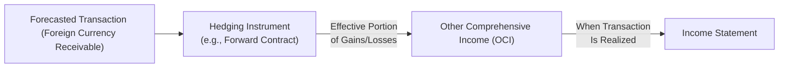

## Overview

Hedge accounting for foreign currency transactions is one of those topics that can make even seasoned finance folks do a double-take, especially when dealing with IFRS 9 (Financial Instruments) or US GAAP’s ASC 815 (Derivatives and Hedging). At its core, hedge accounting attempts to mitigate the sometimes-dramatic volatility in financial statements caused by foreign exchange (FX) rate fluctuations. And trust me—nothing’s quite as stressful as discovering that your bottom line is swinging wildly just because the currency markets decided to have a field day. So, it’s no wonder that professional guidance allows special accounting treatments (assuming certain strict requirements are met) that better reflect the economic reality of risk management activities.

That said, hedge accounting doesn’t magically eliminate risk—it just helps ensure that if you do hedge, your financials won’t see unnecessary mismatches between the hedging instrument’s gains or losses and the items being hedged. In other words, you can record those derivative gains/losses more smoothly in line with the actual exposures they’re hedging.

Below, we’ll explore how hedge accounting works, the different categories of hedges, how it’s applied, and what kinds of documentation and testing you need to ensure you stay compliant, whether you’re under IFRS or US GAAP. Let’s jump in.

## Objectives of Hedge Accounting

In practical terms, companies engage in hedge accounting to:

• Reduce Earnings Volatility: Suppose your firm sells goods in foreign countries. If you’re not hedged, your reported revenue (in your home currency) can fluctuate significantly. Hedge accounting can smooth out these swings.  
• Better Reflect Risk Management Practices: When done properly, hedge accounting aligns your financial statements with your actual economic hedging.  
• Avoid “Noise” in the Income Statement: Pure derivative accounting can cause big hits (gains or losses) in earnings before the underlying exposure is recognized. Hedge accounting helps offset or defer these, so that they appear in the same period as the hedged exposure.  

I once worked with a CFO who was caught off guard by huge currency swings on forward contracts that hit the income statement all at once—even though those derivatives were meant to hedge a long-term receivable. They realized that adopting formal hedge accounting would have better matched the timing and nature of these gains and losses, adding more clarity for analysts reviewing the financial statements. 

## Key Accounting Standards: IFRS 9 vs. ASC 815

Although IFRS 9 (Financial Instruments) and ASC 815 (Derivatives and Hedging, under US GAAP) differ in nuances, both standards share common themes:

• Documentation: Hedge relationships must be formally documented at the inception of the hedge: what is being hedged, how success will be measured, and what your organizational approach to risk management is.  
• Effectiveness Testing: You need to prove (both prospectively and retrospectively) that the derivative or other hedging instrument is highly effective at offsetting the risk you’re hedging.  
• Classification: Each standard recognizes distinct classifications (e.g., Fair Value Hedge, Cash Flow Hedge, Net Investment Hedge). The accounting treatment for each can vary significantly in terms of where gains/losses get recorded.  
• Discontinuation: If the hedge ceases to be effective or you no longer wish to apply hedge accounting, the hedge relationship is de-designated, and subsequent accounting shifts to standard derivative measurement.

## Types of Hedges

### Fair Value Hedge

A Fair Value Hedge is used when you’re hedging the exposure to changes in the fair value of a recognized asset, liability, or unrecognized firm commitment. The classic example is hedging the fair value of a fixed-rate debt instrument. If interest rates or exchange rates change, the value of that fixed-rate debt can fluctuate. A fair value hedge sets out to hedge that fluctuation.

Under a Fair Value Hedge:

• Both the hedging instrument and the hedged item’s fair value changes are measured through the income statement, effectively offsetting each other (if the hedge is fully effective).  
• Hedge effectiveness must be high; otherwise, you’ll see leftover gains or losses.  

### Cash Flow Hedge

A Cash Flow Hedge is aimed at mitigating variability in future cash flows. Maybe you anticipate receiving a foreign-currency inflow (from a forecasted export sale) or paying out a foreign-currency cost (like importing raw materials). If exchange rates shift, your eventual payment or receipt in home currency can become a big surprise. The hedging strategy might involve a forward contract that locks in today’s exchange rate for that future transaction.

Under a Cash Flow Hedge:

• The effective portion of the hedge’s gain or loss goes directly to Other Comprehensive Income (OCI) rather than hitting profit or loss immediately.  
• Then, when the hedged transaction (e.g., the forecasted purchase) eventually occurs and affects the income statement, that accumulated gain/loss in OCI is reclassified into earnings, smoothing out the impact.  

You can think of this as a “timing shift” mechanism. Instead of reporting derivative gains/losses as they happen, you park them in OCI until the underlying transaction hits your income statement.

### Net Investment Hedge

When a parent company has a foreign subsidiary, the net investments in that foreign entity are typically exposed to exchange rate risk. As currency rates move, the net asset value of that subsidiary (in the parent’s consolidated statements) goes up or down. A Net Investment Hedge:

• Typically uses derivatives or foreign-currency-denominated liabilities to offset currency exposure in the net investment of a foreign operation.  
• Gains or losses from the hedging instrument are recognized in OCI (in the translation reserve) alongside the translation adjustments from the net investment.  
• These amounts remain in OCI until you sell or dispose of the foreign operation, at which time they’re reclassified to profit or loss.  

It’s sort of analogous to the Cash Flow Hedge approach of deferring gains/losses until the effect is “realized” (in this case, realized via disposal of the investment).

## Hedge Documentation and Effectiveness Testing

One of the absolutely vital components of hedge accounting is formal documentation. Regulators don’t want companies to casually shift items between OCI and the income statement without robust justification. To qualify for hedge accounting:

• You must document the hedging relationship at the start:  
  – The hedged item and the risk being hedged (e.g., foreign currency risk of a forecasted transaction).  
  – The hedging instrument (e.g., forward contract, swap, option).  
  – Your risk management objective (why you’re hedging).  
  – The method you’ll use to measure hedge effectiveness.  

• You must prove hedge effectiveness, meaning the derivative truly offsets changes in the hedged item due to the specified risk. IFRS 9 has slightly more flexible criteria for effectiveness than older IFRS standards, but it still requires a clear expectation (and demonstration) of a high correlation between changes in the derivative’s fair value or cash flows and those of the hedged item.

• Effectiveness testing is both prospective (i.e., at the inception) and, in many cases, retrospective (i.e., checking actual results). Outside expected bounds can disqualify or partially disqualify the hedge.  

I remember a conversation with an international treasury manager who joked that she spent more time on documenting the hedge relationships than on negotiating the forward contracts themselves—strict compliance with IFRS 9 or ASC 815 can be that demanding!

## Accounting Treatments Under Different Hedge Types

To give you a quick sense of how these hedge treatments compare, here’s a simplified overview:

| Hedge Type            | Recognition of Hedging Instrument Gains/Losses        | Recognition of Hedged Item Gains/Losses                   |
|-----------------------|--------------------------------------------------------|------------------------------------------------------------|
| Fair Value Hedge      | Income Statement (current period)                     | Income Statement (hedged item’s fair value changes)        |
| Cash Flow Hedge       | OCI (effective portion); Ineffective portion in P&L   | Underlying transaction recognized in P&L when it occurs    |
| Net Investment Hedge  | OCI (translation reserve); reclassified upon disposal | Net investment revaluation recognized in OCI alongside hedge |

When all is said and done, the aim is that recognized gains/losses from the hedging instrument appear in the same line item or period as the hedged item’s offsetting changes, reducing or eliminating volatility from currency swings. It’s not bulletproof—there are still complexities relating to ineffective portions, time values of options if you’re using options as hedging instruments, and so on—but it’s much more aligned with the economic reality of hedging activities than if you accounted for derivatives at fair value through profit or loss each period.

## Practical Example: Cash Flow Hedge of a Forecasted Foreign Currency Sale

Let’s imagine Company Alpha (reporting in USD) anticipates receiving EUR 5,000,000 from a customer in 90 days. Currently, 1 EUR = 1.10 USD. The company wants to lock in an exchange rate to avoid the risk of currency depreciation. They enter into a forward contract to sell EUR 5,000,000 at a forward rate of 1.12 USD/EUR in 90 days.

• Hedged Item: Forecasted sale in EUR (foreign currency risk).  
• Hedging Instrument: A forward contract to sell EUR.  
• Hedge Designation: Cash Flow Hedge (because it’s a forecasted transaction, not recognized on the balance sheet yet).

If at the end of 90 days, the spot rate moves to 1.08, that means the euro is weaker against the dollar. On the open market, you’d receive 1.08 USD/EUR, or 5,400,000 USD for the 5 million euros. But your forward contract says you get 1.12, or 5,600,000 USD total, which is better by 200,000 USD. This 200k is effectively the “gain” on the derivative. In a normal derivative scenario, you might have recognized the changing value of this forward contract in your P&L each period from contract inception. But under hedge accounting (assuming the hedge is effective), that gain would remain in OCI until the actual sale occurs. Then, as you record the sale’s revenue, you simultaneously reclassify the hedge gain from OCI to P&L, ensuring that the total USD recognized from this sale in your income statement ends up being close to the contracted forward rate.

## Visualization of Hedge Flows

Below is a simple diagram that outlines the relationships for a Cash Flow Hedge, bridging the forecasted transaction, the hedging instrument, and the financial statements.

In an effective Cash Flow Hedge, the realized gain/loss on the hedging instrument in OCI is reclassified into earnings at the same time the hedged item’s cash flow affects profit or loss.

## Common Pitfalls and Challenges

• Overestimation of Hedge Effectiveness: If you label something a hedge but only a small fraction of your exposures is actually covered, you might be in trouble if tested by auditors or regulators.  
• Forecasted Transactions That Don’t Materialize: If the forecasted transaction never happens—like if your foreign customer cancels the contract—your hedge might not qualify for hedge accounting anymore. Gains/losses parked in OCI might need to be reclassified immediately to P&L.  
• Ineffective Portion: The portion of the gain or loss on the hedging instrument that doesn’t offset the hedged item’s changes is recognized immediately in P&L, causing partial volatility.  
• Complex Instruments: Options, cross-currency swaps, or structured derivatives can complicate the measurement of hedge effectiveness. Time value can be accounted for differently depending on IFRS or US GAAP guidelines.

## Best Practices for Hedge Accounting

• Start with a Clear Risk Management Policy: Make sure your treasury team and finance team communicate the strategy. Nothing kills a hedge relationship faster than not being able to articulate (in writing) why you’re hedging.  
• Maintain Strong Documentation: This includes specifying the hedged risk, the hedging instrument, the period, the method of effectiveness testing, and your rationale.  
• Monitor Ongoing Effectiveness: Perform regular testing to confirm that the derivative’s performance is still aligned with offsetting the hedged item’s risk.  
• Involve Auditors Early: If you have complicated hedges, especially net investment hedges or new derivative products, consider consulting with your auditors proactively.  

## Critically Thinking About Hedge Accounting

Hedge accounting can be a powerful tool—especially for analysts, it presents a clearer reflection of a business’s true performance by eliminating the accounting distortions caused by near-term fluctuations in currency derivatives. However, it can also mask real economic losses if not properly scrutinized. For instance, if a forecasted transaction fails to occur, or if the hedge is only partially effective, the financial statements might not fully convey the underlying risk.

In exam contexts, keep in mind that the CFA Institute expects you to grasp not merely the definitions but also the motivations, the mechanics of each hedge type, and how these hedges flow through the financial statements. You might see scenario-based questions where you’re asked to recommend which hedge classification best fits a particular business exposure or to identify where a hedge’s gains/losses appear in financial statements under IFRS or US GAAP.

## References

• IFRS 9: Financial Instruments – Hedge Accounting Section  
• ASC 815: Derivatives and Hedging  
• “Hedging Currency Exposures: Strategies and Tactics,” by Brian Coyle  
• Chapter 11.1 to 11.5 in this volume (related to foreign exchange exposures and currency translations)  

---

## Test Your Knowledge: Foreign Currency Hedge Accounting Quiz



### Which of the following statements best describes the purpose of hedge accounting for foreign currency transactions?

- [x] It aligns the timing of derivative gains/losses with the recognition of the hedged item in the financial statements.  
- [ ] It eliminates foreign exchange risk on recognized assets and liabilities.  
- [ ] It ensures derivatives are always recognized in OCI.  
- [ ] It allows speculative currency trading activities to bypass normal accounting rules.  

> **Explanation:** Hedge accounting is designed to match gains/losses from the hedging instrument with the timing of the hedged item's impact on the financial statements, thereby reducing volatility that doesn’t reflect the hedge’s true economic effect.

---

### In a fair value hedge under IFRS 9, how is the gain or loss on the hedging instrument recognized?

- [x] In the income statement, along with the fair value adjustments of the hedged item.  
- [ ] In OCI, until the hedged item is settled.  
- [ ] In a separate equity reserve, with no reclassification.  
- [ ] As an adjustment to retained earnings.  

> **Explanation:** Under a fair value hedge, both the hedged item’s fair value changes and the hedging instrument’s changes go to the income statement in the same period.

---

### A company forecasts a sale in a foreign currency three months from today. It designates a forward contract as a cash flow hedge. Where is the effective portion of the forward contract’s unrealized gain or loss typically recorded prior to the actual sale?

- [ ] Immediately in profit or loss.  
- [ ] Directly as an adjustment to goodwill.  
- [x] In Other Comprehensive Income (OCI).  
- [ ] As an offset to the carrying amount of the hedged item.  

> **Explanation:** For a cash flow hedge, the effective portion of the hedging instrument’s gain or loss is recognized in OCI until the forecasted transaction occurs, at which point it’s reclassified into profit or loss.

---

### Which of the following is a valid example of a net investment hedge?

- [ ] Hedging an expected foreign currency revenue from a forecasted export sale.  
- [ ] Hedging the interest rate risk on a floating-rate bond payable.  
- [ ] Using an interest rate cap to limit borrowing costs on a local loan.  
- [x] Using foreign-currency-denominated debt to hedge the FX risk of a foreign subsidiary’s net assets.  

> **Explanation:** Net investment hedges relate to hedging the foreign exchange risk of a net investment in a foreign operation, often by issuing or holding debt denominated in the subsidiary's currency or using derivatives designated for that purpose.

---

### A hedge is deemed ineffective under IFRS 9 when:

- [x] Actual results deviate significantly from the hedge effectiveness criteria documented at inception.  
- [ ] The hedging instrument is a forward contract rather than a swap.  
- [ ] Management decides to roll over the hedge for another six months.  
- [ ] The derivative is in a loss position.  

> **Explanation:** Hedge effectiveness requires that changes in the fair value of the hedging instrument closely offset changes in the hedged item. If the offset is no longer high enough (per IFRS 9 criteria), the hedge is deemed ineffective.

---

### When applying a cash flow hedge and the forecasted transaction does not occur, what typically happens to any accumulated gains or losses in OCI?

- [ ] They remain indefinitely in OCI.  
- [ ] They are transferred to a revaluation reserve.  
- [ ] They are written off against inventory.  
- [x] They are reclassified immediately to the income statement.  

> **Explanation:** If the hedge is for a forecasted transaction that no longer occurs, any gains or losses in OCI get reclassified to profit or loss because the underlying hedged item will never take place to absorb such gains or losses.

---

### Under ASC 815, which of the following documentation elements is required at the inception of a hedge?

- [x] Identification of the hedging instrument, the hedged item, and the risk being hedged.  
- [ ] A formal cost-benefit analysis of executing the hedge.  
- [ ] Board of directors’ approval of every derivative contract.  
- [ ] A schedule of all future derivative transactions for the next 10 years.  

> **Explanation:** US GAAP (ASC 815) requires thorough documentation at the start of the hedge, including the item, instrument, type of risk, risk management objectives, and how effectiveness will be assessed.

---

### In a net investment hedge, where are the foreign exchange gains and losses on the hedging instrument recognized before disposal of the foreign operation?

- [ ] In Retained Earnings.  
- [x] In Other Comprehensive Income (translation reserve).  
- [ ] In profit or loss.  
- [ ] As an adjustment to the hedged item’s carrying amount.  

> **Explanation:** Gains or losses on a derivative or debt instrument designated as a net investment hedge are recognized in OCI (translation reserve), mirroring the translation adjustments of the foreign subsidiary’s net assets.

---

### Which scenario is most likely to cause partial hedge ineffectiveness in a cash flow hedge?

- [x] The notional amount of the hedging instrument is greater than the amount of foreign currency exposure in the hedged transaction.  
- [ ] The derivative is in a gain position.  
- [ ] The hedge is designated to offset a recognized liability.  
- [ ] Forecasted transaction actually occurs.  

> **Explanation:** Hedge ineffectiveness often arises when the volume or timing of the hedging instrument doesn’t precisely match the hedged exposure—such as having an oversized derivative notional compared to the underlying exposure.

---

### True or False: Under IFRS 9, if a hedge relationship no longer meets the effectiveness requirements, it can continue to qualify for hedge accounting as long as the derivative remains outstanding.

- [x] False  
- [ ] True  

> **Explanation:** Hedge relationships must meet strict effectiveness requirements continuously. If those requirements fail, the hedge relationship must end, and the derivative is subsequently accounted for at fair value through profit or loss.


