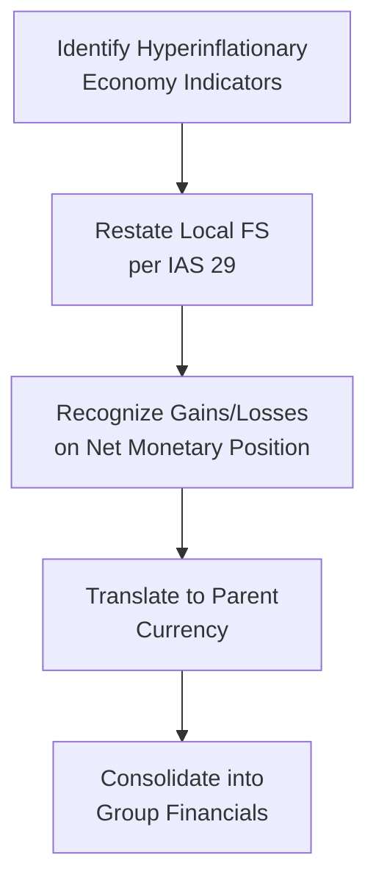

## Overview

Hyperinflationary accounting can feel, well, daunting, especially when you’re first introduced to the concept—at least, it did for me. I still remember my early days at an accounting firm, elbows-deep in endless price indices and trying to figure out if a client’s local currency was “stable enough” to skip the full restatement. It was a reality check: in some parts of the world, inflation skyrockets so much that standard cost-based financial statements basically become meaningless. Anyway, let’s dive in and unpack how IFRS (specifically IAS 29) and US GAAP handle hyperinflation, how you’d restate financials, and what happens when you consolidate a hyperinflationary subsidiary. We’ll try to keep it practical and approachable, while still giving you the formal depth you need for the exam.

## Understanding Hyperinflationary Environments

We often hear “hyperinflation” thrown around casually whenever prices rise dramatically. But from an accounting standpoint, hyperinflation is a strictly defined scenario where financial statements must be adjusted to reflect the change in purchasing power. Under IAS 29, a few indicators hint that an economy is hyperinflationary:

• A three-year cumulative inflation rate exceeding 100%.  
• A strong preference among the population (and businesses) for holding wealth in a foreign currency instead of the local one.  
• Frequent indexation of transactions, prices, and salaries to maintain real value.

Though IFRS focuses on these factors, under US GAAP, there’s also a concept of “highly inflationary” economies (often pegged at around 100% or more inflation over a three-year period). The main idea is that in these environments, ignoring inflation leaves your financials hopelessly out-of-touch with real economic conditions.

## Accounting in Hyperinflationary Economies

### The Why Behind Restatement

When inflation is extremely high, historical costs from, say, two years ago, won’t mirror the current price level at all. This can distort gross margins, depreciation expenses—basically every line item. So standard IFRS procedures say you have to restate the financial statements to reflect prevailing purchasing power. This restatement process:

1. Adjusts non-monetary items with a general price index (like a Consumer Price Index)  
2. Leaves monetary items (like cash, accounts payable) unadjusted because their nominal balances already reflect current nominal values (though their purchasing power erodes).  
3. Recognizes a “gain or loss on net monetary position” in the income statement, depending on whether your monetary assets exceed your monetary liabilities or vice versa.  

### IFRS vs. US GAAP Overview

Under IAS 29, there’s direct guidance: restate the local-currency financial statements and then translate. US GAAP doesn’t have an exact equivalent to IAS 29, but “highly inflationary” accounting in ASC 830 (Foreign Currency Matters) outlines a similar approach: you essentially treat the local currency financial statements as if the functional currency were the parent’s currency once the local economy becomes “highly inflationary.” It’s a bit different in detail, but the end goal is similar—to ensure financial statements meaningfully capture real financial performance and position.

## Practical Steps for Restatement (IAS 29)

Although it may feel cumbersome, the actual restatement procedure follows a fairly systematic approach:

1. Identify a **general price index** you believe best captures average price fluctuation.  
2. **Adjust non-monetary items** on the balance sheet using that price index from the date of their acquisition or revaluation. For example, if you purchased equipment three years ago, you multiply its historical cost by the change in the price index over that period.  
3. **Recalculate depreciation**, amortization, and other items based on the adjusted values.  
4. **Monetary items** remain at their nominal amounts (think cash, short-term receivables, payables).  
5. **Gain or loss on net monetary position**:  
    - If you have more monetary liabilities than monetary assets, inflation effectively reduces your net debt burden, leading to a monetary gain.  
    - If you have more monetary assets than liabilities, inflation erodes the value of your net monetary assets, resulting in a monetary loss.  
6. Update the **income statement** to reflect these adjustments.  

This restatement then becomes your baseline for any subsequent consolidation or translation into another currency.

### Diagram of Hyperinflation Restatement and Consolidation

Below is a simple Mermaid diagram to illustrate the major steps:

The arrows show the step-by-step process from detecting hyperinflation to eventually consolidating with the parent’s financial statements.

## Gains or Losses on Net Monetary Position

Let’s emphasize one of the trickiest parts: the net monetary position. Here’s a quick numeric example:

• Suppose a subsidiary has 1,000 in monetary assets and 500 in monetary liabilities at the start of the year, and the local price index doubles over the year.  
• The net monetary position is 500. Because inflation soared, the purchasing power of that net 500 is halved by year-end.  
• The entity would record a net monetary loss, showing that its net monetary assets lost purchasing power.  

This effect can significantly swing net income, especially if the company is net cash-positive. In some real-world experiences, I’ve seen businesses try to shift their asset mix or accelerate payables or adopt shorter credit terms to mitigate these losses.

## Consolidating a Hyperinflationary Subsidiary

### First Step: Restate, Then Translate

IFRS requires that if the subsidiary operates in a hyperinflationary economy, you must restate its financial statements under IAS 29 before you do anything else. Then you translate it from the local currency into the parent’s presentation currency, typically following IAS 21 (The Effects of Changes in Foreign Exchange Rates). Here’s the sequence:

1. **Restate** subsidiary’s local GAAP or IFRS statements for hyperinflation.  
2. **Translate** the restated figures into the parent’s currency.  
3. **Consolidate** as you would any other subsidiary, but keep an eye on the effect of the restated assets and liabilities on group-level ratios.

### US GAAP and Consolidation

Under US GAAP, if a subsidiary is in a “highly inflationary” economy, you essentially treat the parent’s currency as the subsidiary’s functional currency. This means you remeasure the subsidiary’s accounts rather than simply translating them using standard foreign currency translation. The remeasurement approach is akin to the restatement approach—monetary items measured at current exchange rates, non-monetary items measured at historical exchange rates, etc.

## Effects on Financial Ratios and Analysis

### Distorted Traditional Metrics

When you restate balance sheets and income statements, all kinds of typical ratio analyses might get skewed:

• **Margins**: Because COGS and expenses are restated, you might see unusual trends, especially in turnover or margin analysis.  
• **Liquidity**: Large restatements of working capital items can alter quick and current ratios.  
• **Solvency**: The revaluation of long-term assets or liabilities might change the debt-to-equity ratio drastically.  

### Comparing Across Periods and Entities

If one subsidiary uses hyperinflationary accounting while another doesn’t, it can get messy for cross-subsidiary performance comparisons. Analyzing year-over-year changes requires caution: if the local currency environment drastically changes from high inflation to not-high inflation (or vice versa), the transition can create major disruptions in your consolidated statements.

### Developing a Careful Perspective

When reading hyperinflationary financials, keep your analytic eyes open for:

• **Stability of Price Index**: The choice of index can significantly affect restated numbers, especially if the official government index differs from private indices.  
• **Currency Shifts**: Large swings in the exchange rate when you finally translate can overshadow the restatement adjustments.  
• **Management Discretion**: The restatement process can introduce management judgment, especially regarding certain intangible assets or older fixed assets.

## Real-World Example: Latin America

Countries like Venezuela or, historically, Argentina have faced hyperinflationary conditions where local currency devaluation was severe. Companies operating there often reported IFRS-based statements that featured massive restatement adjustments. Investors analyzing these companies had to recognize that traditional ratio trends, like a “doubling of sales,” might just reflect currency restatement rather than real growth in underlying business activity. While the restatement improves transparency, it can still make short-term performance appear volatile.

## Common Pitfalls and Best Practices

• **Pitfall**: Ignoring the net monetary position calculations—particularly if you assume that “cash is safe.” Under hyperinflation, cash is far from a safe asset if it’s denominated in the local currency.  
• **Pitfall**: Failing to apply consistent price indices across periods.  
• **Best Practice**: Document every restatement step thoroughly and cross-check each item’s indexation. Engage local experts who understand the economy’s standard indices.  
• **Best Practice**: Provide transparent disclosures. Explain the nature of hyperinflation, the index used, and how the net monetary position gain or loss was calculated.

## Exam Tips for Hyperinflationary Accounting

• **Focus on Key Concepts**: For exam questions, you’ll want to automatically recall: (1) the difference between monetary and non-monetary items, (2) how to calculate the gain or loss on net monetary positions, and (3) the rationale for restating before translating.  
• **Practice Numeric Examples**: Even a straightforward example can get tricky under time pressure—pretend you’re walking through a short case study of restating a fixed asset or calculating a net monetary position.  
• **Be Ready to Discuss Impacts on Ratios**: In an essay or item-set format, exam questions might ask you to evaluate how restating affects margins, net income, or assets.  
• **Recognize US GAAP vs. IFRS Contrasts**: Keep in mind IFRS’s requirement for restatement (IAS 29) versus US GAAP’s remeasurement approach (ASC 830).

## References and Further Reading

• IAS 29: Financial Reporting in Hyperinflationary Economies (International Accounting Standards Board).  
• ASC 830: Foreign Currency Matters (Financial Accounting Standards Board).  
• “Accounting for Inflation” by Juan Ramirez—insightful case studies on hyperinflationary environments.  
• Deloitte’s iGAAP guide for real-world hyperinflation examples and detailed IFRS applications.

---

## Test Your Knowledge: Hyperinflationary Accounting in Consolidations



### Which indicator typically signals the presence of a hyperinflationary economy under IAS 29?

- [ ] A slight preference for using local currency in transactions.  
- [ ] Cumulative inflation of 15% over three years.  
- [x] Cumulative inflation exceeding 100% over three years.  
- [ ] Consistently negative interest rates.  

> **Explanation:** IAS 29 specifically points to a three-year cumulative inflation rate surpassing 100% as a key indicator of hyperinflation.

### Under IAS 29, how are non-monetary items (like property, plant, and equipment) treated?

- [ ] They are measured at historical cost without any adjustment.  
- [ ] They are revalued based on the current exchange rate only.  
- [x] They are adjusted using a general price index to reflect current purchasing power.  
- [ ] They are expensed immediately in the income statement.  

> **Explanation:** Non-monetary items are restated by applying a relevant price index to convert historical costs into amounts reflecting the current purchasing power of the date of the statement.

### In hyperinflationary accounting, what happens when a company’s monetary liabilities exceed its monetary assets?

- [x] A net monetary gain is recognized because inflation reduces the real value of net liabilities.  
- [ ] A net monetary loss is recognized because you lose on net liabilities.  
- [ ] There’s no impact as both assets and liabilities are restated.  
- [ ] Gains and losses are deferred in other comprehensive income.  

> **Explanation:** A net liability position benefits from inflation because the real burden is diminished, leading to a recognized gain on the net monetary position.

### After restating a hyperinflationary subsidiary’s financial statements under IAS 29, what is the next step when consolidating?

- [ ] Convert based on historical exchange rates without further adjustments.  
- [x] Translate the restated figures into the parent’s functional or presentation currency.  
- [ ] Record an immediate impairment of the subsidiary’s assets.  
- [ ] Skip consolidation if inflation is deemed too high.  

> **Explanation:** IFRS standards require that once the subsidiary’s statements are restated, they should be translated into the parent’s currency using typical translation rules.

### Which of the following is a potential effect of hyperinflation restatement on financial statement ratios?

- [x] Liquidity ratios can change significantly as some current assets are restated higher.  
- [ ] The debt-to-equity ratio remains exactly the same.  
- [x] Turnover ratios might be skewed by restated sales and COGS figures.  
- [ ] EBITDA margins are unaffected by restatement.  

> **Explanation:** Restatement affects both the balance sheet and the income statement, so liquidity and productivity ratios (e.g., turnover) can shift significantly. Debt-to-equity can also change, but it depends on the mix of monetary vs. non-monetary liabilities.

### Which statement accurately describes the US GAAP approach for hyperinflationary economies?

- [x] Consider the parent’s currency as the subsidiary’s functional currency when inflation is “highly inflationary.”  
- [ ] Use the same procedure as IAS 29, restating non-monetary items with official price indices.  
- [ ] Remeasure the subsidiary’s accounts only for intangible assets.  
- [ ] There is no guidance for hyperinflation under US GAAP.  

> **Explanation:** Under US GAAP, if a local economy is considered “highly inflationary,” the subsidiary is treated as if the parent’s currency were the functional currency, leading to a remeasurement process.

### Why might investors be cautious when comparing a restated hyperinflationary subsidiary’s financials to a non-hyperinflationary subsidiary’s financials?

- [x] Differences in accounting treatment can distort cross-comparison of performance metrics.  
- [ ] Hyperinflationary subsidiaries never experience currency gains or losses.  
- [x] Restated numbers might reflect inflationary adjustments rather than true operational growth.  
- [ ] The subsidiary with higher inflation is always more profitable.  

> **Explanation:** Hyperinflationary restatement often introduces large, one-time inflation-based adjustments that may mask or inflate (no pun intended) actual operational performance.

### What is a common pitfall when performing hyperinflationary restatement?

- [x] Failing to properly apply a consistent price index to non-monetary items.  
- [ ] Adjusting monetary items for both local and foreign inflation.  
- [ ] Excluding net monetary gains or losses from the income statement.  
- [ ] Using multiple price indices to increase comparability.  

> **Explanation:** A consistent and appropriate price index must be used; otherwise, the restatement could be inaccurate or subject to manipulation.

### Under IAS 29, where is the gain or loss on the net monetary position typically reported?

- [x] In the income statement (profit or loss).  
- [ ] Immediately in other comprehensive income.  
- [ ] As a direct adjustment to equity.  
- [ ] Deferred and amortized over future periods.  

> **Explanation:** IAS 29 requires that the net monetary gain or loss be recognized in profit or loss for the period.

### True or False: Hyperinflationary accounting under IAS 29 requires companies to restate both monetary and non-monetary items using a general price index.

- [ ] True  
- [x] False  

> **Explanation:** Under IAS 29, only non-monetary items (e.g., PPE, inventory) are restated with a price index. Monetary items (like cash, receivables, payables) are not restated because their nominal amounts already reflect current currency units.


