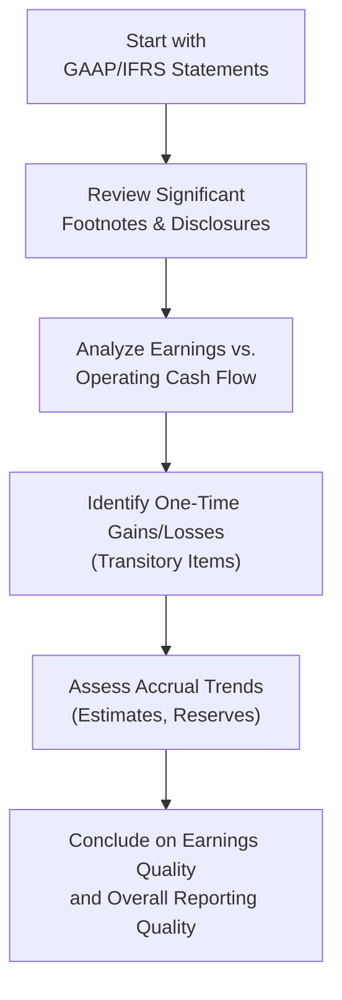

## Introduction and Big Picture

Let’s say you’ve just picked up a company’s annual report, all 100 pages of it. The numbers look decent at first glance—revenues are up, earnings have climbed, and shareholders are celebrating with a slight bump in dividends. But, well, does that truly reflect what’s going on behind the scenes? Are these earnings consistent and sustainable, or do they rely on a one-time asset sale that just happened to land in the same quarter? And how do we figure out whether the operating cash flows actually line up with all this “good news”? These are big, important questions for analysts and investors to consider. 

In what follows, we’ll explore the concept of financial reporting quality, highlight the characteristics of high vs. low-quality reports, discuss how it ties into the notion of quality of earnings and cash flows, and identify best practices for detecting manipulation and ensuring you have a complete picture of a company’s performance. 

## Financial Reporting Quality: Key Elements

Financial reporting quality essentially measures how faithfully a company’s statements represent its economic reality. High-quality reporting provides consistent, trustworthy, comparable results that give you, as an analyst or investor, a clear way to evaluate the firm’s actual performance and make well-grounded decisions. 

But let’s be real: not all financial statements are created equal. Some companies follow the technical rules of accounting but present data in ways that obscure or distort the underlying picture. That’s where advanced analysis—and a healthy dose of professional skepticism—comes into play.

### Characteristics of High-Quality Reporting

• Transparency  
  – Detailed footnotes that clarify accounting policies.  
  – Clear discussion of management’s judgment areas, such as determining impairment or revenue recognition.  

• Consistency  
  – Consistent application of accounting principles over time.  
  – Minimal abrupt policy changes unless absolutely justified.  

• Comparability  
  – Layouts and line items that align well with industry norms.  
  – Full disclosure of specialized or industry-specific accounting.

• Alignment with Economic Reality  
  – Revenues recorded when earned.  
  – Expenses matched with revenues in the right reporting period.  
  – Accruals that reflect real economic events.  

When financial reporting meets these criteria, you can trust that the statements truly convey the business’s performance.

## Quality of Earnings: Why It Matters

Let’s talk about “earnings.” I once had an acquaintance who jumped for joy after seeing a media headline that a certain retailer’s earnings had doubled in a single quarter. But it turned out that the company had just sold one of its brand trademarks, locking in a substantial one-off gain. The ongoing sales performance of its core products was actually stagnating—or even dipping a bit. That’s a classic scenario illustrating the difference between abiding by the letter of accounting rules (earnings up, no problem, right?) and reflecting the real underlying operations.

### Defining Earnings Quality

Earnings quality is about sustainability. Do these profits come from core operational activities—like a manufacturer’s stable production lines, a retailer’s consistent sales, or a software firm’s subscription renewals—or are they the result of sporadic events? A “high-quality” earnings number will typically correlate with strong, stable operating cash flows, reflecting the actual business engine at work.

### Recurring vs. Transitory Items

It’s crucial to identify recurring items—those revenues or expenses that will persist over future reporting periods—versus transitory items. Consider these examples:

• A large manufacturer might have recurring warranty expenses that pop up each year in roughly the same way.  
• On the other hand, a big settlement from a lawsuit is probably a one-off flair, boosting profits this year but unlikely to repeat.

When you’re looking to project future performance, you primarily want to focus on the recurring elements.

## Quality of Cash Flows

If net income is the face of a company’s performance, operating cash flow (OCF) is the heartbeat. It’s essentially how much cash the firm is generating once you strip away non-cash expenses, changes in working capital, and other operating adjustments. Cash flow quality measures how free the reported operational cash flows are from manipulative tactics or ephemeral boosts.

### Assessing Operational Cash Flow Consistency

High-quality operational cash flows will typically mirror stable, ongoing business. Conversely, large spikes or dips might signal that the company has:

• Factored (sold) its receivables to generate short-term cash at the expense of future collections.  
• Delayed or stretched out vendor payables to artificially inflate short-term operating cash flows.  
• Accelerated customer billings prior to official revenue recognition to grab that cash earlier.  

A good rule of thumb is: In the long run, cumulative net income should align closely with cumulative operating cash flows. Major deviations over multiple periods might ring alarm bells.

### The Link between Earnings and Cash Flow

You often compare net income to operating cash flow. If net income is consistently high while OCF is languishing—or even negative—there’s a risk that management is relying on big accruals or uncertain estimates to bolster net earnings. As you can imagine, that’s a big problem if you plan to rely on that “earnings growth” for future forecasting.

Here’s a classic representation in formula form, reminding us that differences between net income and OCF come from items like depreciation, changes in working capital, and non-cash expenses:

$$
\text{Operating Cash Flow} \;=\; \text{Net Income} + \text{Depreciation \& Amortization} \pm \Delta \text{Working Capital} \;\pm\; \dots
$$

If the gap between Net Income and OCF expands significantly without straightforward explanations (like large capital investments or cyclical working capital changes), it’s time for deeper investigation.

## Accruals and Their Implications

Accrual accounting is central to both IFRS and US GAAP: revenues are recognized when earned, expenses when incurred—regardless of actual cash flow timing. Though it provides a more realistic depiction of many economic transactions, accruals can also open doors to manipulation.

### Beware of Aggressive Estimates

Reserve accounts, allowances for doubtful accounts, and inventory obsolescence estimates are all areas where management discretion can overshadow underlying reality. A small tweak to an allowance estimate may artificially smooth out earnings. Over time, small “smoothing” increments can add up to big distortions.

### Big Gaps and Potential Red Flags

When you see a pattern of large, growing accruals on the balance sheet—like a ballooning intangible asset that never seems to be impaired—it’s wise to question whether the reported results still accurately reflect economic events.

## A Quick Mermaid Diagram of the Earnings Quality Assessment Flow

Below is a simple flowchart illustrating a potential process for analyzing earnings quality and cash flows. The node labels are enclosed in double quotes within square brackets:

This chart provides a quick visual reference for how an analyst might structure the examination of a company’s reported results.

## Practical Example: A Receivables and Payables Twist

Imagine that Company X shows strong net income growth, but after an even cursory look at the cash flow statement, you spot negative operating cash flow. Delving deeper, you see that accounts receivable have ballooned while payables have shrunk drastically. 

• The ballooning receivables suggest the company may be booking revenue but not collecting cash, possibly overextending credit terms to customers.  
• The shrinking payables might mean the company is paying its own bills too quickly (or in normal times, it might delay them to manage cash).  

Thus, in the short term, net income is up, but cash flow is incredibly weak. Over time, a pattern like that can lead to liquidity challenges, even if the “accounting earnings” claim otherwise.

## Caution Around Non-GAAP Metrics

Non-GAAP measures—like adjusted EBITDA, operating earnings excluding “extraordinary” losses, or even custom metrics— may provide useful glimpses into a firm’s core performance. At the same time, they can also become vehicles for cherry-picking or concealing less desirable results. Always compare these non-GAAP measures to the official GAAP or IFRS earnings to see what’s being excluded or included. 

## Common Pitfalls and Tactics That Lower Reporting Quality

• Revenue Recognition Games  
  – Accelerating shipments, using channel stuffing to record revenue prematurely.  
  – Recognizing revenue from incomplete contractual obligations.

• Expense Deferral  
  – Capitalizing costs that really should be expensed (e.g., R&D).  
  – Underreporting depreciation or amortization.  

• Big Bath Charges  
  – Taking a sizable one-time charge in a period that’s already bad, effectively “cleaning the slate” so future periods look better.  

• Hidden Reserves  
  – Inflating certain reserves in good times, then reversing them in lean times to manufacture stable earnings.  

• Overly Optimistic Forecasts for Impairment  
  – Holding intangible assets on the books at inflated values.  

## Personal Reflection: Analyzing My First “Shenanigan”

I remember the first time I encountered suspicious financial statements. The company boasted that net income had doubled year over year, but I noticed a suspicious footnote about a huge non-recurring gain from the sale of an underperforming division. Sure, it was a legitimate transaction, but that gain dwarfed the actual operational contribution from the rest of the business. If I had gone just by the face of the income statement, I would have missed the real picture: the company’s core revenue stream was actually shrinking. That moment taught me the crucial importance of reading footnotes and focusing on cash flow generation.

## Aligning with IFRS vs. US GAAP

Both IFRS and US GAAP aim for transparent, comparable reporting, but there are nuances:

• Revenue Recognition  
  – IFRS 15 and ASC 606 converge in many respects, though specific industry applications may differ.  
  – Sizable management judgment can arise when determining performance obligations.  

• Expense Recognition  
  – IFRS often allows more policy choice around capitalization (e.g., development costs), while US GAAP is sometimes more conservative.  

• Cash Flow Classification  
  – IFRS allows more flexibility on classifying interest and dividends in operating, investing, or financing sections; US GAAP is more prescriptive.  

Staying up to date with standard changes is vital since IFRS or FASB updates can alter how certain transactions get reported—sometimes significantly.

## Indicators of Potential Manipulation

A few signals often hint that something’s off:

• Rapidly Growing Accruals  
  – Large discrepancies between net income and cash flow.  

• Frequent Changes in Accounting Policies  
  – Switches in revenue or cost recognition methods with no clear rationale.  

• High Turnover in Executive Management or Auditors  
  – While not definitive proof, it can be a sign of structural shifts (or possible “clean-up acts”).  

• Unusual Gains or Losses Repeatedly Appearing as “Non-Recurring”  
  – If a company calls something “one-off” several quarters in a row, it’s suspicious.

## Strategies for Evaluating Reporting Quality

1. Reconcile Income and Cash Flow  
   – Track net income, operating cash flow, and free cash flow trends.  
   – Investigate large divergences over the medium to long term.  

2. Examine Footnotes Thoroughly  
   – Changes in recognized policies, significant estimates, or off-balance sheet items.  
   – Management’s discussion on uncertainties: do they dodge the topic or address it frankly?  

3. Compare with Industry Peers  
   – If a company is an outlier, either they’re truly exceptional, or the accounting is leading to unusual results.  

4. Trend Analysis of Accruals  
   – Evaluate the total accruals versus revenue, or the growth in intangible assets. If intangible assets keep growing without corresponding revenue expansion, that’s suspicious.  

5. Look at Non-GAAP Measures with Skepticism  
   – Non-GAAP can help clarify genuine operational performance, but can also be used to hide undesirable expenses or inflate results.

## Short Case Study Example

• Company Z, a tech firm, reported 15% year-over-year revenue growth.  
• Non-GAAP earnings were up 20%, touted as “record results.”  
• Meanwhile, net income under IFRS grew only 2%.  
• You notice in the footnotes that the “adjusted” measure excludes a “one-time” stock-based compensation expense that’s actually repeated each quarter.  

When extra items keep recurring, that’s not truly “one-off.” Over time, you’d exclude so many “one-time” charges that the measure loses credibility. An analyst could easily be misled into believing the core profit margin is higher than the IFRS measure reveals.

## Practical Tips for the Exam

• Many exam questions focus on distinguishing recurring from transitory items. Practice identifying these items in sample footnotes.  
• Watch for big differences between net income and operating cash flow. This is a popular area for exam scenarios.  
• If you see suspicious non-GAAP metrics in a vignette, question what’s being excluded. Potential exam questions might ask you to recast earnings by including the excluded items.  
• Remember that intangible asset impairment, changes in depreciation policies, or reclassification of expenses can heavily affect reported earnings—as well as statements about “quality.”  

## Conclusion

Quality of financial reports and quality of earnings/cash flows go hand in hand. At the end of the day, what we’re all after is a reliable, thorough sense of a company’s real performance. By focusing on recurring rather than transitory items, cross-checking income statements against cash flows, and keeping an eye out for red flags in accruals, you’ll be better equipped to detect potential manipulation and gauge the overall health of a business.  

It can feel daunting, but once you start looking more closely—paying attention to footnotes and dissecting the statements—you’ll find it’s actually quite empowering. You’ll see how a lot of the “mysteries” of accounting unfold—a puzzle that you can solve with a mixture of curiosity, professional skepticism, and consistent analytical techniques.

## References and Further Reading

• Schilit, H., & Perler, J. (2010). “Financial Shenanigans: How to Detect Accounting Gimmicks.”  
• CFA Institute (https://www.cfainstitute.org) for detailed “Financial Reporting Quality” resources and professional standards.  
• IFRS Foundation (https://www.ifrs.org) for global financial reporting standards.  
• FASB (https://www.fasb.org) for US GAAP developments and updates.  

## Test Your Knowledge: Quality of Financial Reports and Earnings/Cash Flows



### A company reports an increase in net income but a decrease in operating cash flow. Which of the following is most likely a signal of low-quality earnings?

- [ ] The company paid off debt early, reducing financing cash flows.
- [x] Revenues are recorded earlier while cash receipts are significantly delayed.
- [ ] Depreciation has declined due to the company purchasing new equipment.
- [ ] Accounts receivable turnover ratio has increased.

> **Explanation:** When net income diverges from declining OCF, it often implies aggressive revenue recognition practices or delayed receipt of cash. An upward trend in receivables combined with earlier revenue recognition can indicate lower-quality earnings.

### Which item is most likely considered a transitory gain?

- [x] A large one-off gain from selling an idle factory.
- [ ] Recurrent subscription fees from loyal customers.
- [ ] Monthly depreciation expense on manufacturing equipment.
- [ ] Routine interest income from corporate reserves.

> **Explanation:** Gains from the sale of an idle factory are one-time in nature (transitory). Subscription fees, depreciation, and interest income are recurring or ongoing.

### When assessing quality of financial reports, which of the following best describes high transparency?

- [ ] Multiple policy changes each quarter, briefly mentioned in footnotes.
- [x] Comprehensive footnotes detailing management estimates and accounting policies.
- [ ] Only providing abbreviated annual statements.
- [ ] Using non-GAAP to override GAAP results entirely.

> **Explanation:** High-quality reports offer comprehensive disclosures in footnotes, explain management’s estimates, and apply consistent accounting over time.

### A firm’s operating cash flow is robust, but its net income remains close to zero across several periods. Which situation could plausibly explain this?

- [x] The firm has high depreciation expenses, heavily reducing net income while still generating strong cash flows.
- [ ] The firm defers revenue aggressively, inflating net income and decreasing cash.
- [ ] The firm manipulates accruals to match its cash flow.
- [ ] The firm has incorrect interest expense classification.

> **Explanation:** High non-cash expenses (like large depreciation) can reduce net income while leaving cash flow largely intact, reflecting a strong operational model, not necessarily manipulation.

### Which best characterizes the difference between IFRS and US GAAP regarding cash flow classification?

- [ ] IFRS requires interest received to be financing, while US GAAP deems it investing.
- [x] IFRS offers greater flexibility in classifying interest and dividends, while US GAAP is more rigid.
- [ ] US GAAP disallows interest and dividends in the cash flow statement.
- [ ] US GAAP merges the operating and investing sections.

> **Explanation:** IFRS generally has more leeway when classifying interest and dividends. US GAAP has strict guidelines about classifying interest expense and dividend payments as operating and financing, respectively.

### If a company consistently uses “one-time” adjustments in its non-GAAP results each quarter, an analyst should:

- [x] Investigate the nature of these “one-time” items to see if they are truly non-recurring.
- [ ] Immediately accept management’s determination that adjustments are justified.
- [ ] Merge the “one-time” items and double their impact on GAAP results.
- [ ] Ignore footnotes entirely since they are nonessential.

> **Explanation:** Items labeled as “one-time” can be misleading if they occur frequently. Analysts should always inspect each adjustment’s nature and recurrence.

### Which accounting practice most obviously inflates current period net income?

- [ ] Expensing an R&D project immediately.
- [ ] Using component depreciation.
- [x] Recording revenue before the delivery of goods or services is completed.
- [ ] Recognizing an impairment charge for intangible assets.

> **Explanation:** Accelerated revenue recognition artificially boosts short-term net income, reducing alignment with actual economic events.

### When evaluating accruals for potential manipulation, an analyst would be most concerned if:

- [x] Accruals grow faster than sales for multiple quarters with no clear explanation.
- [ ] Accruals remain in line with revenue growth.
- [ ] Accruals fall slightly in proportion to cost of goods sold.
- [ ] Net income is slightly higher than operating cash flows.

> **Explanation:** A rapid rise in accruals unmatched by a similar increase in sales often indicates management is aggressively booking revenues or adjusting estimates.

### Which of the following scenarios typically suggests higher-quality earnings?

- [x] Earnings closely track consistent operating cash flow growth.
- [ ] Earnings are driven by frequent gains on asset disposals.
- [ ] Earnings improvements come solely from reduced R&D spending.
- [ ] The firm’s net income exhibits large quarterly fluctuations with minimal explanation.

> **Explanation:** Earnings that align closely with predictable operating cash flow growth generally reflect solid, repeatable business performance rather than sporadic or manipulated results.

### True or False: A sudden, large gap between net income and cash flow from operations always indicates fraudulent accounting.

- [x] True
- [ ] False

> **Explanation:** While a sudden gap can be a warning sign, it does not guarantee fraud. It could stem from legitimate changes in working capital or strategic decisions. However, it’s still a key red flag requiring deeper investigation.


