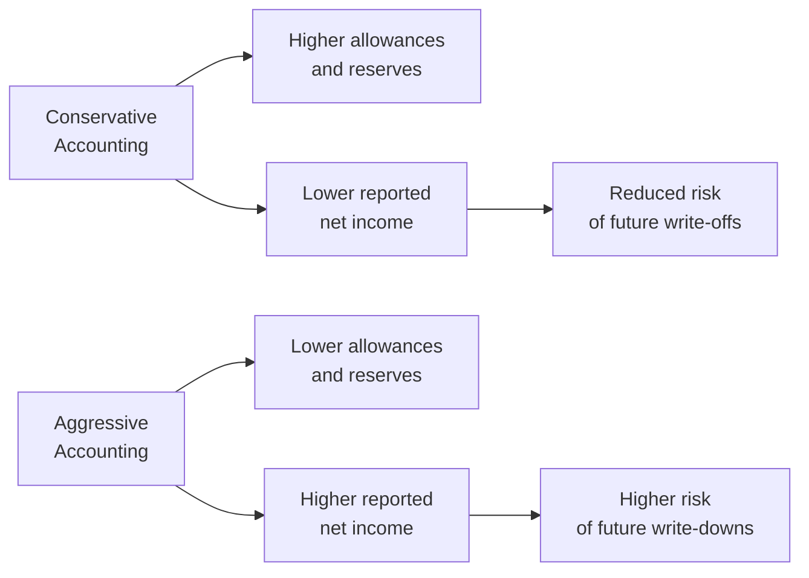

## Overview and Key Concepts

I remember years ago, I was working on a friend’s small manufacturing startup. He was wrestling with the question of whether to record a somewhat generous allowance for bad debts. On one hand, he thought, “Better be safe; let’s expect customers might not pay in full.” On the other, he didn’t want to understate the company’s earnings—especially if he was trying to attract new investors. That tension sums up a classic debate in accounting: going conservative vs. going aggressive.

In financial reporting, “conservative” accounting often means lowering near-term reported earnings by using higher estimates of expenses, allowances, and depreciation costs. “Aggressive” accounting, by contrast, typically bumps up earnings now by assuming more favorable numbers, like lower allowances for bad debts or slower depreciation rates. Although that might sound appealing in the short term, overly aggressive approaches can catch up with a firm if future fundamentals deteriorate. This section dives into what these two approaches look like, why companies choose them, how to spot them, and why they matter for your analyses.

## Defining Conservative and Aggressive Approaches

Conservative accounting is the practice of understating assets or revenues, or overstating liabilities or expenses when uncertainty arises. It’s like erring on the side of caution—providing for possible losses upfront, so you’re not surprised down the road. By contrast, aggressive accounting pushes the envelope of optimism, potentially inflating today’s earnings at the risk of shortfalls tomorrow.

### Typical Areas of Judgment

• Allowances for Bad Debts:  
  – Conservative: Higher allowance rates, which reduce net receivables and earnings.  
  – Aggressive: Minimal allowances, leading to higher reported earnings but a greater chance of future write-offs.

• Depreciation/Amortization Methods:  
  – Conservative: Faster depreciation (e.g., double-declining balance).  
  – Aggressive: Slower depreciation (e.g., straight-line over a longer-than-realistic asset life).  

• Inventory Measurement:  
  – Conservative: Lower of cost or net realizable value, with frequent write-downs if the value dips.  
  – Aggressive: Delaying write-downs or using more profitable cost-flow assumptions (under some systems).  

• Loan Loss Provisions (for financial institutions):  
  – Conservative: High provisions, buffering future credit losses.  
  – Aggressive: Low provisions, potentially puffing up current profits.

## Financial Statement Implications

When a company systematically applies conservative estimates, short-term earnings often look smaller, but the reported numbers might be more resilient in periods of stress. In other words, you may see fewer surprises in the future because the firm has already accounted for many of the downside risks.

With an aggressive approach, a company’s current earnings can flourish—seemingly everything looks profitable, at least for a while. But you may see greater volatility in the long run. At some point, if reality differs from the rosy assumptions, the firm might be forced to take hefty write-downs or restate prior results. Such restatements could erode investor confidence, hurt market valuation, and (in extreme cases) prompt regulatory scrutiny.

Here’s a quick conceptual illustration:

## Industry Norms and Comparative Analysis

Certain sectors, like banking or insurance, face unique sensitivities around conservative vs. aggressive accounting. For example, a bank with overly aggressive loan loss provisions might be seriously understating its risk exposures—or its profits could be overstated if it sets those provisions too low. Meanwhile, a manufacturing firm relying on heavy equipment might choose an accelerated depreciation method to account for future maintenance issues and technological obsolescence. As an analyst, you want to compare a firm’s choices to industry norms and see how consistent it’s being over time.

### Spotting Telltale Signs

1. Sudden Changes in Accounting Policies  
   If a company adjusts from an accelerated depreciation method to a slower one right when profits are declining, that could be a clue: they might be trying to maintain net income artificially.

2. Footnote Disclosures  
   Sometimes, the biggest hints are buried in footnotes. For instance, if the notes reveal an unusual pattern in inventory write-downs or a last-minute change in how the firm calculates bad debt expense, pay attention.

3. Historical Consistency  
   A company that drastically swings between high and low allowances might be practicing “earnings smoothing,” which can tip into questionable territory.

4. Industry Benchmarks  
   If nearly every competitor in the sector uses, say, declining-balance depreciation, but one outlier uses an extremely slow method, it might be worth a deeper look.

## Examples and Case Vignettes

• Tech Start-Up (Software Licenses):  
  Suppose a small SaaS (Software-as-a-Service) player defers recognizing subscription revenue as much as possible (conservative approach) to avoid overstating sales in uncertain times. Over time, that can protect them from big downward adjustments if customers cancel. Another SaaS competitor might recognize revenue more aggressively—great for meeting early growth targets, but risky if churn rates rise and that revenue doesn’t actually materialize.

• Real Estate Developer (Inventory Costing):  
  A property developer might factor in expected declines in local property markets as an impairment, thereby offsetting future losses. Conversely, a developer might carry all assets at near-full value until it’s absolutely forced to acknowledge a decline in market prices. This can lead to big hits all at once if the property market tumbles.

• Financial Institution (Loan Loss Provisions):  
  A bank that sets higher loan loss provisions under IFRS or US GAAP’s expected credit loss model is often seen as more conservative. But if the economy rebounds unexpectedly, that bank might release some of those provisions, effectively boosting earnings in subsequent reporting periods. Meanwhile, a bank with historically low provisions could face a capital shortage if the economy heads south and borrowers start defaulting.

## Why It Matters for Analysts

• Earnings Quality and Persistence  
  If you see that a company is persistently aggressive, you might question whether the current earnings level is sustainable. Conversely, a consistently conservative company could be building a cushion that leads to smoother future performance.

• Risk Assessment  
  A lack of downside protection—like minimal reserves—makes a firm more vulnerable to unforeseen pressures. An analyst evaluating credit risk or solvency risk will pay very close attention to these items.

• Valuation Considerations  
  Overstated short-term profits can tempt the market to assign a higher share price, but the bubble can burst. Modeling future cash flows and expected returns requires an honest read of the firm’s accounting decisions and how they compare to the “true” economic reality.

• Dividend Policy and Capital Structure  
  Firms that aggressively report higher profits might distribute more dividends or buy back shares, leaving less buffer if times get tough. Over the long term, that could reduce liquidity and hamper strategic flexibility.

## Estimation Choices and Methods

A lot of these differences hinge on how fast or slow assets and liabilities are recognized. Depreciation practices often illustrate this well. Let’s look at two formulas for straight-line vs. double-declining-balance (DDB) depreciation.

1. Straight-Line Depreciation:


\text{Annual Depreciation Expense} = \frac{ \text{Cost} - \text{Salvage Value} }{\text{Useful Life}}


2. Double-Declining-Balance (Aggressive Depreciation Example):


\text{Annual Depreciation} = 2 \times \frac{ \text{Net Book Value at Start of Year} }{\text{Useful Life}}


Straight-line might be more “aggressive” in the sense of deferring expenses if the asset is used heavily at inception. Meanwhile, DDB is “conservative” in the sense of recognizing more expense upfront (and having lower net income early on). However, the “aggressiveness” or “conservativeness” can also depend on actual usage patterns, so an analyst’s job is to see if the method truly reflects economic reality or if it’s artificially shifting earnings.

## Evaluating Policy Changes

When management changes accounting methods, pay attention to these questions:
• What triggered the change? Was it concurrent with a tough earnings quarter?  
• Is the rationale clearly explained in the footnotes?  
• Are the new assumptions in line with industry norms, or do they stand out significantly?  
• How material is the impact on reported earnings and overall financial position?  

## Best Practices for Analysts

• Cross-Check Industry Data: Compare the company’s provisions, depreciation schedules, and inventory write-down patterns with peers.  
• Look for Consistency: Jumping from conservative to aggressive methods (or vice versa) might indicate “earnings management.”  
• Examine Footnotes and MD&A: Watch for disclaimers about changes, potential biases, or warnings from external auditors.  
• Understand Regulatory Context: Under IFRS vs. US GAAP, certain accounting treatments (like LIFO inventory under US GAAP) might be permissible in one environment but not the other—leading to different degrees of aggressiveness.  
• Seek Forward-Looking Indicators: Sometimes a firm’s repeated aggressive approach can show up in intangible ways, such as inflated goodwill or intangible assets that eventually need impairment.

## Pitfalls and Potential Consequences

• Overly Aggressive Financials: Sooner or later, asset values might need to be revised downward, leading to big hits on earnings.  
• Sudden “Reserve” Reversals: Some firms may quietly set up large reserves (conservative), only to reverse them in future periods to boost earnings artificially.  
• Reputation Risk: If repeated restatements occur, credit rating agencies or investor confidence can suffer.  
• Litigation and Regulatory Scrutiny: In extreme cases, aggressive accounting can cross the line into fraudulent reporting.

## Final Thoughts and Exam Tips

In practice, no single approach is inherently “wrong” if it’s consistent with applicable standards and genuinely reflects economic substance. But as a future analyst or finance professional, it’s your job to figure out whether a firm’s accounting choices are truly capturing underlying business reality—or painting a rosier (or gloomier) picture. It’s a bit like reading between the lines: the footnotes become your best friend, and comparing a firm’s policies to industry peers is a standard first step.

For exam day (and your real-world career), keep these in mind:
• Understand that the tension between conservative and aggressive accounting ties directly into broader questions of earnings management and financial statement quality (see 12.1 and 12.3 for more context).  
• Don’t forget to read any relevant footnotes or notes on changes in accounting estimates—those can be gold mines for exam questions.  
• Be ready to calculate how alternative choices (e.g., different depreciation methods) affect net income, assets, or liabilities.  
• Always look for patterns or significant deviations from industry norms. These are the red flags testers love to see if you can detect.  

## References

- Penman, S. (2012). Financial Statement Analysis and Security Valuation.  
- White, G. I., Sondhi, A. C., & Fried, D. (2002). The Analysis and Use of Financial Statements.  
- Deloitte & Touche. (n.d.). “Accounting & Reporting Resources” at https://www2.deloitte.com  

--------------------------------------------------------------------------------

## Practice Questions: Analyzing Accounting Choices



### Which statement best describes a conservative accounting practice regarding allowances for bad debts?

- [ ] Setting a bad debt allowance below historical default trends to boost net income.
- [ ] Using an allowance that is exactly the same as the previous year, regardless of credit trends.
- [x] Setting a higher bad debt allowance than average peers, reducing current net income.
- [ ] Recognizing bad debts only when a customer officially declares bankruptcy.

> **Explanation:** Conservative accounting typically errs on the side of caution by setting higher allowances for potential losses, thus lowering current net income but reducing the risk of future surprises.

### Which of the following is a potential negative outcome of aggressive accounting?

- [x] Increased likelihood of future write-downs or restatements.
- [ ] Lower volatility in reported earnings over the long term.
- [ ] Enhanced reliability of financial statements.
- [ ] Reduced credit risk exposure.

> **Explanation:** Aggressive accounting overstates earnings and often leads to abrupt corrections when economic realities no longer match optimistic estimates.

### An analyst observes that a manufacturing company switched from double-declining-balance (DDB) depreciation to straight-line depreciation midway through the asset’s life, just as overall industry demand was weakening. This likely indicates:

- [x] A potential attempt to manage or smooth earnings as production slows.
- [ ] An effort to reflect higher near-term repair costs.
- [ ] A method mandated by IFRS for manufacturing assets nearing obsolescence.
- [ ] A normal adjustment with no implication for financial analysis.

> **Explanation:** Switching from DDB to straight-line can inflate near-term profits if the asset was more heavily depreciated in early years. Doing so when industry demand is weakening may raise questions about earnings management.

### If a bank repeatedly reports significantly lower loan loss provisions than its peers, an analyst’s primary concern might be:

- [x] The bank is overstating its profitability, risking larger future provisions if default rates spike.
- [ ] The bank is more cautious than peers, intentionally lowering current net income.
- [ ] The bank is using industry-standard IFRS rules and fully complying with conservative norms.
- [ ] The bank has no credit exposure, making provisions irrelevant.

> **Explanation:** Understating loan loss provisions inflates current profits but increases the risk of needing large provisions in later periods if defaults occur.

### Which of the following most accurately characterizes the relationship between conservative accounting and earnings volatility?

- [x] Conservative choices often reduce earnings volatility over time because the company already accounts for future risks.
- [x] Excessively conservative provisioning might lead to large “reserve reversals,” creating artificial profit boosts.
- [ ] Conservative methods always produce the same reported earnings over multiple years.
- [ ] There is no link between conservative accounting and earnings volatility.

> **Explanation:** While conservative accounting generally stabilizes reported earnings by planning for potential losses, overly large reserves can later be reversed, suddenly inflating earnings.

### An analyst notices that a software company continues to capitalize research and development (R&D) costs rather than expensing them as incurred. This might be interpreted as:

- [x] Potentially aggressive if the software is still in early development with uncertain future benefits.
- [ ] Conservative, as it lowers near-term net income significantly.
- [ ] Standard IFRS practice for all software firms with no long-term earnings impact.
- [ ] A method that automatically aligns with IFRS 15 Revenue from Contracts.

> **Explanation:** Capitalizing R&D can delay expense recognition and boost present earnings; if the future benefits are uncertain, it’s arguably more aggressive.

### A sudden increase in a firm’s inventory write-downs in the same period that overall industry sales dipped might suggest:

- [x] The firm is taking a conservative approach by acknowledging lower inventory value early.
- [ ] The firm is adopting a new IFRS standard on intangible assets.
- [x] The firm is possibly reversing a previously aggressive stock valuation strategy.
- [ ] Inventory costing methods rarely influence net income.

> **Explanation:** Large write-downs can be either a prudent recognition of declines (conservative) or a correction of previously overstated inventory values (aggressive turned conservative).

### What could happen if a firm systematically adopts aggressive accounting methods but fails to maintain sufficient reserves or “cushions”?

- [x] It may face more significant volatility in earnings during economic downturns.
- [ ] Its solvency risk is generally reduced as profits rise.
- [ ] Investors typically see stable, predictable returns.
- [ ] Regulators reward the firm with more favorable reporting requirements.

> **Explanation:** Firms that use aggressive accounting often expose themselves to bigger swings in reported earnings when real economic conditions deteriorate, as they lack reserves to absorb losses.

### How might excessive conservatism backfire for a company in a highly competitive market?

- [x] Understating earnings could reduce the firm’s attractiveness to investors and lenders.
- [ ] It ensures that the firm’s taxes are minimized indefinitely.
- [ ] Competitors will automatically follow suit.
- [ ] Regulators discourage conservative practices more than aggressive ones.

> **Explanation:** Understated earnings may make it harder to obtain funding and support strategic initiatives, potentially eroding competitive advantage.

### True or False: A firm adopting conservative accounting policies will never have to take a major write-down in the future.

- [x] True
- [ ] False

> **Explanation:** This is a trick question—strictly speaking, a very conservative firm can still face unexpected market shocks or errors in calculation. While conservative accounting lowers the likelihood of big surprises, it doesn’t fully eliminate the chance of future write-downs.


