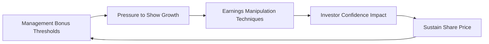

## Overview

In this section, we’re talking about something that might feel a bit uncomfortable: why companies manipulate earnings and what conditions set the stage for it to happen. True, no one wants to believe a management team might bend the rules, but, well, it happens more often than you’d think.

In my early days as a junior analyst (long before smartphones were a thing), I remember sifting through a company’s footnotes and thinking, “Huh, this doesn’t quite add up.” That nagging feeling turned out to be an early sign of potential earnings manipulation. It’s stories like these that remind me: understanding motivations and conditions for earnings manipulation is essential for any diligent analyst. It’s not just an academic exercise.

Below, let’s explore what encourages managers to “cook the books,” how to spot the surroundings that make it easier, and why it all matters for financial statement analysis.

## Key Motivations Behind Earnings Manipulation

### Meeting or Beating Analyst Forecasts
One of the big reasons companies manipulate earnings is that they’re under huge pressure to “meet the number.” There’s a lot riding on matching or exceeding projections from external analysts: share price stability, investor confidence, and executive reputation. When a single penny difference per share in reported earnings can move the market, the temptation to fudge results is undeniable.

1. Avoiding Negative Market Reactions  
   Missing an earnings consensus often sends a company’s share price tumbling. Executives may fear disappointing the market more than facing internal accounting complexities.

2. Preserving Management Credibility  
   Repeatedly exceeding or at least matching forecasts buries doubts about management competence. Even a small shortfall can cause a barrage of pointed questions during the earnings call.

### Achieving Management Bonus Thresholds
Many executive compensation plans tie big bonuses and stock option grants to short-term performance targets. If net income or earnings per share (EPS) is off by even a small margin, those lucrative payouts might evaporate. This structure—where large sums of money hinge on near-term results—can drive some managers to recognize revenue prematurely or shift expenses so that they don’t show up until the next reporting period.

In fact, it’s not unusual to find compensation committees dividing executive pay into base salary, bonus, and equity components that all revolve around the same earnings figure. With so much at stake, short-term success can overshadow long-term sustainability or ethical standards.

### Sustaining Elevated Share Prices
Executives often talk about “creating shareholder value.” But if a company’s shares have soared on lofty earnings growth expectations, there may be extra impetus to keep the momentum going—sometimes at any cost. If numbers dip, that inflated share price might begin to shrink, jeopardizing everything from employee morale to future growth plans. A lot of management teams are reluctant to risk losing what they’ve worked so hard to build. This dynamic fosters an environment where a little “financial smoothing” might feel justified to keep the ride going.

### Pressure to Show Continuous Growth
Markets love a good growth story. Repeatedly hitting quarter-over-quarter improvements—even if incremental—signals to investors that a company has its strategic act together. When industries are tough or the economy is sluggish, achieving respectable earnings growth can be nearly impossible. Managers may push their luck by deferring expenses or accelerating revenue recognition across quarter boundaries.

### Facilitating Big Bath Accounting During Economic Downturns
Sometimes, companies operating in a bad economic environment might decide to “take out the trash” all at once—this is called “big bath” accounting. The logic is straightforward: we’re already having an awful year, so why not report huge write-downs, close failing product lines, or take large restructuring charges? Then we can start clean when the market turns! This can inflate future earnings because the losses have already been recognized en masse in the previous period.

## Common Conditions That Enable Manipulation

### Weak Control Environment
A sagging control environment is the perfect breeding ground for fraudulent reporting. Think of it this way: when no one’s truly watching, it becomes easier to slip in questionable entries or skip required disclosures. The Committee of Sponsoring Organizations (COSO) framework emphasizes that a strong board, informed audit committees, thorough internal audits, and a clear tone from top management largely keep things on track. Without these checks, managers might find themselves free to manipulate results with little fear of consequences.

### Minimal Oversight from Boards or Audit Committees
Boards are supposed to act as watchdogs on behalf of shareholders—asking tough questions and challenging management. If boards are asleep at the wheel or if the audit committee lacks the necessary expertise (we see this in highly technical or fast-growing sectors), management can run circles around them. Even a well-intentioned committee can be overwhelmed if the company’s scale or complexity dwarfs the board’s capacity to supervise.

### High Uncertainty and Rapidly Evolving Industries
Industries dealing with intangible assets—think pharmaceutical patents, software licenses, or cutting-edge R&D—live with extensive guesswork in valuations. Management has significant discretion to estimate intangible asset values, future revenue streams, or the timing of project success. Intangible assets under IFRS or US GAAP rely heavily on estimates of useful life and potential impairment. In super-fast industries, these estimates can quickly become stale or manipulated. The potential for earnings manipulation skyrockets if internal controls are not robust.

### Executive Compensation Structures Centered on Short-Term Results
We touched on this topic earlier, but it’s worth hammering home. When short-term metrics like quarterly earnings or annual EPS drive compensation, managers can be tempted to game the system. Reading the company’s proxy statement or compensation disclosures can reveal the weighting of metrics and highlight where manipulative behaviors might arise. Are stock option grants primarily tied to short-term sales targets? That might signal a vulnerability to overstated revenue or understated sales returns in the short run.

### Inadequate or Infrequent External Audits
Even the best external auditors can’t catch every manipulation if they only drop by once a year or rely too heavily on management-provided documents. If the auditors fail to probe deeper areas of judgment—like intangible valuations, revenue recognition cutoff tests, or related-party transactions—earnings manipulation could go undetected. Additionally, if the external auditors themselves are under cost or time pressure, critical audit procedures might be scaled back.

## Linking Motivations and Conditions

Let’s visualize the interplay between motivations and conditions. The following Mermaid diagram shows how management incentives, external pressures, and weak oversight converge to foster an environment ripe for manipulation:

In short, it can become a cycle. Management incentives feed the need to meet growth targets, which encourages manipulation, which in turn temporarily boosts investor confidence and share prices—thereby preserving or increasing management wealth. And so on.

## Practical Examples

1. Channel Stuffing  
   Picture a hardware manufacturer shipping excess products to distributors near quarter-end. This temporarily inflates revenue—distributors might only pay after the quarter closes, and eventually the company may see a flood of returned products. Yet, short-term earnings look better. This approach thrives when the board provides limited oversight and is used to meeting immediate earnings targets.

2. Artificial Expense Deferral  
   Let’s say a technology firm invests heavily in research and development. Instead of expensing out a batch of R&D costs, they reclassify some items as intangible assets (under IFRS or US GAAP) expecting them to have future economic benefits. The problem? Some might not truly meet the criteria for capitalization. By capitalizing, the company avoids recognizing expenses right away, thereby juicing up net income for the current period.

3. Overly Aggressive Goodwill Assumptions  
   Perhaps a firm acquires another company and records a large chunk of goodwill. A genuine annual impairment test under IFRS or US GAAP would require managers to reduce goodwill if the acquired business underperforms. However, management might “fudge” assumptions about future cash flows to avoid recognizing an impairment charge. This scenario is exacerbated by intangible nature and limited board oversight over the goodwill valuation process.

## Conditions That Heighten Risk

| Motivation/Condition                       | Example                                                  | Potential Impact on Financials            |
|-------------------------------------------|----------------------------------------------------------|-------------------------------------------|
| Meet Analyst Forecasts                     | Channel Stuffing                                         | Overstated Revenue, EPS                   |
| Achieve Bonus Thresholds                  | Delaying Operating Expenses                              | Overstated Net Income                     |
| Weak Control Environment                  | Lack of Segregation of Duties in Accounting              | Undetected Fraudulent Entries             |
| High-Rewards Compensation Structure       | Performance Share Units Tied to Quarterly Sales          | Overemphasis on Short-Term Gains          |
| Rapidly Evolving Industries/Intangible Assets | Overstated R&D Capitalization                            | Inflated Asset Base, Understated Expenses |
| Minimal or Ineffective Board Oversight    | Boilerplate Audit Committee Inquiries                    | Limited Scrutiny Over Complex Transactions|
| Big Bath Accounting                       | Large One-Time Restructuring or Impairment Charges       | Artificially Enhanced Future Profits       |

From the table, you can see how straightforward it is for exit strategies—like big bath accounting—to disguise underlying operational problems. This is particularly prevalent in cyclical industries, where a bad year can become an excuse for a massive reset.

## Evaluating Corporate Governance and Culture
Financial statement manipulation doesn’t happen in a vacuum. A company’s ethical climate, championed by top leadership, sets the stage for either high-integrity reporting or shady tactics. Analysts should:

• Examine the tone at the top: Has senior leadership historically been transparent, or do they dodge tough questions on earnings calls?  
• Observe the board’s composition: Is it filled with independent directors who possess relevant industry or financial expertise?  
• Study compensation plans: Does the plan emphasize short-term goals or longer-term, more balanced objectives?

## Impact on Investment Decisions
Misrepresented earnings can inflate price multiples and distort your valuation analysis. If you’re not careful, your Discounted Cash Flow (DCF) or relative valuation compares “fake” or inflated figures to industry peers. Eventually, manipulated numbers tend to unravel—leading to sudden share price plummets. That’s why no matter how healthy a company’s fundamentals appear, it’s critical to question the reliability of the reported figures.

## Final Exam Tips
• When tackling essay or item-set questions about earnings manipulation, look closely at a company’s motivations (e.g., compensation structures) and the conditions that enable them (e.g., weak oversight).  
• Pay attention to footnote disclosures around revenue recognition changes, intangible asset valuations, and the timing of expense recognition—these are prime hotspots for suspicious accounting.  
• Embrace a skeptical mindset. The CFA Institute code emphasizes professional skepticism and diligence; try to identify any red flags or contradictory statements in management’s commentary.  
• Use cross references, if available, to glean clues. For instance, the mismatch between revenue growth in Chapter 2 analysis and intangible asset valuations in Chapter 3 might signal potential manipulation.

## References and Further Reading
• Healy, P. M., & Wahlen, J. M. (1999). “A Review of the Earnings Management Literature and its Implications for Standard Setting.”  
• COSO (Committee of Sponsoring Organizations). Available at: https://www.coso.org  
• U.S. Securities and Exchange Commission Enforcement Actions: https://www.sec.gov  

## Test Your Knowledge: Earnings Manipulation Drivers and Conditions



### Which of the following is a primary motivation for companies to engage in earnings manipulation?

- [ ] To provide stronger guidance in the next fiscal year
- [x] To meet or exceed analyst forecasts
- [ ] To ensure regulators have clear oversight
- [ ] To reduce competition in the industry

> **Explanation:** One of the key motivators is the desire to align or exceed market expectations (analyst forecasts), which can sustain share prices and protect management’s credibility.

### A company decides to shift revenue from next quarter to the current quarter to meet its earnings target. Which condition most likely facilitated this manipulation?

- [x] Weak internal controls or oversight
- [ ] Large number of intangible assets
- [ ] Presence of a strong independent board
- [ ] Low-pressure industry environment

> **Explanation:** When managers can override or bypass controls without detection, it’s much easier to shift revenue recognition across periods.

### Which statement best defines “Big Bath” accounting?

- [ ] Deferring revenue recognition to inflate future earnings
- [x] Taking large write-downs in a single period to reset future periods
- [ ] Accelerating expense recognition slowly over multiple periods
- [ ] Shifting cost of goods sold to a non-operational expense category

> **Explanation:** “Big Bath” accounting involves consolidating or bunching negative impacts into one period, effectively setting a clean stage for the future.

### How do short-term executive compensation structures contribute to earnings manipulation?

- [ ] They unequivocally strengthen corporate governance and discourage manipulation
- [x] They encourage managers to focus on immediate performance, potentially by manipulating earnings
- [ ] They require managers to be entirely transparent about all accounting practices
- [ ] They reduce the importance of profit margins

> **Explanation:** Placing heavy emphasis on short-term gains may tempt executives to inflate current results—even at the expense of future credibility and accuracy.

### Which scenario describes an industry more prone to earnings manipulation?

- [ ] A slow-growing consumer staples sector with stable demand
- [x] A technology startup with primarily intangible assets and uncertain valuations
- [ ] A mature utility with fully transparent government regulation
- [ ] A non-profit organization with no net income requirements

> **Explanation:** Rapidly evolving industries with intangible or uncertain assets provide significant discretion for management estimates.

### What is the main danger when investors rely on manipulated financial statements?

- [x] Overvaluing the company and facing unexpected losses later
- [ ] Simplifying the compensation structure
- [ ] Enhancing their long-term investment returns
- [ ] Reducing the volatility of stock price movements

> **Explanation:** Earnings manipulation inflates valuations, which can lead investors to mindfully overpay for shares. Eventually, the true financials emerge, hurting investor returns.

### Why might a firm with minimal board oversight be more inclined to manipulate earnings?

- [x] Management’s actions face fewer challenges or questions
- [ ] New board members provide innovative ideas
- [x] The CFO is required to make all decisions
- [ ] The audit committee is extremely thorough

> **Explanation:** Without robust supervision, it’s easier for management to push boundaries without being questioned or held accountable.

### Which best characterizes “channel stuffing”?

- [ ] Delaying the recognition of expenses
- [ ] Taking large impairment charges in a downturn
- [x] Pushing excess products to distributors before the period ends
- [ ] Recognizing intangible assets for future R&D projects

> **Explanation:** Channel stuffing artificially boosts current-period revenue by shipping more products than distributors can realistically sell, potentially inflating short-term results.

### If you find a company repeatedly adjusting intangible asset assumptions to avoid impairment, which condition is most likely at play?

- [ ] Responsible management ethics policy
- [x] Weak control environment permitting questionable judgments
- [ ] Transparent and detailed footnote disclosures
- [ ] Accelerated depreciation methods for fixed assets

> **Explanation:** Regularly circumventing impairment charges by adjusting key assumptions indicates a possible weak control framework allowing manipulative “massaging” of intangible valuations.

### “Big Bath” accounting typically occurs during economic downturns and is intended to:

- [x] Consolidate negative events or charges so that future earnings appear stronger
- [ ] Aid in transferring liabilities to a captive subsidiary
- [ ] Eliminate all intangible assets from the balance sheet
- [ ] Ensure analysts have accurate forecasting models

> **Explanation:** Companies often lump multiple negative items into one reporting period (a “big bath”) to reset or clean up the balance sheet and inflate reported earnings in subsequent periods.


