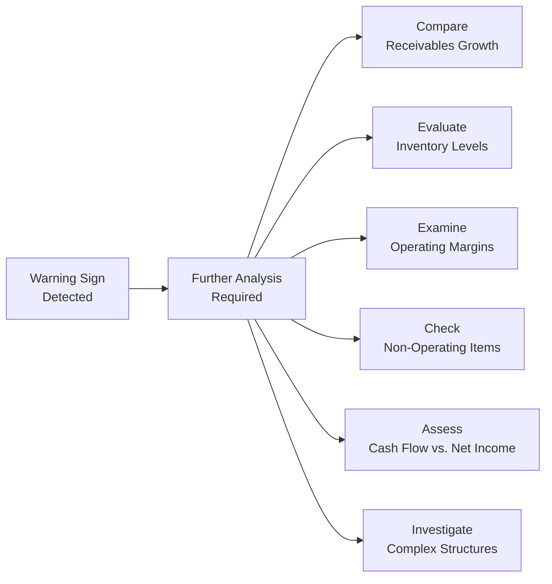

## Introduction

So, let's be honest: sitting down to read a company’s financial statement and trying to figure out if something fishy is going on can feel a bit daunting. Maybe you’ve heard a few horror stories about massive frauds—think Enron or WorldCom—that left everyone scratching their heads, wondering how the signs were missed. In this section, we’ll explore warning signs that might signal aggressive accounting practices or misreporting. These red flags often appear in everyday line items we tend to glance over—like receivables, inventory, margins, or non-operating gains. By the end of this discussion, you'll be able to spot clues that some deeper detective work might be necessary, especially if you suspect any risk to the “quality” of those reported numbers.

## Common Red Flags and Why They Matter

There’s no single foolproof formula that’ll scream “Fraud!” every time. Instead, most financial shenanigans start small, with subtle changes in normal patterns. Here’s a quick rundown of common red flags:

• Abnormal buildup in accounts receivable (relative to sales).  
• Unsurprising but suspicious surge in inventory not matched by demand.  
• Sudden spikes in operating margins without fundamental cause.  
• Frequent or inconsistent accounting policy changes.  
• A high ratio of non-operating or one-time gains to net income.  
• Wide divergence of cash flow from operations (CFO) vs. reported net income.  
• Complex organizational structures using off-balance-sheet entities.  
• Unusual variability in key metrics discovered via trend analysis.  

These clues may hint at everything from revenue recognition issues to aggressive cost deferrals. In any case, they’re worth investigating thoroughly.

## Receivables Growth vs. Sales Growth

One of the easiest ways to detect potential revenue overstatement is by looking at accounts receivable (AR) growth compared to revenue growth. You’d naturally expect receivables to climb in line with sales. However:

• If AR is growing much faster than revenue, well, that’s a sign your company might not be collecting cash as promptly as it’s recording sales.  
• A bigger-than-expected AR may also be an early indicator of channel-stuffing: goods shipped to distributors mainly to book revenue earlier than it’s actually earned.

In Chapter 2 (Analyzing Income Statements) we discussed revenue recognition rules. Those IFRS 15 or ASC 606 guidelines become front-and-center here: revenues should be recognized when “control” of goods or services passes to the customer, not merely at the time of shipping. A big gap between AR and real cash from customers might be your first clue that something is off.

## Inventory Surges and Potential Write-Downs

Occasionally, companies ramp up production in anticipation of major demand, only for that demand to flop. It happens. But if you notice that inventory is ballooning, especially without a matching sales forecast, it might be a red flag for either:

• Imminent inventory write-downs if goods are no longer saleable at standard margins.  
• Potential channel-stuffing if the reported “sales” are actually just pushing unneeded inventory onto distributors.  

The inventory turnover ratio—calculated as (Cost of Goods Sold ÷ Average Inventory)—is a quick check. If that ratio declines steadily (meaning the company’s “turning” inventory more slowly), you might have a buildup in inventory that hasn’t yet been recognized as obsolete or stale. That can eventually lead to big hits on the income statement if everything must be written down at once.

## Sudden Spikes in Operating Margins

Let’s suppose that out of nowhere, the company’s operating margin jumps from 15% to 25% in a quarter—without any real change in the broader business environment. Sure, that jump may be legitimate (like a competitor leaving the market or a terrific new product line). But it may also reflect under-accrued expenses, insufficient reserves (like for warranty or litigation), or manipulation of cost allocations. Either way, it deserves closer scrutiny.

### A Quick Personal Take

I recall analyzing a firm that made a big fuss about cutting costs and boosting margins. Everything looked phenomenal... until we realized they just deferred a bunch of ordinary expenses into the next reporting period. In other words, they “pushed” expenses onto future income statements while reaping short-term gains in reported profits.

## Frequent Accounting Policy Changes

Switching between approved accounting methods—say, changing from FIFO to weighted-average cost for inventory valuation—can be legitimate. But if you see a company switch methods more often than usual, it can be suspicious. Each policy shift can produce a one-time bump (or slump) in reported earnings. Analysts should evaluate whether changes are:

• Transparent: Are motivations for switching methods clearly explained by management?  
• Consistent with industry norms: If it’s out of left field compared to peers, that’s worth investigating.  
• Properly disclosed: IFRS and US GAAP require footnote disclosures that detail how accounting policy changes affect comparability.

## Non-Operating or One-Time Items as Profit Drivers

Sometimes, a big chunk of net income doesn’t actually come from core operations but from, say, asset sales or an accounting revaluation. In small doses, that’s normal—businesses occasionally sell buildings or intangible assets. But if these non-operating items become a sizeable portion of net income, it could signal:

• The company’s core business may be underperforming.  
• Management is reliant on transitory gains—like revalued investments or random sales of property—to meet earnings targets.  

In Chapter 2, we introduced the concept of recurring vs. nonrecurring items. It’s crucial to isolate one-time items when analyzing a firm’s sustainable earnings power. 

## Cash Flow from Operations vs. Net Income

Here’s another big one: if a firm consistently shows robust increases in its reported net income, but operating cash flow lags (or even declines), that mismatch can indicate:

• Over-aggressive revenue recognition (booked top-line revenue not backed by real cash).  
• Inadequate recognition of expenses (deferring them or hiding them).  

Yes, seasonal factors or cyclical swings can create legitimate differences in short-term net income vs. CFO. But over multiple periods, large discrepancies typically demand a second look. Check Chapter 4 (Analyzing Statements of Cash Flows) for a refresher on the direct and indirect methods, and how to reconcile net income to CFO.

## Complex Organizational Structures

Off-balance-sheet entities (often referred to as special purpose entities or variable interest entities) aren’t necessarily evil. They can be used legitimately for risk management (for instance, securitization of receivables). However, complicated structures can also hide liabilities or artificial sales. If you find that the footnotes reference numerous unconsolidated affiliates or peculiar partnership arrangements, you’ll want to:

• Review how these entities are financed and whether the parent bears actual risk.  
• Assess whether the parent is artificially inflating sales or lowering debt.  
• Compare IFRS 10/12 and ASC 810 disclosures. Who truly controls these entities?

No matter how fancy the structure, if an entity is effectively controlled by or depends on the parent, consolidation is usually required under IFRS or US GAAP. So unusual references to “variable interest,” “equity method,” or “proportionate consolidation” might be your clue to dig deeper (see Chapter 10 for more on intercorporate investments).

## Trend and Ratio Analysis for Detection

When in doubt, put your detective hat on and look at past metrics. Many times, a single quarter might look odd for innocent reasons—maybe a one-off contract or a short-lived spike in commodity prices. But if a pattern of suspicious activity persists:

• Analyze multi-period common-size statements.  
• Compare ratio trends (e.g., debt-to-equity, receivables turnover, inventory turnover).  
• Benchmark results against peers and the broader industry.  

Material shifts in these metrics year over year often tell a story that the standard income statement might not fully reveal.

## A Visual Overview of Warning Signs

Here’s a simple diagram to illustrate the flow of identifying potential red flags and then diving deeper into each area:

Use this framework in your own analysis as a quick roadmap for digging into potential trouble spots.

## Illustrative Example

Picture a mid-sized manufacturing firm, Delta Manufacturing, seeing rapid sales growth in the last few quarters. The problem is that its cash collections haven’t kept pace—every quarter, receivables jump by 30–40%, while sales only climb by 10%. On top of that, the footnotes reveal the company changed its revenue recognition policy from percentage-of-completion to a completed-contract method—yet it doesn’t thoroughly explain why. Their net income looks great on paper, but their operating cash flow is negative. That discrepancy should set alarm bells ringing. Maybe the new accounting policy is inflating recognized revenue, or maybe Delta’s piling up inventory to artificially boost reported earnings.  

If you see a scenario like this, your next step would be a deeper investigation: talk to management, compare AR aging schedules, check how quickly prior quarter receivables get collected, and see if there’s a legitimate justification for the policy change. 

## Best Practices and Pitfalls

• Don’t jump to conclusions without thorough analysis. Sometimes an odd ratio can be explained by a unique event or an industry-specific cycle.  
• Maintain professional skepticism—particularly if balancing items in the statement of cash flows or footnotes contain unusual references.  
• Keep an eye on how the audit opinion ties in. (In Chapter 1, we discussed how auditors communicate critical matters in their report.) If auditors highlight “material uncertainties,” it’s worth paying attention.  
• Compare IFRS vs. US GAAP differences. Some items (like inventory methods) can differ slightly, and a firm’s choice of method can have bigger or smaller impacts depending on the environment (e.g., inflationary vs. deflationary).  

## References and Additional Resources

• Mulford, C., & Comiskey, E. (2005). “Creative Cash Flow Reporting.”  
• KPMG’s “Global Fraud Survey” and risk alerts: https://home.kpmg  
• PCAOB (https://pcaobus.org) resources on detecting financial statement fraud.  

For a more in-depth look, consider reviewing the real cases of corporate misreporting—like the SEC’s enforcement actions—and see how these red flags materialize in practice. Many of those “case files” are publicly available.

## Practical Exam Tips

• Familiarize yourself with real-world cases of inflated revenues or hidden liabilities—these can serve as memorable examples in the exam’s scenario-based questions.  
• Master the calculation of key ratios: receivable turnover, inventory turnover, and operating margin are typically tested.  
• Practice interpreting footnotes. The exam often includes footnote data or disclosures that contain the main clues.  
• Watch out for “trick” questions that highlight apparently random changes in an accounting policy or big balance sheet swings—odds are they’re there for a reason.  

## Test Your Knowledge: Identifying Financial Statement Red Flags



### Which scenario most strongly suggests the possibility of aggressive revenue recognition?

- [ ] Inventory rising 5% while sales grow by 20%  
- [x] Accounts receivable increasing 40% while sales grow by 10%  
- [ ] Gross margin remaining constant across multiple periods  
- [ ] Operating expenses decreasing by 2% with stable revenue  

> **Explanation:** A disproportionate increase in accounts receivable compared to sales indicates the firm might be recording revenue that won't be collected soon (or at all).  

### The firm’s direct competitor has suddenly closed shop. Management claims that caused a significant jump in margins. If the spike in operating margins doesn’t align with industry trends, which suspect practice could be at play?

- [ ] Channel-stuffing  
- [ ] Increased capital expenditures
- [x] Under-accrual of expenses  
- [ ] Aggressive expansion into new markets  

> **Explanation:** A sudden, unexplained margin spike might indicate under-accrual of routine expenses (or other manipulations of costs), especially if broader industry factors don’t support that performance.  

### Frequent changes in accounting policies (such as switching back and forth among permissible inventory valuation methods) are concerning because:

- [ ] All policy changes automatically result in SEC sanctions.  
- [x] They can mask underlying trends and distort period-to-period comparisons.  
- [ ] They are typically prohibited under IFRS.  
- [ ] They have no real impact on a company’s financial statements.  

> **Explanation:** Switching methods often makes comparisons difficult, raising the risk that management might be using these changes to manipulate earnings.  

### Which statement best describes channel-stuffing?

- [ ] Deliberately deferring revenue to future periods to smooth earnings.  
- [x] Shipping more products to distributors than they can sell in the near term.  
- [ ] Recording revenue only when cash is received.  
- [ ] Recognizing COGS before the goods are shipped.  

> **Explanation:** Channel-stuffing refers to pushing excess product onto distribution channels primarily to record revenue earlier than is justified by actual end-customer demand.  

### What is a likely outcome of a consistent discrepancy where net income is much higher than operating cash flow over multiple periods?

- [x] Suspicions about over-aggressive accrual of revenue  
- [x] Risk of an eventual restatement  
- [ ] Enhanced liquidity in the short term  
- [ ] Lower interest expense  

> **Explanation:** When net income outpaces operating cash flow for an extended time, it could mean the firm is aggressively accruing revenues or deferring expenses and may need to restate earnings later.  

### A company’s footnotes reveal several unconsolidated special purpose entities (SPEs) that carry debt. Why might this be a red flag?

- [x] The firm may be using SPEs to keep liabilities off its balance sheet.  
- [ ] SPEs are always illegal in most jurisdictions.  
- [ ] It automatically violates IFRS consolidation requirements.  
- [ ] It typically indicates a thriving joint venture.  

> **Explanation:** SPEs or off-balance-sheet entities are often used to hide liabilities or inflate revenues, so analysts should carefully evaluate the structures for potential misstatement of obligations.  

### If a company’s inventory turnover ratio has steadily fallen over three years, which of the following is/are possible?

- [x] The buildup of obsolete inventory  
- [ ] A rise in short-term borrowing costs  
- [x] Potential for future write-downs  
- [ ] Increase in intangible assets  

> **Explanation:** A falling inventory turnover ratio typically indicates slower movement of goods, which may lead to higher risk of obsolescence and potential write-downs.  

### Which statement about non-operating gains is correct?

- [x] They can inflate total net income despite weak core operations.  
- [ ] Unlike operating income, non-operating gains are tax-exempt.  
- [ ] They are the primary source of revenue for most firms.  
- [ ] They cannot be identified separately in the income statement.  

> **Explanation:** Non-operating gains (e.g., asset sales or fair value adjustments) can significantly boost net income in the short term but don’t necessarily reflect core business performance.  

### Which of the following combined issues creates a strong hint of manipulated earnings?

- [ ] Stable AR and slightly declining margins  
- [ ] Higher CFO vs. net income in consistently profitable years  
- [x] Frequent accounting policy changes, surging receivables, and negative CFO  
- [ ] A one-time gain from real estate sales  

> **Explanation:** Multiple red flags—such as frequent policy shifts, high receivable growth, and negative cash flow from operations—together create a strong indication of possible earnings manipulation.  

### Auditors’ communication that highlights “material uncertainties” in the going concern opinion suggests:

- [x] An increased level of risk surrounding the company’s ability to continue operations  
- [ ] Immediate bankruptcy filing by the company  
- [ ] Reversal of prior period’s revenue  
- [ ] That the board of directors must resign  

> **Explanation:** A going concern qualification or mention of “material uncertainties” by auditors signals heightened risk that the firm may not meet obligations, which often warrants a closer look at potential red flags.  


