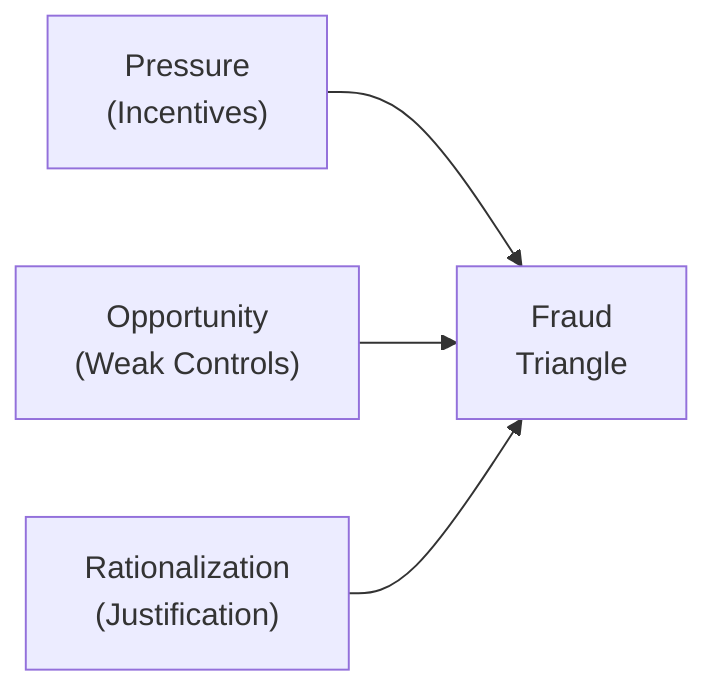

**The Fraud Triangle and Its Core Drivers**  
When analyzing instances of financial statement manipulation, people often ask: “Why in the world would executives tamper with the books?” Well, the Fraud Triangle is a classic framework providing a neat explanation. It states that fraud typically occurs when three forces interact: Pressure, Opportunity, and Rationalization. In simpler terms, it might look like this: a manager experiences enormous pressure to hit an earnings target; the organization has weak internal controls that provide an opportunity to manipulate certain accounts; and the manager rationalizes that it’s “a temporary fix” or that “everyone else in the industry does it.”  

Below is a visual representation of the Fraud Triangle, showing how each of these three elements converges:

**Pressure**  
Pressure can stem from a variety of sources. Companies might be locked in fierce competition, or they might face tight debt covenants. Let’s say I once chatted (casually) with a CFO friend who felt compelled to "smooth" earnings to avoid triggering a covenant breach on the company’s large refinancing package. While they didn’t commit fraud, the temptation to “fix the numbers just a bit” was significant. This type of scenario captures how a pressing financial or operational objective can very easily tilt someone toward unethical behavior.  

This pressure doesn’t always need to be external. It can come from top management’s internal performance targets or bonuses tied heavily to short-term results. When quarterly targets drive significant stock price fluctuations, managers might feel they have no option but to manipulate the reported numbers to keep investors happy, or to avoid losing their job.  

**Opportunity**  
Opportunity arises when an environment allows employees or management to “get away with it.” Even if individuals are under intense pressure, they might not commit fraud if the controls are strong and the board is vigilant. But if oversight is lacking—say, the audit committee is inactive, or the CFO can override internal controls—fraud becomes much more feasible.  

Weak or outdated procedures can also create opportunities. In some organizations, a single individual might handle everything from vendor creation to invoice approval. Without checks and balances, financial manipulations can go unnoticed. On top of that, complex organizational structures (including far-flung subsidiaries and special purpose entities) can obscure transactions, providing unscrupulous managers with enough confusion to disguise improper entries.  

**Rationalization**  
Rationalization is the final piece of the puzzle. Even under great pressure and with ample opportunity, many individuals still need an internal justification. They might tell themselves:  
- “I’ll fix the numbers just this quarter, then we’ll be back on track.”  
- “I’m not stealing—just moving some revenue forward.”  
- “Everyone in this industry is doing it.”  

Rationalizations can be surprisingly powerful. Over time, they can become deeply ingrained, leading to more extensive fraud that is harder to unwind. Some find themselves in so deep that they continuously commit new fraud to avoid being caught for the old fraud.

**Link to Corporate Governance**  
Corporate governance aims to keep these three forces under control. When properly implemented, strong governance mechanisms reduce the chance of fraudulent activities, thus supporting higher-quality financial reporting. A strong board, effective audit committee, and robust internal controls all act as barriers to major missteps.  

Shareholders rely on governance structures to serve as guardians of their interests. As a result, regulators and standard-setters encourage—and often require—firms to implement governance practices aligned with best-in-class frameworks.  

**Key Governance Structures and Roles**  
• Engaged Board of Directors: The board sets the ethical tone and provides overall strategic guidance. It also ensures management’s decisions align with shareholders’ best interests. Strong boards have independent members who are not afraid to challenge executive decisions, especially if they suspect improprieties.  

• Effective Audit Committee: A specialized committee within the board structure, responsible for overseeing financial reporting and interacting with external auditors (for more on regulatory filings and auditors’ reports, see Chapter 1, Section 1.3). If the audit committee is inactive or lacks the right expertise, that creates an “opportunity” sweet spot for possible manipulation.  

• Fiduciary Duty: Directors have a legal obligation to act in the best interest of the shareholders. This includes supervising major financial decisions, ensuring that financial reporting accurately reflects management’s actions, and that the company abides by relevant regulations.  
 
• Internal Controls: These are the policies and procedures designed to ensure reliability in financial reporting. Imagine a scenario where a single employee can initiate and approve payments without any review—this is practically an invitation for errors or fraud. Strong internal controls typically require segregation of duties, dual approvals, and systematic reconciliations.  

• Whistleblower Mechanisms: Having an anonymous tip line where employees can safely report misconduct reduces the chance that fraud goes undetected. It also deters potential fraudsters, who know that any wrongdoing could be traced back if vigilant employees are empowered to speak up.  

**Practical Example**  
Consider a mid-sized manufacturing company with the following situation:  
• It faces pressure to meet bank-imposed covenants requiring a minimum debt-service coverage ratio.  
• It has a relatively new chief accounting officer who also oversees the company’s entire finance department, from payroll to accounts receivable—creating an opportunity to manipulate records.  
• The chair of the audit committee, though well-intentioned, is unsure about the details of complex revenue recognition rules and rarely challenges management’s statements, enabling further opportunity.  
• Under the stress of looming covenant violations, the accounting officer rationalizes that “It’s only pulling future sales forward a bit. Once we close that new customer deal next quarter, everything will balance out.”  

In such a case, you have the perfect recipe for a fraud to occur: strong pressure, low oversight, and a mental justification.  

**Mitigating the Fraud Triangle Through Strong Corporate Governance**  
Because each component in the Fraud Triangle feeds off the others, measures to strengthen governance often aim at multiple elements simultaneously:  

• Reducing Pressure: Aligning compensation structures with long-term performance rather than short-term results can help. Transparent communication with lenders about potential covenant breaches might reduce the pressure to meet unrealistic expectations.  

• Minimizing Opportunity: Ensure that the board and its committees are active and able to challenge management. Implement robust internal controls following recognized frameworks (like COSO) and conduct regular audits to verify compliance. Use control dashboards and real-time analytics to spot anomalies.  

• Countering Rationalization: Cultivate an ethical culture from top to bottom. Many organizations use codes of conduct, required annual ethics training, or having visible leadership that demonstrates integrity. This can make it harder for employees to justify unlawful acts.  

**Analyst Angle: Evaluating Governance Risk**  
As a financial analyst, especially in security selection or in performing due diligence, it’s key to evaluate corporate governance disclosures. Look for:  
• Board Independence: A fully independent board has fewer conflicts of interest when supervising management.  
• Qualifications of Directors: Industry expertise and experience are vital.  
• Audit Committee Quality: Do the audit committee members have the necessary accounting or financial background?  
• Whistleblower Protections: Does the company encourage internal reporting without fear of retaliation?  
• History of Governance Failures: Has the company previously faced enforcement actions or restatements?  

If you find a pattern of restatements in the past (see Chapter 12.4 on Identifying Warning Signs), that might hint at deeper governance or control weaknesses. 

**Common Pitfalls and Challenges**  
Though best-practice guidelines exist, implementing governance reforms can be tricky. Sometimes boards are overly deferential to charismatic CEOs; or the company culture punishes people who speak out. Additionally, global operations involving many jurisdictions may create complexity that can mask issues. It’s also possible that, even in well-governed firms, a determined insider can override controls. Analysts must stay vigilant and look beneath surface-level governance claims.  

**Beyond the Basics: Corporate Governance in Practice**  
Major accounting scandals frequently involve governance breakdowns (e.g., insufficient board oversight, a dominant CEO overshadowing dissenting voices, or absent whistleblower processes). The massive bankruptcies of the early 2000s (Enron, WorldCom) and other more recent global controversies demonstrate that large-scale fraud can brew slowly and remain hidden until it’s too late.  

While the board and its committees are not day-to-day managers, they do set the tone for the organization. Schemes often begin small, possibly fueled by pressure from short-term earnings targets. Over time, as the deception grows, it gets entangled with the company’s broader financial statements, eventually reaching a point of no return.  

**Exam Tips — Bringing Governance into Your Analysis**  
When approaching exam questions (especially constructed-response formats at Levels II and III of the CFA Program), you may encounter scenarios that describe a company’s governance structure and internal controls. Tips include:  
• Identify any red flags regarding board independence.  
• Review the alignment of performance metrics and executive compensation.  
• Assess the internal control environment for likely weaknesses or overrides.  
• Connect these weaknesses to fundamental financial ratios and potential for misstated earnings.  

The exam will often ask you to link the possible governance issue back to the broader financial statement implications. For instance, if a question indicates that the CFO has unilateral authority to approve all journal entries, that signals a prime “opportunity” in the Fraud Triangle—discuss how that might lead to misrepresentation of net income or asset values.  

**References, Further Reading, and Resources**  
• Association of Certified Fraud Examiners (ACFE): https://www.acfe.com  
• COSO Internal Control – Integrated Framework: https://www.coso.org  
• Beasley, M. (1996). “An Empirical Analysis of the Relation Between the Board of Director Composition and Financial Statement Fraud.”  
• For more on fraud detection techniques and red flags, see earlier discussions in Chapter 12.4, and relevant sections on auditor responsibilities in Chapter 1.3.  

  
## Test Your Knowledge: Fraud Triangle and Corporate Governance



### Which of the following examples best illustrates “Pressure” in the Fraud Triangle?

- [ ] A weak internal control environment allowing management to override approvals.  
- [x] A CEO facing an aggressive earnings target tied to personal bonus compensation.  
- [ ] An employee rationalizing fraudulent transactions by saying, “Everybody does it.”  
- [ ] A credit analyst ignoring the need for additional documentation.  

> **Explanation:** Pressure involves an incentive or motivation to commit fraud, such as an earnings target or personal bonus.

### A robust audit committee helps mitigate which aspect of the Fraud Triangle most directly?

- [x] Opportunity  
- [ ] Pressure  
- [ ] Rationalization  
- [ ] All three components simultaneously  

> **Explanation:** An active, well-informed audit committee primarily addresses “Opportunity” by strengthening oversight and reducing weak control environments.

### What does a whistleblower mechanism primarily accomplish?

- [ ] Increases pressure on employees to meet targets.  
- [x] Provides a channel to report potential fraud, reducing undetected opportunities.  
- [ ] Encourages employees to rationalize ethical behavior.  
- [ ] Minimizes disclosure requirements to regulators.  

> **Explanation:** A whistleblower channel lowers opportunity for fraud to remain hidden, since employees can safely disclose wrongdoing.

### Which statement is most aligned with “Rationalization” in the Fraud Triangle?

- [ ] “We must achieve 10% growth or shareholders will lose confidence.”  
- [ ] “If nobody checks these accounts, we can hide losses here.”  
- [x] “I’ll just borrow next quarter’s revenue. We’ll fix it back once new sales close.”  
- [ ] “The CFO has oversight for expense approvals.”  

> **Explanation:** Rationalization involves the internal justification, such as explaining manipulative actions as merely “borrowing next quarter’s revenue.”

### Which board-related factor most effectively decreases the “Opportunity” component?

- [x] Having independent directors who actively question management decisions  
- [ ] Tying all director compensation solely to short-term share price  
- [ ] Replacing the audit committee with a compliance officer  
- [ ] Outsourcing internal controls to external consultants  

> **Explanation:** Active, independent directors curb “Opportunity” by providing genuine oversight and preventing unchecked power by management.

### A firm’s code of ethics, which promotes honesty and accountability, mainly targets which part of the Fraud Triangle?

- [ ] Opportunity  
- [ ] Pressure  
- [x] Rationalization  
- [ ] It does not address the Fraud Triangle directly  

> **Explanation:** A strong ethical code aims to reduce the likelihood that individuals can justify wrongdoing—thus addressing rationalization.

### How can reducing overly aggressive bonus targets mitigate fraud risk?

- [ ] By creating more complex financial reporting structures  
- [ ] By giving employees unlimited authority over accounts  
- [ ] By loosening the external audit scope  
- [x] By lowering the pressure to manipulate results  

> **Explanation:** Eliminating extreme bonus incentives can reduce the pressure factor that might tempt employees to commit fraud.

### What is the primary fiduciary duty of the board in relation to financial reporting?

- [ ] To prepare the company’s annual financial statements themselves  
- [ ] To implement day-to-day operational changes  
- [ ] To set short-term earnings estimates for analysts  
- [x] To ensure that the financial reporting process accurately reflects the company’s performance  

> **Explanation:** The board must oversee management and confirm that financial reports are a reliable reflection of corporate performance.

### Which of the following best describes the importance of an active audit committee to analysts?

- [x] It suggests oversight that reduces the risk of manipulated numbers.  
- [ ] It makes external financial statements less transparent.  
- [ ] It generally inflates audit costs without adding value.  
- [ ] It ensures that dividend policies always benefit minority shareholders.  

> **Explanation:** From an analyst’s perspective, effective audit committee oversight reduces manipulated reporting and offers greater confidence in the financials.

### True or False: A single inexperienced individual managing all financial records is an example of proper internal control.

- [x] True  
- [ ] False  

> **Explanation:** This statement is actually false when taken literally, but watch carefully: the question highlights an obviously weak control scenario. In a well-run environment, you would not have one individual controlling everything. This scenario is ripe for fraud. The question is exploring your ability to recognize an internal control weakness.  


