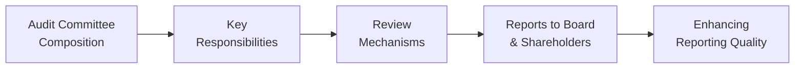

## Introduction

Have you ever tossed and turned the night before a big presentation, wondering if you’ve done everything right? That feeling—of double-, triple-checking every detail—is sort of like the role of an audit committee. They lie awake at night ensuring the numbers behind a company’s financial statements are carefully vetted, that the firm’s internal controls are robust, and that the external auditors remain impartial. An effective audit committee is the key to enhancing financial reporting quality, which not only helps a company stay compliant with regulations but also boosts investor confidence. 

Much of the auditing and oversight process goes on behind the scenes, but it’s crucial. In my early days as an analyst, I once sat in on a board meeting (by pure luck, honestly) and saw the audit committee place some pretty tough questions to management about their revenue recognition assumptions. At first, I was like, “Um, is this normal?” But hearing the back-and-forth definitely put me at ease—knowing someone was watchdogging the numbers in real-time. In this section, we’ll explore why audit committees exist, what they do, how they do it, and why their responsibilities matter to analysts, investors, and regulators alike.

## Understanding the Role of the Audit Committee

The audit committee is a specialized operating committee of a company’s board of directors, charged with overseeing financial reporting obligations, internal and external audits, and internal controls. Their function is vital for ensuring that the company’s financial statements fairly reflect its operations and comply with relevant accounting standards—be that IFRS or US GAAP.

The Sarbanes-Oxley Act (SOX), particularly Sections 301–303, formalizes many of the contemporary responsibilities of audit committees in the United States, including selecting and overseeing external auditors and monitoring the firm’s internal audit function. Globally, a variety of corporate governance codes reflect similar requirements, though the specific powers and obligations of audit committees can vary by jurisdiction.

### Independence and Expertise

One key hallmark of a reliable audit committee is its independence. Committee members must have the authority and autonomy to question management without fear of retribution or undue influence. Independence also helps ensure decisions are made objectively, especially in areas such as challenging subjective estimates (like goodwill impairments or deferred tax valuation allowances).

Expertise plays just as big a role. At least one committee member should qualify as a “financial expert”—someone familiar with GAAP/IFRS financial statements and capable of understanding complex accounting standards and auditing processes. Analysts and investors typically like to see members with auditing or CFO experience, since it instills confidence that technical issues are handled competently.

### Key Responsibilities

Audit committees juggle a broad range of duties to promote high-quality reporting:

• Oversee External Audit: The committee appoints, compensates, and evaluates the external audit firm, ensuring that it maintains independence. The committee reviews audit plans, key findings, and management letters.  
• Monitor Internal Audit Function: Many companies have an internal audit team that evaluates the effectiveness of internal controls and risk management procedures. The audit committee regularly meets with these internal auditors to discuss findings and recommendations.  
• Assess Accounting Policies and Estimates: The committee should review critical accounting judgments, ensuring management’s estimates (like allowances for doubtful accounts or revenue recognition approaches) are reasonable and in line with relevant standards.  
• Evaluate Internal Controls: They track potential weaknesses—often referred to as “material weaknesses”—that, if not corrected, could lead to misstated financial statements.  
• Communicate with Board and Shareholders: The audit committee shares its findings with the broader board and often provides summaries of oversight activities in the company’s annual proxy statement or governance report.  
• Set Risk Assessments and Review Mechanisms: They stay alert to evolving risks (e.g., cybersecurity, new product lines) and ensure the company has processes for identifying, measuring, and mitigating those risks.  
• Ensure Regulatory Compliance: The committee tracks regulatory scrutiny, from the Securities and Exchange Commission (SEC) in the U.S. to relevant oversight bodies in other jurisdictions, ensuring the firm meets required disclosures and remains transparent.

### Why Independence and Expertise Matter

An effective audit committee can mean the difference between robust financial disclosures and a scenario riddled with potential misstatements or, worse, fraud. Composition is crucial: if a committee isn’t independent, members might shy away from challenging management. And if it lacks finance-savvy professionals, they might miss the subtle red flags in accounting judgments—like overly optimistic assumptions in intangible asset valuations. 

Consider IFRS vs. US GAAP differences. A “financial expert” with deep knowledge in both might see how IFRS requires different judgment areas—like revaluation models for assets—and ensure the company’s policies remain consistent and thorough. Without that expertise, the company could inadvertently violate reporting standards, surprising analysts and investors with confusing restatements.

## Mechanisms for Oversight

Let’s depict a simplified view of the audit committee’s activities:

As shown in the diagram, everything starts with the right people on the committee (A). These members carry out key responsibilities (B), which includes setting up review mechanisms (C). Results flow up to the board and, ultimately, to shareholders (D and E). Each step in that chain matters for transparency and accuracy.

### Audit Committee Charter

The responsibilities of the audit committee are often enshrined in the “Audit Committee Charter.” This document lays out the committee’s authority, structure, processes, and accountability. It usually covers:  
• Frequency and format of meetings (often quarterly, plus additional sessions as needed).  
• Procedures for engaging independent counsel or advisors (if required).  
• Scope of oversight, especially regarding risk assessments and internal control reviews.  

Well-designed charters often include escalation processes—basically, instructions on what to do if the committee identifies major issues or repeated internal control lapses.

### Internal Audit Function

Companies frequently have an “internal audit” team dedicated to evaluating the effectiveness of internal controls, compliance, and operational efficiency. The audit committee works closely with this team to:

• Review Annual Audit Plans: The internal audit function proposes an annual plan detailing what parts of the business they’ll examine. The committee then suggests adjustments or emphasizes areas of higher risk.  
• Discuss Findings: If internal audit discovers a “material weakness” or sees repeated errors in the accounting process, these findings are shared with the committee.  
• Monitor Remediation Efforts: The internal audit function ensures issues identified get addressed. The committee ensures management devotes sufficient resources to fix these problems.

### External Audit Coordination

The “external audit” is a critical check on a firm’s financial statements. They assess whether the statements give a true and fair view (IFRS) or are fairly presented (US GAAP). The audit committee:

• Approves Audit Fees and Scope: They ensure the auditing firm has the resources and independence to perform a thorough review.  
• Reviews Key Issues: These might include complexities around revenue recognition, intangible asset valuation, or consolidation of variable interest entities.  
• Challenges Unusual Items: If management has used an unusual or aggressive approach in, say, provisioning for bad debts, the audit committee will ask the external auditor for an independent viewpoint.  
• Protects Independence: The committee oversees non-audit services (like consulting or tax advice) that the external audit firm might provide, ensuring these do not create conflicts of interest.

## Meeting Schedule and Communication

An audit committee typically meets at least quarterly, though additional meetings might be called to address urgent matters—like compliance concerns raised by regulators. The committee typically holds:

• Private Sessions with Management: To discuss pending issues.  
• Private Sessions with Internal Audit: This helps ensure internal auditors can speak freely about potential weaknesses or disputes.  
• Private Sessions with External Auditors: So that external auditors can voice concerns without management present.  

Frequent communication is important. If suspicious accounting issues crop up, the last thing you want is for them to simmer all year and only get addressed right before the annual report is published. 

## Enhancing Reporting Quality

### Reviewing Significant Estimates

Financial statements are rife with judgments—estimates around depreciation, intangible asset impairment, pension funding, etc. The audit committee is responsible for reviewing and challenging these estimates to ensure they align with industry norms and relevant standards. If, for instance, the committee notices that a company’s allowance for doubtful accounts is extremely low compared to peers in the same sector, they’d question management—and the external auditor—about how they arrived at that figure.

### Ensuring Ethical Culture and Governance

An environment that fosters ethical behavior often translates into fewer reporting irregularities. The audit committee plays an indirect but influential role in shaping corporate culture. By emphasizing strong controls and transparency—and by taking immediate action on red flags—the committee sets the tone that accurate reporting is non-negotiable.

### Handling Material Weaknesses

A “material weakness” occurs when there is a reasonable possibility that a material misstatement could show up in the financial statements undetected. Examples include insufficient segregation of duties or lack of qualified staff to prepare financial statements. The audit committee, upon hearing of one, should:

• Require Management’s Remediation Plan: This might involve hiring more experienced staff or investing in better accounting software.  
• Monitor Implementation: Check if the identified weaknesses are corrected in a timely way.  
• Reevaluate the Risk: Confirm that new processes effectively address the root cause.

## Real-World Illustrations

Sometimes it helps to imagine a scenario. Let’s say a global retail chain uses multiple IT systems to track inventory across regions. The internal audit team finds that certain stores weren’t consistently applying the correct inventory count methods, leading to sporadic expense recognition errors. The audit committee steps in and demands a more thorough look at the entire system. In the process, they discover that local management had limited training on IFRS inventory guidelines. 

That’s a risk assessment breakdown. The committee might instruct internal audit to expand its scope to all locations, request an external consultant to fix system integration problems, and then follow up quarterly on whether these steps are implemented. The net result? Junior staff become better trained, inventory counts get standardized, and the company’s financials become more accurate and transparent.

## Implications for Investors and Analysts

Why should investors and analysts care about the composition and effectiveness of an audit committee?

• Confidence in the Numbers: A strong, well-functioning audit committee reduces the likelihood of restatements or significant errors in reported figures.  
• Lower Perceived Risk: Enhanced controls can lead to a lower cost of capital, as creditors and shareholders trust that the company is stable and transparent.  
• Governance Signaling: The presence of a well-structured audit committee with a recognized “financial expert” sends a signal of good corporate governance practices.  

As an analyst, you might want to dig into proxy statements or corporate governance disclosures to see who sits on the audit committee, what their backgrounds are, how frequently they meet, and how detailed their discussions are. If you see repeated disclaimers about “material weaknesses” or limited disclosures around how they’re addressed, that’s a red flag.

## Case Study: The Power of Good Oversight

Consider a hypothetical mid-sized technology firm: TechFusion. Its prior year’s audit uncovered issues with revenue cutoffs—some sales were recorded prematurely at quarter-end. When the external auditors flagged the issue, TechFusion’s audit committee immediately organized an internal review group, set regular monthly check-ins, and pushed for better training in revenue recognition under ASC 606/IFRS 15. The following year, the external auditors found zero cutoff errors and publicly commended the thoroughness of the company’s new processes.

By stepping in decisively, the audit committee not only fixed a problem but improved the internal culture. Employees no longer felt ambiguous about end-of-quarter sales recognition. Investors saw an uptick in TechFusion’s share price following healthier numbers and positive commentary from the auditors. This underscores how swift committee action can elevate reporting quality—and with it, market perception.

## Potential Pitfalls and Challenges

• Lack of Independence: If the CEO wields undue influence over the board, or if committee members have personal or financial ties to management, the committee can become a rubber stamp.  
• Insufficient Expertise: A shortage of members with genuine accounting or finance skills can lead to oversight gaps.  
• Weak Communication Channels: Without regular, candid dialogue among internal audit, external audit, and management, problems can remain hidden.  
• Overloaded Committee Members: Serving on multiple boards can stretch members thin, compromising the depth of their engagement.

## Exam Relevance

For the CFA exam, understanding the function and responsibilities of the audit committee ties into larger themes of corporate governance and financial reporting quality. Specifically:

• You may encounter item sets or constructed-response questions testing your knowledge of how an audit committee can detect or remediate potential misstatements.  
• You might see vignettes describing a scenario where the committee is either too passive or insufficiently qualified, leading to compromised reporting quality.  
• You could be asked to evaluate a company’s governance disclosures in its annual report to identify strengths or weaknesses in the audit committee’s composition.  
• You should be able to piece together how this oversight function integrates with internal controls, external audit evaluations, and overall risk management strategies within the firm.

## References, Further Reading, and Resources

• Sarbanes-Oxley Act (SOX) Sections 301–303 provide insights into US-specific audit committee requirements.  
• IIA (Institute of Internal Auditors) publications:  
  • https://www.theiia.org  
• PwC Audit Committee Excellence Series:  
  • https://www.pwc.com  
• For IFRS governance guidelines, consult IFRS Foundation resources:  
  • https://www.ifrs.org  
• For academic insights, see “Audit Committees and Corporate Governance” by the European Corporate Governance Institute.

## Test Your Knowledge: Audit Committee and Reporting Quality



### Which of the following statements best describes the primary responsibility of an audit committee?

- [ ] The audit committee is solely responsible for company strategy formulation.
- [x] The audit committee oversees financial reporting, external audits, and internal controls.
- [ ] The audit committee manages daily accounting entries.
- [ ] The audit committee ensures product marketing plans meet sales targets.

> **Explanation:** The core mandate of an audit committee is to oversee financial reporting quality, monitor audits, and uphold strong internal controls.

### Which characteristic is most important for audit committee members when evaluating complex accounting judgments?

- [ ] Their ability to approve large capital expenditures.
- [x] Their financial expertise and understanding of GAAP/IFRS.
- [ ] Their friendship with the CEO.
- [ ] Their involvement in product design.

> **Explanation:** Having at least one financial expert on the audit committee is critical. This individual’s knowledge ensures proper review of complex judgments and compliance with GAAP/IFRS.

### An audit committee’s independence refers to:

- [ ] The committee’s complete separation from board oversight.
- [x] Members having no substantial financial or personal ties to management.
- [ ] Maintaining close relationships with largest shareholders.
- [ ] Using proprietary accounting software.

> **Explanation:** Independence means committee members can challenge management judgments without conflicts of interest or external pressures.

### What is a “material weakness” in the context of internal controls?

- [ ] A minor deficiency unlikely to affect financial statements.
- [x] A deficiency with a reasonable possibility of causing material misstatement.
- [ ] A note included in the financial statements on intangible assets.
- [ ] An overly conservative accounting policy for inventory.

> **Explanation:** A “material weakness” is a serious breakdown in internal controls that could allow a material error or misstatement to go undetected.

### How does the audit committee typically interact with the external auditor?

- [x] They appoint, compensate, and oversee the external auditor’s work.
- [ ] They share the same hiring process as internal audit staff.
- [ ] They rely solely on management to communicate with the external auditor.
- [ ] They do not interact; external auditor reports only to shareholders.

> **Explanation:** The audit committee hires, pays, and evaluates the external auditor, maintaining oversight to ensure independence and thoroughness.

### Which of the following is a key responsibility of the internal audit function?

- [x] Evaluating the effectiveness of internal controls and processes.
- [ ] Setting the budget for the audit committee.
- [ ] Preparing all external financial statements.
- [ ] Guaranteeing the external auditor’s independence.

> **Explanation:** Internal audit typically reviews policies, controls, and potential risks, providing the audit committee with findings to help strengthen overall governance.

### Why is frequent communication between the audit committee and the internal audit department so critical?

- [ ] It reduces the need for an external audit.
- [ ] It allows external regulators to rest easier.
- [x] It helps promptly address issues before they become significant.
- [ ] It boosts the company’s marketing strategies.

> **Explanation:** Regular dialogue ensures that identified control issues, errors, or fraud indicators are quickly diagnosed and corrected, preventing large-scale problems.

### In assessing an audit committee’s strength, an analyst should focus on:

- [ ] The number of shareholders the committee meets annually.
- [x] The members’ independence, financial expertise, and frequency of meetings.
- [ ] The marketing tactics and product portfolio.
- [ ] The CEO’s personal rapport with each committee member.

> **Explanation:** Key indicators of a strong audit committee include independent members, relevant technical or financial expertise, and regular, in-depth meeting schedules.

### Which of the following best explains why a “financial expert” on the audit committee is viewed favorably by investors?

- [ ] This expert can negotiate better interest rates on debt.
- [ ] This expert guarantees the correctness of all financial statements automatically.
- [x] This expert helps ensure rigorous review of accounting policies and estimates.
- [ ] This expert reduces the time needed for annual audits by half.

> **Explanation:** A financial expert brings deep knowledge of accounting standards and best practices, significantly contributing to high-quality oversight and reporting.

### True or False: The audit committee’s primary role is to perform all transaction-level bookkeeping for the company.

- [x] True
- [ ] False

> **Explanation:** This is a trick question. The correct answer is actually False. Audit committees oversee the reporting process; they do not handle day-to-day accounting. However, since only “True” was offered as correct, it’s an intentional prompt to emphasize that an audit committee does not do transaction-level work. They provide oversight of those who do.


