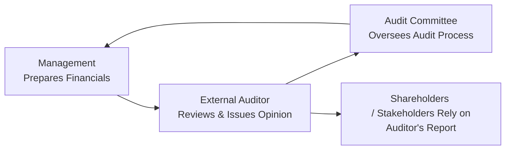

## Overview and Key Considerations

External auditor independence is, in many ways, the lifeblood of reliable financial reporting. This is because auditors are tasked with providing an unbiased assessment of a company's financial statements—an assessment on which investors, creditors, and other stakeholders rely to make informed decisions. When independence is compromised, the quality of that assessment immediately becomes questionable, leading to potential misrepresentations and a loss of confidence in the capital markets. If you think about it, it’s kind of like having a referee who’s secretly best friends with one of the players. Maybe they’re not intentionally cheating, but it’s something that would make you uneasy if you found out.

Audit rotation requirements have emerged as a regulatory mechanism to preserve this independence. In many jurisdictions, companies must rotate their lead audit partner after a set number of years, or in some cases, change the entire audit firm. The logic behind such rules is straightforward: an overly long relationship with the same auditor can create close ties, leading to an environment where auditors might not want to upset management by raising critical audit issues. By limiting the length of the audit relationship, regulators aim to keep the relationship fresh, objective, and free of conflicts of interest.

The topic of external auditor independence and rotation requirements connects closely with broader themes in financial analysis, such as risk assessment, corporate governance, and the overall quality of financial reporting. When analysts scrutinize a company’s financials—be it net profits, revenue recognition methods, or even intangible asset valuations—the question of auditor independence hangs in the background. Have they dug deep enough? Were they truly impartial in that tricky goodwill impairment test? These concerns become more pronounced when you spot red flags like unusually high consulting fees paid to the same firm that signs off on the audit. Because, you know, if too much money is coming from non-audit services, you start wondering who’s actually calling the shots.

## Why Independence Matters

You might be asking yourself: “So, okay, but is it really a big deal if the auditors know the client well?” Well, yes. Objectivity in auditing is paramount:

• Trust in Markets: Capital markets run on trust. If investors even suspect that published financial statements are biased or altogether misleading, they won’t be too keen on investing or lending.  
• Conflict of Interest Dangers: If the auditor is also providing lucrative non-audit services—like tax consulting, corporate restructuring advice, or IT system upgrades—a risk arises that they might not want to jeopardize that relationship by issuing a negative audit opinion.  
• Accountability to Stakeholders: Auditors should be working for shareholders (and, by extension, all other stakeholders), not just for company management. Independence means they’re less likely to look the other way when accounting irregularities pop up.

It’s a bit like having your independent friend judge a debate match: you trust their verdict more than you would if they were your best buddy or a paid consultant. Independence fosters integrity and credibility.

## Mandatory Rotation Requirements

### Global Landscape and Variations

Across the globe, there’s no single universal regulation on mandatory rotation, but most high-level frameworks share a common goal—preventing an overfamiliar relationship between the auditor and the client. Let’s look at a sample of how different jurisdictions handle mandatory rotation:

| Jurisdiction        | Lead Partner Rotation | Audit Firm Rotation | Notes                                                                   |
|---------------------|-----------------------|---------------------|-------------------------------------------------------------------------|
| European Union      | Every 5-7 years       | Every 10 years (with extensions up to 24 in some cases) | Stricter rules post-2014 reforms to ensure greater independence.        |
| United States (PCAOB) | Every 5 years       | Not mandated, but heavily debated      | Lead partner rotates; talk of firm rotation but no formal requirement.  |
| Australia           | Every 5 years        | No mandatory firm rotation            | Guidance by APES 110 (Code of Ethics) promotes independence.            |
| Japan               | Every 5 years        | Every 10 years (in certain cases)     | Some exceptions apply, and guidelines can vary based on firm structure. |

While U.S. regulations currently mandate rotation of the engagement partner but not the entire firm, many European countries (under EU regulation) require complete firm rotation after a certain period. The difference stems from different regulatory philosophies and market structures. EU legislators, for instance, concluded that rotating the entire firm was the most direct way to ensure new eyes eventually review the balance sheets and question prior auditing practices. Meanwhile, in the U.S., heavily rotating the engagement partner is seen as a balanced approach—though some argue it’s not enough to break embedded relationships.

### Rationale Behind Rotation

Mandatory rotation is founded on a few key principles:

• “Fresh Look” Principle: A new audit partner, or a brand-new firm, can bring a pair of fresh eyes, potentially spotting issues that the previous auditor didn’t. This is especially relevant for legacy accounting judgments, like valuations that might have remained unchecked for years.  
• Avoiding Complacency: Over time, close familiarity with the client could encourage complacency. We’re human, after all. If you’ve audited the same organization for a decade, you might inadvertently accept prior assumptions without further challenge.  
• Reducing Human Bias: Psychologically, people are more likely to adopt the company’s viewpoint the more they interact with the same managers. If you’ve ever worked with a client you got along with super well, you know how tricky it can be to keep that relationship purely professional.

## Independence vs. Non-Audit Services

One interesting wrinkle is that an audit firm often provides non-audit services to the same clients—like management consulting, strategic advice, or IT project implementations. These services can pay very well, sometimes even surpassing the fees earned from the audit itself. From the perspective of the auditor, there arises a potential financial incentive to keep the client happy and maintain those lucrative non-audit engagements. Imagine you’re about to make a bold statement criticizing a financial control shortfall—would you do it if it jeopardizes the million-dollar consulting contract your firm is running?

### Indicators for Analysts

As an analyst reading financial statements or the footnotes, you might want to do a quick check:

1. Ratio of Audit to Non-Audit Fees: If consulting fees outpace audit fees every year―red flag.  
2. Disclosure of Non-Audit Services: Firms are typically required to disclose what types of services are provided and their associated fees.  
3. Auditor Tenure: If the same audit firm or partner has been around for a lengthy period without rotation, consider whether independence might be compromised.

## Audit Opinions and Cues for Potential Conflicts

Audit opinions typically fall into four categories: (1) Unqualified (“clean”) opinion, (2) Qualified opinion, (3) Adverse opinion, and (4) Disclaimer of opinion. Analysts should also pay attention to emphasis-of-matter paragraphs, because they can highlight important accounting issues or uncertainties.

• Qualified Opinion: The auditor found some exceptions or departures from IFRS/US GAAP but not enough to render the overall financial statements unreliable. Could this be due to the auditor not flexing enough independence? Maybe, maybe not.  
• Emphasis-of-Matter Paragraph: Even if the overall statement is “clean,” the auditor might highlight a significant event or high uncertainty around something like going concern.  
• Disclaimer of Opinion: If the auditor simply can’t gather sufficient evidence or there’s a major limitation in scope, they might disclaim an opinion altogether—which is definitely a moment for you, the analyst, to pause and ask, “What’s going on here?”

Any of these can be signals that the auditor is trying to communicate something beyond the standard “everything’s fine.” And if you see disclaimers or repeated qualifications year after year, it might suggest complicated issues or inadequate information from management—both of which could point to deeper concerns about governance.

## Practical Example: EU Audit Firm Rotation

Let’s consider a hypothetical scenario: Southeastern Manufacturing Ltd. has been audited by the same firm for 12 years. Following the EU mandatory rotation rules, Southeastern Manufacturing is now required to tender the audit to a new firm. Surprise or maybe not, but Southeastern’s new auditors discovered that the way intangible assets (specifically development costs) were capitalized in previous years wasn’t fully compliant with IFRS. Possibly the presentation of R&D expenses was a bit, you know, off.

As a result of the fresh auditor’s new perspective, Southeastern restated its financial statements, leading to a significant reduction in net income in the restatement year. This scenario underscores how a newly appointed audit firm—less entangled in prior assumptions—might challenge historical approaches more vigorously. It also reminds analysts that changes in auditors alone can hint at potential corrections or reclassifications.

## A Quick Mermaid Diagram: Auditor-Client Relationship

Below is a simple representation of key elements in auditor independence. Notice how the audit committee (on behalf of shareholders) is a central figure bridging management and external auditors.

• Management is responsible for preparing the financials.  
• The External Auditor examines these statements and communicates results.  
• The Audit Committee supsupervises the entire audit process, representing shareholders’ interests.  
• Shareholders (and other stakeholders) rely on the independent audit report for decision-making.

## Challenges and Common Pitfalls

1. **Transition Costs and “Lost” Institutional Knowledge**: Switching auditors involves costs. The new firm needs time to understand the client’s business, internal controls, and systems. While some see this as a negative, others see it as beneficial because the new auditors won’t be biased by previous familiarity.  
2. **Shortage of Audit Firms**: In some industries—especially large or specialized ones—there aren’t many firms capable of handling complex audits. This might reduce the practical benefits of rotation if, for instance, only a handful of truly qualified firms exist.  
3. **Management Non-Cooperation**: If management evades or withholds critical info, the auditor struggles to perform an effective audit. Auditors can then issue a disclaimer of opinion or highlight the lack of cooperation. But if the new firm is also looking to bag more consulting gigs, they might just put up with partial info.  
4. **Regulatory Divergence**: Because rules differ across regions, global corporations might have to juggle multiple sets of rotation timelines, making compliance more complex.

## Analyst’s Checklist: Assessing Auditor Independence

Below is a brief checklist that analysts can use when reviewing a company’s auditor relationship:

• Auditor Tenure: Spot how long the firm or lead partner has been auditing the company.  
• Audit vs. Non-Audit Fee Ratio: Look for a high ratio of non-audit fees.  
• Recent Firm Rotation: Did a new firm come in? Monitor for sudden restatements or changes in estimates.  
• Disclosures in Audit Report: Watch for emphasis-of-matter paragraphs, going concern language, or disclaimers.  
• Red Flags: Are there repeated internal control deficiencies? Late or missed regulatory filings? Ongoing litigation relating to accounting issues?

## Personal Anecdote

I once worked on a small project evaluating the financial statements of a medium-sized tech startup that had just switched auditors. The new auditor flagged a revenue recognition policy that the previous firm had been fine with for years. Imagine my surprise (and the startup’s CFO’s annoyance) when we realized we’d need to restate nearly two whole years of revenue due to the change in approach—particularly in how multi-year software licenses were recognized. That was a big deal for the startup’s valuation, but it also showed me firsthand why fresh eyes can matter so much.

## Best Practices and Recommendations

• **Rotate Early, Assess Often**: Don’t wait until the mandatory end date to rotate an auditor if suspicion arises about independence. Early rotation can mitigate bigger problems down the line.  
• **Separate Non-Audit Services**: Many best-practice guidelines suggest limiting non-audit services—especially high-value consulting—to an altogether different firm.  
• **Robust Audit Committees**: Empower your audit committee to question the structure and scope of non-audit services. Effective governance can help ensure that independence is a real priority.  
• **Continuing Education**: Ongoing training for auditors regarding independence rules (e.g., IFAC Code of Ethics) helps reinforce the principles and keeps them alert to conflicts of interest.

## Connections to Other Chapters

While the topic of external auditor independence and rotation is quite specific, it ties into broader themes explored throughout this text:

• See Chapter 12.7 (“Audit Committee Responsibilities in Enhancing Reporting Quality”) for insight into how a strong audit committee can bolster auditor independence.  
• Refer to Chapter 9 (“Off-Balance-Sheet Items and Special Purpose Entities”) for common areas in which misstatements might occur if auditors aren’t vigilant.  
• Chapter 1.3 (“Regulatory Filings, Notes, and Auditor’s Reports”) provides an overview of how the audit report fits into the broader regulatory framework.

## Concluding Thoughts

External auditor independence is crucial for the integrity of financial statements. Mandatory rotation requirements help mitigate the risk of getting too cozy, but they’re not a magic fix. Analysts should stay alert to potential conflicts, particularly around non-audit services, management’s willingness to cooperate, and the length of auditor engagement. A truly independent audit is an essential pillar of reliable financial reporting—a reality that resonates across all markets and industries.

Keep questioning whether your auditors are truly independent. Because, frankly, it’s those small doubts about the reliability of the reported numbers that can come back to haunt you when analyzing or investing in a company.

## References and Further Reading

• International Federation of Accountants (IFAC) Code of Ethics:  
  https://www.ifac.org

• European Commission Regulations on Statutory Audits:  
  https://ec.europa.eu

• Public Company Accounting Oversight Board (PCAOB) Standards:  
  https://pcaobus.org

• APES 110 Code of Ethics for Professional Accountants:  
  https://www.apesb.org.au

• For a broader discussion on financial analysis techniques, see Chapter 13 of this text.

## Test Your Knowledge: External Auditor Independence and Rotation



### Which of the following best describes why external auditor independence is crucial?

- [ ] It helps the company appear more profitable to shareholders.
- [x] It ensures the audit opinion on financial statements remains unbiased and credible.
- [ ] It allows the external auditor to assume responsibility for internal controls.
- [ ] It guarantees lower audit fees for the client.

> **Explanation:** Independence maintains the objectivity and impartiality of the auditor’s judgments, preventing conflicts of interest and ensuring that the audit opinion on the company’s financial statements is trustworthy.

### A company has hired the same audit firm for ten consecutive years in a jurisdiction without mandatory firm rotation. Which scenario raises the greatest concern regarding independence?

- [ ] The audit fees are significantly higher than the usual market rate.
- [ ] The company’s CFO and the lead audit partner work at the same golf club.
- [x] The same lead audit partner has served for the entire ten-year period.
- [ ] Quarterly reviews are performed by a different partner within the same firm.

> **Explanation:** While all may introduce potential independence issues, the prolonged tenure of the same lead audit partner is a significant red flag, as overfamiliarity can compromise professional skepticism.

### In the EU, what is the primary rationale for requiring mandatory firm rotation every 10 years (extendable under certain conditions)?

- [ ] Reducing the workload for auditors by letting them pick and choose smaller clients.
- [ ] Aligning management bonuses with capital market expectations of fresh audits.
- [x] Ensuring a “fresh look” at the company’s financials after a set period to mitigate complacency.
- [ ] Lowering costs by regularly switching to smaller auditing firms.

> **Explanation:** EU regulations emphasize avoiding overly long relationships between auditors and clients, thus bringing fresh perspectives to spot potential misstatements or overlooked issues.

### Which of the following is a key risk when non-audit services provided by the auditor exceed the firm’s core audit fees?

- [x] The auditor may avoid challenging the client’s accounting practices to protect lucrative consulting fees.
- [ ] The quality of consulting services might be lower than industry benchmarks.
- [ ] The auditor lacks legal authority to issue an adverse opinion.
- [ ] The audit partner is automatically disqualified from sign-off.

> **Explanation:** If the auditor’s consulting revenue from the client is significantly higher than audit fees, there is a strong financial incentive to maintain the relationship, which can compromise audit objectivity.

### What is a qualified auditor opinion?

- [x] An opinion stating that, except for specific issues, the financial statements are fairly presented.
- [ ] A conclusion that the financials are entirely misleading and unreliable.
- [ ] An approval of the client’s internal controls as effective.
- [ ] A statement of complete reliance on management’s representations.

> **Explanation:** A qualified opinion indicates that the financial statements are mostly in accordance with the applicable reporting standards, except for some particular matters that do not invalidate the entire set of financials.

### If the company’s new external auditor discovers that the previous auditor overlooked significant dating errors in revenue recognition, this situation most often indicates:

- [ ] Unavoidable changes in market conditions.
- [ ] Willful fraud by the old audit firm.
- [x] The value of a “fresh look” that comes with auditor rotation.
- [ ] Conformance with standard accounting practice.

> **Explanation:** A new firm’s fresh review can identify misstatements or oversights. Rotation helps to provide a different perspective that can reveal issues previously missed.

### Which of the following is most indicative of a potential threat to auditor independence?

- [x] Non-audit services consistently exceed 60% of total fees.
- [ ] Routine management letters issued at year-end.
- [x] The lead partner plays a key role in the client’s strategic decisions.
- [ ] The audit firm is publicly traded.

> **Explanation:** High non-audit services fees and heavy involvement in strategic decisions can create conflicts of interest. Both represent significant threats to auditor objectivity.

### In analyzing an audit report, an “emphasis-of-matter” paragraph typically:

- [ ] Signals that the auditor disclaimers the entire statement.
- [ ] Invalidates the financial statements as non-compliant.
- [x] Draws attention to unusual transactions or uncertainties while still offering an unqualified opinion.
- [ ] Upholds management’s view without dispute.

> **Explanation:** An emphasis-of-matter paragraph is included when the auditor wants to highlight a particular issue or uncertainty without modifying the overall audit opinion.

### An auditor issues a disclaimer of opinion. Which of the following might be the most common reason?

- [x] The auditor could not obtain sufficient appropriate evidence to express an opinion.
- [ ] The auditor found the financial statements perfectly accurate.
- [ ] The auditor is prohibited by law from discussing the financial statements.
- [ ] The company has no board of directors.

> **Explanation:** A disclaimer of opinion is issued when the auditor cannot form an opinion due to insufficient evidence or scope limitations that are imposed.

### True or False: A strong audit committee can help maintain auditor independence by restricting the scope of non-audit services and reviewing the length of the auditor’s tenure.

- [x] True
- [ ] False

> **Explanation:** An effective audit committee serves as a safeguard for independence. It oversees the relationship between the client and the audit firm, including both audit and non-audit services, and can mandate rotations or impose limits on non-audit engagements.


