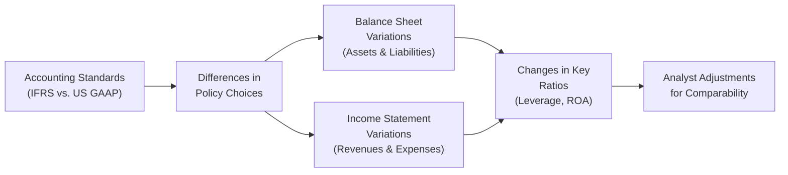

Introduction  
Many of us have been there: Trying to compare two companies—perhaps a European-based retailer under IFRS and a U.S.-based manufacturer following US GAAP—and feeling that tingle of confusion when their reported numbers just don’t line up. You think to yourself, “They’re basically in the same industry, why are their profitability and leverage ratios so different?” Well, subtle (and sometimes not so subtle) differences in accounting standards can significantly impact the figures used in ratio analysis. In this section, we’ll take a close look at how IFRS and US GAAP differences in three key areas—lease capitalization, research and development (R&D) treatment, and revaluation of long-lived assets—can shape your ratio calculations and potentially alter your conclusions about a company’s performance and risk profile.

We’ll walk through each of these topics in detail, share some real-world insights, and toss in a few practical examples. Let’s dive in.

–––––––––––––––––––––––––––––––––––––––––––––––––––––––––––––––––

Lease Capitalization Under IFRS vs. US GAAP  
If you’ve already read about lease accounting in Chapter 7 (Long-Term Liabilities and Equity) and Chapter 3 (Analyzing Balance Sheets), you might recall that IFRS 16 (for IFRS reporters) and ASC 842 (for US GAAP reporters) both require lessees to bring most leases onto the balance sheet, but there remain some classification differences, especially under US GAAP.

• IFRS 16 (Lessee Perspective):  
  – Nearly all leases are recognized on the balance sheet with a right-of-use (ROU) asset and a corresponding lease liability.  
  – Depreciation (for the ROU asset) and interest expense (for the lease liability) replace rental expense.  

• ASC 842 (Lessee Perspective):  
  – There are two types of leases: Operating and Finance.  
  – Both types do appear on the balance sheet; however, the recognition of expense in the income statement differs (straight-line single lease cost for operating leases vs. front-loaded expense for finance leases).  

In practice, IFRS 16 tends to be slightly more “single-model” in approach, while ASC 842 tries to separate “operating” from “finance” for expense reporting purposes. Either way, you end up capitalizing what was formerly off-balance-sheet. But the classification difference under US GAAP can alter how expenses appear in your statements.  

Impact on Ratios  
The big question: “So what?” The main effect is on balance-sheet and profitability ratios:

• Return on Assets (ROA): Because reported total assets increase (via the ROU asset), your ROA will often fall, all else being equal. Under IFRS 16, since all leases are capitalized, the total assets figure might be a bit higher than a comparable US GAAP operating lease arrangement—leading to comparability snags.  

• Debt-to-Equity (D/E) Ratio: The new lease liability increases total liabilities. This can push a firm’s leverage ratio higher, especially if a company previously relied heavily on operating leases. Under IFRS, it’s pretty straightforward; under ASC 842, the classification can slightly alter the presentation, but leverage typically goes up in both systems.  

• EBIT or Operating Income: Shifting from rent expense to depreciation and interest can elevate EBIT because depreciation and interest on the lease liability are usually shown below the operating income line. Under IFRS 16, that’s quite direct. Under ASC 842’s operating lease model, you’ll still see a single lease cost (which is effectively an operating expense), so the effect on operating income might differ.  

In short, if you’re comparing a US GAAP company with tons of operating leases to an IFRS company that’s forced to push those operating leases onto the balance sheet, you’ll need to adjust the statements to maintain consistency in your ratio analysis.

Quick Illustration  
Let’s say Company A (IFRS) capitalizes an equipment lease with present value of $1 million, recording a $1 million ROU asset and $1 million lease liability. Company B (US GAAP) also has an operating lease with the same cash flows. On day one, the IFRS-based Company A’s total assets are $1 million higher, and its total liabilities are also $1 million higher—so its Debt-to-Equity and Return on Assets look worse in straightforward ratio terms.  

If you’re evaluating both companies side by side, you might want to restate B’s lease for comparability. That might mean adjusting total assets and total liabilities by $1 million and swapping out rent expense for depreciation and interest in the income statement. Once you do that, your ratio comparisons become more apples-to-apples.

–––––––––––––––––––––––––––––––––––––––––––––––––––––––––––––––––

R&D Treatment Under IFRS vs. US GAAP  
Research and development is another area where IFRS and US GAAP part ways:

• IFRS (IAS 38):  
  – Distinguishes between “research” and “development” phases.  
  – Research costs are expensed as incurred.  
  – Development costs can be capitalized when certain criteria (technological feasibility, intent to use or sell, etc.) are met.  
  – Once capitalized, these costs become intangible assets and get amortized over their useful life.  

• US GAAP (ASC 730):  
  – Generally requires both research and development costs to be expensed as incurred, with only very narrow exceptions (like some software development after technological feasibility is established).  

Impact on Ratios  
Here’s the part that can really stir the pot in a ratio analysis:

• Profitability Ratios (Return on Sales, ROE, etc.): By capitalizing development costs, an IFRS-reporting entity might show lower expenses in the current period—and thus higher net income—compared to a US GAAP entity that expenses everything right away. Over time, the IFRS-based firm will recognize amortization of those capitalized costs, so it’s kind of a shift in timing.  

• Asset Turnover: Under IFRS, development costs that qualify for capitalization increase total intangible assets. That can reduce the asset turnover ratio (Sales / Total Assets) because the denominator grows.  

• Debt Covenants & Shareholder Perspectives: If a company’s intangible assets balloon due to capitalizing development expenses, it might look more asset-heavy or, ironically, more stable in the short term if net income is higher. But the “real” risk hasn’t changed.  

Analyst Considerations  
You may want to adjust the statements to expense all R&D if you believe the IFRS partial capitalization is overly aggressive. Or, if you trust management’s judgment, you might be comfortable with the reported figures. The key is consistency—just like with leases, ensure you understand how different treatments influence the numbers.

Example Scenario  
Imagine two pharmaceutical companies, each invests $500 million in new drug development. Under IFRS, Company X capitalizes $200 million of certain development costs because the drug has entered advanced phases with a high likelihood of regulatory approval. Under US GAAP, Company Y expenses all $500 million. Company X’s reported net income is higher by $200 million less amortization, plus intangible assets are boosted by the same figure. In early years, X’s ROA might appear higher than Y’s. As the intangible is amortized in later periods, X’s net income is dragged down, but it might still look “healthier” at first glance. Adjust if you want a direct apples-to-apples comparison.

–––––––––––––––––––––––––––––––––––––––––––––––––––––––––––––––––

Revaluation of Long-Lived Assets  
Finally, we come to a biggie: revaluation. IFRS generally allows for upward revaluation of property, plant, and equipment (PPE), as well as intangible assets in some cases, whereas US GAAP does not allow upward revaluation except in very limited circumstances (e.g., fresh-start accounting in bankruptcy).

• IFRS (IAS 16, IAS 38):  
  – Entities can choose the revaluation model, carrying assets at fair value (less subsequent depreciation).  
  – Increases in value are credited to “revaluation surplus” in Other Comprehensive Income (OCI), which is part of equity.  
  – Decreases below historical cost flow through the income statement.  

• US GAAP:  
  – PPE is typically carried at historical cost, less accumulated depreciation.  
  – No routine revaluation to fair value.  

Impact on Ratios  
• Debt-to-Equity (D/E): Revaluation can inflate equity via the revaluation surplus. If a company revalues upward, equity increases, potentially lowering the D/E ratio. This can be misleading if you compare it to a strictly historical-cost-based US GAAP company.  

• Return on Equity (ROE): With equity increasing and net income roughly the same, ROE might look lower. If you see a big chunk of revaluation surplus, you might recast the capital structure to a historical-cost basis for consistency.  

• Asset Turnover: Because assets are carried at a higher value (post-revaluation), turnover metrics may be dampened—sales remain unchanged, but total assets go up.  

Consider a Real Estate Example  
In the real estate sector, IFRS-based companies sometimes revalue property upward regularly. That means an IFRS real estate company might show stronger balance sheets with high asset and equity values. When you compare them to a U.S. peer, you might wrongly conclude the IFRS firm is more stable or has better coverage ratios. An analyst often restates IFRS revaluations back to historical cost or uses external appraisals consistently across both IFRS and US GAAP entities.

–––––––––––––––––––––––––––––––––––––––––––––––––––––––––––––––––

Putting It All Together and Adjusting Financials  
If you want to compare IFRS-based and US GAAP-based companies fairly, you’ve got to do some “harmonizing.” This usually involves:

1. Identifying major differences: Leases, R&D, revaluation, etc.  
2. Estimating the impact on assets, liabilities, equity, and income.  
3. Adjusting the financial statements to a consistent basis.  

When you recast these statements, you can then compute the updated ratios and make apples-to-apples comparisons. It’s more work, but it helps you avoid pitfalls.

In practice, you won’t always have all details needed for perfect adjustments. You might rely on footnotes, MD&A commentary, or supplementary disclosures. If you can’t fully restate, at least highlight the key differences you believe are distorting the ratio analysis.

Below is a simple Mermaid diagram illustrating how differences in accounting standards can feed into ratio outcomes:

–––––––––––––––––––––––––––––––––––––––––––––––––––––––––––––––––

Case Study: Tech Company Comparison  
Let’s do a quick hypothetical scenario. Suppose you’re analyzing two software firms—let’s call them ByteGenius Inc. (IFRS) and CodeWorx Corp. (US GAAP).

• ByteGenius Inc. capitalizes $50 million of R&D development costs, financed with a lease recognized under IFRS 16 for new computing hardware. They also revalue certain intangible assets upward, with a revaluation surplus of $30 million recognized in equity.  
• CodeWorx Corp. expenses all $80 million of R&D, treats all new computer hardware as an operating lease under ASC 842, and doesn’t revalue intangible assets upward at all.  

Because ByteGenius Inc. capitalized R&D, its net income is higher in the short run, and intangible assets are $50 million more than an equivalent expense-based method. Meanwhile, CodeWorx’s net income is lower given that the $80 million is fully expensed. The leased hardware under IFRS is on ByteGenius’s balance sheet, while CodeWorx’s operating lease, if classified as operating in US GAAP, might appear less significant in liabilities. And ByteGenius’s intangible revaluation has inflated equity by $30 million.

• ByteGenius’s ROA: Net income is higher, but total assets are also boosted by the intangible assets and the leased hardware, so the net effect on ROA depends on the relative magnitude of the changes.  
• CodeWorx’s Debt-to-Equity ratio: Potentially lower because the revaluation surplus is not recognized and the capitalized lease is not as large.  
• ByteGenius’s Equity: Is significantly higher with that $30 million revaluation surplus.  

As an analyst, you’d look at these differences carefully. Possibly, you’d remove the $30 million revaluation from ByteGenius’s equity to compare it to CodeWorx’s equity. You might reclassify CodeWorx’s operating lease to a finance lease approach. You might also expense ByteGenius’s R&D. Only then are you comparing apples to apples.  

–––––––––––––––––––––––––––––––––––––––––––––––––––––––––––––––––

Best Practices and Optimal Adjustments  
• Always read footnotes, because IFRS and US GAAP differences will be spelled out (sometimes in mind-numbingly detailed ways—but trust me, it’s worth it).  
• If you’re doing a multi-year trend analysis and a company switched from one standard to another, be mindful that earlier years might not be restated in the same manner.  
• If you’re short on time, focus on the biggest differences—like large revaluation adjustments or R&D capitalizations—since these are likely to have the most material effect on ratios.  
• Remember that “materiality” can differ by industry. For instance, capitalized development costs might be huge for a biotech company but less significant for, say, a retailer.  

–––––––––––––––––––––––––––––––––––––––––––––––––––––––––––––––––

Final Thoughts  
Sure, these differences can be a pain. But once you’ve had a bit of practice adjusting IFRS and US GAAP statements for analysis, it’s not that daunting. And you know what? You’ll see that truly understanding these divergences can give you an edge in your financial statement analyses. You’ll be able to see beyond the first impression of the numbers and figure out what’s really going on underneath.

If there’s one main message, it’s this: IFRS and US GAAP differences in lease accounting, R&D treatment, and the option to revalue assets can drastically affect common ratios (like ROA, ROE, Debt-to-Equity, and more). Whenever you aim for cross-company or cross-border comparisons, understand these differences and adjust where needed. Without that, you might be comparing oranges to, well, grapefruits.

–––––––––––––––––––––––––––––––––––––––––––––––––––––––––––––––––

References & Further Reading  
• EY “Leases (IFRS 16) vs. Leases (ASC 842)”: www.ey.com  
• KPMG, “Comparison of IFRS and U.S. GAAP”  
• IAS 16, IAS 38, IFRS 16 (for details on PPE, intangibles, and leases under IFRS)  
• ASC 730, ASC 842 (for details on R&D and leases under US GAAP)  
• Previous sections in this volume:   
  – Chapter 3 (Analyzing Balance Sheets) for insight into intangible asset presentations.  
  – Chapter 7 (Long-Term Liabilities and Equity) for deeper lease accounting details.  

–––––––––––––––––––––––––––––––––––––––––––––––––––––––––––––––––

## Test Your Knowledge: IFRS vs. US GAAP Impact on Ratios



### A company's lease accounting policy may affect which of the following ratios most directly under IFRS 16 vs. ASC 842?

- [x] Return on Assets and Debt-to-Equity
- [ ] Cash Conversion Cycle and Working Capital Turnover
- [ ] Gross Profit Margin and R&D-to-Sales
- [ ] Inventory Turnover and Receivables Turnover

> **Explanation:** Capitalizing leases increases both assets (ROU asset) and liabilities (lease liability). This impacts total assets (denominator in ROA) and total liabilities or debt (part of the D/E ratio).

### Under IFRS, development costs meeting specific criteria may be:

- [ ] Fully expensed in the year incurred.
- [x] Capitalized and amortized over their useful lives.
- [ ] Recognized as equity upon completion of the project.
- [ ] Recorded directly in Other Comprehensive Income.

> **Explanation:** IFRS allows capitalization of certain development-phase costs once technical feasibility and other criteria are met. After capitalization, these costs are amortized over the asset’s useful life.

### A company that revalues property, plant, and equipment under IFRS is most likely to see which ratio directly impacted by a resulting increase in asset values?

- [ ] Earnings per Share (EPS)
- [x] Debt-to-Equity (D/E)
- [ ] Interest Coverage
- [ ] Tax Rate

> **Explanation:** An upward revaluation increases equity via the revaluation surplus. That, in turn, lowers the D/E ratio if the amount of debt remains constant while equity grows.

### When comparing an IFRS-reporting company that capitalizes development costs to a US GAAP-reporting company that expenses all R&D, the IFRS company's profitability ratios in early years may typically appear:

- [x] Higher
- [ ] Much lower
- [ ] The same
- [ ] Completely irrelevant

> **Explanation:** Capitalization delays the recognition of expenses, often resulting in higher initial net income, thereby boosting profitability ratios in the early stages of development.

### Which of the following is a primary effect of capitalizing leases under IFRS 16 on the income statement for lessees?

- [x] Moving rent expense below the operating income line as depreciation and interest expense
- [ ] Eliminating all operating expenses associated with the lease
- [x] Increasing net income due to reduced depreciation expense
- [ ] Classifying interest expense as a financing cash flow under IFRS

> **Explanation:** Under IFRS 16, operating lease rentals are replaced with depreciation on the ROU asset and interest expense on the lease liability. (Note that net income may go up or down depending on factors such as timing of expenses, so the second check mark addresses a partial nuance but can vary in real scenarios.)

### Under IFRS, an upward revaluation of an intangible asset is:
- [x] Permitted if fair value can be determined reliably
- [ ] Not allowed under any circumstance
- [ ] Required annually for every intangible asset
- [ ] Mandated only when intangible assets decrease in value

> **Explanation:** IFRS allows revaluation of intangible assets when there’s an active market or another reliable determination of fair value. In contrast, US GAAP prohibits most upward revaluations.

### Comparing the ratio effects of IFRS vs. US GAAP on a company’s financial statements, which of the following statements is correct?

- [x] IFRS-based statements may show higher total assets due to lease capitalization and revaluations.
- [ ] US GAAP statements typically show higher net income due to less conservative accounting.
- [x] IFRS requires expensing all R&D projects in all phases.
- [ ] US GAAP permits revaluation of PPE annually.

> **Explanation:** IFRS approaches for leases and revaluations generally lead to higher asset balances. Meanwhile, IFRS distinguishes research vs. development costs and sometimes capitalizes the latter—contrary to the suggestion that all R&D must be expensed. US GAAP does not allow widespread revaluation of PPE.

### The immediate effect of revaluing assets upward under IFRS is:

- [x] An increase in equity (revaluation surplus)
- [ ] A decrease in retained earnings
- [ ] A reduction in deferred tax liabilities
- [ ] A direct increase in net income

> **Explanation:** Upward revaluation surpluses are credited to OCI and accumulate in equity. They do not flow directly through net income.

### Under US GAAP, the majority of R&D costs are:

- [x] Expensed as incurred
- [ ] Capitalized if technical feasibility is achieved
- [ ] Carried as intangible assets and revalued regularly
- [ ] Moved to equity as a special R&D reserve

> **Explanation:** US GAAP generally requires all R&D costs to be expensed. Only limited exceptions (like certain software development costs after feasibility) are capitalized.

### Properly adjusting the financial statements of IFRS vs. US GAAP companies for analytical comparability may involve:

- [x] Standardizing lease treatments, adjusting capitalized R&D, and removing revaluation surpluses
- [ ] Ignoring any differences in lease classification
- [ ] Doubling the reported intangible assets under US GAAP
- [ ] Halving the PPE for IFRS reporters

> **Explanation:** Analysts often restate statements for consistent bases—standardizing for lease accounting, R&D treatment, and revaluation adjustments are critical steps.


