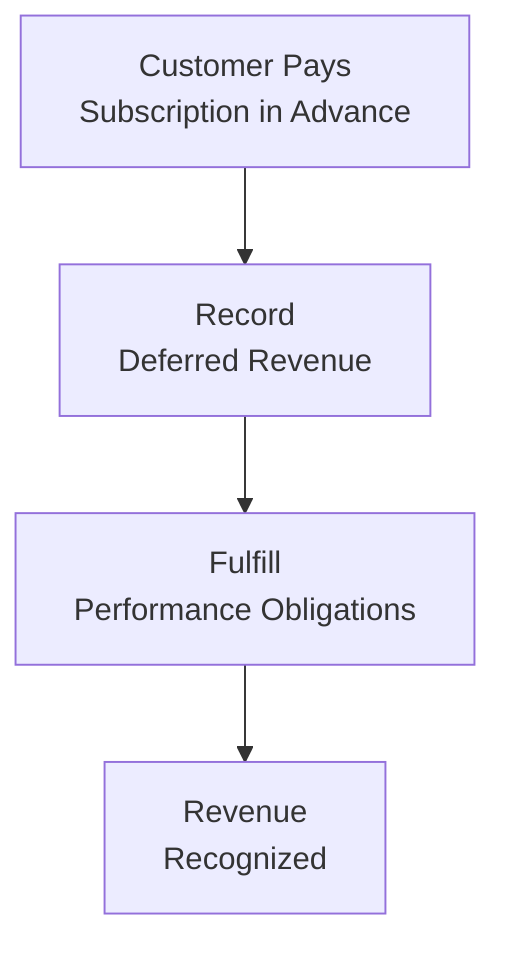

## Overview

So, imagine you just subscribed to a streaming service that charges you an annual fee upfront. That payment you’ve made—well, from the company’s perspective—represents cash in the bank but also an obligation to deliver service for the next twelve months. This scenario is exactly what deferred revenue, often called unearned revenue, is all about. The company gets paid before it completely fulfills its performance obligation, so it carries a liability on its balance sheet until the revenue is “earned” by providing service over time.

Deferred revenue has become widespread in subscription-based businesses, such as software, telecom, and media streaming. If you glance at the balance sheet of any major Software-as-a-Service (SaaS) provider, you'll likely see deferred revenue perched among the current (and sometimes noncurrent) liabilities. And let me tell you, the size of that deferred revenue figure can offer you major clues about revenue growth potential, service renewals, and the near-term cash flow health of the business.

## Key Concepts

### Definition and Nature of Deferred Revenue
Deferred revenue is essentially a prepayment from a customer for goods or services that will be delivered (or earned) in the future. It’s recorded as a liability because the firm owes goods or services (the performance obligation) to the customer. Over time, as the subscription or service is fulfilled, the deferred revenue is recognized as (earned) revenue in the income statement. 

### How Deferred Revenue Arises
• Subscription payments: Annual, monthly, or quarterly subscription fees often paid up front.  
• Service contracts: Extended service warranties or ongoing maintenance packages in industries like telecom, automotive, and tech.  
• Membership dues: Gym memberships, magazine subscriptions, or membership-based organizations.  

### Performance Obligation Under IFRS 15 and ASC 606
Both IFRS 15 and ASC 606 use a five-step model for determining how revenue is recognized:  
1. Identify the contract with a customer.  
2. Identify the performance obligations in the contract.  
3. Determine the transaction price.  
4. Allocate the transaction price to the performance obligations.  
5. Recognize revenue when (or as) the entity satisfies each performance obligation.  

If your eyes are glazing over a bit, don’t worry—you’re not alone. The main idea here is that the revenue recognition timing must match when the promised goods or services are actually delivered. Until then, the amount collected in advance sits on the balance sheet as a liability.

### Subscription Business Models
In a subscription model, customers pay a recurring fee in exchange for continuous or repeated access to a product or service. These models rely heavily on deferred revenue because payments frequently arrive well before the firm’s obligations are fully met (like a multi-year contract for software updates and dedicated support).

## Impact on Ratios

When analyzing subscription-based companies, deferred revenue can materially affect both liquidity and performance measurements. It’s easy to overlook how big an effect large deferred revenue balances may have on standard ratios.

### Liquidity Ratios (Quick Ratio, Current Ratio)
Deferred revenue is often classified as a current liability, which can inflate current liabilities significantly for subscription-based firms. If you think about it, the quick ratio (sometimes called the acid-test ratio) is:

Quick Ratio = (Cash + Marketable Securities + Accounts Receivable) / Current Liabilities

Because deferred revenue is part of the denominator, a large deferred revenue balance can dramatically reduce a firm’s quick ratio, even though the firm has already collected cash from customers. For instance, a software company with US$10 million in cash and little debt might seem super-liquid, but if it has US$9 million in deferred revenue recorded under current liabilities, that quick ratio might not look quite as rosy.

### Solvency Ratios and Leverage
Sometimes, deferred revenue is recognized as a non-debt liability. Nonetheless, it can distort how leverage ratios (like the Debt-to-Equity ratio) appear if a big chunk of total liabilities comes from deferred revenue. Because it’s not interest-bearing, analysts might prefer to separate deferred revenue from interest-bearing liabilities when evaluating a firm’s solvency or credit-worthiness.

### Profitability and Earnings Quality
The recognition of deferred revenue into actual sales influences the timing of reported earnings. A big surge in subscription sales can boost cash flow but won’t necessarily impact the current period’s net income right away. Overstating or understating deferred revenue can be a red flag for earnings management. In some cases, when companies want to show strong revenue growth, they may structure contracts that front-load subscription payments and thereby inflate their deferred revenue and “future growth” story.

### Deferred Revenue Turnover
Some analysts take a look at how swiftly a company converts deferred revenue into actual revenue (i.e., when the performance obligations are met). This concept can be expressed as:

(1) Deferred Revenue Turnover = Recognized Revenue in a Period / Average Deferred Revenue

A high turnover might signal shorter contract terms or rapid delivery of services, while a lower turnover might indicate longer subscription periods (resulting in a relatively bigger deferred revenue base on the balance sheet).

## Measurement and Analysis Approaches

Analysts often dig deeper into deferred revenue beyond just reading the line item on the balance sheet. Here’s a quick rundown:

• Track year-over-year changes: A rising deferred revenue balance may imply strong new sales or expansions of existing contracts. A decrease may point to cancellations of subscriptions or reduced demand.  
• Compare deferred revenue to future revenue growth: If a large part of upcoming sales is already paid for (i.e., recognized as deferred revenue), it can provide some visibility into the next few quarters’ or years’ results.  
• Adjust liquidity metrics: If deferred revenue is not purely a near-term liability (e.g., multi-year deals), analysts might choose to recast or partially exclude it from the current liability portion to get a more meaningful liquidity perspective.  
• Evaluate renewal rates: Looking at the portion of deferred revenue that eventually transitions to recognized revenue—basically, how predictable and stable are the subscription renewals?  

### Example: Adjusting the Quick Ratio
Let’s say Company X has the following summary data (in millions):

• Cash: US$20  
• Accounts Receivable (net): US$5  
• Other Current Assets: US$1  
• Current Liabilities: US$34 (includes US$12 of deferred revenue)  

The standard quick ratio would be:  
( Cash + Accounts Receivable ) / Current Liabilities = (20 + 5) / 34 ≈ 0.74  

However, let’s assume half of the deferred revenue (US$6) actually relates to multi-year deals that won’t require near-term outlays of resources. An analyst might choose to remove that half from “truly current” liabilities. In that scenario, the adjusted current liabilities figure becomes US$28 (34 – 6). The updated quick ratio:

(20 + 5) / 28 ≈ 0.89  

That’s a material difference and might signal that the company is somewhat more liquid than the plain quick ratio suggests. Analysts should, of course, accompany any adjustments with thorough disclosures and justifications.

## Practical Flow of Deferred Revenue Recognition

Below is a simple diagram to visualize how subscription-based deferred revenue works—from the initial cash collection to ultimate revenue recognition:

1. The company collects payments from customers upfront.  
2. The amount collected is recorded as deferred revenue (liability).  
3. Over the subscription period, the company delivers the promised service or product.  
4. As those obligations are fulfilled, the liability is reduced, and revenue is recognized in the income statement.

## Case Study: Software-as-a-Service (SaaS)

I once worked with a growing SaaS start-up—let’s call them CloudWorks. CloudWorks offered annual software licenses, plus monthly support. Most medium-sized businesses purchased annual licenses in January. So come January 1, CloudWorks’s cash balance would surge, and so would its deferred revenue liability. For the rest of the year, the company recognized that revenue monthly, but the initial liability would remain large on the balance sheet until year-end.  

Analysts tracking them noticed two big spikes in the quick ratio:  
• Just after January, the ratio dipped because the deferred revenue soared.  
• By December, the ratio would rise as deferred revenue gradually converted to recognized revenue.  

But if anyone looked at the scoreboard in June or July, they might have thought the company’s liquidity was deceptively low, even though the actual cash in the bank was very healthy. This highlights why analyzing the composition and timing of deferred revenue is crucial.

## Cross-Reference to IFRS 15 and ASC 606

• For a deep dive into the conceptual framework for revenue recognition, it’s worth comparing IFRS 15 and ASC 606. These standards have broadly converged, emphasizing that you recognize revenue when you satisfy a performance obligation.  
• Under IFRS 15, any separate performance obligations must be identified, and revenue is allocated and recognized accordingly. The same concept applies under ASC 606, with the requirement that any distinct goods or services must be accounted for separately.  
• You can find more on these areas in Chapter 2 (Analyzing Income Statements), where we discuss IFRS 15 vs. ASC 606: Comparative Overview.

## Conclusion and Best Practices

Deferred revenue is more than just a line item in the liabilities section; it’s an indicator of future revenue streams, customer demand, and the timing of revenue recognition. Relying solely on standard liquidity or solvency measures without investigating deferred revenue can lead to skewed interpretations of a company’s standing. It’s essential to:

• Examine the magnitude and trend of deferred revenue.  
• Consider its portion in total liabilities and its potential effect on liquidity ratios.  
• Investigate the nature of contracts—are they short-term or multi-year deals?  
• Watch out for changes in renewal rates or performance obligations that might dampen or enhance future revenues.  

From an exam perspective, areas to focus on include the correct reclassification of certain liabilities, understanding the revenue recognition process, and making specific ratio adjustments that reflect economic reality. In the real world, it’s always wise to keep an eye on disclosures in the notes to the financial statements, where you’ll find important policy selections, breakouts by product or service type, and details about average contract lengths.

## References and Further Reading

• IFRS 15 – Revenue from Contracts with Customers (IFRS Foundation)  
• ASC 606 – Revenue from Contracts with Customers (FASB)  
• Zuora Research (www.zuora.com) – Explore subscription economy trends  
• Deloitte: “Revenue Recognition: Understanding the New Guidelines” – Practical guidance on IFRS 15/ASC 606  

## Practice Questions on Deferred Revenue and Ratio Analysis in Subscription Models



### Which of the following best describes deferred revenue?

- [ ] A contra-asset account that offsets receivables
- [x] A liability representing payment in advance of delivered goods or services
- [ ] An equity reserve for future capital expansion
- [ ] A valuation allowance to reduce net income

> **Explanation:** Deferred revenue is recognized as a liability because the company owes goods or services to the customer who has already paid.

### A large spike in deferred revenue on a firm’s balance sheet most likely indicates:

- [ ] An unexpected increase in operating expenses
- [x] An increase in cash received from customers for future obligations
- [ ] A reduction in the firm’s performance obligation
- [ ] An immediate improvement in the firm’s current ratio

> **Explanation:** Deferred revenue grows when the company receives more cash upfront for future services or products. This does not immediately improve the current ratio because deferred revenue is also recorded as a current liability.

### Under IFRS 15 or ASC 606, deferred revenue is recognized as revenue when:

- [ ] Cash is received from the customer
- [ ] The firm issues a bill
- [x] Performance obligations to the customer are satisfied
- [ ] The firm’s fiscal year ends

> **Explanation:** Revenue recognition occurs when—or as—performance obligations are met, according to the core principle of IFRS 15 and ASC 606.

### If a company’s deferred revenue is large relative to total liabilities, which ratio might be impacted the most?

- [ ] Gross margin
- [x] Quick ratio
- [ ] Return on equity
- [ ] Asset turnover

> **Explanation:** The quick ratio (and similarly the current ratio) may be significantly affected because deferred revenue is often included under current liabilities, thereby inflating the denominator.

### How do multi-year contracts typically affect deferred revenue calculations?

- [x] They could increase the noncurrent portion of deferred revenue
- [ ] They eliminate any need for performance obligation disclosures
- [x] They can require partial revenue recognition over several periods
- [ ] They increase interest expense automatically

> **Explanation:** Multi-year contracts can extend the liability beyond the current portion if the performance obligations are not satisfied within one year, and revenue is recognized progressively.

### “Deferred Revenue Turnover” is most accurately described as:

- [x] Recognized Revenue in a Period / Average Deferred Revenue
- [ ] (Net Income / Deferred Revenue) × 100
- [ ] (Deferred Revenue / Recognized Revenue) × 365
- [ ] Average Deferred Revenue × Recognized Revenue

> **Explanation:** Deferred revenue turnover is the ratio of recognized revenue to average deferred revenue, highlighting how quickly a company converts deferred revenue to recognized revenue.

### An analyst removing part of deferred revenue from current liabilities in ratio calculations would most likely do so:

- [x] To account for multi-year obligations not requiring near-term resources
- [ ] To artificially inflate the company’s liquidity
- [x] To reflect a more realistic measure of short-term liabilities
- [ ] To comply strictly with IFRS 15 or ASC 606

> **Explanation:** When large, multi-year obligations inflate current liabilities, an analyst might adjust them to gain clarity on near-term liquidity. This is not a GAAP/IFRS requirement but rather an analytical choice.

### Which statement is true regarding subscription-based companies and deferred revenue?

- [x] They often experience fluctuations in liquidity ratios throughout the contract cycle
- [ ] They typically have no deferred revenue because customers pay after use
- [ ] They only recognize revenue upon receipt of cash
- [ ] They carry deferred revenue as an asset

> **Explanation:** Subscription-based firms frequently receive upfront payments, creating deferred revenue liabilities that can skew traditional liquidity ratios as these liabilities unwind over the subscription period.

### Why might an analyst compare deferred revenue to revenue growth?

- [x] To assess if future revenue is partly “prepaid” and gauge forward visibility
- [ ] To check if interest rates are too high
- [ ] To evaluate whether the firm is overpricing its products
- [ ] To compute operating cash flows directly

> **Explanation:** Examining deferred revenue alongside revenue growth helps to understand how much of next period’s or future periods’ revenue is effectively already locked in via advance payments.

### True or False: Deferred revenue always represents an interest-bearing liability.

- [x] True
- [ ] False

> **Explanation:** This statement is tricky. In many real-world contexts, deferred revenue is generally a non-interest-bearing liability. However, there are scenarios (for example, advanced payments tied to a financing element) where interest might be imputed. In broad terms, deferred revenue can potentially include an implied financing component under IFRS 15 or ASC 606 if there is a significant timing difference between payment and performance. Though it’s typically “non-interest bearing,” the standards do require consideration of a financing component if it’s significant.


