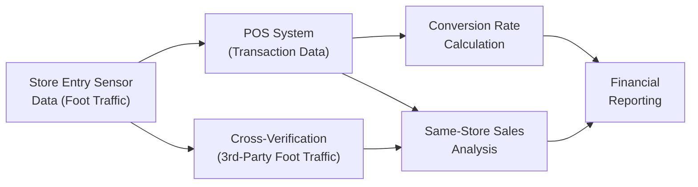

## Overview and Context

Retailers often live and die by their ability to keep customers coming back, buying more, and spreading positive word-of-mouth. But to assess these dynamics rigorously—especially for valuation and performance analysis—analysts commonly rely on certain key metrics. Same-store sales (SSS), foot traffic, and conversion rates, among others, underpin the evaluation of retail store performance. These metrics give us deeper insight into how effectively a retailer is driving customer demand, managing inventory, and sustaining brand loyalty over time.

In earlier sections of Chapter 13 (Financial Analysis Techniques), we explored foundational ratio analyses—like profitability or liquidity metrics. Now, we turn our attention specifically to the retail sector, where evaluating performance requires more granular, store-specific metrics. Same-store sales measure growth at existing store locations, foot traffic tracks how many actual visitors come through the door, and conversion rates tell us what fraction of these visitors actually make a purchase. Combined, these metrics help analysts separate top-performing retailers from those that may be drifting off course.

## Importance of Same-Store Sales

Same-Store Sales (SSS), sometimes called Comparable Store Sales, is one of the most critical measures of retail performance. SSS reflects the percentage change in revenues from year to year (or period to period) for stores that have been open for a predefined minimum time (often 12 or 24 months). By focusing on established locations, this metric isolates underlying operational trends from any distortion caused by newly opened or closed stores. For instance, if a retailer reports overall sales growth of 15% but SSS growth of only 2%, it could signal that most growth is coming from new store openings rather than improved performance at existing stores.

I remember, back in my first part-time job at a small clothing chain, our manager would beam about “comp sales” (short for comparable same-store sales) each quarter. If they were up by a decent percentage—say 5%—it meant our local store had brought in more foot traffic, or at least boosted our average transaction size, compared to the same time last year. That was always cause for celebration, because it suggested that our market presence was strengthening and not just coasting on waves of new store openings elsewhere in the chain.

### Calculation and Interpretation

To calculate SSS for a given period:

( SSS Growth Rate ) = 
( ( Sales in Current Period for Comparable Stores ) – ( Sales in Prior Period for Comparable Stores ) ) 
/ ( Sales in Prior Period for Comparable Stores ) × 100%

SSS can be influenced by multiple factors:
• Product assortment changes (e.g., adding new brands or categories).  
• Promotions, discounting strategies, or loyalty programs.  
• Macroeconomic conditions like consumer confidence and disposable income levels.  
• Store renovations or expansions that might momentarily disrupt sales but later enhance shopper experience.

### Benefits and Pitfalls

Benefits:  
• SSS offers a powerful measure of organic growth.  
• Consistent SSS expansions usually point to healthy brand loyalty and strong competitive positioning.  

Pitfalls:  
• Closing underperforming stores can artificially boost SSS if the weak performers are excluded from the comparable base.  
• Cannibalization arises if a new store is opened too close to an existing one, negatively affecting the older store’s SSS.  
• Changes in local demographics—like a new highway exit shifting traffic patterns—may affect SSS in ways not obvious from a chain-level perspective.

## Foot Traffic Analysis

Foot traffic is simply the number of visitors entering a store during a given period. A decade ago, you might see employees with a little clicker at the entrance counting people; nowadays, advanced methods—like sensor-based analysis using Wi-Fi or Bluetooth signals—help track more detailed movement patterns within stores. Foot traffic is intimately connected to how retailers allocate marketing budgets, design store layouts, and choose store locations.

### Significance and Real-World Application

Foot traffic helps answer some crucial questions: 
• Are people actually showing up at physical locations in an era of e-commerce?  
• Does advertising (local radio spots, online coupons, billboard promotions) effectively draw in more visitors?  
• Are seasonal patterns, local events, or weather affecting store visits?

I once worked for a mall-based boutique that decided to track foot traffic by hooking up with a third-party data provider. We discovered weekday patterns had a midday lull that was deeper than we realized. That data led us to adjust employee shifts, scheduling fewer staffers during slower hours, and reallocate marketing efforts around lunch breaks to attract more impulse shoppers. Foot traffic data was a game-changer for optimizing store operations.

### External Data Cross-Verification

In some cases, management’s reported foot traffic data can be cross-checked against external sources:
• Sensor-based aggregators that gather anonymous foot traffic signals from smartphones.  
• Syndicated data from credit card processors, which can estimate the relative portion of local consumer activity.  

If management’s foot traffic numbers diverge markedly from third-party data about general retail congestion in the same area, be careful. It could signal data misreporting or unusual transaction patterns.

## Conversion Rate

Foot traffic alone isn’t enough; we need to know how many visitors actually buy something. The conversion rate is typically defined as:

( Conversion Rate ) = 
( Number of Transactions ) / ( Number of Visitors ) × 100%

The conversion rate illuminates a store’s ability to transform visitors (or browsers) into paying customers. High traffic with a low conversion rate might point to store layout inefficiencies, poor product mix, or pricing that’s out of reach for most of the site’s visitors.

### Drivers of Conversion

Factors influencing conversion could include:
• Store design and ease of navigation.  
• Quality of customer service.  
• In-store promotions and product placement.  
• The alignment between marketing campaigns and actual inventory.  

One personal anecdote: I once visited a pop-up store that had a wonderful visual display but lacked enough sales associates to handle the crowd. Long lines and overwhelmed staff caused potential buyers to abandon their carts (both literal shopping carts and digital engagement via in-store mobile ordering). Foot traffic soared, but conversion was disappointingly low. Understanding the “why” behind that performance gap helped the retailer pivot to better queue management and staff training, boosting sales afterward.

## Integrating SSS, Foot Traffic, and Conversion with Other Key Metrics

Retailers rarely assess SSS, foot traffic, and conversion rates in isolation. Instead, they combine these metrics with a suite of additional data points to get a holistic picture:

• Average Transaction Value (ATV).  
• Frequency of Customer Visits.  
• Omnichannel sales growth—particularly important nowadays with buy-online-pickup-in-store (BOPIS) or curbside pickup.  
• Brand loyalty indicators (like membership renewal for subscription-based retailers, or Net Promoter Score).  

### Total Channel Performance

In the age of omnichannel retail, shoppers may start their journey online and ultimately conclude it in-store. As noted in IFRS 15 and ASC 606 (see Chapter 2 for a deeper discussion of revenue recognition), revenue is recognized when control of goods or services is transferred. Yet measuring performance can get tricky when you’re juggling online, brick-and-mortar, and mobile channels. Same-store sales might not reflect strong online growth if the two business units are reported separately. An investor or analyst must therefore piece together metrics to see if total brand performance is consistent.

### A Note on Segment Reporting

Retailers who operate multiple formats (e.g., standalone stores, outlet centers, online shops) may have to provide segment-level disclosures under IFRS 8 or the US GAAP equivalent. If you see “store segment” standing alone, keep in mind that certain overhead allocations might vary from one segment to another, potentially skewing same-store sales or foot traffic comparisons. Always watch for store closures or reclassifications that might change the composition of your comparable store base.

## Data Visualization for Retail Analytics

A simple but meaningful illustration often helps when dissecting these metrics. The following Mermaid diagram conceptualizes how foot traffic and point-of-sale data flow into an overall analysis framework:

In such a pipeline, foot traffic is measured through store entry sensors (Node A), while POS systems capture transactions (Node B). Combined, they yield conversion rates (Node C). Meanwhile, SSS data (Node D) is reported to external stakeholders in financial statements (Node F), but might also be cross-referenced to third-party traffic data (Node E). Ultimately, these flows come together to present a coherent narrative of how a retailer is performing.

## Real-World Examples and Case Discussion

Imagine a national clothing retailer with 500 stores spread across various regions. Let’s say they report 8% overall sales growth, year over year. An analyst then sees that only 3% of that growth is from existing stores. Meanwhile, a press release indicates foot traffic is up 1% chain-wide, and the conversion rate improved from 20% to 22%. This combination suggests that more visitors are turning into buyers, albeit foot traffic isn’t growing significantly. A deeper dive might reveal that new store openings accounted for the bulk of the total sales growth.  

If the retailer’s brand loyalty platform reveals churn is low (i.e., membership renewals remain strong), it likely means existing customers are pretty happy. On the other hand, if churn has spiked, it may be that the new stores are attracting fresh customers while existing stores struggle. This de-averaging of performance data is pivotal in assessing the retailer’s fundamental health.

## Best Practices and Common Pitfalls

### Best Practices

1. Correlate SSS, Foot Traffic, and Conversion:  
   Contextualize same-store sales with foot traffic and conversion rates. Steady or rising SSS with stable traffic might mean higher conversion or larger average tickets.

2. Look Beyond the Aggregate:  
   Break down SSS by region or store format to see if certain geographies or types of stores (e.g., urban vs. suburban) are underperforming.

3. Integrate Omnichannel Data:  
   Understand how online and offline channels support each other. Foot traffic might be partially driven by digital marketing.

4. Use External Sources:  
   Validate management’s foot traffic metrics or store performance claims using third-party data whenever possible.

### Common Pitfalls

1. Ignoring Cannibalization:  
   A robust new store opening plan could undermine existing sales in nearby locations, falsely depressing SSS trends.

2. Overlooking Seasonality:  
   Foot traffic and conversion rates can fluctuate drastically with weather and holiday events. A year-over-year approach is particularly critical in retail to adjust for seasonal shifts.

3. Neglecting Normalized Comparisons:  
   Single-month spikes or dips may reflect promotional events rather than a sustained trend.

4. Misclassifying Customer Traffic:  
   If a retailer incorrectly counts staff members or vendors as store visitors, foot traffic data might inflate the official numbers, skewing the conversion rate.

## ESG Considerations

In Chapter 15 (ESG Considerations in Financial Statement Analysis), we dive deeper into how environmental, social, and governance factors are influencing financial analysis. For retail, one ESG angle might be tracking how foot traffic is influenced by a store’s environmental footprint or community engagement activities. Some customers seek out retailers who adopt sustainable practices, encouraging store designs that use energy-efficient lighting or follow fair trade sourcing. By analyzing foot traffic alongside these ESG initiatives, an investor can gain insight into whether socially responsible efforts translate into top-line results.

## Exam-Relevant Insights

CFA Level III candidates might see scenario-based questions requiring them to interpret a retailer’s foot traffic trend, same-store sales, or conversion performance in the context of broader equity valuation. You could be asked to make an investment recommendation based on subtle differences in SSS growth among multiple competitors, or to identify red flags if a retailer’s foot traffic data is inconsistent with external benchmarks. Be prepared to dissect the root causes of changes in these metrics and relate them to the broader macro environment or the company’s strategic moves.

**Time-saving tip:** Check whether management has added or removed certain stores from the comparable base each quarter. Overly frequent changes may reduce the usefulness of SSS as a measure of organic growth.

## Conclusion

Same-store sales, foot traffic analysis, and conversion rates are cornerstones of retail-sector financial analysis. They reveal vital signals about customer behavior, store performance, and overall brand momentum. While a single statistic can’t paint a complete picture of retail success, combining these measures and validating them with external data can yield a robust understanding of a retailer’s health. As you continue exploring financial analysis techniques (see also other sections in Chapter 13), keep these specialized metrics in your toolkit for analyzing consumer-focused businesses.

## References and Further Reading

• National Retail Federation (NRF): [https://nrf.com](https://nrf.com)  
• McKinsey & Company Research on Consumer Behavior: [https://www.mckinsey.com/industries/retail](https://www.mckinsey.com/industries/retail)  
• Deloitte Retail Industry Outlook: [https://www2.deloitte.com/](https://www2.deloitte.com/)  
• For IFRS 15 vs. ASC 606 comparisons, see Chapter 2, Sections 2.1 and 2.12  
• For segment reporting discussions, see Chapter 1, Sections 1.8  

---

## Practice Questions: Retail Metrics Mastery



### How do same-store sales (SSS) help isolate organic growth for a retailer?

- [x] By excluding new or recently opened stores to focus on existing store performance
- [ ] By including data from all stores, new and old
- [ ] By ignoring revenue generated from online channels
- [ ] By focusing only on overall company revenue growth

> **Explanation:** Same-store sales growth only measures performance in stores that have been operational for a defined period, helping analysts identify organic sales trends apart from store expansion.

### Which aspect of retailer performance does foot traffic specifically measure?

- [x] The number of visitors physically entering a store
- [ ] The proportion of visitors who make a purchase
- [ ] The average purchase per transaction
- [ ] The number of customers who return items

> **Explanation:** Foot traffic gauges how many people come into a store. It does not measure how many of those visitors buy anything—that is tracked by conversion rate.

### If a retailer reports higher foot traffic but a lower conversion rate, what might this indicate?

- [x] Store layout or operational inefficiencies affecting purchases
- [ ] A substantial discounting strategy
- [ ] A reduction in new store openings
- [ ] Lower operating expenses

> **Explanation:** Higher foot traffic with a lower conversion rate suggests that people are visiting but fewer of them are completing purchases, pointing to potential store design, staffing, product mix, or pricing issues.

### What is a possible cause of same-store sales performance being overstated?

- [x] Excluding underperforming stores from the comparable store base
- [ ] Reporting higher operating expenses
- [ ] Combining retail analytics with wholesale data
- [ ] Using the net present value approach to sales projection

> **Explanation:** If a company closes underperforming stores, the same-store sales metric can look artificially strong because only stronger operations remain in the comparison.

### In analyzing a retailer with a strong omnichannel strategy, which statement is most accurate regarding same-store sales metrics?

- [x] SSS for physical stores might not fully capture online growth, necessitating a broader performance view
- [ ] SSS fully integrates online and mobile sales as long as the store’s website is included
- [ ] SSS and online sales are always reported together under IFRS 15
- [ ] An omnichannel approach only boosts foot traffic, not SSS

> **Explanation:** Omnichannel sales growth may not be reflected in a retailer’s physical store SSS. Analysts often need additional metrics to measure total performance.

### Why might retailers employ external data sources to cross-check foot traffic?

- [x] To verify accuracy and detect management’s potential data misreporting
- [ ] To reduce discounting strategies
- [ ] To eliminate the need for in-store sensors
- [ ] To comply with IFRS 15 guidelines on revenue recognition

> **Explanation:** Retailers or investors may use external sensor and credit card data to confirm that foot traffic figures reported by management align with broader trends.

### A retailer’s conversion rate of 18% jumps to 22% over a quarter while foot traffic remains steady. What does this imply?

- [x] The store is becoming more effective at turning browsers into buyers
- [ ] The store had fewer visitors but more transactions
- [ ] The store is reporting artificially inflated foot traffic numbers
- [ ] The store reduced inventory levels

> **Explanation:** With stable traffic but an increased conversion rate, the retailer is more successfully convincing visitors to make a purchase.

### What is a common pitfall in interpreting same-store sales across different regions or store formats?

- [x] Failing to break out performance data and missing underperforming subsegments
- [ ] Overreliance on brand loyalty metrics
- [ ] Focusing on periodic fluctuations like holiday sales
- [ ] Combining physical and online data for comparability

> **Explanation:** A retailer may have strong SSS in one region but weak performance elsewhere. Without de-averaging results, analysts might overlook geographic or store-format issues.

### Which metric best complements foot traffic to gauge store effectiveness?

- [x] Conversion rate
- [ ] Debt-to-equity ratio
- [ ] Accounts receivable turnover
- [ ] Price-to-earnings ratio

> **Explanation:** Foot traffic alone does not tell you if visitors are actually making purchases. Conversion rate indicates how many customers become buyers.

### True or False: A decline in same-store sales immediately implies the retailer’s brand appeal is weakening.

- [x] True
- [ ] False

> **Explanation:** Generally, a persistent drop in SSS without known external shocks or store changes may suggest brand challenges. However, some short-term events or macro factors (like renovations or economic downturns) may also cause SSS dips. The statement might be oversimplified in the real world, but from an exam perspective, a decline typically raises concern about brand performance.


