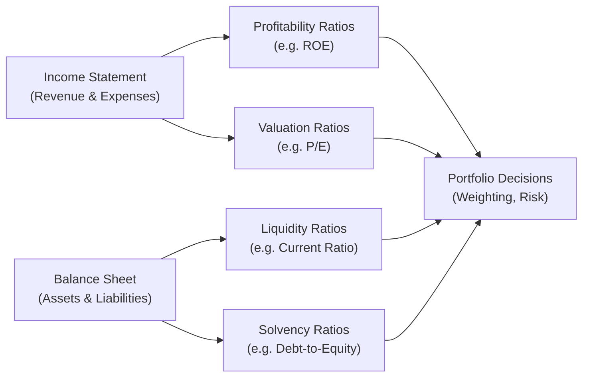

## Introduction and Context

Ratio analysis remains one of the most enduring techniques in financial analysis, cutting across equity, fixed income, and multi-asset portfolios. Even though it often first appears in earlier stages of the CFA Program, ratio analysis takes on more nuanced dimensions at the Level III stage, particularly when integrating it into portfolio construction and risk oversight. You might think, “But we covered these at Level I—why are we revisiting them now?” The key is that Level III demands a holistic, real-world application: combining ratio analysis with advanced topics such as strategic asset allocation, performance measurement, and risk exposures in a portfolio-level setting. 

In this section, we will examine four primary categories of ratios: (1) Liquidity, (2) Solvency, (3) Profitability, and (4) Valuation. We will highlight how each set of ratios can inform portfolio managers and analysts about a firm’s short- and long-term viability, its capacity to deploy capital efficiently, and the relative attractiveness of its valuation. Finally, we will bring these concepts into the context of IFRS vs. US GAAP differences, potential ethical considerations under the CFA Institute Code and Standards, and the practical ways exam questions might ask you to apply these ratios in real-world vignettes.

## The Role of Ratio Analysis in Advanced Portfolio Management

At a high level, ratio analysis offers a quick snapshot of a company’s financial health. But at the advanced (portfolio) level, simple ratio comparisons must be broadened to account for factors such as:

• Sector Rotation: Certain ratios—like those measuring working capital efficiency—are more critical in cyclical industries such as manufacturing or retail, while intangible-focused sectors (e.g., technology) use different benchmarks.  
• International Accounting Differences: Floating between IFRS and US GAAP can cause slight variations in reported numbers, especially where intangible assets, leases, and revenue recognition differ.  
• Risk Management Implications: Leverage ratios or coverage ratios can directly translate into the firm’s creditworthiness, which influences cost of capital and portfolio weighting decisions.  
• Macroeconomic Variables: A ratio might look healthy in isolation but can be distorted if interest rates, inflation, or foreign exchange dynamics shift.  

Understanding these deeper-level influences is key to weaving ratio analysis into your portfolio strategy.  

## Liquidity Ratios

Liquidity ratios assess a company’s ability to meet short-term obligations using current assets that are expected to convert to cash within one operating cycle (often one year). Common liquidity ratios include:  

### Current Ratio
The current ratio is:
  

\text{Current Ratio} = \frac{\text{Current Assets}}{\text{Current Liabilities}}


This ratio shows whether a firm has enough resources to cover immediate liabilities. For example, a current ratio of 2.0 implies that current assets are twice as large as current liabilities, suggesting a comfortable liquidity cushion. However, analyzing the trend over time reveals more than a single snapshot. If a firm’s current ratio has been deteriorating (say, from 2.0 down to 1.5), it might hint at poor working capital management or rising short-term debt.

### Quick Ratio
Also called the acid-test ratio, the quick ratio refines liquidity analysis by removing inventory from the numerator:


\text{Quick Ratio} = \frac{\text{Current Assets} - \text{Inventory}}{\text{Current Liabilities}}


Certain industries (such as heavy manufacturing or retail) carry substantial inventory, which may not be easily convertible to cash in the short term. Thus, the quick ratio provides a more conservative gauge of the company’s ability to pay off immediate obligations.  

### Practical Insights and Pitfalls
• Industry Norms: Liquidity needs differ by industry. A current ratio of 2.0 in one sector may be average, while 1.2 might be normal elsewhere due to differences in inventory turnover.  
• Seasonal Distortions: In industries with high seasonality (e.g., retail), liquidity ratios can spike or drop based on the time of year. Analysts often use rolling averages or compare the same quarter across multiple years to mitigate seasonal biases.  
• IFRS vs. US GAAP: Differences in the classification of certain items as current vs. noncurrent can subtly affect ratio calculations. For instance, under IFRS, short-term obligations that the firm can roll over may still appear as current liabilities unless certain criteria are met for reclassification.  

## Solvency Ratios

Solvency ratios look beyond short-term liquidity and focus on a firm’s capital structure, ability to service long-term debt, and the overall risk of insolvency. The two most common are the debt-to-equity ratio and the interest coverage ratio.

### Debt-to-Equity Ratio

\text{Debt-to-Equity Ratio} = \frac{\text{Total Debt}}{\text{Shareholders' Equity}}


A higher ratio typically implies greater risk, as the company has leveraged itself with debt. However, moderate leverage can magnify returns on equity in favorable markets. For instance, banks often operate with relatively high leverage because they generate revenue by lending out deposits—an accepted business model so long as prudent risk management and adequate capital reserves are in place (refer to Basel Accords in Chapter 14 for further discussion).

From a portfolio manager’s perspective, analyzing the debt-to-equity trend can inform the company’s shifting risk profile. An upward trend might elevate the cost of capital if credit rating agencies or bond investors perceive the firm to be riskier. It can also influence an equity analyst’s required rate of return in a discounted cash flow (DCF) valuation.

### Interest Coverage Ratio

\text{Interest Coverage Ratio} = \frac{\text{EBIT}}{\text{Interest Expense}}


Sometimes referred to as the times interest earned ratio, it measures how comfortably a firm can meet its interest payments. A ratio of 5.0 indicates that EBIT (Earnings Before Interest and Taxes) is five times annual interest expense, providing some cushion if operating income fluctuates.

### Practical Insights and Pitfalls
• Operating Leases: Under both IFRS 16 and ASC 842, many leases must be capitalized, increasing recognized liabilities. This can inflate both total debt and interest expense, which in turn reduces coverage ratios and raises the debt-to-equity ratio—making historical ratio comparisons more challenging.  
• Industry-Specific Benchmarks: Highly capital-intensive sectors (utilities, telecom) often carry higher debt-to-equity ratios, but that doesn’t automatically mean they are riskier. Stable, regulated cash flows can sustain higher leverage.  
• Hidden Off-Balance-Sheet Liabilities: Special Purpose Entities (SPEs) or certain factoring arrangements (Chapter 9) can obscure direct comparisons. Analysts must carefully review footnotes and management discussion & analysis (MD&A).

## Profitability Ratios

While liquidity and solvency tell you about a firm’s ability to survive, profitability ratios show how efficiently it uses its resources to generate returns. In the context of multi-asset portfolios, these ratios can guide sector allocation decisions and help detect fundamental shifts in a firm’s competitive posture.

### Net Profit Margin

\text{Net Profit Margin} = \frac{\text{Net Income}}{\text{Revenue}}


This ratio conveys how much net income is produced for every dollar of revenue. Shifts in net profit margin can suggest changes in cost structure, pricing power, or broader industry trends. In a slack economic environment, many companies might see net margins compressing, whereas in a booming period, net margins often expand if the firm can keep costs in check.

### Return on Assets (ROA)

\text{ROA} = \frac{\text{Net Income}}{\text{Total Assets}}


ROA captures how effectively management deploys the firm’s asset base to generate profits. Firms with asset-light business models (e.g., software or consulting) tend to exhibit higher ROA, while asset-heavy industries (energy, manufacturing, shipping) tend to have lower ROA.  

### Return on Equity (ROE)

\text{ROE} = \frac{\text{Net Income}}{\text{Shareholders' Equity}}


This key profitability metric reveals shareholders’ return on their invested capital. A high ROE may reflect strong operational performance or elevated financial leverage. Investors often break it down further via the DuPont analysis (see Section 13.3) to isolate whether the driver is profit margin, asset turnover, or higher leverage.  

### Practical Insights and Pitfalls
• Cross-Border Comparisons: IFRS and US GAAP differences in revenue recognition (Chapter 2) or capitalization of development costs (Chapter 6) can alter net income, and thus margins and returns.  
• One-Time Items and Nonrecurring Charges: Adjusted or normalized earnings often give a clearer picture of underlying profitability. M&A, restructuring, or impairment charges can significantly distort reported net income in any given period.  
• Growth vs. Value Perspectives: High margins and returns might be priced into the stock, so the next question involves the firm’s sustainable competitive advantage or expected future margins, bridging to valuation ratios discussed below.

## Valuation Ratios

Valuation ratios are particularly crucial for portfolio managers, enabling direct comparisons between a company’s stock price (or enterprise value) and fundamental performance or book value. They typically reflect market expectations of the firm’s growth, risk, and profitability.

### Price-to-Earnings (P/E) Ratio

\text{P/E Ratio} = \frac{\text{Price per Share}}{\text{Earnings per Share}}


By far the most cited ratio, the P/E ratio helps gauge how the market prices each dollar of earnings. A high P/E often indicates investors anticipate significant earnings growth, whereas a low P/E may highlight undervaluation—or it might signal concerns about the sustainability of earnings. Keep in mind that changes in accounting standards (such as IFRS 15 vs. ASC 606 for revenue recognition) can alter reported EPS, thereby affecting the P/E ratio.

### Price-to-Book (P/B) Ratio

\text{P/B Ratio} = \frac{\text{Price per Share}}{\text{Book Value per Share}}


Book value (particularly under IFRS) can change with revaluations of fixed assets or intangible assets, so it’s not always consistently measured across jurisdictions and industries. Nonetheless, P/B can offer insight into whether the market perceives the firm’s equity to be significantly above or below its accounting base.

### Enterprise Value to EBITDA (EV/EBITDA)

\text{EV/EBITDA} = \frac{\text{Enterprise Value}}{\text{EBITDA}}


Enterprise value (EV) includes market capitalization plus total debt (minus cash and equivalents), representing the entire value of a company’s financing sources. By comparing EV to EBITDA, analysts focus on the firm’s operating earnings potential before the influence of financing and accounting decisions (like depreciation schedules). This ratio can be more stable for cross-company comparisons, except when intangible assets and capitalized costs vary significantly under different accounting regimes.

### Practical Insights and Pitfalls
• Negative Earnings: A P/E ratio isn’t meaningful when EPS goes negative, so analysts may turn to forward P/E or EV/EBITDA in such scenarios.  
• Industry Norms: Technology companies sometimes trade at lofty P/E multiples due to perceived growth potential, while stable industries like utilities can have lower multiples.  
• Impact of Nonrecurring Charges: If EBITDA is inflated by unusual gains or suppressed by extraordinary expenses, EV/EBITDA might be skewed.  

## Integrating Ratio Analysis into Portfolio Decisions

### Multi-Asset Implications
For a Level III portfolio manager, ratio analysis is not just about deciding whether a stock is a “buy” or “sell.” It’s about constructing a balanced portfolio with an understanding of how these ratios interact with asset classes. For example, a heavily leveraged firm in an environment of rising interest rates might impact the fixed income portion of your portfolio—bonds or credit derivatives underwritten by that firm could experience higher default risk, forcing you to re-examine portfolio weightings.

### Behavioral Considerations
Overconfidence bias can lead some analysts to misjudge solvency or roughly interpret valuations. A thorough ratio-by-ratio comparison to historical averages or peers can mitigate such biases. Also, anchoring bias might cause us to hold onto an outdated industry average or a prior-year ratio. Stay alert to short-term shifts in market conditions or changes in the firm’s capital structure that can invalidate old anchor points.

### Ethical Aspects
Under the CFA Institute Code and Standards, especially Standards I(C) (Misrepresentation) and V(B) (Communication with Clients and Prospective Clients), comprehensive and accurate ratio analysis requires diligence. Representing a “conservative” liquidity or solvency position without revealing off-balance-sheet items or known potential distortions could mislead clients. Additionally, if you’re adjusting financial statements for comparability, disclosing these adjustments and their rationale is critical to maintain transparency and integrity.

## Common Adjustments and Accounting Differences

### IFRS vs. US GAAP
• Inventory: IFRS allows revaluation of some inventory write-downs if market conditions improve, whereas US GAAP generally does not, influencing cost of goods sold and net income.  
• Leases: Capitalization differences can significantly inflate liabilities under IFRS 16 and ASC 842.  
• Intangibles: IFRS often allows for valuation adjustments or revaluation of certain intangible assets, whereas US GAAP is stricter.  

Each difference can cascade into the denominators or numerators of your ratios, changing the perceived financial health of a company. It is common practice to apply “common-size” techniques or make normalization adjustments to ensure that ratios are comparable across different standards (see Chapter 1 and 2 for deeper discussions around IFRS vs. US GAAP).

### Major Transactions
Mergers, acquisitions, or large capital expenditures can temporarily warp ratios. A newly consolidated subsidiary might shift asset or liability balances significantly, thus altering liquidity and solvency ratios. Non-recurring events—like a major lawsuit settlement—can distort net income, affecting profitability or valuation metrics.

## Using Mermaid Diagrams to Visualize Ratio Flows

Below is a simple Mermaid diagram illustrating how certain inputs drive into ratios and how these metrics intersect with each other. Note that this diagram focuses on directional relationships rather than precise numeric flows:

In an integrated portfolio management setting, each dimension feeds into the final decision—whether to overweight or underweight a particular stock, sector, or region.

## Conclusion and Final Exam Tips

Ratio analysis at the CFA Level III stage goes well beyond the mechanical calculation of formulas. You must consider how each ratio interacts with sector characteristics, accounting policies, corporate strategies, and macroeconomic variables. When approaching exam questions:

• Identify the Ratio’s Relevance: Not all ratios are equally pertinent in every scenario. Questions often focus on the ratio that best addresses a particular risk or valuation perspective.  
• Examine Trends and Cross-Sectional Data: The exam might provide multiple years of ratios or data for several comparable companies. Look for divergences and consistent patterns.  
• Reconcile with Qualitative Factors: Beware of potential red flags: one-time items, off-balance-sheet structures, or imminent product obsolescence.  
• Apply Ethical Judgment: Ensure that any recommended adjustments to financial statements or ratio interpretations honor the principles of fairness and full disclosure under the CFA Institute Code and Standards.  
• Manage Time Wisely: In the constructed-response (essay) format, highlight the key drivers, potential distortions, and the final interpretation succinctly.  

If you integrate ratio analysis effectively—balancing your numeric findings with a nuanced understanding of the firm’s environment—you’ll add substantial value to real-world portfolio decisions and demonstrate your mastery of the CFA Program’s integrative approach.

## References

• Bernstein, Leopold A. “Analysis of Financial Statements.”  
• Financial Accounting Standards Board (FASB): www.fasb.org  
• Harvard Business Review: Articles on ratio and KPI development for business performance  
• IFRS Foundation: www.ifrs.org for updates on IFRS standards  
• CFA Institute Code of Ethics and Standards of Professional Conduct (Latest Edition)  

--------------------------------------------------------------------------------

## Test Your Knowledge: Ratio Analysis for Portfolio Management



### Which ratio best indicates a firm's ability to pay short-term liabilities from its most liquid assets?

- [ ] Current Ratio
- [x] Quick Ratio
- [ ] Debt-to-Equity Ratio
- [ ] Return on Equity

> **Explanation:** The quick ratio (sometimes called the acid-test ratio) excludes inventory from current assets, providing a more immediate picture of a firm’s ability to settle short-term debts using its most liquid resources.

### A high debt-to-equity ratio in a firm typically suggests:

- [ ] The firm has low financial risk.
- [x] The firm is using significant leverage, which can increase both risk and return.
- [ ] The firm is experiencing short-term liquidity problems.
- [ ] The firm’s credit rating is necessarily high.

> **Explanation:** A high debt-to-equity ratio means the firm relies more on borrowed funds. While this can boost returns on equity in favorable markets, it also raises the risk of insolvency and can lead to increased interest costs.

### When comparing a firm’s current ratio over several quarters, a consistent decline most likely indicates:

- [x] A potential deterioration in working capital management or rising short-term debts.
- [ ] Improved ability to convert inventories into cash.
- [ ] Higher profit margins.
- [ ] Shifting intangible assets from noncurrent to current.

> **Explanation:** A falling current ratio over time generally reflects worsening liquidity conditions, often due to growing current liabilities or ineffective working capital management.

### Which of the following statements about valuation ratios is most accurate?

- [ ] P/E ratio is always the best measure for firms with negative earnings.
- [ ] Price-to-book ratio is unaffected by differences in accounting standards.
- [x] EV/EBITDA can be more stable for cross-company comparisons, especially if accounting practices differ for depreciation.
- [ ] A high P/E ratio always indicates overvaluation.

> **Explanation:** EV/EBITDA focuses on operational earnings and total enterprise value, bypassing some of the variability introduced by depreciation and amortization, which can differ across accounting standards and capital structures.

### Under IFRS and US GAAP, how can new lease accounting standards (IFRS 16, ASC 842) affect ratio analysis?

- [x] They can increase reported debt and reduce interest coverage ratios.
- [ ] They reduce the firm’s reported net income significantly.
- [x] They have no influence on leverage ratios whatsoever.
- [ ] They eliminate the need to classify leases as operating or finance.

> **Explanation:** Capitalizing leases adds lease liabilities to the balance sheet, thereby elevating total debt. Interest expense also increases, which may reduce interest coverage. Under IFRS 16 and ASC 842, most leases are capitalized, but the classification nuances can still affect presentation.

### An analyst performs a DuPont breakdown of ROE to highlight:

- [x] Whether profitability, asset turnover, or financial leverage is driving return on equity.
- [ ] How many times current assets cover current liabilities.
- [ ] The firm’s short-run debt service coverage.
- [ ] The impact of intangible asset impairment on equity directly.

> **Explanation:** DuPont analysis decomposes ROE into net profit margin, asset turnover, and leverage (equity multiplier), providing deeper insight into which operational or capital structure factors drive overall returns.

### If a firm’s EBITDA is significantly inflated due to a nonrecurring gain:

- [ ] Its EV would also be inflated, eliminating any distortion in EV/EBITDA.
- [x] Its EV/EBITDA ratio might be understated, leading to misinterpretation.
- [x] Its P/E ratio would automatically revert to historic means.
- [ ] Its interest coverage ratio would become irrelevant.

> **Explanation:** Nonrecurring gains that inflate EBITDA would reduce the EV/EBITDA ratio artificially, making the firm appear cheaper than it truly is. Analysts should normalize or exclude one-time items for an accurate valuation.

### Which ratio is most directly relevant when assessing whether a firm is generating adequate returns for shareholders?

- [ ] Quick Ratio
- [ ] Debt-to-Equity Ratio
- [ ] Net Profit Margin
- [x] Return on Equity (ROE)

> **Explanation:** Return on Equity (ROE) focuses on how efficiently the firm uses shareholder capital to generate net income. It is a direct reflection of returns to the firm’s common equity holders.

### A firm’s solvency position is most thoroughly evaluated by:

- [ ] The current ratio and quick ratio.
- [ ] The net profit margin.
- [ ] The P/E ratio.
- [x] The debt-to-equity ratio and interest coverage ratio.

> **Explanation:** Solvency is fundamentally about long-term financial stability and leverage. Debt-to-equity and interest coverage ratios are both crucial in understanding the firm’s long-term viability and debt-servicing capacity.

### True or False: A very high ROE always indicates management effectiveness.

- [x] True
- [ ] False

> **Explanation:** While higher ROE may be due to operational efficiency, it could also stem from excessive leverage. A high ROE on its own does not necessarily mean management is effective; deeper analysis is required to ensure operational performance, not leverage, is the real driver.


