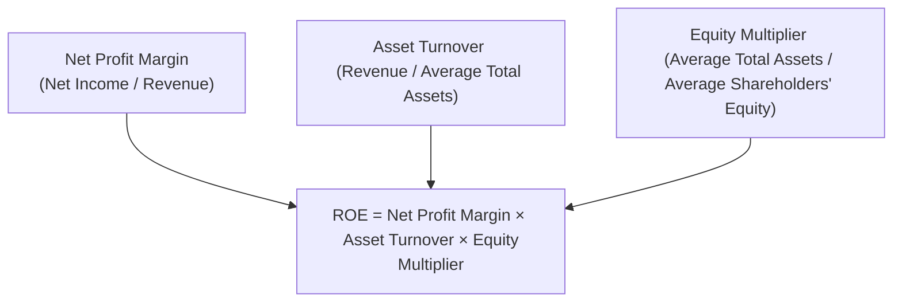

## Introduction

I remember the very first time I stumbled upon DuPont Analysis—it felt like someone had handed me the secret recipe to see exactly why a company’s Return on Equity (ROE) was moving up or down. Before that, I’d glance at ROE and think, “Well, higher must be better—oh, wait, is it from margin improvements, or is it just from piling on debt?” DuPont Analysis was the key that unlocked that puzzle. 

This section explores how this tried-and-true technique breaks down ROE into specific components, letting you identify which lever—profitability, efficiency, or leverage—is truly behind a firm’s performance. We’ll also discuss how you can extend the DuPont approach even further, capturing factors like the effect of taxes or interest. Along the way, we’ll look at real-world considerations, including distortions from one-time events and off-balance-sheet financing. If you’re already well-versed in basic ratio analysis (see Section 13.2), you’ll find DuPont Analysis to be a natural extension. And if you’re brand new, don’t worry—by the end, you’ll be able to read a company’s tea leaves (i.e., its financial statements) with precision and confidence.

## The Classic DuPont Formula

At the heart of DuPont Analysis is the idea that Return on Equity (ROE) alone does not paint a full picture of why a company’s equity holders are earning whatever percentage they’re earning. ROE is simply:

  
ROE = Net Income / Average Shareholders’ Equity.

That’s nice to know, but it doesn’t tell us how a company arrived at that specific ratio. The **Classic DuPont Formula** deconstructs ROE into three components:

  
ROE = (Net Profit Margin) × (Asset Turnover) × (Equity Multiplier),

where:

• Net Profit Margin = Net Income / Revenue  
• Asset Turnover = Revenue / Average Total Assets  
• Equity Multiplier (Leverage Ratio) = Average Total Assets / Average Shareholders’ Equity  

We often see ROE visualized in a pyramid, with margin, turnover, and leverage forming the building blocks, culminating in ROE at the top.

### Diagram: Classic DuPont Decomposition

#### Why These Components Matter

1. Net Profit Margin (NPM) measures how effectively a company converts its revenue into actual profit. A rising NPM suggests improved pricing power, cost containment, or just plain efficiency.
2. Asset Turnover indicates how productively a company uses its assets. A higher turnover means the company generates more sales per dollar invested in assets.
3. The Equity Multiplier captures a company’s leverage. If the firm is leaning more on debt, you’ll see a higher multiplier (i.e., more total assets stacked on a smaller equity base).

Together, these factors help analysts see if a company’s solid ROE is due to genuine business strength (higher margin or better asset utilization), or if it’s just from taking on more debt. You might find that a big chunk of “success” is simply from leverage, suggesting higher financial risk.

## Simple Numerical Example

Suppose ABC Company reported the following last year:

• Net Income: $500,000  
• Revenue: $5,000,000  
• Average Total Assets: $2,000,000  
• Average Shareholders’ Equity: $1,000,000  

From these data:

• Net Profit Margin = $500,000 / $5,000,000 = 0.10 (or 10%)  
• Asset Turnover = $5,000,000 / $2,000,000 = 2.5  
• Equity Multiplier = $2,000,000 / $1,000,000 = 2.0  

Hence,

ROE = 0.10 × 2.5 × 2.0 = 0.50 (or 50%)

At first glance, a 50% ROE looks astounding. But as we can see, the company’s strong performance comes from both decent profitability (10% margin) and a relatively high level of leverage (equity multiplier of 2.0). If we tried to compare ABC to a competitor with a similar margin and turnover but an equity multiplier of 1.3, we’d quickly realize ABC’s higher ROE is partly due to taking on more debt.

## Extended DuPont Analysis

Sometimes, even the classic decomposition doesn’t tell the whole story. You might see companies that have a bright operating margin but get hammered by high interest payments or heavy taxes. In those cases, the broad “Net Income” figure clouds the root cause. That’s where the **Extended DuPont Model** comes into play. One version of the extended model breaks Net Profit Margin into:

• Tax Burden = Net Income / Pre-Tax Income  
• Interest Burden = Pre-Tax Income / EBIT (Earnings Before Interest and Taxes)  
• Operating Margin = EBIT / Revenue  

Combining these:

ROE = (Tax Burden) × (Interest Burden) × (Operating Margin) × (Asset Turnover) × (Equity Multiplier).

You might see slightly different notations, but they all aim to segment out how much interest cost and taxation are affecting final profits, separate from operating performance. 

#### Sample Extended Formula Breakdown

  
• Operating margin shows core profitability from operations, before interest and taxes.  
• Interest burden shows how much of the operating profit is left after interest expenses.  
• Tax burden reveals how much is left after taxes.  

Multiplying them gives you the net margin but in a more detailed way—useful if you’re analyzing a firm’s capital structure decisions or changes in tax strategies over time.

## Period-Over-Period and Peer Comparisons

### Tracking Changes Over Time

One of the best things about DuPont is how it pinpoints **which** driver changes from one period to the next. If last year’s ROE was 15% and this year it’s 20%, you can break down that 5% jump to see if it was due to:

1. Higher margin (maybe new product lines or improved pricing).  
2. Better asset turnover (more efficient use of factories, warehouses, or intangible assets).  
3. A bigger equity multiplier (possibly new debt taken on).  

Armed with these insights, you can decide if the ROE jump is a high-quality improvement or just a lever that might snap back in the future.

### Benchmarking Against Peers

DuPont also helps you compare a company to its competitors in the same industry. Two companies with the same ROE could have completely different risk profiles. One might have an equity multiplier of 4.0—risky if the industry is cyclical. The other might get the same ROE purely through a super-efficient production process but with minimal leverage. By comparing each DuPont component to industry norms, you can tell which factor sets the firm apart—maybe it’s a high-end brand that commands premium prices (margin) or a well-oiled distribution network (turnover).

## Potential Distortions and Cautions

Like any analytical tool, DuPont can be skewed by unusual items or statements:

1. **Off-Balance-Sheet Financing**: If a firm has substantial operating leases (under certain accounting standards) or uses special purpose entities (discussed in Chapter 9), total assets and liabilities might be understated.
2. **One-Time Charges and Non-Recurring Items**: Big gains or losses that inflate or shrink net income in a single period can throw off margin or hamper multi-year comparisons.
3. **Asset Revaluations**: Under IFRS, certain noncurrent assets can be revalued. This changes the asset base and can distort asset turnover or equity if revaluation surplus hits equity.
4. **Seasonality**: If you’re analyzing an interim period (see Chapter 1.14 for seasonality discourse), the DuPont ratios might not reflect the full-year pattern.

The gist? Don’t treat DuPont Analysis as an autopilot for truth. Layer on your judgment: Are the numbers truly capturing the company’s normal performance?

## Real-World Example (Hypothetical)

Let’s imagine a retailer, SunnyMart, that releases its annual results:

• Revenue: $2 billion  
• Net Income: $120 million  
• Pre-Tax Income: $180 million  
• EBIT: $200 million  
• Average Total Assets: $1 billion  
• Average Equity: $500 million  

### Classic Approach

• Net Profit Margin = $120m / $2,000m = 6.0%  
• Asset Turnover = $2,000m / $1,000m = 2.0  
• Equity Multiplier = $1,000m / $500m = 2.0  

So:

ROE = 6.0% × 2.0 × 2.0 = 24.0%.

### Extended Approach

Let’s see if we want more detail on how that 6.0% net margin came about:

• Operating Margin = EBIT / Revenue = $200m / $2,000m = 10%  
• Interest Burden = Pre-Tax Income / EBIT = $180m / $200m = 0.90  
• Tax Burden = Net Income / Pre-Tax Income = $120m / $180m = 0.67  

Hence:

Net Profit Margin = 10% × 0.90 × 0.67 ≈ 6.03%.

That’s consistent with our simpler calculation. Now let’s incorporate turnover and leverage:

ROE = 10% × 0.90 × 0.67 × 2.0 × 2.0 ≈ 24.1%.

You can see that interest expense took a 10% EBIT margin down to 9%, and then taxes carved it down further to about 6%. When comparing to a competitor, we might discover that competitor’s interest burden is closer to 0.98 but has a steeper equity multiplier. So even if they both have a broadly similar ROE, the competitor is lighter on interest expense but uses more debt in total (that’s revealed in the equity multiplier).

## Best Practices for Applying DuPont

• **Combine Period Averages**: Use average assets and equity over the period to reduce distortion from year-end spikes or dips.  
• **Exclude Extreme One-Time Events**: Sometimes you want to adjust net income for large non-recurring items, like a big asset sale that artificially jacks up margin.  
• **Align with IFRS/GAAP**: If you’re cross-comparing firms that follow different accounting standards, be mindful that differences in classification or measurement can blur direct comparisons.  
• **Conduct Trend Analysis**: Evaluate DuPont components over multiple periods to see whether improvements are consistent or just a flash in the pan.

## Exam Tips and Practical Implications

For exam settings—especially if you’re faced with ratio decomposition questions—focus on identifying how changes in margin, turnover, or leverage affect ROE. When a vignette says “Company X’s net income grew, but so did their interest expense,” or “The firm nearly doubled its fixed assets,” you’ll know to look at the margin for the first clue and the turnover for the second. Also, look out for big changes in capital structure that push the equity multiplier around. 

Real-world analysts do the same: We check the footnotes for clues about debt issuance or intangible asset revaluations. We see if the company is experiencing one-off events (such as a big legal settlement) that might alter net income. Each detail helps clarify what’s truly driving returns for shareholders.

## References

• Peterson Drake, P. (various editions). “Financial Analysis: Tools and Techniques.”  
• CFA Institute publications on DuPont and related ratio analyses (https://www.cfainstitute.org).  
• Various studies on ROE decomposition techniques in academic finance journals.

## Test Your Knowledge: DuPont Analysis and Extensions



### A company has an ROE of 18%. Its net profit margin is 9%, and its equity multiplier is 2.0. What is its asset turnover ratio?

- [ ] 1.0  
- [ ] 1.5  
- [x] 1.0  
- [ ] 2.5  

> **Explanation:** ROE = NPM × Asset Turnover × Equity Multiplier.  
> 18% = 9% × Asset Turnover × 2.0 ⇒ Asset Turnover = 18% / (9% × 2.0) = 1.0.

### Which of the following best reflects how DuPont Analysis helps in understanding ROE?

- [x] It breaks down ROE into profitability, efficiency, and leverage components.  
- [ ] It increases the net income a company reports.  
- [ ] It is an alternate format of the income statement.  
- [ ] It is the sum of various liquidity ratios.  

> **Explanation:** DuPont Analysis decomposes ROE into net profit margin, asset turnover, and the equity multiplier, each representing a key performance dimension.

### What is the primary additional insight provided by the extended DuPont model?

- [ ] It isolates all non-operating income.  
- [x] It separates the impact of interest and taxes on net income.  
- [ ] It does not use net income in the calculation.  
- [ ] It directly measures the beta of a company.  

> **Explanation:** The extended model breaks net profit into operating margin, interest burden, and tax burden, highlighting interest expenses and tax impacts on final earnings.

### If a company's net margin increases but its asset turnover and equity multiplier remain the same, which DuPont component is primarily driving an increase in ROE?

- [ ] Asset Turnover  
- [x] Net Profit Margin  
- [ ] Equity Multiplier  
- [ ] None of the above  

> **Explanation:** A rise in net margin (with stable turnover and leverage) directly boosts ROE.

### Assume a firm’s equity multiplier is significantly higher than its peers. What best describes the potential risk?

- [x] The firm may be taking on more debt, increasing financial risk.  
- [ ] The firm must have better operating margins.  
- [ ] The net profit margin is guaranteed to be higher.  
- [ ] Its tax burden is always lower.  

> **Explanation:** A higher equity multiplier indicates more total assets financed by debt relative to equity, which raises financial risk.

### Period-over-period DuPont comparison is most beneficial when:

- [x] Identifying whether changes in ROE stem from margins, efficiency, or leverage.  
- [ ] Calculating the weighted average cost of capital.  
- [ ] Determining the intrinsic value of equity.  
- [ ] Aggregating liquidity ratios.  

> **Explanation:** DuPont Analysis excels at pinpointing specific drivers behind changes in ROE from one period to another.

### In the extended DuPont formula, “tax burden” is calculated as:

- [ ] EBIT / Net Income  
- [x] Net Income / Pre-Tax Income  
- [ ] Pre-Tax Income / Net Income  
- [ ] Revenue / EBIT  

> **Explanation:** Tax burden measures the portion of pre-tax earnings left over after income tax.

### When might operating leases significantly distort the equity multiplier in DuPont Analysis?

- [x] When a large share of a company’s assets are not recorded on the balance sheet.  
- [ ] When the company reports negative earnings.  
- [ ] When the company uses the direct method for cash flow.  
- [ ] When intangible assets are reported at fair value.  

> **Explanation:** Off-balance-sheet items (like certain operating leases under older standards) can reduce total assets (and liabilities) artificially, skewing the equity multiplier.

### A company’s net margin rose from 5% to 8%, but asset turnover declined from 2.0 to 1.6. The equity multiplier stayed the same. What best describes the interaction on ROE?

- [x] The firm’s improved net margin offsets the reduced turnover, net effect on ROE depends on how much each factor changed.  
- [ ] ROE must have increased because the margin rose.  
- [ ] ROE must have decreased because turnover declined.  
- [ ] There is no effect on ROE unless leverage also changes.  

> **Explanation:** DuPont is a product of margin × turnover × leverage. If margin goes up but turnover falls, you must compare the magnitudes to see the net effect.

### True or False: DuPont Analysis can be misleading if nonrecurring items inflate net profit.

- [x] True  
- [ ] False  

> **Explanation:** Large one-time events may distort margin and hence ROE. Analysts often adjust for these items to get a more accurate picture.


