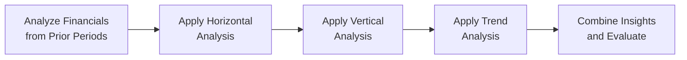

It’s often said that when we look at financial statements for just a single period, it’s like reading one chapter out of a whole book—useful, sure, but hardly revealing the complete story. This is where horizontal, vertical, and trend analysis become your close companions. They help you compare and contrast multiple periods, spot unexpected jumps or drops, and make sense of the “whys” behind the numbers.

Below, we’ll explore these three techniques in detail and show how they can be integrated to deliver a well-rounded perspective. We’ll also embed a few personal insights, so you’ll see that even practitioners who have been at this for decades can get the occasional surprise or “Aha!” moment.

## Overview and Importance

Analysts frequently combine horizontal, vertical, and trend analysis to assess performance consistency, pinpoint strategic shifts, and discover red flags related to earnings management. These tools create a 360-degree view of a company’s financial posture over time and across peer firms, enhancing both internal decision-making and external valuation assessments. In Chapter 13.2 (Ratio Analysis), we saw how ratio trends provide an at-a-glance picture of corporate health; here, we’ll expand on those ideas to help you interpret underlying financial statement data in more detail.

And yes, there’s a lot to keep track of—like IFRS vs. US GAAP differences that might alter the base figure used in vertical analysis or cause some line items to be recognized differently for horizontal comparisons. But don’t worry. Let’s tackle them one at a time.



This simple diagram outlines our approach: we gather historical statements, perform horizontal analysis, then conduct vertical analysis, look for multi-year patterns with trend tools, and finally interpret the results holistically.

---

## Horizontal Analysis: Comparing Across Multiple Periods

Horizontal analysis is all about comparing financial data across several periods (often year over year or quarter over quarter). You can look at absolute changes, percentages, or both.

### Key Concepts

• Time-Series Data: Observations of the same variable (like revenue or inventory) across multiple intervals.  
• Growth Rate: The percentage increase or decrease of an item from one period to the next.  

A quick example: Let’s say you want to see how revenue changed from 20X1 to 20X2. Imagine:

- Revenue in 20X1 = $200 million  
- Revenue in 20X2 = $250 million  

Absolute Change = $250 million – $200 million = $50 million.  
Percentage Change = ($50 million / $200 million) × 100% = 25% increase.

While this is straightforward, you might want to dig deeper. For instance, if cost of goods sold (COGS) soared by 40% in the same period, that mismatch might signal either poor cost control or a strategic decision to invest more in product quality. One time I remember seeing a client’s beverage division costs spike by 60% when revenue was up just 20%. Turned out they were transitioning to more premium packaging materials, which was all part of a marketing strategy. The lesson? Horizontal analysis is a conversation starter, not a final, stand-alone verdict.

### Applications Across Statements

- Income Statement: Compare revenue, operating expenses, interest expenses, and net income across periods.  
- Balance Sheet: Evaluate changes in assets, liabilities, and equity over time.  
- Statement of Cash Flows: Spot fluctuations in operating, investing, and financing cash flows.  

### Potential Pitfalls

- Accounting Policy Changes: Between IFRS and US GAAP, some items might shift from one line to another, complicating direct period-to-period comparisons.  
- Nonrecurring Items: Large one-off gains or losses skew the analysis. Check for extraordinary items or discontinued operations.  
- Inflation & Currency Effects: In high-inflation environments or when comparing foreign subsidiaries, the raw numbers might be misleading. (You can adjust for inflation or currency swings to remain consistent.)

---

## Vertical (Common-Size) Analysis: Normalizing the Data

Vertical analysis flips the lens: each line item is shown as a percentage of a base figure, typically total revenue on the income statement or total assets on the balance sheet. This “common-size” approach reveals the internal structure of the statement.

### Key Concepts

• Base Figure: The denominator. For the income statement, total revenue is common; for the balance sheet, total assets or total liabilities + equity.  

If total revenue is $100 million and selling, general, and administrative (SG&A) expenses are $20 million, then SG&A is 20% of revenue. Over multiple periods, you can spot whether a cost category is growing or shrinking relative to revenue.

### Why It’s Useful

1. Compare Across Companies: Evaluating PepsiCo and a small local soda maker based on raw revenue differences alone isn’t helpful. But SG&A as a percentage of revenue can instantly reveal whether one is spending more or less on overhead.  
2. Spot Structural Shifts: A stable 5% R&D ratio that suddenly jumps to 12% might indicate a major strategic pivot. This ties back to the earlier anecdote where you might see that large jump in R&D horizontally but realize it’s still a fraction of total revenue vertically.  

### Real-World Note

Well, here’s a short anecdote: My old colleague once hopped into consulting for a tech startup that had impressive revenue growth but also uncomfortably high marketing expenses. When you stacked the marketing expense vertically against revenue, you realized the cost was nearly half of the total. It looked unsustainable, but the founders insisted customer acquisition was the top priority. Sometimes the story behind the numbers validates the ratio; other times, it contradicts it. Vertical analysis is how you identify those discrepancies at a glance.

---

## Trend Analysis: Detecting Patterns Over Many Periods

Trend analysis is like taking horizontal analysis a step further by looking at multiple time periods—3, 5, or even 10 years—and also standardizing to a baseline. You might see statements indexed to 100 for the earliest period, so if revenue in the baseline year is $200 million, we call that 100. If in the next year revenue is $220 million, we call that 110, and so forth.

### Key Concepts

- **Indexing Data:** Convert all data points to a baseline of 100 for the earliest year. This approach quickly reveals the direction and magnitude of growth or contraction over time.  
- **Multi-Year Growth Rates:** You can compute compound annual growth rates (CAGR) to measure an item’s average rate of increase (or decrease) over multiple periods.

For example, suppose a company’s revenue (in millions) for five years is:

• Year 1: 200  
• Year 2: 220  
• Year 3: 230  
• Year 4: 250  
• Year 5: 300  

Index to Year 1:
• Year 1 = (200 / 200) × 100 = 100  
• Year 2 = (220 / 200) × 100 = 110  
• Year 3 = (230 / 200) × 100 = 115  
• Year 4 = (250 / 200) × 100 = 125  
• Year 5 = (300 / 200) × 100 = 150  

In a quick glance, you see that by Year 5, revenue has grown 50% above the baseline.  

Let’s illustrate a Python snippet to do the indexing quickly:

```python
import pandas as pd

revenue_data = [200, 220, 230, 250, 300]
base_year_value = revenue_data[0]

indexed_data = [(val / base_year_value) * 100 for val in revenue_data]

df = pd.DataFrame({
    'Year': [1, 2, 3, 4, 5],
    'Revenue (millions)': revenue_data,
    'Indexed (Year1=100)': indexed_data
})

print(df)
```

This snippet can be extended to incorporate multiple line items for more comprehensive trend analysis.

### Applications in Cyclical Industries

Trend analysis is particularly crucial for cyclical industries—think automotive, steel, or retail—where you see multi-year swings. One year might look dismal within a single period, but a five-year horizon provides context that a down year might simply be part of the usual pattern (or maybe a global supply chain glitch, as we saw in some recent automotive chip shortages).

---

## Merging Horizontal, Vertical, and Trend Analysis for Deeper Insights

In practice, horizontal, vertical, and trend analyses are more powerful when applied together. You might start by comparing data across years (horizontal), then shift into a vertical analysis to see how the percentage composition has changed, and finally layer on trend indexes to see if the direction aligns with strategic initiatives.

Consider an instance where a firm’s R&D expenses soared by $10 million year over year. That might sound huge in absolute terms (horizontal analysis). But let’s say revenue also soared by $200 million, so R&D is still just 3% relative to total revenue in the vertical analysis. Over a five-year timeline, R&D has consistently grown from 1% to 3%, indicating a steady upward slope in R&D investment captured by trend analysis. Putting these together, you infer that yes, the company is investing more in R&D, but it hasn’t become an unwieldy cost driver. That’s a strategic shift, but it’s under control.  

And remember, keep an eye on how line items are classified under IFRS vs. US GAAP. For instance, some R&D costs might be capitalized under certain conditions (especially in IFRS) or recognized as expenses in others (particularly under US GAAP). If you’re not consistent in your approach from period to period, your analysis could be apples-to-oranges.

---

## Case Study: A Midsize Manufacturing Firm

Let’s do a simplified fictional example. Suppose we have a midsize firm, Maple Manufacturing, with the following select income statement info (in thousands of dollars) for two consecutive years:

|                        | Year 1     | Year 2     |
|------------------------|-----------:|-----------:|
| Revenue               | $50,000    | $56,000    |
| Cost of Goods Sold    | $30,000    | $35,000    |
| Gross Profit          | $20,000    | $21,000    |
| Selling/Administrative| $5,000     | $6,000     |
| R&D                   | $800       | $1,200     |
| Operating Income      | $14,200    | $13,800    |
| Net Income            | $9,100     | $8,800     |

### Horizontal Analysis Snapshot

• Revenue rose by $6,000 (12% increase).  
• COGS rose by $5,000 (17% increase).  
• R&D soared by $400 (50% increase).  
• Net Income decreased by $300 (-3.3%).

You might wonder: “Why did net income fall despite a 12% revenue increase?” On closer inspection, you see that costs across the board went up faster than revenue, especially R&D, plus some operating inefficiencies.

### Vertical Analysis (Year 2 as a % of Revenue)

For Year 2:

• COGS = $35,000 / $56,000 ≈ 62.5%  
• Selling/Administrative = $6,000 / $56,000 ≈ 10.7%  
• R&D = $1,200 / $56,000 ≈ 2.1%  
• Operating Income = $13,800 / $56,000 ≈ 24.6%  
• Net Income = $8,800 / $56,000 ≈ 15.7%  

Comparing to Year 1 (where net income was $9,100 / $50,000 = 18.2%) shows net income margin dipped from 18.2% to 15.7%. That’s a notable margin contraction.

### Trend Perspective (Year 1 = 100)

Revenue indexed to 100 in Year 1 becomes 112 in Year 2. Meanwhile, net income’s index is about 97 (a decline), indicating that while top-line growth was robust, the bottom line actually slipped.

---

## Practical Observations and Caveats

1. **Strategic vs. Structural Changes**: A big jump in operating expenses might be part of a long-term growth plan (like brand building). Try connecting these expenses to the company’s stated strategy or management discussion (see Chapter 1.1 The Role of Financial Reporting and Analysis).  
2. **Exclusion of Nonrecurring Items**: If a firm sold a major asset in Year 2, that gain can distort your horizontal and trend calculations. Make adjustments to isolate underlying operational performance.  
3. **Regulatory Differences**: IFRS vs. US GAAP might affect how development costs, leasing, or intangible asset amortization are recognized. (See Chapter 2.11 Key IFRS vs. US GAAP Differences and Chapter 7.1 Lease Accounting for more specifics.)  
4. **Industry Norms**: The ratio that’s healthy in a software startup might be alarming in a mature manufacturing setting. Always frame your analysis within the industry context.

---

## Best Practices and Exam Tips

• **Consistency is Queen**: Align your data classification across all periods. If IFRS or US GAAP changes the categorization, note it carefully.  
• **Adjust for Inflation/Currency**: If you’re analyzing multiple geographies or high-inflation jurisdictions, consider constant currency or inflation-adjusted figures.  
• **Automate Calculations**: Tools like Python, Excel macros, or specialized accounting software can reduce mechanical errors (time is precious!).  
• **Scenario Analysis**: For the Level I exam, you might see item-set questions presenting multiple periods of financial statements with a question on probable trends or margins. Practice reading beyond the obvious.  
• **Time Management**: The exam might combine ratio interpretation with horizontal/vertical analysis. Remember to methodically parse the statements—doing mental math in a hurry can introduce silly mistakes.  
• **Constructed Response**: Although more common at advanced CFA levels, interpretation skills are crucial. Be prepared to articulate a coherent narrative from the numbers.

---

## Further Reading

• White, Sondhi, and Fried, “Guide to Financial Statement Analysis.”  
• Benjamin Graham, “Interpretation of Financial Statements.”  
• Lisa Weaver’s accounting outlines in professional accounting journals.  
• IFRS.org for updated IFRS standards.  
• FASB.org for US GAAP clarifications.

---

## Test Your Knowledge: Horizontal, Vertical, and Trend Analysis



### If cost of goods sold grows at a faster rate than revenue in horizontal analysis, which of the following is the most immediate concern for analysts?

- [ ] Reduced revenue recognition period
- [ ] No impact on profit margin
- [x] Potential contraction in gross margin
- [ ] Lower non-operating expenses

> **Explanation:** When COGS grows faster than revenue, the gross margin tends to shrink, suggesting potential issues with cost control.

### Which line item typically serves as the base figure for vertical (common-size) analysis on the income statement?

- [ ] Gross Profit
- [x] Total Revenue
- [ ] Net Income
- [ ] Operating Income

> **Explanation:** Common-size income statements usually express every line item as a percentage of total revenue.

### When using trend analysis, an index value of 150 represents what percentage increase from the base year’s value of 100?

- [ ] 25%
- [ ] 40%
- [ ] 45%
- [x] 50%

> **Explanation:** An index of 150 is 50% higher than the base index of 100.

### Which of the following is generally not a best practice in preparing multi-period comparisons for horizontal analysis?

- [ ] Using the same definition of line items each period
- [ ] Adjusting for significant currency fluctuations
- [ ] Excluding nonrecurring items to compare core operations
- [x] Ignoring changes in accounting policies

> **Explanation:** You must consider changes in accounting policies; ignoring them can result in improper comparisons.

### When performing vertical analysis of a balance sheet, which of the following is commonly used as the base figure?

- [x] Total assets
- [ ] Total revenue
- [ ] Total liabilities
- [ ] Shareholders’ equity

> **Explanation:** Common-size balance sheet percentages are usually derived by dividing each account by total assets.

### Why might a large jump in R&D outlays look less alarming under a vertical analysis than a horizontal analysis?

- [x] Because R&D might still be a small percentage of total revenue
- [ ] Because R&D is not recognized under IFRS
- [ ] Because R&D is offset by intangible asset write-offs
- [ ] Because vertical analysis only includes net income

> **Explanation:** Even if R&D costs increase in absolute terms, the percentage to total revenue may remain small, indicating manageable growth.

### Which scenario best illustrates the use of multi-year trend indexing?

- [ ] Calculating a single year’s revenue growth
- [x] Converting data over five years to a baseline of 100
- [ ] Examining annual depreciation schedules
- [ ] Looking only at the latest year’s total expenses

> **Explanation:** Trend indexing involves comparing multiple years to a chosen base year, typically set to 100.

### Under which condition might horizontal analysis be most prone to distortion?

- [x] When the company experiences a significant one-time gain or loss
- [ ] When the company has consistent growth rates every year
- [ ] When the company uses IFRS instead of US GAAP
- [ ] When the company invests purely in intangible assets

> **Explanation:** One-time items can create misleading year-over-year comparisons if not adjusted or noted.

### In vertical (common-size) analysis of an income statement over time, what could cause a rising percentage of SG&A expenses?

- [x] SG&A growth that exceeds revenue growth
- [ ] A higher income tax rate
- [ ] A rise in COGS
- [ ] Decreasing depreciation expense

> **Explanation:** If SG&A expenses grow faster than revenue, then as a percentage of revenue, SG&A will rise.

### Horizontal, vertical, and trend analysis can be integrated to provide a more complete view of a firm’s performance over time.

- [x] True
- [ ] False

> **Explanation:** Each technique sheds light on different aspects of financial performance. Using them in conjunction offers a holistic picture.


