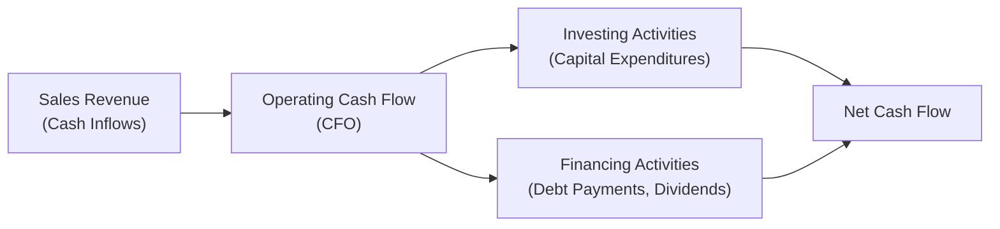

## Introduction

When folks talk about a company's performance, they often point to net income or earnings per share. But, um, let's be honest: cash is usually the real star of the show. After all, you can’t pay salaries or suppliers with “net income.” That’s why cash flow ratios are so important in evaluating an organization’s liquidity, solvency, and overall financial health. 

In this section, we’ll go beyond the income statement spotlight. We’ll look instead at how well a firm generates and manages cash. If earnings are the “story” told by the income statement, then cash flows provide the behind-the-scenes reality check. And if there’s a big discrepancy between a company’s reported profits and its actual cash on hand, it’s sometimes a sign that something fishy might be going on—like overly aggressive revenue recognition or underreported expenses. 

To illustrate the major points, we’ll discuss specific cash flow ratios such as Operating Cash Flow Ratio, Cash Return on Assets (CFROA), and Cash Coverage Ratios. We’ll also glance at the potential red flags that an analyst should watch out for, especially when these ratios don’t align with accrual-based performance indicators. By the end, you’ll know how to interpret these cash-based metrics, what they reveal about ongoing financial health, and how to use them alongside more traditional measures like net income, return on assets, or the infamous “EBITDA.”

## Rationale for Cash Flow Analysis

### The Limitations of Accrual Accounting

Accrual accounting is a great invention. It helps match revenues to the expenses that generated them, which yields a smooth (sometimes artificially smooth!) pattern of earnings over time. However, accruals can mask short-term liquidity problems or manipulate the timing of revenue and expense recognition.

From a CFA perspective, especially at advanced levels, recognizing that net income might not reflect the true economic performance of a business is crucial. If a firm extends credit terms aggressively, net income might look amazing, but the cash receipts might arrive way too late—or not at all. Conversely, a large chunk of current liabilities might quickly deplete actual liquidity, even if the firm is still technically profitable. That’s why we look at cash flow. Cash doesn’t hide the same way accruals do.

### Why Cash Flow Ratios Matter

Cash flow ratios move the analytical spotlight away from purely profit-based metrics toward understanding financial flexibility and day-to-day viability. They help us figure out whether the firm can:

• Cover short-term obligations without raising external capital.  
• Maintain and grow capacity through capital expenditures.  
• Pay dividends in a sustainable manner.  
• Manage its debt-service requirements under adverse conditions.

Cash flow metrics effectively reveal how management deals with real money. While net income could be “engineered” by adjusting estimates or exploiting gaps in revenue-recognition rules, cash is harder to fake consistently over the long term (although sophisticated manipulations like stretching payables, factoring receivables, or misclassifying items can occur—just more easily detected if you know what to look for).

## Key Cash Flow Ratios

### Operating Cash Flow Ratio

The Operating Cash Flow Ratio (sometimes called the Operating Cash Flow to Current Liabilities Ratio) is a straightforward measure:


\text{Operating Cash Flow Ratio} = \frac{\text{Operating Cash Flow (CFO)}}{\text{Current Liabilities}}


• “Operating Cash Flow” (CFO) typically comes from the statement of cash flows under the operating activities section.  
• “Current Liabilities” appear on the balance sheet and usually refer to obligations due within one year.

This ratio tells you how readily the firm’s core business operations generate enough cash to cover near-term obligations. If it’s significantly greater than 1.0, that’s generally a good sign: the business is generating robust cash flows to pay its staff, suppliers, and interest costs on short-term debt. If it’s consistently below 1.0, the company might struggle to handle its current liabilities without drawing on lines of credit or raising funds elsewhere.

#### Interpretation & Potential Pitfalls

• A firm with high depreciation or amortization (which inflates CFO relative to net income) might look great here even if actual liquidity is weak. Always consider whether CFO is boosted by large non-cash charges that inflate operating cash flow.  
• Seasonal businesses often see large swings in CFO from quarter to quarter. An annual or trailing twelve-month measure is usually more reliable than a single quarter snapshot.

### Cash Return on Assets (CFROA)

Another favorite is the Cash Return on Assets (CFROA). While Return on Assets (ROA) uses net income in the numerator, CFROA uses cash flow from operations instead:


\text{CFROA} = \frac{\text{CFO}}{\text{Average Total Assets}}


• “CFO” is taken from the cash flow statement.  
• “Average Total Assets” is typically the average of beginning and ending total assets for the period.

CFROA tells you how well management is using the firm’s total asset base to generate cold, hard cash. It’s a measure of efficiency and profitability in cash terms.

If CFROA seems chronically low compared to a peer group, potential causes include cost management issues, an inability to turn inventory quickly, or an imbalance between credit terms extended to customers and credit terms demanded by suppliers. In an extreme scenario, low CFROA might reveal that the business is always short on liquidity, perhaps relying heavily on new financing to sustain operations.

#### Comparing CFROA to Traditional ROA

Traditional ROA uses net income, which can be influenced heavily by accruals, deferrals, and one-time items. CFROA, on the other hand, shows what proportion of the asset base is truly generating cash. 
If a company’s ROA is notably higher than its CFROA for extended periods, that discrepancy suggests the firm’s reported earnings may be front-loaded or based on less-than-certain receivables.

### Cash Coverage Ratios

Cash coverage ratios examine a company’s ability to meet its fixed charges—most notably interest expense—using internally generated cash. One commonly referenced metric is:


\text{Cash Coverage Ratio} = \frac{\text{CFO + Interest Paid + Taxes Paid}}{\text{Interest Paid}}


Yes, we do sometimes add back interest and/or taxes paid if they were originally subtracted as part of CFO. The goal is to see whether CFO is enough to handle interest expense comfortably. A ratio substantially above 1.0 (often something like 2x or more) indicates that the firm can service its debt promptly, even if operating conditions worsen.

#### Practical Observations

• Under IFRS, companies have some flexibility in classifying interest paid under either operating or financing cash flows, which can affect the numerator. Keep an eye out for classification differences between IFRS and US GAAP when comparing coverage ratios across multinational firms.  
• If a company is capitalizing interest costs (for example, during construction of a long-term asset), that portion of interest won’t appear in operating expenses or CFO, potentially overstating coverage.

### Free Cash Flow (FCF) and Its Role

Even though Free Cash Flow (FCF) isn’t always included as a formal ratio by itself, it’s often used in tandem with the above metrics. FCF is basically:


\text{FCF} = \text{CFO} - \text{Capital Expenditures}


If FCF is negative over multiple periods, the firm may be forced to raise equity or debt unless it can find a way to improve operations. For certain valuations or capital-structure analyses, the consistency (or volatility) of FCF is more telling than net income trends.

## Red Flags and Earnings Management Clues

One big red flag is a persistent gap between net income and CFO. Here are a few examples:

1. **Rising Net Income but Declining CFO:** Growth may be driven by aggressive revenue recognition, such as booking large receivables that might not be collected on time.  
2. **High CFO but Stagnant or Declining Net Income:** This might indicate heavy non-cash charges (depreciation, impairments, etc.). Sometimes it’s fine, but occasionally management might be “kitchen-sinking” accruals into net income.  
3. **Hefty Working Capital Movements:** Reclassifying short-term obligations to longer-term categories or discounting receivables can temporarily boost CFO.  

Comparing cash-based ratios to accrual-based ratios can help. For instance, a high operating margin (net income / revenue) but a low cash flow margin (CFO / revenue) could hint that the supposed profitability might not be sustainable.

## Visualizing Cash Flow Dynamics

Below is a simple Mermaid diagram illustrating how cash flows feed into operating, investing, and financing activities, and how each category interrelates:



This diagram simplifies the idea that CFO is the foundation for both investing and financing decisions. If CFO is insufficient or erratic, the firm may need external financing to meet its obligations or invest in new growth projects.

## Comparing Cash Flow and Accrual-Based Ratios

### Step-by-Step Example

Let’s say Company ABC has:  
• Net Income (NI): $1.2 million  
• CFO: $0.9 million  
• Current Liabilities: $1.0 million  
• Interest Paid: $0.15 million  
• Taxes Paid: $0.05 million  
• Average Total Assets: $10 million  
• Capital Expenditures: $0.4 million  

From this, we compute:

1. Operating Cash Flow Ratio = CFO / Current Liabilities  
   = $0.9 million / $1.0 million = 0.9  

2. CFROA = CFO / Average Total Assets  
   = $0.9 million / $10 million = 0.09 or 9%  

3. Cash Coverage Ratio = (CFO + Interest Paid + Taxes Paid) / Interest Paid  
   = ($0.9 + $0.15 + $0.05) / $0.15 = $1.1 / $0.15 ≈ 7.3  

4. Free Cash Flow (FCF) = CFO – CapEx = $0.9 million – $0.4 million = $0.5 million  

At first glance, the operating cash flow ratio of 0.9 is slightly below 1.0, which means the company’s CFO was not fully sufficient to cover its short-term liabilities for this period—maybe not a crisis, but it’s worth noting for a trend analysis. However, the coverage ratio of about 7.3 is robust. It suggests that interest expense is well-covered if management chooses to direct CFO primarily toward interest obligations.

That begs the question: Is this firm allocating enough funds toward capital expenditures? Or is it generating short-term coverage at the expense of reinvestment? We see that the company spent 0.4 million on capital expenditures, leaving 0.5 million in free cash flow. This might be adequate, but an analyst should examine whether those capital expenditures are sufficient to maintain or grow the asset base.

## Personal Anecdote on CFO vs. Net Income

I remember once analyzing a regional retailer who displayed handsome net income growth quarter after quarter. Management took every opportunity to announce expansions into new markets. When I dug into their cash flow statement, though, the CFO was basically nonexistent. Even more bizarre, their accounts receivable skyrocketed, indicating they’d extended credit to customers who weren’t paying on time. It turned out the expansions were financed largely by short-term debt, and the CFO didn’t catch up until months later—if at all. Eventually, they had to restructure. That’s when I learned how CFO can provide a reality check for what might be inflated or illusory net income.

## Best Practices and Pitfalls

### Best Practices

• **Focus on a Multi-Period Trend:** A single year’s ratio is sometimes misleading. Look at 3- to 5-year trends to see if CFO is consistently covering liabilities and sustaining growth.  
• **Compare with Industry Peers:** Some industries, like utilities, have predictable accounting and stable cash flows; others, such as tech startups, experience lumpy CFO due to big product cycles. Benchmarking helps you understand what’s “normal” in that sector.  
• **Integrate Macro Factors:** During economic downturns, even well-run firms may see a dip in CFO. Understanding whether that’s cyclical or structural is key.

### Common Pitfalls

• **Misclassification of Cash Flows:** Occasionally, companies might classify regular operating transactions within investing or financing sections, artificially boosting CFO. Watch out for unusual year-to-year classification changes.  
• **Ignoring Non-Cash Items:** Large movements in working capital—like building up inventories—will reduce CFO. But if there’s a valid strategic reason (e.g., anticipating demand spikes), it might not be a problem.  
• **Not Adjusting for Industry Standards:** IFRS vs. US GAAP differences in interest or dividend classification can distort comparisons. Some firms record interest received or dividends received in operating cash flows under IFRS, whereas US GAAP generally keeps them in operating as well, but interest paid can appear in operating or financing under IFRS.

## A Brief Python Example

Here’s a quick snippet showing how an analyst might compute these cash flow ratios from a dataset in Python. It assumes you have a dataset with columns for CFO, current liabilities, interest paid, taxes paid, total assets, and capital expenditures:

```python
import pandas as pd

data = {
    'CFO': [900000, 1200000, 1150000],
    'CurrentLiabilities': [1000000, 900000, 950000],
    'InterestPaid': [150000, 150000, 155000],
    'TaxesPaid': [50000, 70000, 65000],
    'AvgTotalAssets': [10000000, 10500000, 11000000],
    'CapEx': [400000, 500000, 600000]
}
df = pd.DataFrame(data)

df['OperatingCashFlowRatio'] = df['CFO'] / df['CurrentLiabilities']

df['CFROA'] = df['CFO'] / df['AvgTotalAssets']

df['CashCoverage'] = (df['CFO'] + df['InterestPaid'] + df['TaxesPaid']) / df['InterestPaid']

df['FCF'] = df['CFO'] - df['CapEx']

print(df)
```

It’s a simplistic example, but it shows how quickly these metrics can be generated once you have the right data at your fingertips.

## Conclusion and Practical Exam Tips

Cash flow ratios are powerful tools to evaluate how sound or shaky a company’s financial foundation might be. While accrual-based ratios can detail a firm’s profitability or operational efficiency, it’s the cash flow ratios that peel back the layers, revealing the genuine capacity to meet obligations and invest for the future. When these ratios diverge from the accrual-based story, that’s your cue to dig deeper.

For exam-day success, keep these tips in mind:

• **Integrate Accrual and Cash Flow Analysis:** The CFA Institute often poses questions where net income conflicts with CFO. Being able to interpret these discrepancies is essential.  
• **Spotting Trends or Red Flags:** The exam might offer multi-year data. Evaluate whether CFO and net income are diverging over time.  
• **Master the Distinctions in IFRS vs. US GAAP:** Classification differences can alter CFO, so be prepared to discuss or adjust for them.  
• **Show Calculations Clearly:** When the question requires ratio computations, ensure each step is well-labeled: define the ratio, plug in the numbers, interpret.  
• **Exam Format:** You may see constructed responses asking you to analyze a scenario that includes partial statements or footnotes. Don’t forget to check for manipulative reclassifications or one-time items.  

In short, analyzing cash-based metrics side by side with accrual-based metrics helps you build a well-rounded view of a firm’s viability and resilience. Keep practicing ratio calculations, but also interpret them in context—because it’s that interpretation that truly adds value and demonstrates mastery of financial analysis.

## References and Further Reading

• Charles P. Jones, “Cash Flow Reporting and Analysis.”  
• Dechow & Dichev, “The Quality of Accruals and Earnings: The Role of Accrual Estimation Errors.”  
• Howard Schilit, “Financial Shenanigans.”  
• IFRS and US GAAP standards on cash flow classification.  
• CFA Institute Level 1, 2, and 3 Curriculum on Financial Reporting and Analysis.  

--------------------------------------------------------------------------------

## Test Your Knowledge: Cash Flow Ratios and Performance Evaluation



### In assessing a company’s short-term liquidity using cash flow metrics, which ratio is typically most relevant?

- [ ] Cash Return on Assets (CFROA)
- [ ] Free Cash Flow (FCF)
- [x] Operating Cash Flow Ratio (CFO / Current Liabilities)
- [ ] EBIT / Interest Expense

> **Explanation:** The Operating Cash Flow Ratio compares operating cash flow to current liabilities, making it a good indicator of near-term liquidity from actual cash generation.

### A firm reports significantly higher net income than CFO for multiple periods. What might this discrepancy suggest?

- [ ] Large non-cash depreciation expenses
- [ ] Short-term timing differences
- [x] Possible aggressive revenue recognition
- [ ] Elevated capital expenditures

> **Explanation:** A large gap with higher net income but lower CFO might indicate the firm is booking revenues that haven’t yet converted to cash, potentially pointing to overly aggressive revenue recognition practices.

### When calculating the Cash Coverage Ratio, why is interest paid often added back to CFO?

- [x] Because interest paid is sometimes classified as operating cash flow, and adding it back clarifies how much cash is truly available to meet interest obligations
- [ ] Because interest paid is a one-time item unrelated to operations
- [ ] Because interest expense is typically nonexistent under IFRS
- [ ] Because interest expense does not affect cash flows

> **Explanation:** Adding interest paid allows a clearer view of how much operating cash flow is available for covering interest charges, particularly when interest is subtracted within the operating section for some reporting standards.

### A consistently low CFROA compared to ROA may indicate:

- [ ] The firm has high-quality earnings
- [ ] The firm is properly matching revenue and expenses
- [ ] The firm operates in a cyclical industry
- [x] Earnings may be driven by accrual accounting rather than real cash generation

> **Explanation:** If CFROA is much lower than the traditional ROA, it can signal that the reported income is not translating into robust operating cash flows, potentially revealing earnings management or overly optimistic accrual assumptions.

### Which of the following is NOT a typical red flag tied to cash flow analysis?

- [ ] Decreasing CFO despite rising net income
- [ ] Classification of operating cash flows in investing or financing sections
- [x] Increasing CFO alongside increasing capital expenditures and stable net income
- [ ] Excessively large increases in receivables without a similar increase in CFO

> **Explanation:** Increasing CFO at the same time as robust CapEx and stable net income generally suggests healthy performance. The others can signal potential manipulation or liquidity strain.

### Under IFRS, which statement about interest paid is correct?

- [ ] It must be reported in the financing section
- [ ]) It must be reported in the operating section
- [ ] It is subtracted from net income in the direct method but not in the indirect method
- [x] It can be reported in either the financing or the operating section

> **Explanation:** IFRS allows flexibility, permitting interest paid to appear in the operating or financing section, while US GAAP typically requires it in the operating section.

### A firm’s FCF is negative, but its Operating Cash Flow Ratio is high. Which scenario might explain this?

- [x] The firm has high capital expenditures that exceed its otherwise strong operating cash flow
- [ ] The firm has minimal capital expenditures and high net income
- [ ] The firm is aggressively classifying expenses in non-operating categories
- [ ] The firm’s interest coverage is likely to be very low

> **Explanation:** A high Operating Cash Flow Ratio points to strong CFO relative to current liabilities, but if FCF is negative, the firm is spending heavily on capex. This can be normal for growth.

### When computing the Operating Cash Flow Ratio, which financial statements are most critical?

- [x] Balance Sheet (to get current liabilities) and the Statement of Cash Flows (to get CFO)
- [ ] Income Statement only
- [ ] Statement of Shareholders’ Equity only
- [ ] Cash flow statement for financing activities only

> **Explanation:** The ratio uses current liabilities from the Balance Sheet and operating cash flow from the Statement of Cash Flows.

### If a company consistently reclassifies items from Financing to Operating cash flows, which of the following best describes the impact on CFO?

- [x] CFO is overstated
- [ ] CFO is understated
- [ ] CFO remains unaffected since all classifications are still cash-based
- [ ] CFO becomes negative immediately

> **Explanation:** Shifting items that belong to financing into operating artificially inflates CFO, making it appear more robust than it truly is.

### True or False: A large discrepancy between net income and CFO is always a sign of earnings manipulation.

- [x] True
- [ ] False

> **Explanation:** While “always” might be a strong word in real-world practice, for exam purposes, a noticeable gap is a classic indicator that prompts deeper investigation. The CFA curriculum treats large persistent gaps as strong warnings, though there can be legitimate explanations.


