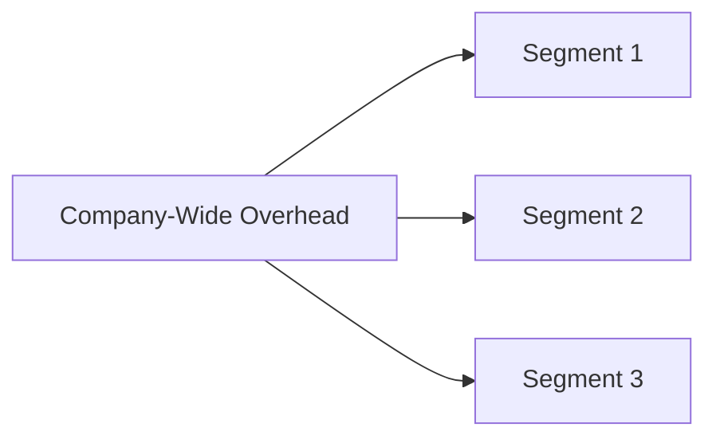

## Why Segment-Level Analysis Matters
Sometimes, we forget that the flashy top-line numbers in an earnings report can hide significant details about what’s driving a company’s results. Maybe your friend invests in a well-known retail brand, only to find out later that its fastest growing division isn’t retail at all, but a separate technology segment. Wait, what? Indeed, many firms diversify into multiple lines of business or operate across various geographic regions. This diversification can neutralize risk (like hedging your bets), or it can amplify complexity and blur performance.

Segment-level financial analysis zooms in on each significant business division or geographic region. By looking at segment revenue, segment operating margin, and other core metrics, we see which areas thrive and which might be struggling. It’s a bit like reading multiple short stories within one novel—sometimes, the real drama unfolds in one chapter, while the overall storyline might look pretty average.

## Key Segment Disclosures
Regulators like the IASB (International Accounting Standards Board) and FASB (Financial Accounting Standards Board) recognize that aggregated data can mask key details. Under IFRS 8 (Operating Segments) and ASC 280 (Segment Reporting), companies must disclose separate, regularly reviewed financial information for “operating segments,” which are those divisions or regions under direct performance evaluation by the chief operating decision-maker. These required disclosures often include:

• Segment revenue: This helps you see how significant each segment is.  
• Segment operating margin or profit: Usually some form of EBIT or EBITDA allocated to each segment.  
• Segment assets: Assets assigned to a segment—including intangible assets, if relevant.  
• Segment liabilities (sometimes): Not always required, but it’s great when it’s disclosed.  
• Capital expenditures: A vital measure of how much each segment invests in growth and maintenance.  

Think of all these disclosures as puzzle pieces. Each piece helps you gauge the segment’s contribution to overall performance, its capital intensity, and future prospects.

## Overhead and Corporate Cost Allocation
Now, let’s address the elephant in the room: overhead costs. Maybe you’ve seen a CFO who’s... well, quite “flexible” when distributing corporate overhead among segments. The reality is that corporate costs like administrative expenses, R&D overhead, and marketing often are shared among various segments. Companies may allocate these costs to segments using certain metrics (e.g., revenue proportion, headcount, or direct usage). But these allocations can get arbitrary and sometimes manipulated.

If you’re analyzing segment data, pay close attention to how these costs are sliced up. If one segment suddenly faces a giant spike in allocated corporate expenses, it might appear to underperform, even though its direct expenses haven’t markedly changed. For your analysis, you may want to:

• Investigate the allocation methodology. Is it consistent over time?  
• See whether changes in the method have been disclosed.  
• Understand which segments absorb intangible asset costs (e.g., brand valuations).  

Exam tip: Be prepared to adjust or “normalize” segment data if you spot suspicious shifts in overhead assigning. Sometimes, you’ll see disclaimers about methodology changes in the notes to the financial statements.

## Analyzing Segment Performance Over Time
Sure, it’s interesting to see how each segment performed in a single reporting period, but the real insights often come from analyzing trends over time. Maybe the North American division shows steady growth in revenue each year, while the Asia-Pacific segment is more volatile. Another scenario: a matured segment with a stable profit margin might be subsidizing a newer, riskier line of business that’s in a scale-up phase.

And watch for redefined segments. Companies occasionally reshape how they group lines of business—for example, they might merge two smaller segments or spin off part of a larger one. This can break continuity in your time-series analysis. Before comparing the data year-over-year, confirm you’re comparing “apples to apples.”

Now, let’s visualize a straightforward illustration of how corporate overhead might funnel into each main segment using a mermaid diagram:

In practice, the overhead flows might be assigned proportionally to budgets, revenues, or intangible criteria. The point is, overhead rarely “belongs” to just one segment; it is typically shared across the entire enterprise.

## Integrating Segment-Level Analysis with Other Tools
Segment-level analysis is central to advanced financial evaluation. Combine it with the ratio analyses we discussed in earlier sections, such as profitability ratios or liquidity and solvency metrics (see Chapter 13.2, “Ratio Analysis,” for more details). For instance, you might choose to compute a segment-level return on assets or do a DuPont breakdown that’s tailored only to a particular segment’s data. This approach can reveal if one segment’s capital is earning significantly higher returns than the rest of the company.

Or consider analyzing segment-level free cash flow (FCF). Certain divisions might require heavy capital expenditures, while others operate with minimal ongoing investment. This discrepancy can be a central factor in valuation, especially if you’re building a sum-of-the-parts (SOTP) model (for more on building financial models, see Chapter 16).

## Geographic Diversification and Localized Risks
Geographic segmentation can be hugely relevant in industries like consumer goods, technology, or retail. Each region brings different revenue growth trajectories, currency exposures, and operational costs. For instance, a segment in an emerging market might show high revenue growth but also face foreign exchange volatility and supply chain disruptions. Meanwhile, a segment in a stable, developed market might exhibit modest growth but steady cash flows.

Keeping an eye on geographic-based segment reporting is especially important if the company manages global brands or invests in cross-border expansions. Notably, IFRS 8 and ASC 280 do permit companies to aggregate smaller segments if they share similar economic characteristics—so always read the footnotes about how these aggregated regions were determined.

## IFRS 8 and ASC 280: Key Similarities and Differences
Both IFRS 8 and ASC 280 revolve around the “management approach,” which means the way a firm’s internal management organizes itself often dictates how external reporting is structured. The main purpose is to ensure that financial information is reported the way a company’s chief operating decision-maker sees it. That said, we do see some differences in detail:  
• IFRS 8 might require a bit more disclosure on, say, major customers and the reliance on certain large clients.  
• ASC 280 can have slightly different thresholds for determining whether a segment is reportable (for instance, the 10% threshold of combined revenues, profit or loss, or assets).  

But in essence, the frameworks aim to provide the same thing: more granular information to help you, the analyst, figure out how the business truly makes its money (or not).

## Considering Management Incentives and Potential Manipulation
People sometimes joke that a savvy CFO can shape segment data like a potter molds clay. Because segment margins or segment performance can affect compensation or investor sentiment, management might shift costs among segments to boost the perceived performance of a strategic area. Also watch for reclassifying certain overhead expenses out of a star segment to keep it looking good. In short, remain a bit skeptical—a healthy “trust but verify” mindset helps.

It’s not that every company manipulates segment data, of course. But as an analyst, you’re wise to note any abrupt changes in reported metrics from one period to the next. Always check the footnotes or management’s discussion and analysis (MD&A) to see if they highlight any changes to segment definitions, cost allocations, or accounting treatments.

## A Quick Case Study
Picture a global manufacturing conglomerate, Superior Widgets Inc. They operate in three main segments:

1) Consumer Products  
2) Industrial Machinery  
3) Technology Licensing  

Consumer Products has been the main revenue driver for years, but it requires big marketing and distribution budgets. Industrial Machinery yields a stable margin with moderate growth. Technology Licensing is small but, wow, it’s booming with strong margin expansion. By analyzing these segments, you might notice:

• Technology Licensing invests less in physical assets and more in intangible R&D.  
• Industrial Machinery has consistent CapEx, with stable revenue.  
• Consumer Products invests heavily in brand marketing but might see tighter margins because of rising distribution costs.  

If overhead allocation changes wildly—say, more overhead is suddenly allocated to Consumer Products—its margin might appear to decline further. The footnotes? They might reveal that a portion of corporate headquarters’ overhead was reclassified. Without reading those details, you’d think the segment’s performance drastically deteriorated. This is where segment-level analysis is so powerful: you can catch these reclassifications and adjust your viewpoint accordingly.

## Putting It All Together & Final Exam Tips
Segment reporting is about transparency. If a firm lumps all business activities together, it’s easier to hide poor performance or lumps of intangible assets that might be languishing in one area. Conversely, well-detailed segments let you pinpoint exactly which division or region is humming along and which is on shaky ground.

For your CFA exam considerations, be alert to these points:
• Changes in segment definitions. They might require you to restate or reconcile prior-year data in an exam question.  
• Overhead cost allocations. Prepare to recast segment margins to isolate what’s truly happening.  
• Segment-level ratio analysis. Expect potential questions on how to interpret segment profitability or capital intensity.  
• IFRS 8 vs. ASC 280. Know the main similarities, like the management approach, and the typical threshold differences.  

If the exam question presents you with partial or incomplete segment data, you might need to make assumptions. That’s okay—explain your assumptions clearly (just like you would in real life). Also, keep an eye on how synergy or cross-segment transactions might affect reported numbers. In a constructed-response question, the prompt may ask you to evaluate a spin-off scenario or a big shift in segment definitions.

Finally, remember that truly mastering segment-level analysis can make you the hero in real-world valuation work. Oh, and watch out for footnotes—they’re often the hidden gold mines of corporate reporting. Good luck, and don’t be afraid to dig around in the details.

## References & Further Reading
• IFRS 8 (Operating Segments)  
• ASC 280 (Segment Reporting)  
• KPMG’s “Guide to Segment Reporting” (www.kpmg.com)  
• Company annual filings (particularly the MD&A section)  
• Chapter 13.2 (Ratio Analysis) and Chapter 16.1 (Building Forecasts) for related topics  

--------------------------------------------------------------------------------

## Test Your Knowledge: Segment-Level Financial Analysis



### Which of the following best describes the main purpose of segment-level financial analysis?

- [x] To evaluate the individual performance of each business unit or region within a company.
- [ ] To determine the best overhead allocation method for management.
- [ ] To consolidate all financial data into one reported figure.
- [ ] To simplify complex businesses by eliminating segment-specific data.

> **Explanation:** Segment-level financial analysis isolates the performance of each division or region, allowing investors to spot where profits come from and where risks are concentrated.

### Under IFRS 8 and ASC 280, how is an operating segment generally defined?

- [ ] A division of a company that consistently loses money.
- [x] A business unit or division for which separate financial information is available and evaluated by the chief operating decision-maker.
- [ ] Any cost center that requires overhead allocation.
- [ ] A group of business units that share substantially no economic similarity.

> **Explanation:** Both IFRS 8 and ASC 280 define an operating segment as one whose results are regularly reviewed by the entity’s chief operating decision-maker, using discrete financial information.

### A sudden change in corporate overhead allocation to a particular segment could indicate:

- [ ] A reduction in management’s estimates of intangible asset life.
- [x] Possible manipulation of segment profit or loss.
- [ ] An unrelated shift in capital structure.
- [ ] The reclassification of geographic regions.

> **Explanation:** Changes in overhead allocations can be used to artificially inflate or deflate a segment’s apparent profitability or cost structure.

### Which of the following is most likely included in segment disclosures under IFRS 8?

- [x] Segment revenue, segment assets, and segment profit or loss.
- [ ] Expected future tax rates for each segment.
- [ ] Share option expenses for the board of directors.
- [ ] Detailed cost of goods sold data for all suppliers.

> **Explanation:** IFRS 8 requires disclosure of segment revenue, segment profit or loss (often operating profit), and segment assets, among other items.

### Why is consistency in segment definitions over time particularly important for financial analysis?

- [ ] Because it makes the annual report shorter.
- [ ] Because corporate governance requires it by law in all jurisdictions.
- [x] Because changes can distort trend analyses and make period-to-period comparisons less reliable.
- [ ] Because it usually leads to higher segment margins.

> **Explanation:** When companies redefine segments, comparing results from one period to the next can be misleading unless the data is restated to reflect the new definitions.

### Which of the following actions might an analyst take if a company changes its segment definitions?

- [ ] Abandon analyzing the company to avoid confusion.
- [x] Restate or reconcile previous segment data to maintain comparability.
- [ ] Disqualify the segment data under IFRS requirements.
- [ ] Immediately assume the changes are fraudulent.

> **Explanation:** A key step is to restate prior data, if possible, so that the revised segment definitions can be compared correctly across different time periods.

### How might geographic diversification impact a company’s segment-level analysis?

- [x] Different regions may face varying economic conditions, currency risks, and growth opportunities.
- [ ] All regions generally produce identical returns and growth rates.
- [ ] It has no material effect on segment reporting requirements.
- [ ] It eliminates the need to analyze intangible assets.

> **Explanation:** Geographic diversification can yield distinct risk/return profiles; analyzing each regional segment separately highlights these differences.

### One advantage of segment reporting for analysts is:

- [x] Greater transparency about which parts of the business are profitable or unprofitable.
- [ ] Mandatory uniform allocation of all corporate costs to each segment.
- [ ] Guaranteed elimination of any cost-overlap between segments.
- [ ] Reduced disclosure about intangible assets.

> **Explanation:** Segment reporting sheds light on profitability drivers and areas of concern. Without segments, poor-performing units can remain hidden within consolidated data.

### If segment results include a relatively high allocation of intangible asset impairment in one segment, an analyst should:

- [x] Investigate the basis for that allocation and see if it’s consistent with prior periods.
- [ ] Assume there’s no impact on overall company valuation.
- [ ] Ignore it, because intangible assets have no resale value.
- [ ] Conclude that the segment is automatically unprofitable forever.

> **Explanation:** High intangible asset impairment may significantly affect a segment’s profits, so understanding the reasons and consistency of allocation is crucial.

### True or False: Under IFRS 8, a major customer’s contribution to a segment’s revenue must be disclosed if it meets certain thresholds.

- [x] True
- [ ] False

> **Explanation:** IFRS 8 requires disclosure of revenues from major customers and the segments in which those revenues are earned, provided they exceed specified thresholds.


