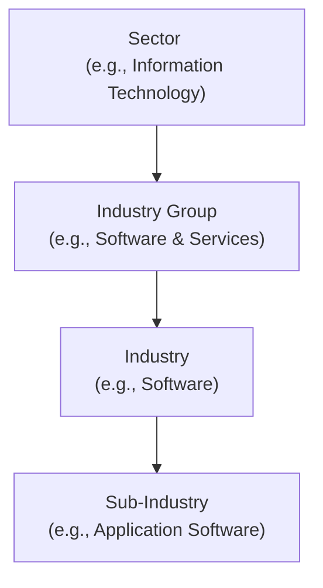
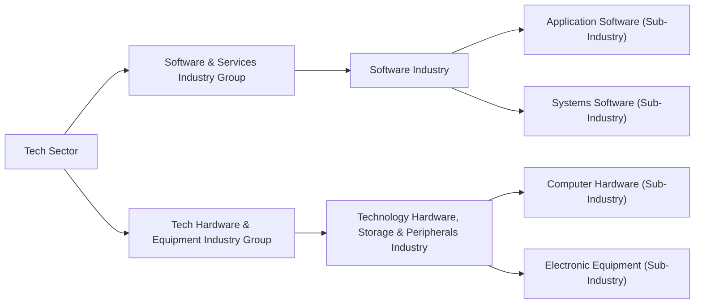

## Understanding the Role of GICS in Peer Analysis

If you’ve ever wondered how analysts figure out which companies truly belong together in a “peer group,” you’re not alone. I remember my early days as a newbie investment professional, scanning through lists of companies and thinking, “Wait, how is that bank considered a peer of that tech company?” Well, that confusion often stems from inconsistent classification methods. Enter GICS, or Global Industry Classification Benchmark, a standardized system that helps solve this mismatch by categorizing companies by their principal business activities. Let’s explore how GICS works, why it’s important, and how you can use it to refine your peer analysis.

GICS was developed by MSCI and S&P Global to bring some order to the chaos. It’s exhaustive and goes from very broad “sectors,” like Energy or Financials, all the way down to specialized “sub-industries.” This structured approach promotes apples-to-apples comparisons, ensuring that you’re analyzing, say, cloud software firms alongside other cloud software firms, rather than grouping them with—who knows—an electric utility or two.

## GICS Classification Structure

At its simplest, GICS assigns companies to the sector and industry that best reflect their main revenue source. It then dives deeper into narrower categories called industry groups, industries, and, at the most specific level, sub-industries. This four-tiered hierarchy is meant to capture the specialization and nuances of different business models.

Below is a simple Mermaid diagram to illustrate the GICS layer structure:



• Sector: The broadest classification (e.g., Energy, Financials, Information Technology).  
• Industry Group: A subset within the sector (e.g., Software & Services under Information Technology).  
• Industry: A narrower grouping (e.g., Software).  
• Sub-Industry: The most specific classification (e.g., Application Software).

In practice, you’ll often see analysts zero in on the “sub-industry” level for really detailed peer analysis. This makes sense: comparing an application software company to a semiconductor manufacturer (both in the Information Technology sector) might still be too broad because their drivers, challenges, and valuations differ significantly.

## Why GICS Matters for Peer Analysis

Picture building a fantasy sports team. You’d group players by position to compare their stats. You wouldn’t compare your star quarterback to a placekicker. GICS is essentially doing that for stocks, grouping them by their principal activities so that you can compare the “quarterbacks” to other “quarterbacks.”

• Consistency: Because GICS is widely adopted, it reduces confusion. It’s like a commonly shared language.  
• Transparency: The classification system is publicly documented, so you know exactly why a certain company is placed in a particular category.  
• Comparability: With GICS, the relevant financial ratios and metrics are more aligned. If you’re evaluating P/E or EV/EBITDA for a group of retail companies, you can be confident that each one is indeed in the retail sub-industry, rather than springing from, say, consumer services or manufacturing.  

Many analysts rely on GICS sub-industries for benchmarking stock performance, building market indexes, or constructing sector-based Exchange Traded Funds (ETFs). For instance, sector-based funds might only include companies whose GICS classification lines up with that sector, preserving purity in the overall portfolio.

## Large Conglomerates and GICS Dominance Criteria

One interesting challenge arises with large conglomerates, which might easily straddle multiple GICS categories. Let’s say we have a global behemoth that manufactures aircraft engines, invests in real estate, and operates a media streaming service. Where do you put that?

GICS methodology generally considers the dominant revenue driver. So if 60% of that conglomerate’s revenue comes from aviation manufacturing, it might land under the Industrials sector, Aerospace & Defense industry, even if the real estate or media divisions are also significant. While this approach isn’t perfect, it does force an objective look at where the bulk of a company’s business lies.

For peer analysis, though, you should always peek at segment disclosures (discussed in Chapter 1.8 on Segment Reporting Requirements) to see how diversified the conglomerate is. If some segment is overshadowing the primary GICS classification, you might refine how you treat that company when you build your peer universe. This is especially relevant for evaluating synergy or “hidden value” in cross-segment operations.

## Standardized Peer Groups: The Key Advantage

Your analysis is only as good as the peers you choose. If your comparison set is random—one software-as-a-service platform, an oil producer, and a pharmaceutical giant—your “benchmark” metrics won’t hold a whole lot of meaning. Using GICS ensures that:

• Companies share business drivers.  
• Macroeconomic forces affect them similarly.  
• Seasonality patterns (e.g., Q4 holiday boosts for retailers) are more directly comparable.  

From an exam perspective, keep in mind that constructing relevant peer groups is a fundamental skill. The CFA exam might present scenario-based questions where you must identify the most appropriate set of comparables. A GICS-based approach helps you rationalize your selection.

## GICS for Sector-Based Investing

Analysts who manage sector-specific portfolios (like a Technology ETF) lean heavily on GICS to define their investable universe. GICS is often integrated directly into screens run by portfolio managers or quantitative analysts, who might use a code snippet similar to the following in Python to filter a database of equities:

```python
import pandas as pd

data = {
    'company': ['TechAlpha Inc', 'RetailMax Corp', 'EnergyNow LLC', 'CloudNinja Co'],
    'gics_sector': ['Information Technology', 'Consumer Discretionary', 'Energy', 'Information Technology'],
    'gics_industry_group': ['Software & Services', 'Retailing', 'Oil, Gas & Consumable Fuels', 'Software & Services'],
    'gics_industry': ['Software', 'Broadline Retail', 'Integrated Oil & Gas', 'Software'],
    'gics_sub_industry': ['Application Software', 'Department Stores', 'Integrated Oil & Gas', 'Application Software']
}

df = pd.DataFrame(data)

tech_filtered = df[df['gics_sector'] == 'Information Technology']
print(tech_filtered)
```

In this simple scenario, you’re instantly honing in on the relevant industry or sub-industry. For deeper peer analysis, you might filter for the exact sub-industry, like “Application Software,” to ensure that you’re comparing businesses with similar models (e.g., subscription-based software revenues, intangible R&D-driven assets, etc.).

## Real-World Example: Application in Equity Research

Imagine you’re evaluating a potential investment in a medical device manufacturer. Let’s call them MediEquip Inc. Suppose you want to find a peer universe to compare revenue growth, operating margins, and R&D spend:

1. Check MediEquip Inc.’s GICS classification. Maybe it’s under the Health Care sector, Health Care Equipment & Services industry group, Health Care Equipment industry, and specifically the Health Care Equipment sub-industry.  
2. Pull other publicly traded companies with “Health Care Equipment” as their sub-industry.  
3. Examine each for size, geographic presence, or product focus. Are these truly comparable to MediEquip Inc.? If some are purely software or biotech, you might drop them from your final list.  
4. Build your ratio analysis—profitability, liquidity, leverage—knowing these metrics are relevant in matching business contexts.

This process helps you develop more accurate valuations and more robust investment theses.

## Common Pitfalls in Classification

Even though GICS is standardized, make sure to watch out for:

• Outdated Classifications: Company business models evolve. Sometimes, GICS assignments lag behind reality, especially if the firm has pivoted to new lines of business.  
• Diversified Giants: As mentioned, large conglomerates may not neatly fit in one sub-industry.  
• Cross-Listing Discrepancies: A multinational might be shown in different categories on different trading platforms. Usually, GICS is consistent across markets, but it’s worth verifying.  
• Overlap with Other Systems: Sometimes, you’ll see the Industry Classification Benchmark (ICB) from FTSE Russell or the North American Industry Classification System (NAICS). GICS is dominant in many equity research circles, but always confirm which classification system is in use.

## Encouraging Critical Thinking

Maybe this is obvious, but keep in mind that the classification is a starting point, not the final word. If you notice that your target firm’s business model is trending toward, say, clean energy, but it’s still listed under traditional Utilities, you might question if the classification is going to change soon. That’s often a key forward-looking question that can help you spot early investment opportunities or risks.

It also pays to think about how GICS aligns with the segment data you see in a company’s financial disclosures. Chapter 1.8 in this volume covers segment reporting requirements, and segment-level data might reveal shifts in revenue composition that GICS hasn’t caught up with yet. A seasoned analyst knows to read between the lines.

## Diagram: Comparing Two Sub-Industries

To grasp how two companies that share a GICS sector can vastly differ, here’s a simplified diagram:



Two companies might be in the same “Tech Sector,” but if one is in “Application Software” and the other is in “Computer Hardware,” their profit margins, capital expenditure needs, and R&D intensity may be worlds apart.

## ESG and GICS: An Evolving Relationship

As environmental, social, and governance (ESG) considerations become increasingly integral (covered broadly in Chapter 15), GICS itself might adapt. Certain industries—like renewable energy integrators—fall into existing GICS buckets but carry different ESG risk profiles. While GICS wasn’t originally designed around ESG metrics, many data providers combine GICS with ESG overlays. Keep in mind that a “Utilities” classification could include both high-carbon-emitting traditional power companies and greener alternatives, which might require further sub-categorization in your analysis.

## Best Practices for Utilizing GICS

• Verify Classifications: Cross-check the official GICS reference to avoid using stale data.  
• Use the Sub-Industry Level: This is where you get the highest specificity, which matters most for peer grouping and ratio analysis.  
• Combine With Other Data: GICS is excellent for screening, but always refine peers based on size, geographical reach, or growth stage.  
• Keep an Eye on Corporate Actions: Mergers, acquisitions, and spinoffs can shift a firm’s classification.  
• Engage Judgment for Conglomerates: If the classification doesn’t reflect the real growth driver, consider an adjusted approach to grouping.

## Personal Reflection on GICS

It’s funny—I learned about GICS classification almost by accident, while dealing with an index reconstitution that forced me to re-check a bunch of companies’ sector assignments. Initially, I was skeptical. Why not just pick companies that “felt” like they belonged together? Yet after some near-misses—like grouping a media streaming service with a music publisher—I realized that the systematic approach of GICS saved me from big analytical blind spots. Now I rely on GICS from the start, and it’s made my peer analysis a heck of a lot more robust.

## Looking Beyond GICS

Although GICS is a powerful tool, it’s not the only approach. Various classification systems (like NAICS, ICB, or Thomson Reuters Business Classification) exist. If you ever cross paths with them, keep the same spirit: look for systematic, revenue-driven sorting. The magic is in consistency. As an analyst, you need a stable framework to evaluate a company’s competitive position and performance metrics.

## Summary and Further Reading

GICS is a globally recognized classification system that unites equities under broad sectors, narrower industry groups, even narrower industries, and the most specific sub-industries. It streamlines the process of forming peer groups, setting up industry benchmarks, and building sector-based investment strategies. Just remember the practical considerations: conglomerates, evolving business models, and classification timing can influence how accurate GICS designations are.

If you’re itching to learn more or confirm the details:  
• Check MSCI’s official GICS methodology (search “GICS” at www.msci.com).  
• S&P Global’s guide on GICS definitions and applications.  
• Writings on sector rotation strategies—these often incorporate GICS-based sector performance analysis to decide which parts of the market might outperform.

A thorough understanding of GICS is extremely helpful for both the CFA program and real-world financial analysis. It ensures that you, your team, and the broader investment community speak the same language when talking about “peer groups.”

## Test Your Mastery: Global Industry Classification Benchmark (GICS) in Peer Analysis



### Which of the following best describes the primary advantage of the GICS framework for peer analysis?

- [x] It facilitates apples-to-apples comparisons by standardizing industry groupings.
- [ ] It groups companies by geographic region, ensuring global representation.
- [ ] It assigns companies to a classification solely based on their market capitalization.
- [ ] It ranks companies according to their dividend yield, offering income investors a benchmark.

> **Explanation:** GICS categorizes firms by principal business activities, thus ensuring consistent and comparable peer groups.

### A company with multiple lines of business is generally classified under which GICS sector or industry?

- [ ] The sector that has the highest profit margin.
- [ ] The sector with the smallest proportion of the company’s revenue, to encourage diversification.
- [x] The sector in which the company generates the largest percentage of revenue.
- [ ] Whichever sector management chooses to emphasize in investor presentations.

> **Explanation:** GICS allocates a company's classification based on its dominant revenue driver (or sometimes dominant operational assets), ensuring that the main business activity is accurately reflected.

### In the GICS structure, which level offers the narrowest categorization?

- [ ] Sector
- [ ] Industry Group
- [ ] Industry
- [x] Sub-Industry

> **Explanation:** The sub-industry level is the most specific GICS classification, capturing a firm’s specialized activity.

### When conducting a peer analysis for a cloud software company, what is the most crucial GICS level for narrowing the universe?

- [ ] Sector (e.g., Information Technology)
- [ ] Industry Group (e.g., Software & Services)
- [ ] Industry (e.g., Software)
- [x] Sub-Industry (e.g., Application Software)

> **Explanation:** Focusing on the sub-industry (Application Software) ensures that peers share similar revenue models and operational characteristics.

### Which scenario might represent a potential pitfall of relying solely on GICS for classification?

- [x] A conglomerate’s new business line becomes its main focus, yet GICS data lags, classifying it incorrectly.
- [ ] GICS sector definitions are updated quarterly, ensuring perfect real-time accuracy.
- [ ] GICS forces an exact split of classification for multi-segment companies.
- [ ] Firms must submit a formal request to change their classification whenever they acquire another firm.

> **Explanation:** GICS might not immediately capture shifts in a company’s business model or revenue composition if that company changes direction or invests heavily in a new segment.

### Analysts selecting constituents for a sector-based ETF primarily use GICS in order to:

- [x] Ensure all companies subscribe to the same overarching industry classification.
- [ ] Raise the average market capitalization of that ETF to attract larger institutional participants.
- [ ] Evaluate a company’s technical chart patterns.
- [ ] Incorporate only companies with significant exposure to emerging markets.

> **Explanation:** Sector-based ETFs often rely on GICS to define their official universe, so that all included firms operate in the specified sector.

### If you see a company’s GICS listing as “Industrials – Capital Goods – Aerospace & Defense – Aerospace & Defense,” at which level of detail is “Capital Goods?”

- [ ] Sector
- [x] Industry Group
- [ ] Industry
- [ ] Sub-Industry

> **Explanation:** In the GICS hierarchy, Industry Group typically sits between Sector and Industry.

### Suppose you filter a database of equities for “Information Technology” sector and “Software & Services” industry group. Which approach most accurately refines your peer analysis set?

- [ ] Keep all firms with the “Software & Services” label, no matter the sub-industry.
- [ ] Classify all results as “Application Software,” whether or not that’s correct.
- [x] Further narrow down by the relevant sub-industry (e.g., “Application Software”) to ensure business model alignment.
- [ ] Immediately remove all large-cap companies from the sample to avoid size bias.

> **Explanation:** Drilling down to the specific sub-industry level ensures you’re grouping firms with truly comparable operational and revenue structures.

### Which statement is true about ESG considerations and GICS classifications?

- [ ] GICS sub-industries directly integrate environmental performance data.
- [ ] ESG classifications always replace GICS, preventing overlap.
- [ ] Companies with strong sustainability metrics are placed in a separate GICS sector.
- [x] Certain GICS sectors, like Utilities, may contain both high- and low-emission firms, suggesting further ESG analysis is needed.

> **Explanation:** GICS doesn’t explicitly factor ESG metrics into its classifications. You often need additional ESG overlays to distinguish between high- and low-emission companies in the same sector.

### GICS is most commonly used in financial analysis to:

- [x] Create standardized peer groups and sector-based benchmarks.
- [ ] Define the regulatory framework for accounting disclosures in each region.
- [ ] Establish international tax brackets for multinational corporations.
- [ ] Determine the appropriate discount rate for discounted cash flow (DCF) models.

> **Explanation:** GICS is a classification system used to enhance comparability and benchmarking, not for setting accounting, tax, or discount rate policies.


