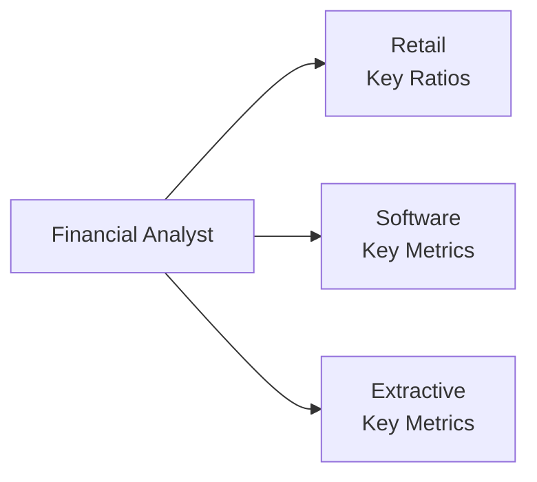

## Overview

Financial analysis is rarely a one-size-fits-all process. In practice, different industries have unique ways of measuring success, risk, and profitability. While core financial statement metrics (e.g., net income, return on equity) are still crucial, professionals in retail, software, and extractive industries often evaluate specialized ratios and Key Performance Indicators (KPIs) to capture the nuances of their operating models. These specialized measures may be located beyond the standard financial statements—in the footnotes, management discussion, or industry-specific disclosures. Understanding how to interpret and integrate these non-GAAP or industry-specific figures is paramount for well-rounded financial analysis.

Below, we explore the specialized metrics for each of these three sectors and outline how they can complement broader ratio analysis, as covered earlier in Ratio Analysis (see Section 13.2) and DuPont Analysis (see Section 13.3). We also highlight the differences in accounting methods between IFRS and US GAAP that can have an outsized impact on industry metrics.

## Specialized Metrics for Retail

Retailers operate within a highly competitive environment characterized by frequent price changes, product turnover, and shifting consumer tastes. Because of these dynamics, analysts focus on several key metrics that help them evaluate a retailer’s efficiency, growth potential, and profitability.

### Inventory Metrics

• Inventory Turnover: Measures how many times a retailer sells and replaces its inventory within a given period. A higher turnover rate often indicates efficient inventory management and robust sales.   
  
  Formula (commonly):  
  Inventory Turnover = (Cost of Goods Sold) ÷ (Average Inventory)  
  
  Interpretation: If a company’s inventory turnover is consistently higher than its peers, it may be managing inventory efficiently or capitalizing on strong consumer demand. Conversely, an unusually low turnover may signal unsold or obsolete stock.

• Days Sales in Inventory (DSI): Converts inventory turnover into a day count, showing how quickly inventory is moving in days.   
  
  Formula:  
  DSI = (365 ÷ Inventory Turnover)  
  
  Interpretation: Shorter DSI often implies fast-moving merchandise, which reduces holding costs and can indicate strong demand. However, an excessively low DSI might cause stock-outs, losing potential sales.

### Same-Store Sales Growth (SSSG)

Also known as “like-for-like” or “comparable store” sales growth, SSSG measures the year-over-year performance of stores open for at least one year. This isolates revenue increases attributable to changes in consumer demand, pricing, or marketing strategies rather than new store openings. A consistent increase in same-store sales is generally viewed favorably, suggesting that existing locations remain profitable or are improving in operational efficiency.

### Basket Size

Basket size gauges the average transaction value or the number of items per customer purchase. It is often expressed in monetary terms, such as average spending per customer visit, or measured in unit terms, such as number of items purchased per transaction. Monitoring changes here can reveal the effectiveness of cross-selling efforts, promotional campaigns, or store layout strategies.

### Foot Traffic and Store Expansion Data

Analysts also track foot traffic (the number of people entering a store or chain of stores) and monitor trends in store openings or closures. In the context of IFRS vs. US GAAP, these data points typically appear in management commentary rather than the core financial statements. The ratio of foot traffic to total sales can help you see whether sales are driven by higher volume of visitors or by bigger basket sizes among existing customers.

## Specialized Metrics for Software and Tech

Software and technology companies face their own unique set of measurement challenges. Many operate on subscription or recurring revenue models, where the lifetime value of customers and retention rates drive future cash flows, but can be subject to revenue recognition complexities.

### Subscription and Recurring Revenue Metrics

• Annual Recurring Revenue (ARR) or Monthly Recurring Revenue (MRR): These metrics capture the predictable stream of revenue from software subscriptions, maintenance contracts, or cloud services. Investors often focus on ARR growth rates to gauge the rate at which recurring revenue is expanding.  

• Retention/Churn Rates: Customer retention rates measure what percentage of customers or revenue a company keeps over time. The inverse, churn rate, measures the rate at which the company loses customers (or recurring revenue). High retention and low churn rates usually imply a stable, loyal customer base.

• Average Revenue per User (ARPU): By dividing total revenue by the number of users (or subscribers), ARPU highlights profitability at the individual customer level. Tracking ARPU over time reveals pricing power, cross-selling opportunities, and market penetration.

### Capitalized Software Development Costs

Software companies may choose (or be required) to capitalize development costs once technical feasibility is established under IFRS (IAS 38) or US GAAP (ASC 985-20, for software to be sold or leased). This accounting choice inflates the asset base and defers some expenses to future periods, affecting margins and potentially net income. Analysts often adjust for these capitalization policies to compare companies more accurately, particularly when evaluating operating profitability or intangible asset values.

### User Engagement Metrics

Beyond revenue, many software firms (especially those with freemium or advertising-based models) track metrics such as Monthly Active Users (MAU), Daily Active Users (DAU), and time spent on the platform. While not strictly GAAP or IFRS metrics, these figures can be early indicators of the company’s revenue potential and engagement trends.

## Specialized Metrics for Extractive Industries

Extractive industries like oil, gas, and mining operate on long production cycles, capital-intensive projects, and a heavy reliance on underlying commodity prices. Their inherent volatility requires a number of specialized KPIs and ratios for assessment.

### Reserve Replacement Ratio (RRR)

RRR compares the amount of new reserves (through exploration, improved recovery, or acquisitions) to the volume extracted during the year. A ratio above 1.0 means the firm is adding reserves at a higher rate than it is depleting them, signaling sustainability of operations. However, falling commodity prices can quickly reclassify reserves as unviable, so commodity fluctuations must be kept in mind when assessing RRR.

### Production Costs per Unit

Commonly known as “lifting costs” in oil and gas, or “cash operating costs” in mining, these metrics indicate how efficiently a company extracts resources. In the oil sector, metrics like “cost per barrel” examine both direct operating costs (labor, materials) and overhead. Analysts compare these figures to prevailing market prices to gauge profitability. A higher cost per barrel or ounce can erode margins if commodity prices decline.

### Accounting Methods: Full-Cost vs. Successful-Efforts

Under the full-cost method (allowed by some standards in US GAAP), all exploration costs are capitalized in a cost pool, whether successful or not. This can boost assets and potentially defer expenses. By contrast, the successful-efforts method requires that only successful exploration activities be capitalized, while unsuccessful exploration costs are expensed immediately. IFRS (IFRS 6) generally gives companies latitude in how they capitalize exploration and evaluation costs, but the choice can materially alter reported financials. Analysts need to identify which method is used and, if necessary, adjust comparisons across companies.

### Commodity Price Cycles

With large swings in commodity prices, cyclical factors often overshadow operational performance in the short run. Price hedging activities or derivative contracts may reduce volatility, but these strategies can also introduce complexity in risk disclosures (see Chapter 14 for more detail on stress testing in financial institutions, which can also be relevant for commodity risk). Keeping an eye on forward commodity curves, local tax regimes, and macroeconomic indicators is critical in analyzing the potential for revenue fluctuations.

## Implementing These Metrics in Financial Analysis

When using specialized ratios and KPIs, a few important considerations apply:

• Data Reliability: Many specialized metrics or KPIs are derived from internal management systems, not thoroughly audited financial statements. Analysts must gauge the reliability of these figures through management commentary, third-party industry reports, or cross-verification with digital analytics data.  

• Comparability: Even within the same industry, companies may calculate these metrics slightly differently. Look for standardized definitions or footnotes. For instance, ensure that “churn rate” is being measured on the same basis (user churn vs. revenue churn) across different software companies.

• Integrated Analysis: Specialized metrics should complement, not replace, standard financial analysis. For example, a software company with high retention rates but negative free cash flow signals potential liquidity problems that must be addressed before it can realize long-term profitability.

## Best Practices and Common Pitfalls

• Align to a Quality Framework: Where possible, reconcile specialized metrics to a standard GAAP or IFRS figure, or discuss them alongside related line items from the statement of financial position or statement of comprehensive income.

• Watch for Aggressive Approaches: A retail company might overstate foot traffic by counting repeat visits in short windows, or a software firm might expand the definition of “active users.” For extractive companies, intangible reserves may be booked at optimistic price or extraction cost assumptions.

• Stay Updated on Regulatory Guidance: IFRS and US GAAP continue to evolve their guidance on intangible asset capitalization, revenue recognition for subscriptions (IFRS 15 vs. ASC 606), and disclosures on resource extraction. Familiarity with the latest pronouncements helps ensure robust analysis.

## Exam Tips for CFA Candidates

Exam questions related to specialized ratios often require:

• Understanding the link between the specialized metric and standard ratios (e.g., how inventory turnover and DSI affect a retailer’s liquidity or working capital needs).  
• Adjusting for different accounting methods (such as successful-efforts vs. full-cost in extractive industries).  
• Explaining how capitalized development costs affect profitability measures and intangible asset calculations in software companies.  
• Calculating or interpreting advanced metrics like same-store sales growth or churn rates and relating them to broader profitability ratios.

When confronted with item set or constructed-response questions, candidates should:

• Clearly identify the relevant industry practices.  
• Discuss the potential variations in how metrics are calculated.  
• Distinguish between recognized GAAP or IFRS treatments and those requiring footnote disclosures.  
• Summarize the impact on ratios, profits, or cash flows in a concise and well-structured format.

## References and Further Reading

- Deloitte, “Oil & Gas Industry Accounting Guide.”  
- Deloitte, “Technology Industry Accounting Guide.”  
- National Retail Federation (NRF), “Retail Industry Data & Analysis.”  
- Damodaran, A., “Reading Between the Lines of Software Financials,” NYU Stern.  
- IFRS Foundation: IFRS 6 (Exploration for and Evaluation of Mineral Resources), IAS 38 (Intangible Assets).  
- FASB Codification: ASC 985-20 (Software to be Sold or Leased), ASC 606 (Revenue from Contracts with Customers).  

---

## Test Your Knowledge: Specialized Ratios and KPIs Quiz



### 1. Which of the following most accurately describes why same-store sales growth is crucial in retail analysis?

- [ ] It measures total inventory turnover over a 12-month period.
- [x] It isolates sales growth from existing stores, removing effects of new store openings.
- [ ] It captures the impact of commodity price fluctuations on margins.
- [ ] It computes foot traffic growth across all stores.

> **Explanation:** Same-store sales growth focuses on the performance of stores open for at least one year and removes expansions to highlight organic sales trends.

### 2. When analyzing a software-as-a-service (SaaS) business, which metric would best help assess recurring revenue?

- [ ] Cash conversion cycle
- [ ] Inventory turnover
- [x] Annual Recurring Revenue (ARR)
- [ ] Days sales outstanding

> **Explanation:** SaaS businesses commonly track ARR to gauge the predictability and stability of their revenue streams from subscriptions.

### 3. A company’s average inventory turnover is declining year over year. Which scenario would most likely help explain this trend?

- [x] The firm has accumulated slow-moving or obsolete stock.
- [ ] The firm shortened its production cycle.
- [ ] The firm strictly adopted successful-efforts accounting.
- [ ] The firm reported a surge in same-store sales.

> **Explanation:** Lower inventory turnover usually indicates slower-moving or excess inventory, possibly because of weakening customer demand or poor inventory control.

### 4. Under successful-efforts accounting, how are unsuccessful exploration costs in extractive industries generally treated?

- [x] They are expensed when incurred.
- [ ] They are fully capitalized as intangible exploration assets.
- [ ] They are recognized as part of other comprehensive income.
- [ ] They are deferred until commercial production begins.

> **Explanation:** Unsuccessful exploration expenditures are expensed immediately in successful-efforts accounting, which contrasts with the full-cost method’s approach.

### 5. In evaluating a retail company’s short-term operational efficiency, which pair of metrics is most directly related?

- [x] Inventory turnover and days sales in inventory
- [ ] Net asset turnover and revenue retention rate
- [x] Basket size and churn rate
- [ ] Margin expansion and haircut ratio

> **Explanation:** Inventory turnover and DSI both measure how efficiently a company manages and sells its stock. (Note: The mention of “basket size and churn rate” here is a distractor. Basket size is retail-specific, while churn typically pertains to subscription or user-based businesses.)

### 6. Which statement best describes the impact of capitalizing software development costs on a software company’s financial statements?

- [x] Operating margins may appear higher in early stages, as some expenses are deferred.
- [ ] Net income immediately decreases due to recognition of intangible assets.
- [ ] Operating expenses increase dramatically in the current period.
- [ ] It has no impact on the statement of cash flows.

> **Explanation:** Capitalizing development costs defers certain expenses to future periods through amortization, often resulting in higher near-term operating margins and impacting intangible assets on the balance sheet.

### 7. What is the primary reason to examine foot traffic and store expansion data in a retail context?

- [x] To assess whether sales growth is driven by increased customer visits or expansions.
- [ ] To comply with IFRS and US GAAP mandatory disclosure requirements.
- [x] To measure intangible assets related to brand value.
- [ ] To reconcile differences between IFRS 1 and IAS 34.

> **Explanation:** Foot traffic and expansion data help analysts see whether growth is organic or driven by new locations. They also shed light on how effectively management is capitalizing on customer visits.

### 8. Reserve replacement ratio (RRR) above 1.0 implies:

- [ ] The extractive company’s intangible assets exceed total reserves.
- [x] The company is adding more reserves than it is extracting.
- [ ] The company’s refining costs per unit remain constant.
- [ ] The company has negative free cash flow.

> **Explanation:** A ratio above 1.0 indicates an increase in total reserves, suggesting the firm is replacing extracted resources at least one-to-one, often viewed as a sign of sustainability.

### 9. ARPU (Average Revenue per User) in software/tech is particularly useful for understanding:

- [x] Revenue generated per user or subscriber on average.
- [ ] The total value of intangible assets resulting from capitalized development.
- [ ] The extent of supply chain efficiency.
- [ ] The average price hedging ratio for a commodity.

> **Explanation:** ARPU focuses on how much revenue each active user (or subscription) contributes, valuable for analyzing user-based business models.

### 10. True or False: In a low-churn environment, a subscription-based company can reliably forecast revenue with less uncertainty.

- [x] True
- [ ] False

> **Explanation:** Low churn typically means the company retains a large portion of its subscriber base, making revenue streams more predictable.


