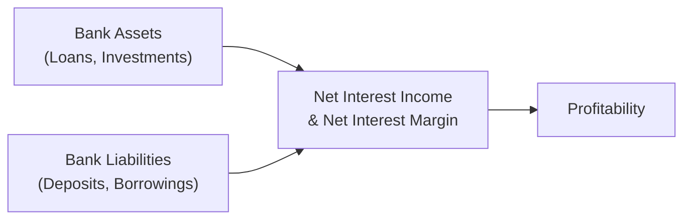
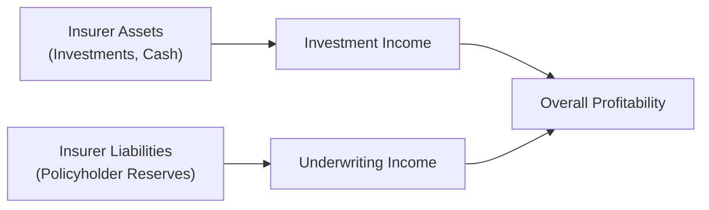

## Introduction

Let’s be honest: even if you’ve spent years poring over typical corporate financial statements, the balance sheets and income statements of banks and insurance companies can feel like you’ve entered a completely new dimension. I remember being caught off-guard the first time I glanced at a bank’s annual report—loans and deposits everywhere, massive leverage, and “interest margin” popping up all over the place. If you’re feeling a bit of that bewilderment, don’t worry; it’s a common reaction.

Financial institutions—especially banks and insurance companies—serve as a backbone of the global economy, but their statements are structured in ways that differ significantly from non-financial organizations. By understanding these differences, you’ll be better equipped to analyze their financial health, spot potential issues, and make informed decisions, whether you’re an investor, analyst, or just a curious observer. Below, we’ll walk through the key items on the financial statements of banks and insurers, discuss unique profitability metrics like net interest margin (NIM) and underwriting income, and highlight the regulatory frameworks that swirl around capital adequacy and disclosures.

## Why Statements Differ for Financial Institutions

It all starts with the fundamental nature of their business:

• Banks hold deposits and extend credit. In other words, a bank’s “inventory” is actually money.  
• Insurance companies collect premiums in exchange for providing coverage against specified risks; their main obligations are future claim payouts or policy benefits.

Both these business models lead to highly leveraged balance sheets, with different rules about how to measure and present assets and liabilities. For non-financial firms, we often think in terms of tangible or intangible assets (property, equipment, intellectual property, etc.). Banks and insurers, on the other hand, live and breathe financial instruments and associated liabilities. So, their statements are structured accordingly.

## The Balance Sheet of a Bank

When you open a bank’s balance sheet, the first thing you might notice is that the largest asset item is usually loans to customers. Banks thrive (or suffer) based on the quality and quantity of these loans. Meanwhile, on the liabilities side, the most prominent line items are customer deposits—both retail (you and I with our checking and savings accounts) and wholesale (corporate or interbank deposits).

Below is a simplified mermaid chart that highlights typical bank assets and liabilities:

### Loans as the Primary Asset

Loans can represent anywhere from 40–80% of a bank’s total assets, depending on the bank’s specialization (commercial lending, retail mortgages, etc.). Under IFRS or US GAAP, these loans may be carried at amortized cost or at fair value, depending on the bank’s business model and regulatory preferences. Banks must frequently disclose:

• Methods for calculating loan loss provisions (the allowance for credit losses).  
• Credit risk management practices.  
• Fair value estimates (often falling under IFRS 13 or ASC 820 hierarchical valuation).  
• Loan segmentation (commercial vs. consumer, prime vs. subprime, and so on).

### Deposits as the Principal Liability

Customer deposits—checking accounts, savings accounts, time deposits—are the core liabilities for most banks. Interestingly, these “liabilities” are effectively the funds depositors lend to the bank. Banks are obligated to return deposits upon request (for demand deposits) or at maturity (for time deposits). The volume of deposits, their interest rates, and deposit mix drive the bank’s interest expense, which in turn helps determine net interest income (NII).

### Leverage

Leverage in banking often is higher than what you see in a typical manufacturing or retail firm. A bank might have an equity-to-asset ratio of, say, 5–10%, which would be considered extreme for a non-financial firm but is normal in the banking sector. This level of leverage magnifies both returns and risks. It’s also why regulators (through accords like Basel III) impose capital adequacy requirements to ensure banks maintain a suitable buffer against potential losses.

## The Bank Income Statement: Net Interest Income and Net Interest Margin

Ever hear bankers toss around the term “net interest margin” (NIM)? NIM is absolutely central to analyzing a bank’s profitability. You can think of NIM as a measure of how effectively the bank is using its interest-bearing assets to generate net interest income relative to those assets.

Formulaically:  
NIM = (Net Interest Income) ÷ (Average Earning Assets)

• Net Interest Income (NII) is the difference between interest revenue (from loans, securities) and interest expense (on deposits, borrowings).  
• Earning Assets typically include loans and investments that generate interest.  

A high or stable NIM suggests the bank is managing its spreads efficiently, whereas a shrinking or negative trend in NIM may indicate deteriorating asset quality or increasing funding costs.

## Loan Loss Provisions: Estimating Potential Defaults

Banks must estimate credit losses each period and recognize them as an expense via loan loss provisions. These provisions are the bank’s attempt to guess how many loans will eventually go bad (i.e., not be repaid). Analysts should pay close attention to these provisions because:

• Management may be conservative (overestimating) or aggressive (underestimating) in setting aside these allowances.  
• Large swings in provisions can drastically affect reported earnings.  
• Tracking loan loss provision ratios over time provides insight into how stable or risky a bank’s lending portfolio might be.

Under IFRS 9, banks follow an “expected credit loss” model that is typically forward-looking. In the US, we have the Current Expected Credit Loss (CECL) model under ASC 326. Both frameworks have spurred banks to refine their credit risk models extensively (though let’s be honest, modeling is half science, half educated guess).

## The Balance Sheet of an Insurance Company

Insurance companies are in the business of collecting premiums today while being on the hook for paying (often uncertain and possibly large) claims tomorrow. This results in a balance sheet packed with “technical provisions” (or “policyholder reserves”) on the liability side. Meanwhile, on the asset side, insurers hold investments to fund these future obligations.

Here’s a quick mermaid diagram comparing assets and liabilities unique to insurers:

### Policyholder Reserves (Technical Provisions)

Policyholder reserves reflect the company’s best estimate of future claims, benefits, and related costs. These reserves can be extremely long-term (as in life insurance) or relatively short-term (as in property and casualty). The exact methodology for setting these reserves involves actuarial science, present value discounting, and sometimes complicated assumptions about mortality rates, morbidity rates, interest rates, and claims inflation.

### High-Quality Investment Assets

Insurers typically maintain a large investment portfolio—often in bonds, stocks, and alternative assets. Since claim liabilities can stretch well into the future, insurers match the duration of their investment assets to their expected liabilities. Under IFRS or US GAAP, these investments may be classified as held-to-maturity, available-for-sale, or fair value through profit and loss. As a result, the statement of comprehensive income could see periodic fluctuations in value based on changes in market interest rates or other factors.

## The Insurance Income Statement: Underwriting Income vs. Investment Income

An essential distinction in insurance accounting is the separation of underwriting income from investment income.

• Underwriting Income (sometimes “insurance service result” under IFRS 17) measures how profitable the core insurance operations are—i.e., premiums earned minus claims, acquisition costs, and other underwriting-related expenses.  
• Investment Income reflects returns from the insurer’s invested assets.  

An insurer could have strong overall net income that masks weak underwriting performance, simply because its investment portfolio did very well. As an analyst, you’ll want to examine:
1) The loss ratio (claims incurred ÷ premiums earned).  
2) The expense ratio (underwriting expenses ÷ premiums earned).  
3) The combined ratio (sum of loss ratio and expense ratio).  

A combined ratio below 100% indicates an underwriting profit, whereas a ratio above 100% implies an underwriting loss.

## Fair Value Disclosures and Hierarchy

Both banks and insurers hold lots of financial instruments (loans, bonds, derivatives) that may need to be reported at fair value. Under IFRS 13 or ASC 820, companies must categorize assets and liabilities into:

• Level 1: Quoted prices in active markets for identical instruments.  
• Level 2: Observable inputs other than Level 1 prices (e.g., similar instruments, market corroboration).  
• Level 3: Unobservable inputs, often requiring internal models and assumptions.

This hierarchy helps you assess just how much subjectivity is baked into the valuations. If you see large amounts of Level 3 assets, you might want to read the footnotes very carefully. Valuation changes in these positions can have a material impact on equity and earnings.

## Capital Adequacy and Regulation

Capital adequacy is a huge deal for both banks and insurers. In fact, typical GAAP or IFRS statements only tell part of the story. Regulators require supplemental disclosures and capital calculations that can differ significantly from standard accounting-based numbers. For banks, we have frameworks like Basel III (with its Common Equity Tier 1 ratio). For insurers in the EU, there’s Solvency II, and in the US, there are Risk-Based Capital (RBC) guidelines. In each case, the goal is to ensure that the financial institution has enough capital to absorb unexpected shocks and continue meeting obligations to depositors or policyholders.

## Spotlight on Key Disclosure and Analysis Areas

• Loan Loss Provisions vs. Actual Loan Default Rates (Banks): Watch for any mismatch indicating overly optimistic or pessimistic provisioning.  
• Claim Reserves vs. Actual Claim Experience (Insurers): Large unexpected reserve increases can indicate big trouble.  
• Net Interest Margin Trends (Banks): A narrower margin might reflect difficulty in controlling funding costs or lending rates.  
• Underwriting Performance vs. Investment Performance (Insurers): If underwriting consistently loses money, the insurer is relying heavily on investment returns to remain profitable.  
• Fair Value Classification: Heavy reliance on Level 3 indicates subjectivity.  
• Regulatory Capital Ratios: Are they comfortably above the minimum thresholds? Sudden or frequent capital raises can be red flags.

## Example: Simple Bank vs. Insurance Financials

Let’s do a quick hypothetical:

• Bank X:  
  – Total Assets: $100 billion (Loans = $70 billion)  
  – Total Liabilities: $95 billion (Deposits = $60 billion)  
  – Equity = $5 billion  
  – Net Interest Income (NII) = $2 billion  
  – Loan Loss Provision = $0.3 billion  

  NIM = $2 billion ÷ $75 billion* ≈ 2.67%  
  *assuming average earning assets are $75 billion  
  The bank’s provision is 15% of NII, signaling caution or maybe an uptick in delinquencies.

• Insurer Y:  
  – Policyholder Reserves: $70 billion  
  – Investment Assets: $80 billion  
  – Underwriting Income = $1.5 billion  
  – Investment Income = $3.0 billion  
  – Combined Ratio = 95%  

  The insurer’s combined ratio below 100% suggests it’s making money from underwriting operations, and with a considerable investment base, it also has a sizable chunk of investment income. That’s an insurer that looks stable for now, but we’d still examine those reserve assumptions carefully.

## Encouraging Critical Thinking

It’s easy to get lost in the numbers, but always remember to question: Are these figures realistic, or are we relying on highly subjective models? Read footnotes. Compare actual outcomes to prior estimates. Check if the entity’s capital ratio meets or exceeds regulatory minimums by a comfortable margin. And definitely beware of big, sudden changes in reserves or provisioning that come out of nowhere.

## Exam Tips for CFA Candidates

• Be prepared for scenario-based questions. For instance, the exam might present you with a bank’s shift in deposit mix and ask how that affects NIM and net interest income.  
• Understand how underwriting income is derived and be able to dissect combined ratios for insurance companies.  
• Memorize the gist of IFRS 13 / ASC 820 fair value hierarchy. Knowing which assets typically go to Level 3 can win you easy points.  
• Practice reading footnote disclosures on loan loss provisions and insurance claim reserves. Those details often become the basis of an exam’s “hidden pitfalls” question.  
• Keep an eye on the interplay between regulatory capital requirements (Basel III, Solvency II, RBC) and standard GAAP/IFRS ratios. The exam loves to test your ability to differentiate between these measures.

## References

• Basel Committee on Banking Supervision Publications:  
  https://www.bis.org/bcbs/  

• IFRS Standards (IFRS 7, IFRS 9, IFRS 13, IFRS 17):
  https://www.ifrs.org/  

• FASB Accounting Standards Codification (ASC 820, ASC 326):
  https://www.fasb.org/  

• Rezaee, Zabihollah: “Financial Institutions, Valuations, Mergers, and Acquisitions”  

• Solvency II Directive (EU)  
  https://ec.europa.eu/info/business-economy-euro/banking-and-finance/insurance-and-pensions/solvency-2_en  

• US Risk-Based Capital (RBC) Framework for Insurers (NAIC)  
  https://www.naic.org  

--------------------------------------------------------------------------------

## Test Your Knowledge: Banks and Insurers’ Financial Structures



### Which of the following typically represents the largest asset class on a bank's balance sheet?

- [x] Loans
- [ ] Equity securities
- [ ] Inventory
- [ ] Accounts receivable

> **Explanation:** Banks primarily earn income by lending money, so loans usually occupy the largest slice of their asset portfolio.

### A drop in net interest margin (NIM) for a bank most likely indicates:

- [x] Reduced profitability from interest-bearing assets relative to interest costs
- [ ] A substantial increase in fee-based revenue
- [ ] Better underwriting results
- [ ] Higher returns on equity investments

> **Explanation:** NIM is the ratio of net interest income to average earning assets. A declining NIM suggests that either loan yields have fallen, funding costs have risen, or both.

### Insurance policyholder reserves are best described as:

- [ ] Equity accounts set aside to fund dividends
- [ ] Cash kept in short-term deposit accounts
- [x] Liabilities representing future obligations to policyholders
- [ ] Contingent liabilities that appear only off the balance sheet

> **Explanation:** Policyholder reserves (or technical provisions) are recorded as liabilities reflecting the insurer’s obligation to pay future claims or benefits.

### Which line item directly measures a bank’s expense associated with potential loan defaults?

- [ ] Deposits payable
- [ ] Short-term borrowings
- [x] Loan loss provisions
- [ ] Net deferred tax liabilities

> **Explanation:** Loan loss provisions capture the periodic expense that banks recognize to reflect expected future credit losses.

### In the insurance industry, the “combined ratio” is computed by summing the:

- [x] Loss ratio and expense ratio
- [ ] Premium growth ratio and policy rate ratio
- [ ] Initial claim ratio and final claim ratio
- [ ] Leverage ratio and interest coverage ratio

> **Explanation:** The combined ratio = loss ratio + expense ratio. A ratio below 100% generally indicates underwriting profitability.

### Underwriting income for an insurance company is best described as:

- [ ] Interest from investment securities
- [ ] Gains from revaluing intangible assets
- [x] Premiums earned minus claims and underwriting expenses
- [ ] The net effect of derivatives hedging

> **Explanation:** Underwriting income reflects the core insurance operations—specifically how premiums cover claims and related costs.

### Which capital adequacy framework is primarily applied to insurers within the European Union?

- [ ] Basel III
- [x] Solvency II
- [ ] RBC (Risk Based Capital)
- [ ] CECL

> **Explanation:** Solvency II is the EU regulatory framework for insurance companies, requiring them to maintain sufficient capital to meet liabilities.

### For banks, a higher level of deposits in relation to equity typically implies:

- [x] Higher leverage
- [ ] Lower leverage
- [ ] No impact on leverage
- [ ] Reduced systemic risk

> **Explanation:** Deposits form a significant part of a bank’s liabilities. Larger deposits relative to equity usually signal higher leverage.

### A key distinction between Level 1 and Level 3 assets under fair value accounting is that:

- [ ] Both rely on unobservable inputs
- [x] Level 1 refers to assets with observable market prices, while Level 3 relies on internal assumptions  
- [ ] Level 1 assets can only be equity securities, while Level 3 are always derivatives  
- [ ] Level 3 assets cannot be traded in active markets for any reason

> **Explanation:** Level 1 uses quoted prices in active markets for identical assets. Level 3 valuations rely heavily on internal models and unobservable inputs.

### True or False: Insurance companies often generate both underwriting income and investment income, which may mask poor underwriting results if investment returns are strong.

- [x] True
- [ ] False

> **Explanation:** Insurers commonly separate underwriting from investment performance, and robust investments can offset weak underwriting outcomes.


