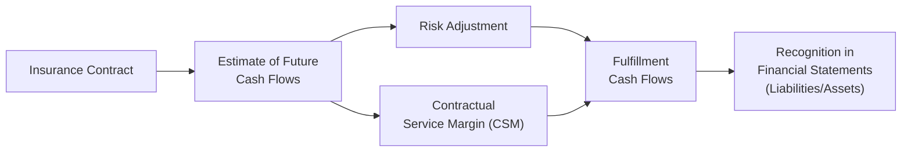

## The Evolution from IFRS 4 to IFRS 17
Sometimes, you know, we assume “another accounting standard” won’t drastically alter how insurers report their performance. But IFRS 17 truly hits a reset button on insurance accounting. Under IFRS 4 (the old standard), insurers had leeway to use various local GAAP or other national rules. This meant two global insurance companies could produce strikingly different financial statements—even if they were underwriting almost identical insurance risks. IFRS 17 aims to fix that by introducing a more uniform framework.

IFRS 17 replaced IFRS 4 to deliver consistency, clarity, and improved comparability across geographical boundaries. Analysts, regulators, and policyholders benefit from deeper insights into insurers’ current assumptions, profitability drivers, and risk exposures—an especially big deal for cross-border comparisons.

## Core Concepts in IFRS 17
IFRS 17 reshapes how insurance liabilities and profits are recognized and disclosed. Let’s briefly walk through some critical components:

• Separation of Contract Components: An insurance contract often contains parts such as coverage or protection elements, investment components, and additional services. IFRS 17 requires insurers to isolate certain components if they are distinct (e.g., easily separable like an investment fund), ensuring each project’s economics are reported accurately.

• Risk Adjustment: Beyond the expected cash flows, IFRS 17 requires insurers to quantify uncertainty. This risk adjustment captures the compensation an insurer demands for bearing uncertainty around insurance risks.

• Contractual Service Margin (CSM): Profits at the inception of a contract aren’t recognized immediately. Instead, they’re parked in the CSM and recognized into income over the coverage period as services are provided. It’s basically a mechanism to spread out (or defer) profits rather than front-loading them all at once.

• Loss Component: If a contract is deemed onerous (i.e., unprofitable) from inception, IFRS 17 requires immediate recognition of losses, preventing undesirable surprises later.

## IFRS 17: The General Model
Under IFRS 17, the “General Model” (GM) is the default measurement approach for long-duration contracts. Imagine you’re analyzing a life insurer that writes policies lasting 20+ years. With the GM, the insurer estimates:

1) Future Cash Flows: The present value of all expected inflows (premiums, investment income, etc.) minus outflows (benefit payments, expenses).  
2) Risk Adjustment: Reflecting the uncertainty of these cash flows.  
3) Contractual Service Margin (CSM): Any surplus of inflows over outflows plus the risk adjustment. That margin is booked as a liability and released to profits over the coverage period.

The GM approach keeps insurers honest by continually updating assumptions—like mortality rates or policy lapse rates—and reflecting those changes in the measurement of liabilities and the release of the CSM.

### Example of the General Model in Action (High-Level)
Let’s say an insurer issues a 10-year endowment policy:

• Present Value of Future Cash Inflows: $1,000 (premiums)  
• Present Value of Future Cash Outflows: $900 (benefits, claims, expenses)  
• Risk Adjustment: $30  

If the net cash flow plus risk adjustment is positive ($1,000 − $900 = $100; $100 + $30 = $130), this becomes the “net fulfillment cash flow.” The $130 difference is typically recognized as a liability at inception. If the contract is profitable, part of that $130 is labeled the CSM. Over time, the insurer will release the CSM to the income statement as it provides coverage.

## Premium Allocation Approach (PAA)
For shorter-duration insurance contracts (often one year or less, like property-casualty policies for cars or homeowners), IFRS 17 allows a simplified approach called the Premium Allocation Approach (PAA). Since these contracts don’t stretch over many years, insurers can measure the liability in a manner similar to unearned premium under older standards, so long as they meet certain eligibility requirements.

### Key Features of the PAA
• Simplicity: Instead of a fully detailed cash flow model, insurers can initially defer premiums as a liability (unearned premium) and recognize revenue over the coverage period.  
• Onerous Contracts: If it’s clear a contract will be unprofitable, insurers must recognize losses immediately.  
• Time Horizon: Typically used for 12-month coverage or shorter, though IFRS 17 allows PAA usage for multiple-year contracts if it doesn’t materially deviate from the General Model.  

Anyway, the PAA basically streamlines the measurement for short-term contracts, reducing the burden of constant revaluations.

## IFRS 17 and Reinsurance
One of the biggest changes, in my opinion, is how IFRS 17 mandates a consistent framework for reinsurance. Under IFRS 17, reinsurance contracts are accounted for separately rather than offsetting directly the underlying insurance contracts. For instance:

• Gains and Losses on Purchasing Reinsurance: If you purchase reinsurance to cede some of your risks, IFRS 17 requires you to measure this reinsurance asset with separate risk adjustments and a CSM, if applicable.  
• If an Underlying Contract is Onerous: The net effect changes when reinsured coverage is recognized. An insurer might record an immediate gain on purchasing reinsurance if it reduces a previously recognized loss on onerous contracts.

Thus, reinsurance programs for risk mitigation still follow the same IFRS 17 measurement logic, though with special adjustments for the direction of risk transfer.

## Disclosure Requirements
IFRS 17’s disclosure demands can catch folks off guard. Or at least, it caught me off guard when I first studied the standard. The principle is that insurers must provide enough clarity about:

• Reconciliations of Opening to Closing Balances: Reconciliation tables that walk through how the insurance liability evolves over time, including new contracts, changes in assumptions, CSM adjustments, and risk margin remeasurement.  
• Assumptions and Methods: Key assumptions around discount rates, mortality/longevity factors, and how the risk adjustment is determined (like a confidence-level technique).  
• Sensitivity Analyses: Insurers may need to show how changes in assumptions (e.g., interest rates, mortality tables) could affect the contract assets/liabilities.  

This heightened transparency gives analysts a lens into the “black box” of insurance accounting, at least more so than under IFRS 4.

## Transition Adjustments
Many insurers adopting IFRS 17 for the first time faced a significant transition from IFRS 4. IFRS 17 provides three main transition methods:

• Full Retrospective Approach: As if the standard was always in effect (often impractical for longstanding portfolios).  
• Modified Retrospective Approach: A middle ground, retaining some historical information but permitting approximations.  
• Fair Value Approach: For complex legacy business, insurers measure the net liability at fair value on transition and treat that new number as the “starting point.”

From an analyst’s perspective, watch how companies choose their transition approach—some methods could more favorably impact equity or minimize day-one volatility in profit.

## Impact on Financial Analysis
For a quick refresher: IFRS 17 changes how profits are recognized over time, so fundamental metrics like return on equity and combined ratios (in non-life) or new-business margins (in life) can shift. The standard can significantly reduce early profit recognition because the CSM defers those gains into future periods. Earnings may appear smoother, with lower initial surpluses but steadier profit release.

Furthermore, IFRS 17 fosters cross-border comparability—assuming local jurisdictions don’t insert too many modifications. As an analyst evaluating a multinational insurer’s solvency, it becomes easier to align coverage obligations across multiple geographies. You might see short-term hits to equity if an insurer reclassifies certain profitable lines, or immediate hits from onerous contracts. But overall, IFRS 17 helps you gauge consistent profitability and risk adjustments.

## Example: IFRS 17 Flow Diagram
Below is a simple diagram capturing the key building blocks of an IFRS 17 measurement model. It’s obviously simplified, but hopefully it sheds some light:

The insurer starts with key data from the contract, arrives at the expected future cash flows, then layers on the risk adjustment and the CSM to determine fulfillment cash flows. Finally, those amounts appear on the balance sheet and move into the income statement as coverage is provided.

## Potential Pitfalls and Best Practices
• Data Collection and Actuarial Modeling: IFRS 17 heavily relies on accurate, detailed actuarial projections. Gaps in data or subpar modeling can distort reported profits.  
• Complexity of Risk Adjustment: Calculating the risk adjustment can get subjective. Overly aggressive or overly conservative assumptions will affect both liabilities and recognized profits.  
• Onerous Contracts: If your analysis overlooks the immediate recognition of losses on onerous contracts, you might incorrectly forecast future profitability.  
• National Adaptations: Some jurisdictions might tweak IFRS 17 for local regulations, so cross-check footnotes for differences.  
• Consistency Over Time: IFRS 17 demands continuous updates of assumptions. Watch for frequent changes in discount rates or mortality tables—these factor directly into net income.

## Final Exam Tips
• Familiarize yourself with the differences between the General Model and the Premium Allocation Approach. A short question might test your understanding of when each is applied.  
• Practice analyzing how the CSM is recognized over time. This is often tested in scenario-based questions.  
• Don’t forget reinsurance subtleties. IFRS 17 reinsurance measurement can have a big impact on net results and capital adequacy.  
• Devote extra time to disclosures. IFRS 17’s granular approach requires you to interpret reconciliation statements. In the real exam, that might be exactly what you’re asked to do.  
• Approach each question systematically: identify whether it’s a short-duration or long-duration contract, see if there’s a risk adjustment, check if it’s profitable or onerous, then figure out the correct IFRS 17 treatment.

## References
• IFRS 17: https://www.ifrs.org/issued-standards/list-of-standards/ifrs-17-insurance-contracts/  
• “Preparing for IFRS 17” – Deloitte, KPMG, and EY resources  
• Industry publications from S&P, Fitch, Moody’s discussing IFRS 17 implications  

## Test Your Knowledge: IFRS 17 Insurance Contract Accounting



### Under IFRS 17, which component is used to defer unearned profit on a life insurance contract?
- [ ] Risk adjustment
- [x] Contractual Service Margin (CSM)
- [ ] Future cash flow projection
- [ ] OCI (Other Comprehensive Income)

> **Explanation:** IFRS 17 requires profit to be recognized as services are provided over the duration of the contract. The Contractual Service Margin (CSM) is the mechanism that defers these unearned profits.

### Which approach under IFRS 17 is primarily intended for shorter-duration insurance contracts?
- [ ] General Model
- [ ] Reinsurance Model
- [x] Premium Allocation Approach
- [ ] Full Retrospective Approach

> **Explanation:** The Premium Allocation Approach (PAA) under IFRS 17 is designed for short-duration insurance contracts and allows simplified measurement, similar to traditional unearned premium models.

### Which of the following statements about IFRS 17 reinsurance accounting is most accurate?
- [x] Reinsurance contracts are measured separately, with their own risk adjustment and CSM.
- [ ] Reinsurance contracts must always offset the liabilities of the underlying contract directly.
- [ ] Gains from reinsurance cannot be recognized at inception.
- [ ] IFRS 17 does not apply to reinsurance transactions, only direct insurance.

> **Explanation:** IFRS 17 requires separate measurement of reinsurance with its own risk adjustment and contractual service margin, rather than offsetting the underlying insurance contracts on a net basis.

### Under IFRS 17, how is an onerous contract (one expected to generate losses) recognized?
- [x] The anticipated loss is recognized immediately in profit or loss.
- [ ] Losses are spread out evenly via the CSM over the coverage period.
- [ ] Loss recognition is deferred to the end of the policy term.
- [ ] It is offset by reinsurance assets automatically.

> **Explanation:** IFRS 17 stipulates that losses on onerous contracts must be booked immediately to prevent delayed recognition of unfavorable performance.

### A company transitions from IFRS 4 to IFRS 17. Which transition approach requires the greatest amount of historical information for all insurance contracts?
- [ ] Fair Value Approach
- [ ] Modified Retrospective Approach
- [x] Full Retrospective Approach
- [ ] Premium Allocation Approach

> **Explanation:** The Full Retrospective Approach aims to restate all prior contracts as if IFRS 17 had always been in place, requiring extensive historical data.

### Under the General Model in IFRS 17, the estimated future cash flows of an insurance contract are combined with which two additional components to form the “fulfillment cash flows”?
- [x] Risk adjustment and CSM
- [ ] Policy dividend obligation and discount rate spread
- [ ] Gross liability and net liability
- [ ] Deferred costs and intangible assets

> **Explanation:** “Fulfillment cash flows” under IFRS 17 include the present value of future cash flows plus a risk adjustment, and the contractual service margin (added if the contract is profitable).

### Which IFRS 17 method is generally the most practical for a portfolio of one-year property insurance contracts?
- [ ] Full Retrospective Approach
- [x] Premium Allocation Approach
- [ ] Modified Retrospective Approach
- [ ] General Model

> **Explanation:** For simple, short-duration insurance policies, the Premium Allocation Approach offers a more practical and less data-intensive method than the General Model.

### Under IFRS 17, what is the primary significance of the “risk adjustment”?
- [x] It reflects the uncertainty around the amount and timing of future insurance cash flows.
- [ ] It is another term for interest expense.
- [ ] It represents a tax-driven adjustment.
- [ ] It only applies to reinsurance contracts.

> **Explanation:** The risk adjustment in IFRS 17 captures the compensation required for bearing the inherent uncertainty in insurance liabilities.

### Why might an insurer’s net income pattern smooth out under IFRS 17 compared to prior accounting standards?
- [ ] The risk adjustment defers all income recognition until final settlement. 
- [x] Profit is deferred into the contractual service margin, releasing it over the coverage period.
- [ ] IFRS 17 prohibits market-rate discounting.
- [ ] IFRS 17 disallows any recognition of underwriting losses.

> **Explanation:** IFRS 17’s CSM structure spreads profit recognition over time instead of booking it upfront, which can reduce volatility and smooth earnings.

### From an analyst's perspective, IFRS 17 primarily improves comparability across insurers by:
- [x] Standardizing measurement and presenting consistent disclosures globally.
- [ ] Allowing each company to retain its previous local GAAP without any changes.
- [ ] Eliminating the risk adjustment requirement.
- [ ] Removing all transitional methods and requiring one uniform approach.

> **Explanation:** IFRS 17’s consistent measurement approach and extensive disclosure requirements enhance comparability across insurers in different jurisdictions.


