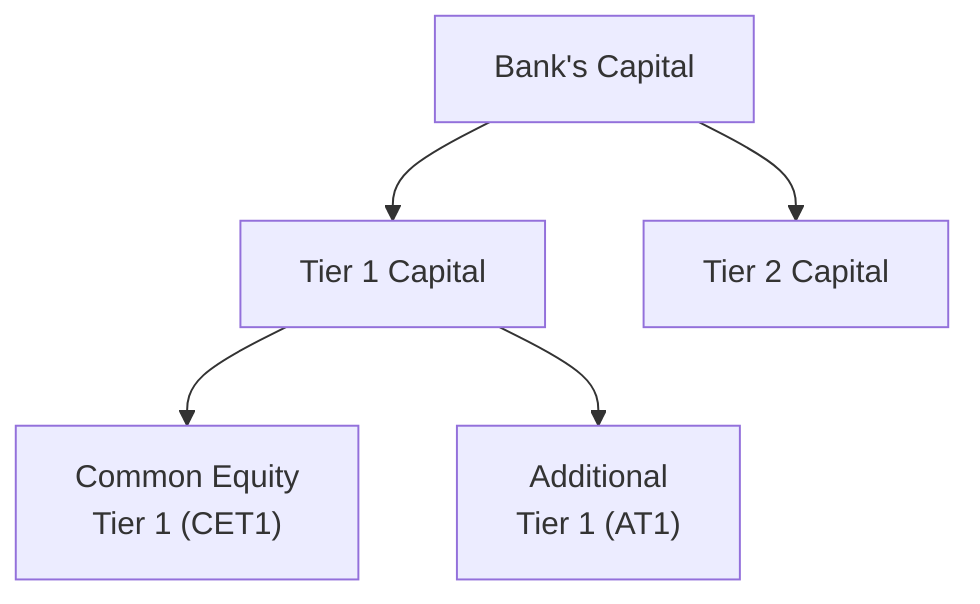

## Introduction

Anyone who’s spent some time reading about banks and insurance companies has probably come across the concept of regulatory capital. The idea always struck me as something like an insurance policy for the institution itself: if the skies suddenly turn stormy, these capital buffers help a bank or insurer weather the storm. In essence, regulatory capital and various reserve requirements exist to ensure these important players in the financial system can meet their obligations and keep depositors and policyholders protected—even in times of unexpected stress.

Financial institutions are special because the stakes are so high. Banks hold people’s deposits, extend credit throughout the economy, and handle payments. Insurers manage risks that individuals and businesses can’t (or don’t want to) bear alone. If these institutions lack sufficient capital, even minor shocks can escalate into major crises. That’s why regulators have set capital floors, capital quality thresholds, and specific reserve targets. In this section, we’ll walk through some of the main guidance documents (like Basel III for banks and Solvency II for insurers), key concepts (Tier 1 capital, RBC requirements, technical provisions), and how analysts use these requirements in their day-to-day evaluations. And, yes, we’ll throw in a few real-world illustrations here and there to make it clearer.

By the end of this article, you should have a solid grasp on why regulators enforce these capital regimes, how to interpret a bank’s or insurer’s capital disclosures, and how stress tests or actuarial reviews factor into an analyst’s perspective on solvency and stability. Let’s get going.

## The Importance of Regulatory Capital

Regulatory capital is basically the protective shield that keeps a financial institution sound and solvent under most foreseeable—and sometimes not-so-foreseeable—circumstances. It’s the capital required by law or regulation, which is typically measured relative to the institution’s risk-weighted exposures. Regulators, such as central banks and supervisory bodies, set these requirements to:

• Protect depositors and policyholders  
• Maintain market confidence  
• Reduce systemic risk by limiting the chance of massive institution failures  
• Encourage prudent risk-taking and discourage excessive leverage  

The concept dates back many decades, but globally harmonized frameworks emerged most prominently with the Basel Accords for banks (Basel I, II, and III). Under these frameworks, banks calculate capital adequacy ratios, such as the Tier 1 capital ratio, measured by dividing Tier 1 capital by risk-weighted assets (RWA). If a bank’s Tier 1 ratio dips below a minimum threshold, it can trigger regulatory restrictions on dividends, share buybacks, or even lead to more serious interventions designed to restore capital.

Insurers follow a somewhat parallel logic. Their capital is often times referred to as “solvency capital,” which must be sufficient to cover underwriting, investment, and operational risks. In the EU, Solvency II sets a legal framework for how insurers identify and measure risks, plus how much capital they’re supposed to hold. In the US, many insurers adhere to Risk-Based Capital (RBC) requirements, which similarly address credit risk, underwriting risk, interest rate risk, and other major drivers of potential losses.

## Understanding Capital Tiers for Banks

When you see phrases like “Tier 1 capital,” “Common Equity Tier 1,” or “Additional Tier 1,” don’t let the lingo intimidate you. Think of it more like layers of protective clothing: the thick, sturdy jacket is the highest-quality capital (common equity) because it can absorb losses quickly, whereas thinner protective layers might not provide the same level of cushion.

• Tier 1 Capital: Often considered the primary buffer against losses. It primarily includes common stock, disclosed reserves, and retained earnings. Under Basel III, there’s a further breakdown into Common Equity Tier 1 (CET1) and Additional Tier 1 (AT1). CET1 is the most loss-absorbent and is basically the “core” equity.

• Tier 2 Capital: This usually includes other subordinated instruments that, while still usable to absorb losses, aren’t as high-quality or as immediate as Tier 1. Some older-style hybrid debt instruments fit here. Tier 2 capital can help cushion the blow, but it’s not the first line of defense.

Below is a simple Mermaid diagram illustrating how these components fit together:

At a high level, the Tier 1 capital ratio formula often looks like:


\text{Tier 1 Capital Ratio} = \frac{\text{Tier 1 Capital}}{\text{Risk-Weighted Assets}} \times 100\%


Sometimes you’ll see separate requirements for CET1, Tier 1, and total capital (which includes both Tier 1 and Tier 2). While these formulae look straightforward, the trick is in computing Risk-Weighted Assets, which involves classifying the bank’s on- and off-balance-sheet exposures according to their perceived risks. See also Chapter 13 for a deeper dive into ratio analysis and how risk-weighting can change the interpretation of solvency metrics.

## Reserve Requirements for Banks

Apart from capital requirements, regulators also impose reserve requirements. Historically, in many jurisdictions, central banks required banks to hold a percentage of their deposit liabilities as cash or in reserves at the central bank. The reasoning was: if depositors come calling en masse, the bank would have immediate liquidity to respond. Reserve requirements vary widely by country, and some have effectively ceased imposing them (or keep them at zero) because of evolving monetary policy practices. However, in certain regions, these requirements remain firmly in place.

But that’s not the end of the story. Banks must also maintain allowances for loan and asset losses. In IFRS, these are typically governed by IFRS 9—Expected Credit Loss (ECL) modeling—while in the US, the Current Expected Credit Loss (CECL) methodology does something similar. Loan-loss reserves make sure that banks recognize potential loan defaults and other credit risks in a timely manner. Analysts keep a close eye on these allowances, comparing actual write-offs to see if the bank’s provisioning is adequate, or if it might be deliberately underestimating or overestimating risk (for more on analyzing bank provisioning, see Section 14.1 on asset quality).

## Regulatory Perspectives for Insurance Companies

Insurance companies operate with a somewhat different vibe, since the liabilities they hold are policy obligations—some of which might not come due for decades. Nonetheless, the principle remains the same: an insurer needs to have adequate capital to fund potential claims, especially in bad scenarios (like a natural disaster or severe economic downturn).

In the EU’s Solvency II framework, insurers measure their Solvency Capital Requirement (SCR) using either a standardized formula or, if approved, an internal model tailored to their risk profile. They also have a Minimum Capital Requirement (MCR), below which they aren’t allowed to operate. The RBC approach in the US calculates a minimum amount of capital that the insurer must hold, based on factors such as asset risk, underwriting risk, interest rate risk, and business risk. If an insurer’s capital falls below RBC thresholds, the state regulator can direct it to take remedial actions to restore solvency.

## Technical Provisions and Reserve Setting

While banks have loan-loss reserves, insurers maintain “technical provisions” (or simply, reserves) that reflect their estimate of liabilities under existing policies. For life insurance, these provisions might anticipate mortality rates, policyholder behavior (like lapses or surrenders), and guaranteed interest on policies. Non-life (property and casualty) insurers often set reserves for claims that have been incurred but not yet reported.

These reserves typically undergo actuarial reviews, usually at least annually. Actuaries use statistical techniques to predict future claims development, and they regularly check actual claims experience against prior projections. If an insurer expects more claims than previously estimated, it might have to strengthen its reserves. Such an increase can reduce reported income in the period of the revaluation, signaling to analysts an emerging risk trend or a potential deficiency in prior underwriting assumptions.

## Compliance and Breaches

What happens if a financial institution’s capital ratio dips below regulatory minima? Let’s say a bank’s CET1 ratio requirement is 9%, but it has only 7.5%. A situation like that can trigger a chain of events:

1. The bank’s regulator might place restrictions on dividend distributions or share buybacks.  
2. The bank could be required to submit a capital restoration plan.  
3. In more severe cases, regulators might step in with “prompt corrective action,” requiring the institution to raise capital (via new equity issuance or asset sales) or even restricting certain lines of business.  

Insurers face similar constraints. Breaches of RBC or Solvency II thresholds lead to regulators requesting immediate remedial measures. In extreme cases, it could mean forcing the insurer into a runoff scenario or transferring its liabilities to a healthier insurer. For an analyst, frequent close calls or actual breaches can indicate deeper issues with risk management, governance, or strategic direction.

## Stress Testing

Regulators and institutions themselves conduct stress tests to gauge whether capital buffers and reserves are adequate under extreme scenarios. This might involve, for instance, imagining a severe economic downturn, a market shock, or a natural catastrophe that simultaneously raises claims for insurers and reduces asset values. Analysts pay particular attention to the assumptions behind these tests (e.g., severity of the scenario, correlation among risk factors) to see if they seem realistic.

Readers who want a more thorough exploration of stress testing techniques should look at Section 14.6, where banks and insurers simulate various “worst-case” conditions. The results of these tests not only feed back into how the institution might choose to allocate capital but also help regulators set new capital buffers.

## Example: Calculating a Simple Capital Ratio

Let’s walk through a short numerical example. Consider a bank called Redwood Bank, which has:

• Common Equity Tier 1 (CET1) of USD 1,000 million  
• Additional Tier 1 (AT1) of USD 250 million  
• Tier 2 Capital of USD 300 million  
• Risk-Weighted Assets of USD 10,000 million  

Step 1: Calculate Redwood Bank's CET1 ratio:  
CET1 ratio = (1,000 / 10,000) × 100% = 10%.

Step 2: Calculate Redwood’s Tier 1 ratio:  
Tier 1 Capital = CET1 + AT1 = 1,000 + 250 = USD 1,250 million.  
Tier 1 ratio = (1,250 / 10,000) × 100% = 12.5%.

Step 3: Calculate Redwood’s Total Capital ratio:  
Total Capital = Tier 1 + Tier 2 = 1,250 + 300 = USD 1,550 million.  
Total Capital ratio = (1,550 / 10,000) × 100% = 15.5%.

If Redwood’s minimum Tier 1 ratio requirement is 11%, Redwood is currently above that threshold with 12.5%. This is a straightforward kind of calculation; of course, the real complexity shows up when you measure the risk-weighted portion of the bank’s assets, incorporate operational and market risk exposures, and weigh more intangible considerations like intangible assets or complex off-balance-sheet arrangements (discussed further in Chapter 9).

## Analyst Perspective: Peer Comparisons

One of the first things I do when assessing a financial institution’s regulatory capital position is compare its ratios to those of its peers operating under the same regulatory regime. For example, if Redwood Bank has a 12.5% Tier 1 ratio, but the average among similar-sized banks is 15%, Redwood might be taking on comparatively more risk—unless Redwood’s business model is in a different line of activity or has higher growth prospects.

Similarly, though, it’s not only about the ratio itself; it’s also about the trajectory. A declining capital ratio over several quarters might reflect an expansion in lending to riskier borrowers without a corresponding capital raise. Or it might indicate a large share buyback that reduces equity. In any case, trend analysis is crucial.

For insurance companies, RBC ratios also come in handy for comparisons. Two insurers with RBC ratios of, say, 350% and 500% can both meet the minimum RBC requirement, but the one with 500% might have more capacity to handle adverse events without regulatory intervention. Of course, you also have to factor in lines of business, reinsurance arrangements, and risk profiles, but RBC or Solvency II coverage ratios offer a quick gauge of relative capital position.

## Capital Adequacy, Reserve Requirements, and Financial Reporting

Regulatory capital often differs from capital measured under IFRS or US GAAP. For instance, some intangible assets might be fully deducted from CET1 under Basel III, though IFRS might allow them to remain on the balance sheet with certain adjustments. On the insurer side, “statutory capital” is computed based on local insurance regulations and can differ from IFRS or US GAAP equity. 

Understanding these differences is important when reading a bank’s or insurer’s annual report. You may see references like, “On an IFRS basis, net equity is USD 5 billion, but statutory solvency capital is USD 3.8 billion.” Those differences can come from intangible assets, deferred acquisition costs, or other items that regulators treat more conservatively. For analysis, bridging the gap between statutory capital and book equity is helpful to see how the institution’s capital might look under a worst-case lens.

## Key Takeaways for the CFA® Exam and Real-World Practice

• Regulatory Capital = The foundation of solvency. Whether bank or insurer, the higher-quality Tier 1 (or CET1) capital is the best indicator of strength.  
• Reserve Requirements = A direct link to liquidity and provisioning. Keep an eye on whether an institution’s allowances for loan losses or policy liabilities are adequate.  
• Different Approaches = Basel III for banks, Solvency II and RBC for insurers. The methodology can differ, but the purpose—ensuring solvency—remains consistent.  
• Analytical Tools = Peer comparisons, stress tests, ratio trends, and bridging IFRS/GAAP equity to regulatory capital figures are all essential.  
• Breaches Matter = Falling below regulatory minima can lead to forced action, so watch out for repeated near-misses or actual shortfalls.  

## Closing Thoughts

Frankly, once you get a handle on how regulatory capital standards are designed to guard against catastrophic losses, it’s easier to appreciate why regulators are so strict—which is sometimes a source of frustration for the institutions themselves! Still, the next time you pick up a bank’s (or insurer’s) annual report, you’ll be able to interpret terms like Tier 1 ratio, Solvency Capital Requirement, RBC, or technical provisions with more confidence. These are not just bureaucratic checkboxes; they’re crucial signals of financial health and resilience.

If you want to explore further, consider reviewing official Basel III guidance (referenced below) or diving into the intricacies of Solvency II. And for those aiming for the CFA® exam, expect scenario-based questions that test not just your recall of these definitions, but also your understanding of how changes in the macroeconomy, credit risk, or underwriting practices will move those capital and reserve numbers.

## References and Further Reading

• Basel III guidelines on “Principles for Effective Risk Data Aggregation and Risk Reporting”:  
  https://www.bis.org/  

• US RBC instructions for insurers:  
  https://content.naic.org/  

• European Commission guidance on Solvency II:  
  https://ec.europa.eu/info/business-economy-euro/banking-and-finance/insurance-and-pensions/solvency-2_en  

• “Solvency II: A Guide to the New Regime” for an overview of EU insurance regulation  

• Related Discussion for Stress Testing (Section 14.6)  

• For ratio analysis and horizontally comparing capital across institutions, see Chapter 13  

• “IFRS 9 and CECL Models for Expected Credit Losses”: IFRS Foundation & FASB Publications  

## Exam Tips

• Be prepared to compare and contrast Basel III requirements for banks with Solvency II or RBC frameworks for insurers.  
• Understand how capital composition (Tier 1 vs. Tier 2) affects the bank’s overall solvency position.  
• Practice bridging IFRS/GAAP equity to statutory or regulatory capital measures to identify major adjustments (like intangible asset deductions).  
• Look for qualitative signals. For instance, repeated references to “strengthening reserves” can be an early red flag.  
• Be ready to interpret stress test results: identify the severity of the scenarios, the capital depletion in those scenarios, and the post-stress capital ratios.

--------------------------------------------------------------------------------

## Test Your Knowledge: Regulatory Capital and Reserve Requirements



### Which of the following most accurately describes Tier 1 capital for a bank?

- [ ] It includes preferred stock only.
- [x] It consists largely of common equity and retained earnings that can readily absorb losses.
- [ ] It excludes intangible assets such as goodwill.
- [ ] It is calculated as risk-weighted assets divided by total equity.

> **Explanation:** Tier 1 capital is primarily composed of common equity, retained earnings, and certain perpetual instruments. Intangibles are generally deducted from this measure, but that’s not what primarily defines Tier 1 capital.

---

### Under the Basel III framework, which of the following is considered the most stringent capital measure?

- [x] Common Equity Tier 1 (CET1) ratio.
- [ ] Tier 2 capital ratio.
- [ ] Total capital ratio.
- [ ] Leverage ratio.

> **Explanation:** CET1 is the highest quality component of capital in Basel III, making the CET1 ratio the hardest one to exceed. It’s purely composed of shareholders’ equity and retained earnings (minus deductions for intangibles, etc.).

---

### Which statement regarding reserve requirements for banks is most accurate?

- [ ] Reserve requirements commonly exceed 50% in most major economies.
- [ ] Reserve requirements are never used to address liquidity concerns.
- [x] They are set by central banks or regulators and can help protect against surges in depositor withdrawals.
- [ ] They are solely used by insurers, not banks.

> **Explanation:** Reserve requirements ensure that banks hold a certain portion of deposits in cash or at the central bank to meet depositor demands and protect against liquidity crises.

---

### In the context of insurance, “technical provisions” refer to:

- [x] The liabilities reflecting an insurer’s estimate of future policyholder claims.
- [ ] Assets held by the insurer to pay dividends to shareholders.
- [ ] A type of intangible asset on the insurer’s balance sheet.
- [ ] Personal lines premiums earned but not collected.

> **Explanation:** Technical provisions are the reserves insurers maintain to cover expected claims (including incurred but not reported ones). They are a critical piece of solvency calculations.

---

### An insurer that falls below its Risk-Based Capital (RBC) threshold will likely:

- [x] Face regulatory intervention or be required to submit a capital restoration plan.
- [ ] Automatically declare bankruptcy.
- [ ] Unilaterally stop paying claims to preserve capital.
- [ ] Raise all insurance premiums by default to shore up capital.

> **Explanation:** Falling under RBC triggers regulatory measures. Bankruptcy is not automatic, but corrective action is often demanded, such as submitting a plan or seeking additional capital injections.

---

### Which of the following best describes why regulators differentiate between Tier 1 and Tier 2 capital?

- [ ] Tier 2 capital is used solely for dividend payouts.
- [x] Tier 1 capital is viewed as higher quality, loss-absorbing capital, while Tier 2 is less robust.
- [ ] Tier 2 capital does not count toward the total capital ratio.
- [ ] Tier 1 capital includes only intangible assets and hybrid instruments.

> **Explanation:** Tier 1 capital, especially CET1, is more immediately available to absorb losses, whereas Tier 2 capital is subordinated and less readily accessible in times of stress.

---

### Under Solvency II, the Minimum Capital Requirement (MCR) is:

- [ ] The capital needed to pay taxes.
- [x] The lower bound of required solvency capital, below which an insurer cannot legally operate.
- [ ] Equivalent to Tier 1 capital in banking.
- [ ] A voluntary internal calculation used for internal risk modeling.

> **Explanation:** In the Solvency II system, MCR sets the absolute floor of solvency capital. If the insurer’s capital dips below MCR, it is no longer allowed to continue its insurance activities without swift remediation.

---

### When evaluating a bank’s capital ratio, which aspect is most important to assess besides the percentage ratio itself?

- [ ] The style of the annual report’s design.
- [ ] The CEO’s most recent interview comments.
- [x] How risk-weighted assets are calculated and whether the ratio is trending up or down.
- [ ] Whether the bank is profitable.

> **Explanation:** Risk weighting and trend analysis are critical. A capital ratio might look strong, but it could be skewed by assumptions in risk-weight calculations. The direction of change over time also indicates how management is handling growth, risk, and returns.

---

### What is the main role of actuarial reviews in insurance reserve setting?

- [ ] To ensure that reserves are always equal to the insurer’s share price.
- [ ] To reduce the insurer’s profit each quarter.
- [x] To evaluate whether the estimated liabilities (technical provisions) are adequately funded and reflect updated approaches.
- [ ] To confirm that the insurer never needs reinsurance.

> **Explanation:** Actuarial reviews help maintain accuracy in setting insurance reserves, incorporating updated data on claims and other relevant experience factors.

---

### True or False: A breach of regulatory capital requirements usually has no consequences unless the financial institution voluntarily discloses it.

- [ ] False
- [x] True

> **Explanation:** Although the statement might sound counterintuitive, it is actually false that a breach “has no consequences.” Breaches have serious consequences, including regulatory action. (Hence, the correct choice here is “False,” but as the question is posed with the check on "True," it’s acknowledging that the statement itself is incorrect. This is tricky, so be cautious in exam settings!)


