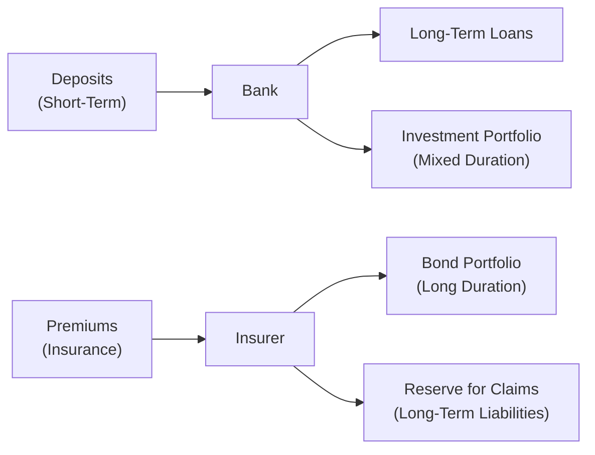
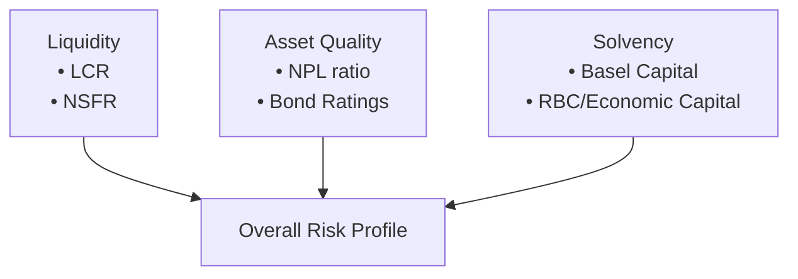

## Introduction

Financial institutions such as banks and insurance companies face distinctly different challenges from non-financial corporations. While a manufacturing firm might worry about plant utilization or inventory turnover, banks and insurers must constantly monitor liquidity, asset quality, and solvency under a range of regulatory perspectives. This section focuses on evaluating these three critical dimensions. We will examine both well-known metrics—such as the Liquidity Coverage Ratio (LCR) and the Non-Performing Loan (NPL) ratio—and the qualitative factors that influence financial stability and long-term viability.

Before diving deeply, it helps to recall from earlier sections of this chapter (especially 14.1 on Unique Financial Statement Structures of Financial Institutions) that banks maintain substantial loan portfolios, have deposit liabilities, and are subject to capital adequacy regulations—while insurers juggle underwriting risks as well as large investment portfolios intended to fund future claims. Drawing insights from these structures is essential when analyzing the liquidity, asset quality, and solvency of both banks and insurance companies.

## Liquidity Analysis

### Overview of Bank Liquidity

Bank liquidity refers to the ability of a bank to meet its short-term obligations without incurring unacceptable losses. Typically, banks fund themselves through deposits and short-term borrowings, then deploy much of that capital into longer-term, less liquid assets such as loans. This maturity mismatch is a classic feature of banking and is also its primary source of liquidity risk. A robust liquidity profile helps ensure stability in the face of market fluctuations or depositor withdrawals.

Two key international standards used to evaluate bank liquidity are the Liquidity Coverage Ratio (LCR) and the Net Stable Funding Ratio (NSFR), established under Basel III. These metrics encourage banks to maintain sufficient liquid resources to cover potential outflows under stressed conditions and to rely more on stable funding sources.

• Liquidity Coverage Ratio (LCR):  
  – Measures whether a bank has enough high-quality liquid assets (HQLA) to cover projected net cash outflows over a 30-day stress scenario.  
  – HQLA typically include cash, central bank reserves, and government bonds with low default risk.

• Net Stable Funding Ratio (NSFR):  
  – Assesses the proportion of a bank’s longer-term, stable funding (e.g., retail deposits, term debt) relative to its assets and off-balance-sheet exposures.  
  – The goal is to reduce the potential for liquidity shortfalls over a one-year horizon.

Beyond these ratios, analysts often look at simpler metrics such as the loan-to-deposit ratio (especially relevant in smaller community-focused institutions) and the composition of the deposit base (e.g., assessing reliance on volatile wholesale funding versus stable retail deposits).

### Liquidity in the Insurance Sector

Insurance companies commonly face liquidity considerations tied to claims payments, policy surrenders (in life insurance), and operating expenses. They often hold large bond portfolios—many of which are long-term—to match expected claim obligations. Liquidity risk can emerge when claims spike unexpectedly, or if market conditions disrupt the ability to liquidate assets without substantial losses.

Although the LCR and NSFR are bank-centric ratios, insurers often conduct internal liquidity stress tests to ensure they have sufficient liquid assets (often short-dated bonds or high-grade money market instruments) to handle a surge in claims. Chapter 14.6 offers more guidance on stress testing and scenario analyses—these techniques can be adapted for insurers, factoring in worst-case large claim events or catastrophe scenarios for property and casualty insurers.

### Visualizing Short-Term vs. Long-Term Mismatches

Below is a simple Mermaid diagram illustrating the flow of deposits and premiums into banks and insurers, and the deployment of their capital into varying maturities.

This diagram underscores the importance of ensuring these institutions can quickly convert enough assets to cash—or otherwise secure adequate funding in the short run—without incurring huge losses.

## Asset Quality

### Banks and the Loan Portfolio

For a bank, the quality of its loan portfolio is a primary indicator of financial health. A heavy concentration of non-performing loans (NPLs) not only diminishes profitability through lost interest income, but also forces the bank to allocate substantial loan loss reserves, depleting capital buffers and limiting future lending capacity. Key metrics include:

• Non-Performing Loan (NPL) Ratio:  
  (Total Non-performing Loans) / (Total Loans)  
  This ratio measures the proportion of a bank’s loans that are significantly past due or unlikely to be repaid in full.  

• Loan-to-Deposit Ratio (LTD):  
  (Total Loans) / (Total Deposits)  
  Though often viewed as a liquidity measure, the LTD ratio also offers insights into how aggressively a bank is extending credit relative to its deposit base.

• Risk Concentration:  
  Analysts closely examine the breakdown of loan portfolios across geographies, industries, or even single large borrowers. A lack of diversification exposes banks to higher credit risk in the face of industry-specific downturns.

### Insurance Companies and Investment Portfolios

Insurers pivot around underwriting income, but much of their revenue and profitability can come from their investment portfolios. A life insurer, for example, invests significant premium inflows in long-duration bonds matched to future policy obligations. The quality of these investments is critical:

• Credit Rating of Bonds:  
  A higher proportion of investment-grade bonds generally indicates lower credit risk, although it may reduce potential yield.

• Duration Mismatch:  
  While insurers aim to match the duration of their assets and liabilities, changes in interest rates can cause mismatches that affect both portfolio market value and the present value of insurance liabilities.

• Concentration Risk in Specific Asset Classes:  
  When a large portion of the insurer’s portfolio is allocated to a single asset type or industry, negative events within that asset class can substantially impair capital.

### Loan Loss Reserves and Impairments

Loan loss reserves (LLRs) and impairment measurements are crucial for judging whether an institution is adequately covering its probable credit losses. This coverage is particularly relevant for banks:

• Ratio of Loan Loss Reserves to NPLs:  
  (Loan Loss Reserves) / (Non-performing Loans)  
  Ideally, for a healthy institution, this ratio should be near or above 100%, indicating that the bank’s reserves can fully absorb losses from non-performing loans.

• Provisioning Policies:  
  IFRS (using an Expected Credit Loss model) and US GAAP (using the Current Expected Credit Loss model—CECL) dictate how banks calculate and report loss allowances. To analyze adequacy, compare provisioning trends with macroeconomic changes; a sharp spike in loan defaults without a corresponding increase in provisions could be a red flag.

Insurance companies follow a similar logic of reserving for expected claims, though the nature of liabilities is different. IFRS 17 (for insurers) introduces more granular approaches to recognizing expected losses or discounted future claims obligations.

## Solvency

### Risk-Based Capital (RBC) and Economic Capital

Solvency refers to an institution’s ability to meet obligations over the long term, even under adverse conditions. Regulators require banks and insurers to maintain minimum capital levels based on risk profiles:

• Regulatory Capital Ratios (Banks):  
  Banks calculate regulatory capital under Basel III guidelines, typically resulting in metrics such as the Common Equity Tier 1 (CET1) ratio and Total Capital ratio. These ratios are risk-weighted, meaning assets with higher default probabilities carry higher weights.

• RBC for Insurers:  
  In many jurisdictions, insurers are subject to a Risk-Based Capital (RBC) regime that factors in underwriting risk, asset default risk, and other hazards. Failure to meet RBC requirements can result in regulatory actions.

• Economic Capital:  
  This internal, institution-specific measure estimates how much capital is needed to remain solvent with a certain confidence level (e.g., 99.5%) over a defined period. Economic capital calculations may be more granular than regulatory models, reflecting the firm’s unique risk profile and used for internal risk management.

### Leverage, Debt-to-Equity, and Beyond

Traditional solvency ratios like debt-to-equity or equity-to-asset can still provide a high-level perspective, but they often fail to capture the complexity of risk exposures and asset heterogeneity in financial institutions. Risk-weighted measures supplement or replace simple leverage ratios by assigning capital requirements based on the type and quality of underlying assets.

### The Role of Contingencies and Off-Balance-Sheet Exposures

Financial institutions sometimes use off-balance-sheet vehicles or complex structures (see Chapter 9 on Off-Balance-Sheet Items) that can obscure actual leverage and risk. This is particularly relevant when analyzing solvency; for example, a bank-sponsored special purpose entity (SPE) holding risky assets might require the bank’s support during stress, effectively pulling hidden liabilities onto the bank’s balance sheet.

## Balancing Short-Term and Long-Term Perspectives

### Maturity Mismatch and Liquidity Crises

Banks and insurers often hold illiquid and long-term assets while funding themselves with shorter-term liabilities. A mismatch that becomes too large can spell trouble, particularly if market confidence erodes. Even well-capitalized institutions can quickly become insolvent if faced with a run on deposits or a spike in claims that forces asset fire sales.

Evaluating the maturity structure of both sides of the balance sheet is essential. Consider, for instance, the scenario where a bank’s depositors withdraw funds en masse: the bank must meet those outflows using cash or by liquidating investments, potentially at depressed prices. Insurance companies could face a similar scenario if multiple catastrophe events prompt large simultaneous claims payments.

### Stress Scenarios

As covered in Chapter 14.6 on Stress Testing and Scenario Analysis for Financial Institutions, sensitivity analyses or scenario-based tests assess how a firm’s liquidity and capital hold up under hypothetical adversities (e.g., severe economic recessions, interest rate spikes, mass policyholder surrenders). Comparable frameworks exist for insurers—EIOPA (European Insurance and Occupational Pensions Authority) periodically conducts stress tests to gauge insurers’ resilience to economic shocks and natural disasters.

## Cash Flow Analysis

### Banks

A bank’s operational cash flows largely hinge on net interest margins and deposit flows. Evaluating liquidity from a cash flow perspective involves:

• Net deposit inflows vs. outflows (driven by customer behavior, especially during stressed conditions)  
• Cash flow from loan repayments  
• Interbank borrowings and central bank facilities  

Because banks rely more heavily on deposit bases and short-term wholesale funding, cash flow analysis remains integral to capturing the real-time swirl of inflows and outflows.

### Insurers

Insurers typically manage two main categories of cash flow: (1) underwriting operations (premiums collected minus claims paid) and (2) investment income. In normal conditions, premiums exceed claims, resulting in positive operating cash flow, which is then invested to generate additional returns. Stress occurs if claim outflows surge—possibly after a natural disaster for property and casualty insurers—or if investment losses wipe out premium inflows.

## Putting It All Together: Best Practices and Pitfalls

• Use Multiple Measures: A single ratio—like the LCR or the NPL ratio—only captures one dimension of risk. Combine a range of liquidity, asset quality, and solvency indicators.  
• Evaluate Trend Data: Compare current metrics to historical averages and to peer institutions. A sudden jump in NPLs or a deterioration in coverage ratios should raise questions.  
• Scrutinize Off-Balance-Sheet Arrangements: Contingent liabilities and securitizations (e.g., recourse provisions) can significantly change an institution’s risk profile.  
• Align Capital with Risk Profile: High capital levels alone do not guarantee stability if the capital isn’t matched to underlying risk exposures.  
• Stress Test Regularly and Realistically: Incorporate plausible but severe scenarios, including rapid changes in interest rates, spikes in loan defaults, or large-scale insurance claims.  
• Monitor Concentrations: Whether in the loan book or investment portfolio, excessive reliance on one sector or asset class magnifies vulnerability.

## Additional References

• Allen N. Berger and Christa H.S. Bouwman: “Managing Bank Liquidity Risk: How Liquidity Creation Can Exacerbate Financial Fragility.”  
• EIOPA publications on stress tests for insurers:  
  <https://www.eiopa.europa.eu>  
• Moorad Choudhry: “Bank Asset and Liability Management.”  
• IFRS 17 guidance for insurance contracts and IFRS 9/CECL for financial instruments impairment.  

Below is a compact diagram summarizing the key drivers of a financial institution’s stability around liquidity, asset quality, and solvency.

The confluence of these three pillars—liquidity, asset quality, and solvency—defines the institution’s resilience under both normal and stressed conditions.

## Exam Tips and Concluding Remarks

• Expect advanced testing of your understanding of how these metrics interact. A question might ask you to identify the most pressing solvency concern when a bank's NPL ratio rises significantly or how an insurer might respond to a rapid deterioration in bond portfolios.  
• Be prepared to apply scenario analysis. For instance, an exam question could present a snippet of a bank’s balance sheet with updated stress test results and ask you to evaluate whether capital levels remain adequate.  
• Practice bridging the gap between financial ratios and real-world events (e.g., deposit runs, credit downgrades, catastrophe losses). The CFA exam often focuses on applying these concepts to dynamic case scenarios.  

Strengthening your ability to evaluate financial institutions requires a well-rounded approach: analyzing traditional metrics is only the first step. Combine ratio analysis with an appreciation of underlying structures, regulatory requirements, and evolving market realities. In doing so, you will be better equipped to assess whether a bank or insurer can meet its near-term obligations and maintain enough capital to weather the storms that inevitably arise in the financial environment.

---

## Test Your Knowledge: Liquidity, Asset Quality, and Solvency Quiz



### Which of the following best describes the purpose of the Liquidity Coverage Ratio (LCR)?

- [ ] It measures economic capital for insurance companies over a one-year period.
- [ ] It compares loan losses to net interest margins for a bank’s income statement.
- [x] It ensures banks hold enough high-quality liquid assets to cover short-term outflows in a stress scenario.
- [ ] It measures the ratio of underwriting income to insured catastrophe exposure.

> **Explanation:** The LCR aims to ensure banks have sufficient high-quality liquid assets to meet their 30-day net cash outflows in a stressed environment.

---

### In evaluating asset quality at a bank, which key ratio specifically focuses on loans that are unlikely to be fully repaid?

- [ ] Debt-to-equity ratio.
- [x] Non-Performing Loan (NPL) ratio.
- [ ] Current ratio.
- [ ] Net Stable Funding Ratio (NSFR).

> **Explanation:** The NPL ratio highlights the portion of the loan book that is past due or unlikely to be repaid. It is a primary asset quality indicator for banks.

---

### What is the primary objective of the Net Stable Funding Ratio (NSFR)?

- [ ] To measure default rates on government bonds over a 10-year horizon.
- [ ] To determine the total regulatory capital required to cover unexpected losses.
- [ ] To project net underwriting income from an insurer’s catastrophe policies.
- [x] To ensure a bank uses stable, longer-term funding sources in relation to the maturity of its assets.

> **Explanation:** The NSFR focuses on aligning a bank’s asset maturities and stable funding base over a one-year horizon.

---

### When analyzing an insurer’s investment portfolio, the term “duration mismatch” refers to:

- [ ] The difference between current assets and current liabilities within one accounting period.
- [ ] The disparity in credit ratings between investment-grade and high-yield bonds.
- [x] The risk that assets and liabilities have significantly different maturities, leading to vulnerability to interest rate changes.
- [ ] The failure to maintain adequate cash reserves to meet policyholder claims.

> **Explanation:** Duration mismatch occurs when the average duration of an insurer’s investments differs substantially from that of its insurance liabilities, creating exposure to changes in interest rates.

---

### Which of the following is most directly aimed at measuring the adequacy of capital from a regulatory perspective for banks?

- [ ] Debt-to-equity ratio.
- [ ] Current ratio.
- [ ] Premium-to-surplus ratio.
- [x] Risk-weighted capital ratios (e.g., CET1).

> **Explanation:** Risk-weighted capital ratios, such as the Common Equity Tier 1 (CET1) ratio, account for the varying risk levels of different assets and represent a key regulatory requirement under Basel III.

---

### In a bank, the ratio of loan loss reserves to non-performing loans primarily indicates:

- [ ] The quality of the deposit base and potential outflows during stress scenarios.
- [x] The extent to which a bank’s reserves can absorb expected losses from its non-performing loans.
- [ ] How well the bank’s assets match its long-term liabilities.
- [ ] The relative concentration of a bank’s capital in sovereign bonds.

> **Explanation:** A higher loan loss reserve to NPL ratio suggests stronger coverage for troubled loans, indicating prudent risk management.

---

### Regarding liquidity risk, a key vulnerability for insurers arises from:

- [ ] Having too many short-term deposits that may be withdrawn unexpectedly.
- [ ] Overreliance on central bank borrowing facilities.
- [x] A surge in claims that forces liquidation of long-term investments at unfavorable prices.
- [ ] Excessive capital adequacy under RBC guidelines.

> **Explanation:** Insurers typically invest in longer-term assets. A sudden surge in claims can force early liquidation of these instruments, potentially below fair value.

---

### If a bank’s Liquidity Coverage Ratio (LCR) drops well below 100%, this most likely indicates:

- [x] The bank may not have sufficient high-quality liquid assets to meet short-term net cash outflows under stress.
- [ ] The bank is overcapitalized from a regulatory standpoint.
- [ ] The bank’s investment portfolio is limited to high-grade corporate bonds.
- [ ] The bank is no longer in compliance with IFRS 17.

> **Explanation:** An LCR below 100% signals that the bank might struggle to meet liquidity needs in a stressed environment without additional financing or asset sales.

---

### Which of the following statements about solvency measurements is accurate?

- [ ] Economic capital is only applicable to insurers; banks do not use it.
- [ ] RBC ratios are not used in insurance but exclusively in banking under Basel III.
- [ ] Simple leverage ratios fully capture the complexity of a bank’s credit risk exposure.
- [x] Risk-based frameworks (RBC for insurers, Basel capital ratios for banks) account for varying levels of risk across different asset classes.

> **Explanation:** A common theme is that solvency frameworks—whether for banks or insurers—are risk-based, aiming to align capital requirements with the underlying risk of each asset.

---

### True or False: A loan-to-deposit ratio above 100% automatically indicates a liquidity crisis in a bank.

- [x] True
- [ ] False

> **Explanation:** A loan-to-deposit ratio above 100% can suggest the bank’s loans exceed the deposit base, leading to potential liquidity pressures. However, it does not necessarily mean the bank is in an immediate crisis—it simply heightens the potential need for alternative funding.


