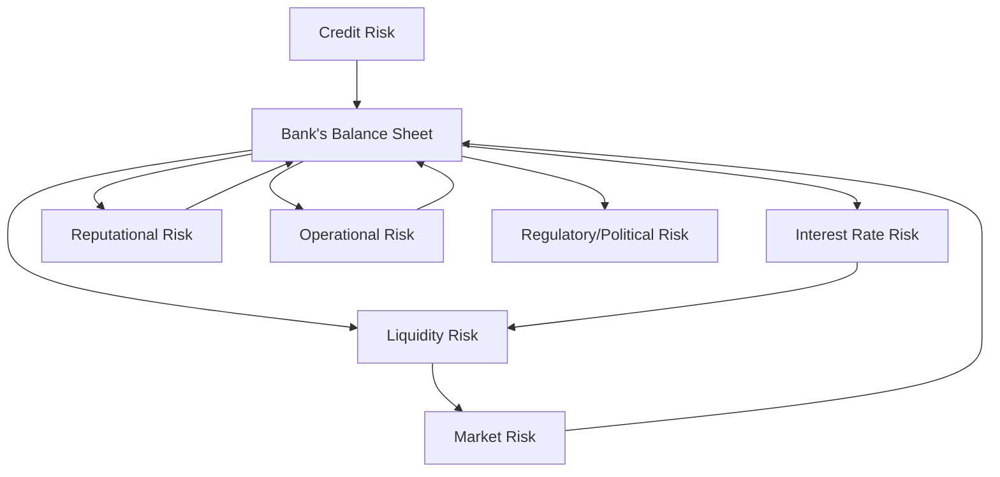

## The Nature of Risk in Banking and Insurance

If you’ve ever had that uneasy feeling when a friend asked you to loan them money—wondering if they’ll actually pay you back—you’ve already felt a bit of what banks and insurers experience every day. In a much more complex and high-stakes environment, banks make loans to various borrowers, and insurance companies collect premiums in exchange for paying future claims. Both of these businesses revolve around a fundamental uncertainty: Will the counterparty fulfill its obligations? Will actual claims end up being more than the premiums collected?

This is precisely why risk management is at the heart of banking and insurance operations—these institutions take on risks with every product or service they offer. Below, we’ll explore the major categories of risk they face, how these risks materialize in financial statements, and how they’re typically managed or mitigated. Along the way, I’ll also share a personal anecdote or two that might illustrate the practical side of risk. 

## Credit Risk

Whenever a bank extends loans, issues credit cards, or invests in fixed-income securities, there is a chance that the borrower or issuer might fail to make interest or principal payments. For insurance companies, credit risk often shows up through bond investments in their portfolios (especially high-yield or emerging-market debt) and through exposure to reinsurance counterparties.

• For banks, credit risk is typically the number one priority. If you see a bank’s income statement, the interest it earns on loans is the main revenue driver, but the “Provision for Loan Losses” or “Expected Credit Loss (ECL) Expense” is a big line item that directly reduces earnings. Under IFRS 9, for example, banks are required to recognize credit losses earlier, using an expected loss model rather than waiting for an actual default.

• For insurers, understanding and limiting credit risk is sometimes overshadowed by underwriting risk (which we’ll discuss in a moment). But if you look at the balance sheet of a major insurer, you’ll notice a large chunk of assets are investments in bonds. An unexpected default could really hurt the insurer’s solvency ratio, especially if combined with a spike in claims.

### Identifying Credit Risk

Credit risk can be measured through corporate and government bond ratings, credit default swap (CDS) spreads, or internal credit models that banks maintain. Insurers often rely on third-party rating agencies when investing in bonds. Both industries also use internal risk models to anticipate expected losses, factoring in possible deterioration in economic conditions. 

### Managing Credit Risk

Banks typically:

• Diversify loan portfolios (both geographically and by industry).  
• Require collateral or guarantees.  
• Maintain robust credit-scoring systems and underwriting standards.  

Insurers often:

• Diversify investments across different bond issuers and asset classes.  
• Use reinsurance to limit large exposures from catastrophic events.  
• Closely monitor credit ratings of reinsurance partners.

## Interest Rate Risk

Think about the difference between the interest rate you pay on your mortgage and the interest your bank pays you on your checking account. That gap—also called the net interest margin—is basically how many banks make a profit. However, as interest rates move, this margin can shrink or expand. Understanding it can feel a bit like checking the weather forecast for tomorrow’s picnic. You hope the forecast is right, but if the weather shifts abruptly, your plans might be ruined.

• Banks face interest rate risk primarily in how quickly they can adjust the rates they charge on loans (assets) versus what they pay on deposits and borrowings (liabilities). Regulatory guidelines, including the Basel Accords, often require banks to measure exposure via metrics like Net Interest Income at Risk or Economic Value of Equity.

• Insurers, especially life insurers, worry about their long-term liabilities—think of life insurance policies that extend decades into the future. If market interest rates fall significantly, the insurer’s investment returns might not keep pace with the promised policy payouts.

### Common Methods to Measure and Mitigate Interest Rate Risk

1. Gap Analysis: Measures the difference between rate-sensitive assets and rate-sensitive liabilities over given time buckets (e.g., up to 3 months, 3–12 months, 1–5 years, etc.).  
2. Duration Analysis: Evaluates how changes in interest rates affect the market value of assets and liabilities. This is especially relevant for long-duration insurance products.  
3. Hedging Strategies: Use interest-rate swaps, futures, or options to limit volatility in net interest income or portfolio value.  

## Underwriting/Actuarial Risk (Insurance-Specific)

Underwriting risk is mostly relevant to insurance companies. A classic example: an auto insurer who sets premiums too low because it underestimates the frequency of accidents. If you’ve ever been the “guy who drives your car way too carefully” (like me), you might wonder why you’re paying the same or even a higher premium than your friend who speeds. Insurers use broad assumptions on how many claims will happen in certain segments, but actual results can deviate.

• Life Insurers: They worry about mortality and morbidity assumptions. If life expectancy changes more than anticipated, annuity products could become more costly.  
• P&C (Property and Casualty) Insurers: They could be blindsided by unexpectedly large hurricane or flood claims.  
• Reinsurance Arrangements: Insurers often buy reinsurance to transfer part of the risk. However, if the reinsurance counterparties are in financial trouble, the benefit might not fully materialize.  

### Managing Underwriting Risk

• Rate Adjustments and Experience Studies: Premiums are periodically reviewed and adjusted to reflect changes in claim experience.  
• Detailed Valuation of Policy Liabilities: IFRS 17 (for insurance contracts) and local GAAP standards require insurers to perform fair valuation of future policy benefit liabilities and to monitor changes in assumptions.  
• Reinsurance Strategies: Purchasing adequate coverage from financially strong reinsurers lowers the net exposure to catastrophic losses.  

## Operational Risk

Operational risk arises from internal process failures, system breakdowns, fraud, or human errors. One of my first internships was at a regional bank that had an unexpected system outage—customers couldn’t access accounts for over a day, and the bank’s reputation took a beating. It may seem intangible, but the associated costs can be huge.

• Banks handle millions of transactions daily, and a small system glitch can trigger widespread errors or fraud attempts.  
• Insurers may miscalculate premium quotes or face challenges with claims-processing software, leading to duplicated payouts or denial-of-service claims from legitimate customers.

### Control and Mitigation

• Strong Internal Controls: Both banks and insurers invest heavily in cybersecurity, staff training, and oversight committees.  
• Separation of Duties: For instance, the person inputting new claim data often cannot be the same person approving the claims settlement.  
• Regulatory Oversight: Regulators worldwide issue guidelines (e.g., Basel Committee for Banking Supervision’s “Sound Practices for Operational Risk Management”) requiring minimum control environments.

## Liquidity Risk

Liquidity risk relates to not having enough cash or liquid assets to cover obligations when they come due. 

• Banks can face a sudden deposit run if customers lose confidence and withdraw funds rapidly. Even a small rumor can spark mass withdrawals, which is precisely why central banks serve as “lenders of last resort.”  
• Insurers must plan for scenarios where a large volume of claims arrives in a short time (e.g., a massive hurricane causing property damage across an entire region).

### Stress Testing Liquidity

Scenario analysis is critical for both banks and insurers. For a bank, a plausible stress scenario might combine a credit downgrade with a sudden wave of deposit outflows. For an insurer, a burst of policy redemptions (for life insurance) or claims (for property & casualty) plus adverse investment market conditions can strain liquidity. Institutions hold reserves in highly liquid, high-grade assets—like government treasuries—to manage these scenarios.

## Market Risk

Market risk is the risk of losses from adverse movements in market prices—interest rates, equities, commodities, currencies, you name it.

• Banks usually hold larger trading portfolios than insurers. Their trading desks might be active in foreign exchange, derivatives, or equity markets. Sudden market volatility—like the 2020 oil price crash or a sharp equity downturn—can create significant mark-to-market losses.  
• Insurers typically invest policyholder premiums. A stock market decline or bond market turbulence can reduce the value of these investments, affecting solvency measures.

### Common Methods for Measuring Market Risk

• Value at Risk (VaR): Attempts to estimate the maximum expected loss over a given period at a certain confidence level.  
• Stress Scenarios: For instance, insurers check what happens if interest rates rise by 200 basis points or if equity markets drop 30%.  
• Sensitivity Analysis: A simpler approach that looks at incremental changes (e.g., a 1% move in interest rates) to gauge the effect on portfolio value.  

## Reputational Risk

Reputational risk might seem “soft,” but a mismanaged crisis can severely damage a bank’s or insurer’s standing in the market. If a bank is compromised by a money-laundering scandal, or if an insurer denies claims unfairly and gets hit by negative media coverage, the trust factor can crumble overnight.

• Restoring reputation takes time and substantial resources—think additional regulatory scrutiny, internal process overhauls, and customer outreach.  
• On financial statements, reputational risk rarely has a direct line item, but you will see indirect effects such as declining deposits, slower premium growth, or potentially higher funding costs.

## Regulatory and Political Risk

Both banks and insurers operate under detailed rules that can shift with each new regulation or political push. A change in capital adequacy requirements, for example, can force institutions to raise fresh equity or divest certain assets. 

• Banks: Regulatory frameworks such as Basel III require higher capital buffers and liquidity coverage ratios. A shift in these requirements can impact banks’ ability to lend.  
• Insurers: They might face changes in reserve requirements or restrictions on product design under local insurance regulations. IFRS 17, for instance, redefined how insurance companies measure their liabilities, potentially altering reported earnings and capital positions.

### Example: Political Uncertainty

In many emerging markets, government policy changes can affect the flow of foreign capital, hamper currency convertibility, or impose new taxes on financial services. Insurers that want to expand into those countries often buy local reinsurance or partner with local companies to offset or share the political risk.

## Visualizing Risk Relationships

Below is a simplified diagram using Mermaid.js that shows how these key risks intersect. Feel free to interpret it as a rough map of interdependencies:

In the insurance context, the same categories play out with a heavier emphasis on underwriting risks and the long-term nature of liabilities.

## Short Illustration: A Hypothetical Scenario

Imagine a mid-sized bank with a sizable loan portfolio to commercial real estate borrowers. At the same time, it invests in corporate debt securities to diversify income. Then, interest rates suddenly rise 2% more than expected:  

• The bank’s existing borrowers struggle to refinance, leading to a rise in late payments. Credit risk ticks upward.  
• Depositors, seeing higher rates elsewhere, withdraw funds, creating liquidity pressure.  
• Squeezed net interest margin means narrower profits.  
• Falling bond values impact the bank’s investment book, causing market-related losses.  

Over in the insurance wing of the same conglomerate, the higher rates reduce the market values of their bond holdings, but ironically might help them earn more on future premiums. However, if the insurance side invests heavily in long-duration bonds that quickly lose market value, solvency ratios could deteriorate in the short term. 

## Glossary of Key Terms

• Underwriting Risk: The possibility that real claims deviate significantly from expected claims.  
• Morbidity Assumptions: Predictions of the rate of illnesses or disabilities in a target population, important for health and life insurers.  
• Market Risk: The threat of loss from fluctuations in market prices—interest rates, stocks, commodities, etc.  
• Reinsurance: Insurance for insurance companies; used to transfer or share risk.  
• Operational Risk: The danger of losses stemming from internal processes, system failures, or human error.  
• Systemic Risk: The potential for a whole financial system meltdown if one institution’s collapse triggers others.  
• Reputational Capital: The trust that stakeholders place in an institution’s ability and willingness to meet obligations.  
• Stress Scenario: A hypothetical, extreme but plausible event to test a firm’s resilience.  

## Final Thoughts on Managing Risk

The cultural mindset around risk is just as important as the models or capital reserves. Institutions that embed risk awareness into every level—whether it’s the teller at a bank’s local branch or an actuary in a global insurer—tend to fare better when storms hit. Pursuing something as seemingly mundane as a periodic “risk drill” can uncover hidden vulnerabilities.

In actual examination or professional scenarios, keep an eye on how banks and insurers disclose their exposures in notes to the financial statements. Look for any mention of off-balance-sheet items (like reinsurance deals), derivatives used for hedging interest rate risk, or a large mismatch of liability duration in the notes. These disclosures often reveal far more than the face of the balance sheet about how precarious (or secure) an institution may be.

## References and Further Reading

• “Insurance Risk Management” by the Society of Actuaries (https://www.soa.org/)  
• BIS guidelines on “Sound Practices for the Management and Supervision of Operational Risk”  
• “Foundations of Banking Risk” by GARP  
• IFRS 9 and IFRS 17 standards from the IFRS Foundation for guidance on expected credit losses and insurance contract accounting  

---

## Test Your Knowledge of Banking and Insurance Risks



### Which of the following best describes interest rate risk for a commercial bank?

- [ ] The risk of default by a corporate borrower.
- [ ] The threat that insufficient premiums are collected to meet future claims.
- [x] The volatility in net interest margins due to changes in market rates.
- [ ] The possibility of adverse changes in tax laws affecting bank operations.

> **Explanation:** Interest rate risk for banks centers on potential fluctuations in net interest margins due to shifts in market rates, which affect their lending and deposit costs.

### An insurer that underestimates mortality in life insurance policies is primarily exposed to:

- [ ] Interest rate risk.
- [x] Underwriting/actuarial risk.
- [ ] Operational risk.
- [ ] Reputational risk.

> **Explanation:** Underwriting/actuarial risk occurs when assumptions around mortality, morbidity, or general claim frequencies deviate from expectations, resulting in potential losses.

### A bank’s liquidity risk is most likely highlighted by which scenario?

- [ ] A moderate fluctuation in currency exchange rates.
- [x] Significant deposit withdrawals in a short time.
- [ ] A sudden jump in inflation expectations.
- [ ] A spike in equity markets after a financial report.

> **Explanation:** Liquidity risk arises when a bank cannot meet its cash outflow needs. A pronounced deposit run can quickly deplete available funds, illustrating a classic liquidity scenario.

### In an environment of rising interest rates, which statement is generally true for a life insurer?

- [x] The market value of previously issued bonds may decrease.
- [ ] The insurer’s underwriting risk automatically decreases.
- [ ] Liquidity risk is eliminated.
- [ ] The insurer’s investment returns fall to zero.

> **Explanation:** As interest rates rise, the market value of fixed-rate bonds falls, which can lower the insurer’s overall portfolio value.

### Which risk is most directly mitigated through a reinsurance arrangement?

- [x] Underwriting risk.
- [ ] Operational risk.
- [x] Catastrophic claim risk.
- [ ] Reputational risk.

> **Explanation:** Reinsurance is used by insurers to share or transfer a portion of underwriting risk, especially for large or catastrophic events.

### A bank looking to manage its market risk might implement which of the following strategies?

- [x] Use of Value at Risk (VaR) models and hedging with derivatives.
- [ ] Increasing deposits in checking accounts only.
- [ ] Lowering interest rates on all new loans regardless of market conditions.
- [ ] Discontinuing all consumer lending products.

> **Explanation:** VaR models help quantify potential losses, and derivatives can hedge exposure to interest rate and market movements.

### Operational risk in an insurer is illustrated by:

- [x] A system error that leads to incorrect claim payments.
- [ ] A sudden drop in stock market prices.
- [x] Internal fraud by employees manipulating policy data.
- [ ] The impact of a major flood on property damage claims.

> **Explanation:** Operational risk comes from failed processes, systems, and people. System breakdowns and employee fraud are classic operational issues.

### Which event best exemplifies reputational risk for a bank?

- [x] Widespread media reports of improper loan approvals leading to losses.
- [ ] A monetary policy change by the central bank.
- [ ] A natural disaster hitting the bank’s main office.
- [ ] A stable net interest margin that remains unchanged for years.

> **Explanation:** Negative media coverage about improper practices can degrade customer trust, leading to a reputational crisis that might result in deposit outflows or higher funding costs.

### Regulatory/political risk for insurers is likely to arise from:

- [x] Revision of capital requirements or solvency regulations.
- [ ] A disorganized project management structure.
- [ ] A mismatch between short-term liabilities and long-term assets.
- [ ] Competitors launching a new insurance product.

> **Explanation:** Regulatory changes—such as revised capital or solvency requirements—can force insurers to quickly adapt their capital structure or product offerings, illustrating regulatory/political risk.

### Stress testing is used by both banks and insurers primarily to:

- [x] Assess their resilience under extreme but plausible adverse scenarios.
- [ ] Determine the best marketing strategy.
- [ ] Calculate daily exchange rate fluctuations.
- [ ] Eliminate all risk exposure to zero.

> **Explanation:** Stress tests model extreme conditions (like a severe recession or catastrophic event) to ensure institutions can withstand significant shocks without failing.


