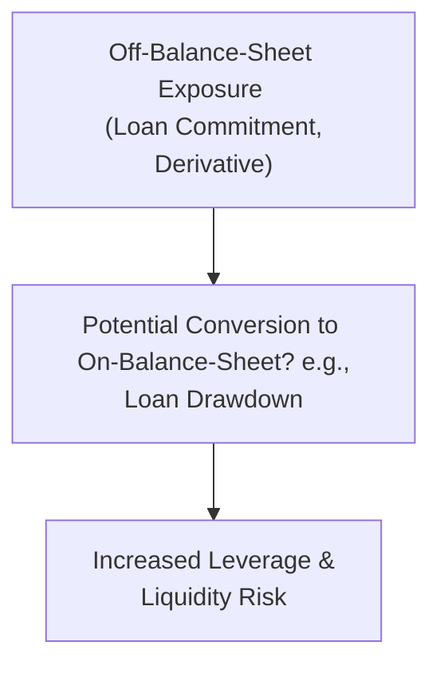

## Overview and Importance

Off-balance-sheet exposures can sometimes feel like a hidden world of risk—sort of like those forgotten boxes in your garage that might contain something harmless, or might contain a long-lost family heirloom with huge implications. In financial institutions, these obligations don’t appear on the balance sheet (or initially seem minimal there), yet they can morph into very real assets or liabilities. For banks, off-balance-sheet instruments include letters of credit, loan commitments, and derivatives. For insurers, items such as reinsurance treaties and securitized structures (e.g., catastrophe bonds) serve a similar purpose. Regardless of the specific structure, analysts need to understand that these exposures can cause sudden changes to capital, liquidity, and profitability, especially during stressed conditions.

Off-balance-sheet activities typically do not require immediate funding—even though they can represent significant economic commitments. When certain triggers occur, these exposures may become on-balance-sheet items. A straightforward example is a loan commitment: the bank has promised to lend up to a certain limit if the client decides to draw on it. As soon as the drawdown occurs, that off-balance-sheet promise becomes a very real on-balance-sheet loan.

This section explores common off-balance-sheet items for both banks and insurers, plus the practical ways to evaluate the disclosures, watch for hidden leverage, and perform stress testing. We’ll also discuss how you, as an analyst, can read between the lines to catch potential red flags or unknown risk pockets.

## Common Off-Balance-Sheet Items in Banking

### Letters of Credit (LoCs)

Letters of credit are instruments that guarantee payment to a beneficiary if certain conditions are met—often used in trade finance. A bank’s client might use an LoC to assure a seller that payment will be made, provided the seller meets contract conditions (like shipping goods). Now, even though the bank’s immediate outlay might be zero if no default occurs, this guarantee can be triggered under adverse circumstances.

It’s a bit like you promising a friend that you’ll pay their restaurant bill if they can’t. Usually, you expect your friend to pay, so you’re not immediately out of pocket. But if that friend ends up short on cash, your promise (guarantee) becomes a real expense. Similarly, banks must reserve regulatory capital for these exposures, because if clients fail to pay, the bank is on the hook.

### Loan Commitments

Loan commitments are contractual promises by a bank to lend a specific amount to a borrower. This is not a liability on the bank’s balance sheet until the funds are actually drawn. If a corporation has a standing credit line of, say, $50 million—and decides to draw the entire amount—suddenly the bank’s balance sheet swells by a $50 million loan asset (and the associated credit risk). That can potentially strain a bank’s capital if too many large commitments become actual loans at once. 

I remember this topic first “clicked” for me when a bank CFO explained that these commitments can look harmless until a recession hits and borrowers, struggling to maintain liquidity, draw down everything available. Then the bank’s capital ratio might plunge almost overnight. So analysts pay close attention to the unused portions of loan commitments—especially in times of economic stress.

### Derivatives

Banks use derivatives for various purposes: hedging, market making, speculative trading, you name it. The “notional amount” of these derivatives can be enormous compared to on-balance-sheet items, but notional amounts themselves can be misleading. After all, the notional principal indicates the reference amount on which payments are calculated, not the amount at stake in a single moment. 

From an off-balance-sheet perspective, the concern is that derivatives can create significant counterparty credit risk, liquidity risk, or market risk. Indeed, IFRS 7 and IFRS 9 address disclosures around derivatives to bring some of these exposures out into the light. Regulators use a concept called the “Credit Equivalent Amount” (CEA) to gauge how derivatives exposures compare to normal on-balance-sheet assets. That helps measure potential losses if counterparties default. But let’s face it—derivatives can be complex, so thorough footnote analysis is crucial. 

### Repo Agreements

Repurchase agreements (repos) can appear either on- or off-balance-sheet, depending on regional accounting rules and the specific terms. A repo is basically a short-term borrowing arrangement: a bank sells securities with an agreement to buy them back later at a higher price. In some jurisdictions, a “true sale” structure might remove the securities from the bank’s balance sheet (the bank receives cash in exchange). In others, the securities remain on the balance sheet, with a corresponding liability for the cash borrowed. 

Either way, repos can create liquidity and counterparty exposures. If it’s off-balance-sheet, you’ll typically see references to them in the footnotes. If the market for those securities collapses (e.g., the underlying securities lose value), the bank might be forced to repurchase them at a higher price, leading to potential liquidity problems.

## Off-Balance-Sheet Exposures in Insurance

### Reinsurance Treaties

Insurance companies mitigate risk partly by buying reinsurance (i.e., transferring some of their underwriting risk to another insurer or reinsurer). While this risk transfer can be beneficial, it can also create off-balance-sheet nuances. For instance, a reinsurer might fail to fulfill its obligations if it experiences default. Meanwhile, if the insurer underestimates the potential liabilities that exceed reinsurance limits, the net exposure could be higher than expected.

In other cases, insurers may utilize special reinsurance structures like “finite reinsurance,” which can shift the appearance of liabilities off the primary insurer’s financial statements. If not properly disclosed and understood, this can understate true risk. Regulators have become more vigilant about these structures, especially when used aggressively to smooth earnings or hide solvency concerns.

### Special Purpose Vehicles (SPVs) and Catastrophe Bonds

Insurance-linked securities (ILS) have become popular avenues for transferring specific risks—like catastrophic hurricane damage—to institutional investors via securities known as “cat bonds.” These are typically packaged through SPVs. The advantage is that the insurer’s worst-case scenarios (e.g., a major natural disaster) might be fully or partially hived off to investors. On the face of the insurer’s balance sheet, that catastrophic liability might appear reduced.

Of course, if the coverage threshold is triggered (say, a hurricane hits and meets defined severity criteria), the SPV uses the cat bond proceeds to pay claims. The bond investors can lose some or all of their principal. From the insurer’s perspective, this is a brilliant way to lay off risk—but from the investor side, and from an off-balance-sheet analysis perspective, it’s essential to see how much risk is truly out of the insurer’s orbit and how it’s structured. Footnotes and risk disclosures should reveal any reinsurance or SPVs in place.  

## Potential for Hidden Leverage

One big worry with off-balance-sheet activities is hidden leverage. If a bank or insurance company has minimal on-balance-sheet debt but massive notional exposures in derivatives or large lines of credit extended to clients, it’s a bit like a ticking time bomb. The day those exposures become real (e.g., borrowers draw on credit facilities; derivatives shift massively out of the money), the institution’s capital can suddenly take a huge hit. 

Analysts typically compare notional exposures to core capital (e.g., Tier 1 capital for banks) to sense whether the institution is overextending itself. Let’s face it: many a financial crisis has started with unexpected triggers bringing off-balance-sheet exposures into the spotlight. That’s exactly why rating agencies track not only the disclosed exposures but also management’s track record in controlling them.

## Stress Testing and Regulatory Oversight

### Integrating Off-Balance-Sheet in Stress Scenarios

Stress tests aim to identify how well a financial institution can withstand adverse events. If an analyst overlooks off-balance-sheet items—like liquidity lines or derivative obligations—stress tests become incomplete or misleading. Regulators now expect banks and insurers to incorporate these exposures systematically when running capital adequacy or liquidity stress scenarios. 

Picture a scenario where an economic downturn triggers widespread loan commitment drawdowns; if the bank hasn’t set aside enough capital or liquidity, the results can be dire. Similarly, for insurers, a major hurricane combined with a reinsurance counterparty’s default can replicate on-balance-sheet liabilities that previously seemed safely ceded away. Sound stress tests model these multiple hits all at once.

### Example Stress Test Situation

Imagine Bank ABC has $1 billion in Tier 1 capital and $5 billion of notional credit derivatives sold to various clients (essentially guaranteeing credit exposure). If a recession hits, default rates could spike. The bank might suddenly find a large chunk of that $5 billion is effectively “real.” At the same time, suppose another $2 billion in unused credit lines are drawn upon by corporate clients. 

If the bank’s provisioning or buffer for capital was insufficient, it could breach regulatory capital requirements or even risk insolvency. Capturing these scenarios in stress testing is vital for a realistic risk assessment.



## Key Disclosures and Examination

### Footnote and Notional Amount Analysis

Off-balance-sheet items usually appear in the notes or footnotes to the financial statements. An institution’s annual report or regulatory filings (e.g., IFRS 7 disclosure notes) will outline notional amounts, maturities, and fair-value impacts for derivatives. For loan commitments and letters of credit, you’ll often see aggregate lines stating “Unused commitments to lend” or “Guarantees and other off-balance-sheet exposures.”

An essential step is reconciling these stated notional amounts with risk weights or conversion factors used by regulators. For instance, a $100 million credit commitment might not be fully drawn, so its “credit equivalent amount” might be set at, say, 50% if historically only half is utilized. But in a true crunch, 70%-80% might get drawn, so assumptions matter.

### Table: Selected Off-Balance-Sheet Instruments

Below is a quick reference for analysts to evaluate the key features of common off-balance-sheet exposures:

| Item                   | Key Features                                                 | Potential Risk                                          |
|------------------------|--------------------------------------------------------------|---------------------------------------------------------|
| Letter of Credit (LoC) | Bank guarantee for payment under specific conditions         | Credit &Liquidity: Must pay if customer defaults        |
| Loan Commitment        | Promise to lend up to an agreed amount                      | Credit & Liquidity: Drawdowns can quickly use up capital|
| Derivatives            | Contracts with notional amounts for hedging or speculation  | Market, Counterparty, and Settlement Risk               |
| Repo Agreement         | Short-term funding arrangement (sell + repurchase)          | Counterparty & Liquidity Risk; Off-balance-sheet in some jurisdictions |
| Reinsurance            | Transfer of insurance risk to a third party                 | Counterparty Risk: Reinsurer failure or limited coverage|
| SPV / Cat Bonds        | Securitization of insurance risk (natural disasters, etc.)   | Residual Risks if triggers are not covered or if SPV fails to pay |

## Brief Practical Python Example for Data Inspection

Sometimes, especially if you’re looking at a bank’s publicly available data, you might snag detailed derivative or off-balance-sheet disclosures in CSV or PDF format. A quick Python snippet for analyzing large numeric disclosures from multiple banks could look like this:

```python
import pandas as pd
import numpy as np

df = pd.read_csv("bank_off_balance_sheet_data.csv")

summary = df.groupby("Bank")["Notional"].sum()

print(summary)

at_risk_banks = summary[summary > 1000000000]  # > $1 billion in notional
print("Banks with more than $1B in off-balance-sheet notional:\n", at_risk_banks)
```

While this snippet is simplistic, it highlights how an analyst might combine data analytics with standard ratio analysis to get a real glimpse into the magnitude of potential exposures.

## Practical Considerations and Potential Pitfalls

• Don’t be lulled into complacency if the notional amounts appear large but the reported fair values are small—the risk can lie in the tail events.  
• Check how frequently management updates credit models or reinsurance assumptions. Stale assumptions can undermine the reliability of off-balance-sheet reporting.  
• Beware of “window dressing.” Banks might reduce exposures right before a reporting date, only to add them back later.  
• Cross-check regulatory filings (like Basel disclosures for banks or statutory filings for insurers) with IFRS or US GAAP financial statements to ensure consistency.  

## Glossary of Key Terms

• Letter of Credit (LoC): A bank’s promise to pay a beneficiary if certain conditions are satisfied (common in trade finance).  
• Credit Equivalent Amount (CEA): A regulatory metric that converts off-balance-sheet exposures (e.g., derivatives) into on-balance-sheet equivalents, aiding in capital requirement calculations.  
• Repo Agreement: A short-term borrowing mechanism in which a party sells securities and agrees to repurchase them later at a higher price.  
• Special Purpose Vehicle (SPV): A separate legal entity established for a distinct purpose, often securitizing assets or risks.  
• Reinsurance Limit: The maximum volume or coverage that an insurer cedes to a reinsurer.  
• Catastrophe Bonds (Cat Bonds): Securities transferring certain catastrophic (usually natural disaster) risks to investors, typically facilitated through SPVs.  
• Loan Commitment: A contractual promise from a bank to lend a specified sum.  
• Notional Amount: The face value on which derivative payments are based (though not necessarily an amount of cash exchanged).

## References for Further Exploration

• Federal Reserve Archives: “Off-Balance-Sheet Activities of Commercial Banks”  
• International Financial Reporting Standards (IFRS) 7 & 9 on Disclosures of Financial Instruments  
• Heffernan, Shelagh. “Modern Banking,” for a comprehensive look at both on- and off-balance-sheet banking structures  

## Concluding Thoughts

Off-balance-sheet items can heavily influence a financial institution’s risk profile, even if they aren’t immediately visible on the face of the balance sheet. Well, it’s sort of like an iceberg—what you see in the statement might be just a fraction, and the rest lurks below in the notes and disclosures. As an analyst, never gloss over those details. Conducting robust stress tests, consulting regulatory reports, clipping through IFRS 7 derivative disclosures, and verifying reinsurance structures in insurers are all must-dos for a thorough understanding.

By learning the ins and outs of these commitments and complexities, you’ll be armed with the right questions to detect potential pitfalls, gauge a bank’s liquidity risk, or spot an insurer’s vulnerability to large claims. Ultimately, off-balance-sheet exposures highlight the ingenuity and fluidity within financial institutions—tools that can be used responsibly to manage risk or, in less ideal scenarios, to hide it. Maintain a skeptical eye and keep verifying.

---

## Test Your Knowledge: Off-Balance-Sheet Exposures Quiz



### Which of the following most accurately describes the risk posed by letters of credit?

- [ ] Immediate liquidity risk because they are recorded as an asset.
- [x] Potential credit risk; the bank must fulfill payment if the client fails to do so.
- [ ] No risk; letters of credit reduce a bank’s obligations.
- [ ] Significant interest rate risk on the notional amount.

> **Explanation:** Letters of credit do not generally appear as immediate liabilities, but the bank is obligated to pay if the client fails. This creates credit risk rather than immediate liquidity or interest rate risk.

### What is the primary purpose of cat bonds issued through an SPV?

- [ ] To reduce the notional amount of derivatives on the insurer’s balance sheet.
- [ ] To increase bank regulatory capital ratios.
- [x] To transfer large, low-frequency risks (e.g., natural disasters) from the insurer to bond investors.
- [ ] To guarantee reinsurance treaties.

> **Explanation:** Catastrophe bonds let insurers offload extreme event risks to investors. If a catastrophe triggers the bond conditions, the insurer can use the SPV’s bond proceeds to pay claims.

### In times of financial stress, which scenario can cause a sudden increase in on-balance-sheet assets?

- [x] Borrowers heavily drawing on loan commitments.
- [ ] Insurers selling reinsurance treaties.
- [ ] SPVs issuing cat bonds to new investors.
- [ ] Letter of credit beneficiaries returning funds.

> **Explanation:** If borrowers choose to draw on existing loan commitments, the bank’s loans outstanding (thus its on-balance-sheet assets) jump dramatically.

### Why might the notional amount of a derivative be misleading as a measure of risk?

- [x] Because the actual credit or market exposure is often a fraction of the notional amount.
- [ ] Because it only applies for interest rate swaps.
- [ ] Because it prevents banks from recognizing any liabilities.
- [ ] Because notional amounts cannot be hedged.

> **Explanation:** The notional amount is the reference principal; actual exposure for credit or market risk may be significantly lower. Regulators use conversion factors (like the CEA) to approximate the real exposure.

### What is a primary issue with “hidden leverage” in off-balance-sheet items?

- [x] Large notional commitments can rapidly convert into real liabilities.
- [ ] It consistently reduces earnings volatility.
- [x] It is not permitted under IFRS 7 and IFRS 9.
- [ ] It is automatically included in the bank’s balance sheet gearings.

> **Explanation:** While IFRS 7 and 9 require disclosure, they do not outright forbid large exposures. The real danger is that off-balance-sheet exposures (e.g., loan commitments, derivatives) can become actual liabilities with little notice, amplifying leverage.

### What role does reinsurance commonly play in insurance companies’ off-balance-sheet exposures?

- [x] It transfers part of the insurer’s risk to another entity, potentially reducing on-balance-sheet liabilities.
- [ ] It shifts all underwriting risk onto the reinsurer, eliminating disclosures in IFRS 7.
- [ ] It never reduces capital requirements for insurers.
- [ ] It systematically increases on-balance-sheet capital reserves.

> **Explanation:** Reinsurance transfers some liabilities to another party, often reducing the amount the insurer needs to account for on its own balance sheet. However, disclosures remain necessary and certain regulatory capital implications still apply.

### Which of the following might result in an off-balance-sheet structure being reclassified onto the balance sheet?

- [x] A repo agreement not meeting local criteria for true sale accounting.
- [ ] A minor change in interest rate assumptions.
- [x] A routine letter of credit for a stable client.
- [ ] An unexercised stock option for the CFO.

> **Explanation:** Under certain accounting rules, a repo might not qualify for off-balance-sheet treatment. This determination largely depends on whether risks and rewards have transferred.

### How do regulators typically address derivatives in a bank’s capital requirements?

- [x] By converting notional amounts into credit-equivalent exposures using set formulas.
- [ ] By forcing banks to recognize all hedge positions as liabilities.
- [ ] By ignoring them if they are netted in an ISDA agreement.
- [ ] By requiring immediate write-down of notional amounts.

> **Explanation:** Regulators commonly use standardized conversion factors to estimate how derivative notional amounts equate to an on-balance-sheet risk exposure (credit-equivalent amount).

### When analyzing footnotes for loan commitments, which factor is crucial in evaluating potential impacts?

- [x] The unused portion of commitments relative to bank capital.
- [ ] The location of the bank’s headquarters.
- [ ] Historical dividends paid by the bank.
- [ ] The bank’s total market capitalization.

> **Explanation:** Analysts look at the size of unused commitments compared to the bank’s capital because widespread drawdowns can undermine liquidity and capital adequacy.

### True or False: In a financial crisis, off-balance-sheet exposures can remain harmless because they are not recorded on the balance sheet.

- [x] True
- [ ] False

> **Explanation:** It can initially seem “harmless,” but the correct nuanced perspective is that these exposures remain permissible and off-record until triggered. Once triggered, they can have a significant on-balance-sheet impact. Some might interpret this perspective differently, but from a regulatory viewpoint, these exposures can and often do become real obligations in a crisis.


