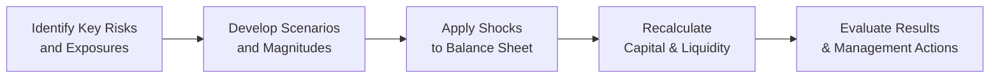

## Overview

Stress testing and scenario analysis are critical tools that help financial institutions—especially banks and insurance companies—evaluate how their balance sheets, income statements, and solvency positions might hold up under adverse conditions. Whether it’s a sharp jump in interest rates, a massive spike in unemployment, a sudden equity market crash, or some unimaginable global pandemic scenario, stress tests can reveal just how precarious (or resilient) a firm’s capital base might be. 

It’s worth noting that these exercises aren’t purely academic. Regulators worldwide typically demand robust internal stress testing processes. In fact, many large banks I’ve worked with have dedicated teams running complex multi-factor models. If you’ve never peeked at these models, they’re about as fun as trying to do your taxes by hand—yet they’re absolutely central to modern risk management. 

Anyway, in this section, we’ll break down stress testing and scenario analysis. We’ll dig into why they’re so important, run through a variety of methods, and see how regulators (like the Federal Reserve in the US or the European Central Bank) incorporate them into capital adequacy frameworks. We’ll also highlight some best practices for building credible and informative tests.

## Why We Need Stress Testing

Stress tests were catapulted into the limelight following real-life financial catastrophes—most famously, the global financial crisis of 2008. That crisis exposed how quickly extreme market events can shred bank capital, paralyze credit markets, and leave financial institutions scrambling to cover losses. Today, regulators want banks and insurers to produce internal and standardized stress tests to ensure they’re adequately prepared for potential crises. 

Here are a few reasons stress testing is pivotal:

• Capital Adequacy: It helps assess whether a bank or insurer holds sufficient buffers (equity, reserves, surplus) to absorb large losses.  
• Liquidity Management: Stress tests expose vulnerabilities in short-term funding and cash management under panic conditions.  
• Risk Appetite Setting: Institutions can use stress test outcomes to set or refine their risk appetite and exposure limits.  
• Transparency: Published stress test results (for instance, under Dodd-Frank in the US) enhance market discipline by letting investors, depositors, and other stakeholders see how institutions might fare in crisis scenarios.  

So, in short, stress tests help keep the financial system from going off a cliff by ensuring that major players have a plan when storms roll in.

## Regulatory Requirements and Approaches

Different regulatory authorities worldwide set out guidelines—sometimes quite detailed—on how banks and insurers should conduct stress testing. The Federal Reserve’s Comprehensive Capital Analysis and Review (CCAR) and Dodd-Frank Act Stress Tests (DFAST) in the United States are prime examples. Around the globe, we have the European Banking Authority (EBA) stress tests, the Basel Committee on Banking Supervision guidance, local central banks’ national or regional frameworks, and specialized insurance stress tests from bodies overseeing Solvency II (Europe) and RBC requirements (in the US).

Institutions often have to run:

• Macro Stress Tests: Based on macroeconomic variables—think GDP decline, unemployment spikes, plunging property prices—that drive large loan defaults and hamper revenue.  
• Market Risk Stress Tests: Suppose interest rates surge 300 basis points while equity markets drop 30%. These tests examine how such a shift impacts trading portfolios, liquidity, or mark-to-market assets.  
• Insurance-Specific Stress: Insurers address catastrophic event risk (e.g., hurricanes, earthquakes), pandemic risk, or tail events in mortality or longevity.  

Regulators expect stress tests to be forward-looking over horizons ranging from a few quarters to multiple years. This forward look tries to bridge immediate liquidity concerns (how fast can you get cash if outflows spike?) with medium-term capital adequacy (how much Tier 1 or RBC capital would remain after protracted losses?).

## Single-Factor vs. Multi-Factor Stress Tests

Stress tests can be extremely varied in complexity and scope. At their simplest, you have:

• Single-Factor Stress Test: “What if interest rates jump by 200 basis points overnight?”  
• Multi-Factor Stress Test: “What if unemployment hits 12%, equity markets crash 35%, and real estate drops by 25%—all at the same time?”

Banks often start with single-factor tests to get a feel for sensitivity. But let’s be real: in a genuine crisis, multiple factors can simultaneously move in terrifying ways. Multi-factor tests provide this more holistic perspective. One quick anecdote from my time analyzing a regional bank: their single-factor test for interest rates looked fine in isolation, but once we added real estate meltdown assumptions, the bank’s capital ratio buckled. That’s the power of multi-factor approaches—because real crises rarely cooperate by unfolding only one risk at a time.

## Scenario Analysis vs. Stress Testing

You’ve likely heard the term “scenario analysis” in the same breath as stress testing, and indeed these terms sometimes get used interchangeably. But scenario analysis is a broader concept, including:

• Baseline Scenario: A “most likely” path based on expected macro conditions.  
• Best-Case Scenario: Optimistic assumptions about economic growth, consumer confidence, etc.  
• Worst-Case Scenario (Stress Test): The extremely adverse environment to test resilience.  

Scenario analysis might incorporate not only adverse changes but also favorable conditions—banks might want to see how quickly they can grow their balance sheets if, say, interest rates remain extremely low and the economy expands. Stress tests focus heavily on negative shocks, though they often represent a subset of scenario analysis, zeroing in on capital depletion risk.

## Reverse Stress Testing

Reverse stress testing basically starts from the dreaded end state, typically insolvency or capital falling below a specified threshold, and then tries to figure out which conditions could lead to that outcome. It’s like saying: “If we were to become insolvent, what meltdown or chain of events could have possibly caused that, and how do we plan for it?” 

It might sound a bit unnerving to start with the meltdown scenario, but it’s a powerful exercise. Some real-world cases have shown that reverse stress tests can uncover weird correlations or lesser-known vulnerabilities that standard forward-looking models sometimes overlook. In the exam context, you might see a case study question describing a sequence of events that leads to capital depletion, and you’d be asked to identify which scenario or combination of factors triggered the meltdown.

## Key Elements of a Stress Test

A typical stress test usually involves:

1. Choosing Risk Factors: Could be interest rates, credit spreads, commodity prices, default rates, mortality rates (for insurers), or any key variable that can severely affect the balance sheet.  
2. Defining the Magnitude of Shock(s): “Interest rates rise by 300 bps,” “Equity prices drop by 40%,” “GDP declines by 6%,” etc.  
3. Applying the Shocks to the Portfolio: Modify the projected cash flows or carrying values of assets and liabilities, factoring in potential contagion or secondary effects.  
4. Recalculating Capital and Liquidity Ratios: For instance, we examine the effect on the capital adequacy ratio (CAR) under stressed conditions:  

   $$
   \text{CAR}_{\text{stress}} \;=\; 
   \frac{\text{Capital}_{\text{stress}}}{\text{RWA}_{\text{stress}}}
   $$

   where \\( \text{RWA}_{\text{stress}} \\) is the risk-weighted assets after applying the relevant stress factors.  
5. Evaluation and Action: If the institution fails the stress test—meaning capital ratios drop below thresholds—management and regulators might demand de-risking, capital injections, or other strategic changes.

## Modeling Risk and Limitations

Models rely heavily on historical data to estimate correlations and default probabilities. There’s a risk that the next crisis behaves totally differently. One classic example: The 2008 crisis was partly fueled by new kinds of securitized products (CDOs, mortgage-backed securities) that didn’t have a long enough, or relevant enough, historical record. 

For extreme scenarios, historical data can sometimes fail to capture tail events (think global pandemics). Hence, stress testers rely on domain expertise, judgment, and theoretically derived relationships in their simulations. This is a big challenge known as model risk: the danger that your model might lead you to false comfort about your resilience.

## Implementation Steps (Illustrated)

Below is a simple flowchart illustrating the typical workflow when compiling a stress test or scenario analysis for a financial institution:

1. Identify Key Risks & Exposures: Start by mapping out potential vulnerabilities, from consumer credit defaults to derivatives exposures.  
2. Develop Scenarios & Magnitudes: Create or select relevant macroeconomic or market scenarios, deciding how large and how fast each variable shifts.  
3. Apply Shocks to Balance Sheet: Translate scenario changes into revenue shortfalls, loan losses, investment impairments, or higher liability expenses (for insurers).  
4. Recalculate Capital & Liquidity: Stress test the capital ratios (Tier 1, RBC) and short-term liquidity coverage (LCR).  
5. Evaluate Results & Management Actions: If results are subpar, plan corrective measures—like raising capital or reducing risky exposures.

## Comparative Analysis Across Institutions

Analysts don’t just look at one bank or insurer’s stress test in a vacuum. Instead, they often compare results across peer institutions. For instance, if one bank’s stress test assumptions look suspiciously mild compared to peers—“Seriously? They’re only modeling a 1% rise in default rates?”—that might indicate potential underestimation of risk. 

From an exam standpoint, you might be shown a table of hypothetical stress test outcomes for multiple banks and asked to:

• Identify which bank is “most aggressive” in assumptions.  
• Discuss the key assumptions or data limitations.  
• Evaluate which institution’s capital buffer remains adequate or which might struggle under more realistic stress scenarios.

## Real-World Example: Federal Reserve’s CCAR

The Comprehensive Capital Analysis and Review (CCAR) in the United States is a prime real-life example. In CCAR, the Fed imposes hypothetical macro scenarios—like a global recession—and banks must estimate their losses, revenues, and capital ratios over a nine-quarter horizon. The Fed also runs a separate set of its own models to verify banks’ projections. 

If a bank fails these tests (meaning their post-stress capital ratio is below the regulator’s minimum), they could face restrictions on dividends, share buybacks, or even be forced to raise fresh equity. The results are published, which can create media buzz—nobody wants to be singled out as “failing” or “barely passing.” 

## Insurance Industry Nuances

Insurers also face macro risk, but they often focus more on underwriting claims or catastrophic events. For example, a stress test for an insurer might incorporate:

• Natural Catastrophes: Major hurricanes or earthquakes that burn through coverage limits.  
• Pandemic Scenarios: A huge spike in mortality or morbidity claims.  
• Market-Linked Annuities: A dramatic downturn in equity indices or bond yields that could force reserve strengthening.

In Europe, Solvency II sets capital requirements for insurers, mandating robust stress testing to ensure enough reserves. Reverse stress testing also helps insurers discover improbable events that could drain their reserves, such as a bizarre scenario where a natural disaster coincides with a massive equity crash.

## Reverse Stress Testing in Practice

Reverse stress testing differs from standard forward stress testing because it asks: “What set of events could wipe out our capital?” This approach is particularly useful for capturing black swan events or correlated tail risks.

For instance, you might imagine:

• A triple-whammy of simultaneous terrorist attacks, a severe global recession, and disruptions in supply chains.  
• Large-scale mortgage defaults that coincide with a derivative exposure meltdown.  
• A perfect storm for insurers: a prolonged pandemic with massive claims, combined with a severe drop in asset values.

By starting from a capital depletion scenario, an institution can identify and prepare for previously unconsidered triggers or hidden risk concentrations.

## Best Practices

1. Involve Multiple Teams: Risk, finance, treasury, front-office, and actuarial (for insurers) teams should all collaborate.  
2. Align with Strategy: Use stress test results to adjust risk appetite and business strategy.  
3. Validate Models Regularly: Backtest them against historical instances. Update them if new products or markets come into play.  
4. Transparency and Documentation: Keep detailed records of assumptions. Regulators expect clarity on scenario setting and methodology.  
5. Deeper Governance: Engage senior managers and boards of directors. They should actively review and challenge stress test methodologies.  

## Exam Focus and Tips

On the CFA exam, you could see constructed response or item set questions testing your ability to:

• Analyze the adequacy of a bank’s or insurer’s stress testing methodology.  
• Compare one institution’s stress test performance to another’s.  
• Discuss the limitations of historical data or model assumptions.  
• Interpret stress test results in the context of liquidity, solvency, or profitability.  
• Explain the importance of reverse stress testing, especially for tail risk events.

A common pitfall is to ignore the link between stress tests and capital planning. In an exam scenario, if a bank’s results show it dips below required capital under stress, the next question might be: “What capital management actions should the bank consider?” If you can connect stress test outcomes to practical managerial solutions, that’s typically what examiners love to see.

## Conclusion

Stress testing and scenario analysis are imperative, not just for regulatory compliance but for prudent risk management. They help financial institutions see around the corner—to spot potential threats that, while unlikely, could wreck capital and erode stakeholder confidence. Many banks and insurers have discovered that simply going through the motions of these tests isn’t enough: a real, serious deep-dive can reveal hidden vulnerabilities and accelerate strategic guidelines for sustainability.

Whether you’re analyzing a bank’s shift in interest-rate risk, an insurer’s catastrophic event exposure, or a global financial institution’s combined macro meltdown scenario, stress tests remain one of the best lines of defense. Indeed, done right, these tests are a crucial step toward building shock-resistant balance sheets and reinforcing trust in our financial system.

## References

• Stress Testing at the IMF – https://www.imf.org/  
• Federal Reserve Stress Test Publications (CCAR & DFAST) – https://www.federalreserve.gov/  
• Principles for Sound Stress Testing Practices and Supervision by the Basel Committee on Banking Supervision  
• Solvency II (EU Directive) for Insurers – https://ec.europa.eu/info/business-economy-euro/banking-and-finance/insurance-and-pensions  
• EBA (European Banking Authority) Stress Testing – https://www.eba.europa.eu/  

## Test Your Knowledge: Stress Testing & Scenario Analysis Quiz



### Which of the following best describes the primary goal of regulatory stress testing for banks?

- [ ] To optimize dividend payout levels in a baseline economic scenario
- [x] To evaluate capital adequacy under plausible adverse economic conditions
- [ ] To determine best-case growth scenarios and expansion strategies
- [ ] To identify deterministic outcomes with zero subjectivity

> **Explanation:** Regulatory stress tests focus on ensuring that banks retain sufficient capital buffers under severely adverse economic scenarios, thus promoting financial system stability.

### From a scenario analysis perspective, which statement is most accurate?

- [ ] Scenario analysis applies only to credit risk.
- [x] Scenario analysis includes both adverse and favorable conditions, providing a comprehensive evaluation of different possible futures.
- [ ] Scenario analysis and stress tests are identical in every way.
- [ ] Scenario analysis focuses exclusively on interest-rate risk.

> **Explanation:** Scenario analysis is broader and includes multiple future states—both bad and good. Stress testing, by contrast, zeroes in on adverse outcomes.

### Reverse stress testing is best described as:

- [ ] Starting with moderate, realistic economic assumptions and moving forward.
- [ ] Setting the maximum plausible capital ratio first and then backing into solvency scenarios.
- [x] Identifying the event or series of events that could cause capital adequacy to fall below acceptable thresholds, and then working backward to see how those events might arise.
- [ ] Focusing exclusively on single-factor shocks while ignoring multi-factor correlations.

> **Explanation:** Reverse stress testing begins by assuming a failure point (such as insolvency) and then determines what correlated events could realistically produce that effect.

### In a worst-case scenario focused on interest rates, a bank most likely tests:

- [x] A rapid and large upward shift in interest rates that impacts net interest margins, bond valuations, and borrower default rates.
- [ ] A scenario in which interest rates remain unchanged for three years.
- [ ] A mild economic downturn with stable inflation levels.
- [ ] A scenario centered on extremely low loan default rates.

> **Explanation:** A typical worst-case scenario with respect to interest rates involves a large and abrupt rate hike, pressuring capital via both decreased asset values and potential borrower defaults.

### Which of the following is a core challenge in designing effective stress tests?

- [x] Historical data may not reflect future extreme events, requiring judgment or expert overlays.
- [ ] Regulators rarely provide instructions on scenario parameters.
- [ ] Management has unlimited freedom to choose the easiest assumptions possible.
- [ ] Market prices remain static, so stress tests can ignore changes in volatility or liquidity.

> **Explanation:** Historical data limitations represent a core difficulty in modeling tail risk or new, unprecedented events.

### An insurance company emphasizing pandemic risk in its stress tests would primarily be concerned about:

- [x] High mortality or morbidity rates leading to large claim outflows and reserve strengthening.
- [ ] Low real estate prices impacting mortgage-backed securities.
- [ ] Rapid interest rate hikes reducing the value of fixed-rate loans.
- [ ] Minor fluctuations in foreign exchange rates.

> **Explanation:** A pandemic would drive surging claims (mortality or health), leading to significant reserve usage—critical for an insurer’s solvency.

### Under the Comprehensive Capital Analysis and Review (CCAR), the Federal Reserve essentially:

- [x] Provides standardized macroeconomic scenarios and reviews how major banks’ capital holds up over a multi-quarter horizon.
- [ ] Only reviews interest rate risk exposure for small community banks.
- [ ] Conducts reviews for insurance companies but not banks.
- [ ] Permits banks to pick favorable scenarios without regulatory oversight.

> **Explanation:** CCAR subjects large banks to severe macro scenarios over a nine-quarter horizon and assesses capital adequacy. Results can restrict capital actions like dividends.

### A multi-factor stress test might involve simultaneously shocking:

- [x] Unemployment, interest rates, and equity prices.
- [ ] Only one macro variable, such as unemployment.
- [ ] Micro-level operational risks without macro-level influences.
- [ ] None of the above.

> **Explanation:** A multi-factor test accounts for the joint movement of multiple economic and market variables—often crucial in capturing realistic recessionary impacts.

### The process of “Reverse Stress Testing” is especially beneficial for uncovering:

- [x] Hidden correlations and unrecognized tail risks that standard forward-looking models might overlook.
- [ ] Straightforward remedies for minor, immediate threats.
- [ ] Predictable, standard interest-rate risk exposures found in baseline budgets.
- [ ] Automatic solutions to liquidity management challenges.

> **Explanation:** Reverse stress tests come from the end-state of capital depletion and trace backward. This often reveals new vulnerabilities or unusual correlations.

### True or False: A major side benefit of publishing stress test outcomes is increased transparency for investors, regulators, and other stakeholders.

- [x] True
- [ ] False

> **Explanation:** Publicly disclosed stress test results are intended to build market confidence and inform investors about the institution’s resilience and risk management capabilities.




