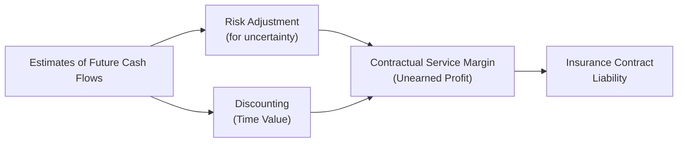

## Overview

Insurance contracts can sometimes feel like a maze of technicalities: there are mortality assumptions, discount rate curves, risk adjustments, all sorts of margin calculations, and you name it. To me, it once felt like deciphering a code I accidentally stumbled upon in an old movie. Anyway, in today’s discussion, we’ll try to demystify key aspects of insurance contract liabilities, with a particular spotlight on discount rate assumptions and how they shape the financial statements of insurance companies. We’ll cover how insurers measure these liabilities under commonly adopted guidelines like IFRS 17, and we’ll even talk about how statutory reserves differ from international or GAAP-based valuations. 

Feel free to think of this topic as the heart of what keeps insurance companies financially healthy—and, at the same time, a major area that can cause confusion when you’re reading their financial statements. By the end, you should have a solid sense of how insurance liabilities are set up, why assumptions matter, and how to interpret them when conducting financial analysis. 

## Key Concepts of Insurance Contract Liabilities

Before diving into discount rates, let's briefly break down the fundamental components of insurance contract liabilities. An insurer’s liabilities (often referred to as reserves) represent the amount an insurer expects—or is required by statute—to set aside to cover future claims, benefits, and related expenses stemming from in-force policies. 

In IFRS 17 terms, there are three main building blocks in measuring these liabilities:

1. Best Estimate of Future Cash Flows:  
   • Encompasses all expected policyholder benefits, claims, expenses, and premiums over the contract’s life.  
   • Includes assumptions about mortality, morbidity, lapses, and other policyholder behavior.  

2. Risk Adjustment:  
   • Represents a margin to compensate the insurer for the uncertainty in timing and amount of future cash flows.  
   • Effectively the “shortness-of-breath” factor if actual outcomes deviate unfavorably.  

3. Contractual Service Margin (CSM):  
   • Recognizes expected future profit component from each contract.  
   • Released over time as insurance services are provided.  

## Why Discount Rate Assumptions Matter

We know that money has a time value; a dollar today is worth more than a dollar a few years from now. Insurance companies often have very long-dated obligations, especially in life insurance or annuity products. That said, how you discount all those future payouts to present value can dramatically change the reported liabilities.

• A higher discount rate = lower present value of future claims.  
• A lower discount rate = higher present value of future claims.  

This discount rate puzzle is a cornerstone in insurance accounting. Small changes in discount rates can cause big swings in an insurer’s reported earnings and equity. It’s kind of like flipping a small lever on a big machine and watching the entire thing shift in surprising ways. 

## Methodologies for Measuring Liabilities

### Prospective Approach

Under IFRS 17, insurers typically use a prospective or “forward-looking” method. This approach projects all future policy-related cash flows—claims, premiums, expenses—and discounts them back to the balance sheet date.

• Considers the most recent assumptions about mortality, morbidity, policyholder behavior, and interest rates.  
• Recognizes adjustments for risk and for any unearned profit (the CSM) in the measurement.  

This approach means if interest rates drop or if new mortality tables project us to live longer, insurers must update their estimates. The prospective approach (at least in principle) helps ensure that the reserves remain a reflection of “current best estimates” rather than stale assumptions from the initial policy issuance date.

### Retrospective Approach

Some insurers historically used retrospective approaches—particularly in older GAAP and local statutory frameworks—where reserves are based on accumulated “past” premiums and credited investment returns, minus claims. Although IFRS 17 generally requires a prospective measurement, you might still see references to retrospective methodologies in certain traditional or statutory contexts.

## IFRS 17 and Its Core Elements

IFRS 17 replaced IFRS 4 for annual reporting periods beginning on or after January 1, 2023 (with some jurisdictions adopting slightly different dates). It aims to provide a consistent measurement framework:

• Current assumptions of future cash flows (no more “set it once, forget it forever”).  
• Discount rates consistent with characteristics (currency, timing) of the projected cash flows.  
• Explicit separation of risk adjustment and a contractual service margin that defers recognition of unearned profits.  

From an analyst’s perspective, IFRS 17 demands more transparency in how assumptions are derived and updated—and that’s (hopefully) great news if you like clarity when reading financial statements.

## Statutory Reserves vs. IFRS/GAAP Reserves

Now, a little anecdote. I once had a chat with an actuary friend who said, “You’d think IFRS reserves and statutory reserves would match up nicely, but sometimes it’s like comparing apples to avocados.” That’s indeed the case: statutory reserves are often mandated by local regulators to ensure solvency and protect policyholders in worst-case scenarios. They can follow very conservative guidelines—older mortality tables, minimal assumption changes, or artificially low discount rates. 

Meanwhile, IFRS or GAAP-based reserves attempt to represent more up-to-date best estimates of the liabilities. This can lead to big differences in the reported numbers. Analysts, therefore, typically review both statutory financial statements (to assess solvency) and IFRS financial statements (to assess profitability trends).  

## Exploring Discount Rate Approaches

### Characteristics of the Cash Flows

IFRS 17 suggests discount rates that reflect the time value of money and the characteristics of the liability’s cash flows—mainly their timing and currency. Insurers might use:

• Top-Down Approach: Begin with an actual or reference portfolio yield for assets with similar liquidity and duration, then strip out default risk, liquidity premium, etc.  
• Bottom-Up Approach: Start with a risk-free yield curve in the appropriate currency, then add liquidity premiums that reflect the illiquidity of insurance liabilities.  

This might get complicated in practice. For long-duration life contracts—with terms 20 or 30 years out—insurers rarely have perfect matching assets. They may rely on model-based extrapolations of yield curves for the far end of the maturity spectrum. That’s a fancy way of saying: “We just guess how discount rates evolve for the next few decades,” hopefully in a systematic, transparent manner.

### Effect of Interest Rate Environments

Imagine you’re analyzing a life insurer in a low-rate environment. The discount rate used for a 30-year liability is going to be quite low, which drives up the present value of future obligations. This often compresses profitability, because the insurer might have priced products assuming a higher yield environment—suddenly it’s facing bigger liabilities. 

In a high-rate environment, the reverse might happen—liabilities get discounted at a higher rate, driving down their present value. The insurer might look super profitable in the short run. However, remember that its assets might also have changed in fair value if they’re bond portfolios marked to market. So it’s never just about liabilities alone—you have to weigh assets and liabilities together to see the net effect on an insurer’s balance sheet.

## Remeasurements and the Impact on Financial Statements

One hallmark of IFRS 17 is that when assumptions change—be it mortality estimates, lapses, or discount rates—insurers must remeasure. Changes in estimates of future cash flows adjust the CSM to the extent that they relate to future service. Changes in discount rates or the effect of interest accretion pass through profit or loss or other comprehensive income, depending on the insurer’s accounting policy election. 

• Adverse experience (e.g., higher claims than expected) lowers the CSM or margin recognized in the period.  
• Decreasing discount rates increase liabilities, potentially leading to immediate hits to net income or equity (depending on how the insurer classifies that effect).  

## Sensitivity Analysis and Changing Assumptions

Just like with bond duration, life insurance liabilities can be highly sensitive to discount rate changes. Insurers typically disclose sensitivities in their notes. For instance:

• A 100-basis-point drop in discount rates might increase liabilities by, say, 8%.  
• A 10% increase in mortality rates (meaning more deaths, ironically for life insurance) might further raise liabilities by 2%.  

These disclosures help you gauge how vulnerable the insurer might be to interest rate or demographic shocks. If you see bigger swings in sensitivity analyses from one period to the next, that might mean the company has changed product mix or updated assumptions about longevity or investment return patterns.

## Life Insurance vs. Property & Casualty

To keep it simple, property and casualty (P&C) insurers often have shorter liability durations: a car accident claim typically doesn’t stretch out 30 years, yet a life insurance death benefit can. Because of these shorter durations, discount rates can be less of a focus in P&C. Instead, the bigger question is claim severity and frequency assumptions for short-tail lines. But for life insurers, discount rate assumptions can overshadow all other factors if the liabilities are truly long-tailed.  

## Embedded Value (EV) Considerations

Embedded Value is a methodology that tries to measure the economic value of an insurer—particularly relevant in life insurance. It sums:

1. Net Asset Value: The adjusted net worth on the insurer’s balance sheet.  
2. Present Value of Future Profits: Discounted expected profits on in-force business (minus frictional costs, etc.).  

Critically, the discount rate for the in-force business is paramount. A small tweak can drastically change the EV. This ties back to the real significance of discount rates in insurance: they’re not just a theoretical exercise in measuring risk—they directly tie to how much an insurer is “worth,” especially for life products with a long horizon.

## Accounting Flows: A Quick Visual

Let’s explore a simple diagram to illustrate the building-block approach under IFRS 17.  

In this simplified diagram:  
• We start with estimates of future cash flows (A).  
• We add a risk adjustment (B) for uncertainty.  
• We then incorporate discounting (D).  
• We end up with the CSM (C) and the final liability measurement (E).  

## Practical Example: Long-Duration Life Policy

Say an insurer issues a 20-year life policy. The total expected claims over that period come to ±$100 million in current dollar terms. Using a discount rate of 4%, the present value might be $67 million. Now, if interest rates drop to 2.5%, that present value might rise to $74 million. That’s a $7 million jump in liabilities just because of discount rates—equivalent to 10% of the original PV. Insert changes in mortality assumptions (maybe we now think policyholders will live longer, meaning fewer or later claims for certain types of insurance, or more for annuities), and we can see how volatile these numbers can be.  

## Analyzing Liability Roll-Forward

Nearly every major insurer’s annual report will feature a liability “roll-forward” or reconciliation table, which will show:

• Beginning-of-year liability.  
• Interest accretion (unwinding of the discount).  
• Changes due to updated experience.  
• Changes due to updated assumptions.  
• Ending liability.  

If you see a substantial jump under “assumption changes,” consider investigating the reason. Perhaps discount rates were updated to reflect new yield curves. Or maybe the company realized its historical mortality assumptions were too optimistic. Even if it’s a small line item, it could be the canary in the coal mine for potential future changes.

## Common Pitfalls and Challenges

• Overreliance on a Single Assumption: Don’t just focus on discount rates. Mortality, morbidity, and lapse rates can be equally impactful.  
• Confusion Between Statutory vs. IFRS Reserves: These can look dramatically different. Make sure you know which you’re analyzing.  
• Hidden Sensitivity in the Footnotes: Sometimes the biggest clues are tucked away in sensitivity tables or disclaimers about how assumptions might change.  
• Inconsistent Disclosures Across Jurisdictions: Some insurers might not break out discount changes as clearly as others, making cross-company comparisons tough.  

## Best Practices for Analysts

• Read the Actuarial Opinions or Actuarial Supplements: They often detail the assumptions used, any margins for adverse deviation, and the insurer’s approach to discount rates.  
• Perform Scenario Analysis: If you’re building your own model, see how insurer profitability or solvency changes if discount rates move 100 bps up or down.  
• Compare Historical Assumptions to Actual Experience: This helps you see whether management historically overshot or undershot their assumptions.  
• Don’t Forget about Asset-Liability Matching: For a holistic view, examine the interest-rate sensitivity on both sides of the balance sheet.  

## Putting It All Together

Insurance contract liabilities, especially under IFRS 17, incorporate a blend of best-estimate assumptions, risk adjustments, and discounting that can be significantly impacted by changing market conditions. As an analyst, you’ll want to keep an eye on:

• How well the insurer’s discount rate methodology aligns with the duration, currency, and liquidity characteristics of its liabilities.  
• The potential for remeasurement gains or losses if interest rates move unexpectedly.  
• Differences between statutory, GAAP, and IFRS valuations, so you aren’t blindsided by local solvency metrics vs. global reporting frameworks.  

Ultimately, analyzing these liabilities requires both quantitative chops—like comparing discount rate curves or performing scenario analysis—and qualitative judgment about how realistic or conservative an insurer’s assumptions are. 

## Exam Relevance for CFA Candidates

On the CFA exam, you might see scenario-based questions involving remeasurements. They could give you changes in discount rates or changes in mortality assumptions, and you’d need to figure out how the insurer’s liabilities and net income are affected. Or perhaps they’d show you a partial set of footnotes about the liability roll-forward, and you’d have to identify the reasons for an increase in reserves. Don’t be surprised if you also see references to IFRS 17’s requirement for prospective measurement vs. a local GAAP or statutory approach. 

Takeaway? Familiarize yourself with the building-block measurement model and be ready to interpret sensitivity disclosures. Also, keep in mind the interplay with other financial statements: changes in discount rates might inflate or deflate equity if they run through Other Comprehensive Income (OCI).  

## References for Further Study

• IFRS 17 Text:  
  https://www.ifrs.org/issued-standards/list-of-standards/ifrs-17-insurance-contracts/  

• “Actuarial Mathematics for Life Contingent Risks” by Dickson, Hardy, and Waters  
  (A deeper dive into valuation and modeling approaches—great if you want to become an actuarial whiz).  

• “Insurance Accounting Under IFRS 17” by PwC  
  (Contains real-world implementation stories and case studies).  

• Other Chapters in This Volume  
  (See especially Chapter 7: Long-Term Liabilities and Equity, and Chapter 14: Sections 14.1–14.7 for broader context on insurance and banking analysis).  

• Industry Guides and Regulatory Dashboards  
  (Local regulators often publish frameworks for statutory reserving, so check those if you’re analyzing a specific region).  

## Test Your Knowledge: Insurance Contract Liabilities and Discount Rates



### Which of the following components of an insurance liability under IFRS 17 represents the unearned profit in an insurance contract?

- [ ] Risk Adjustment  
- [x] Contractual Service Margin (CSM)  
- [ ] Discount Margin  
- [ ] Deferred Profit Liability  

> **Explanation:** Under IFRS 17, the CSM is the component in the measurement of an insurance contract that reflects the unearned profit. It is released into profit or loss over the coverage period as services are provided.

### Under IFRS 17, if discount rates decrease significantly, how does this generally affect the present value of future insurance liabilities?

- [x] It increases the present value of the liabilities.  
- [ ] It has no effect under IFRS 17 rules.  
- [ ] It decreases the present value of the liabilities.  
- [ ] It increases the CSM but not the liability.  

> **Explanation:** A lower discount rate raises the present value of future outflows, resulting in a higher reported liability on the balance sheet.

### Which of the following is most likely to cause a significant upward revision in insurance contract liabilities for a life insurer?

- [x] Lower interest rates and higher longevity assumptions.  
- [ ] Higher interest rates and lower expense assumptions.  
- [ ] Unexpected short-term policy lapses.  
- [ ] Stable interest rates and mortality in line with estimates.  

> **Explanation:** Lower interest rates increase the present value of liabilities, and higher longevity assumptions often raise estimated cash outflows, thereby increasing overall reserves.

### What is one reason statutory reserves might differ from IFRS 17 reserves?

- [ ] Statutory reserves always use a higher discount rate.  
- [x] Statutory reserves may be based on conservative assumptions set by regulators.  
- [ ] IFRS 17 requires the use of retrospective methods, whereas statutory reserves use prospective.  
- [ ] Statutory reserves are purely for internal reporting.  

> **Explanation:** Statutory reserves are typically mandated by local regulations and often employ conservative assumptions, which can diverge significantly from the best-estimate approach required by IFRS 17.

### Under IFRS 17, which statement is true regarding the risk adjustment?

- [ ] It includes the entire unearned profit on the contract.  
- [x] It reflects the uncertainty about amount and timing of future cash flows.  
- [ ] It is always calculated using a bottom-up discount approach.  
- [ ] It can be released only on contract inception.  

> **Explanation:** The risk adjustment is an explicit addition to the liability to account for the uncertainty in the timing and amount of the insurance cash flows.

### A prospective measurement of liabilities primarily focuses on:

- [x] Projecting future premiums, claims, and expenses and discounting them to present.  
- [ ] Summing historical premiums and claims paid to date for a net reserve figure.  
- [ ] Minimal changes from period to period once the reserve is established.  
- [ ] Regulatory minimums that are not subject to remeasurement.  

> **Explanation:** Prospective methods involve forecasting future cash flows and bringing them back to the present using an appropriate discount rate, reflecting the most current assumptions.

### How does IFRS 17 generally handle changes in discount rates for long-duration contracts?

- [ ] Changes are ignored until the contract reaches maturity.  
- [x] Changes may affect the liability and are recognized in profit or loss or OCI, depending on the insurer’s policy.  
- [ ] Changes only affect the CSM and do not change total liability.  
- [ ] Changes in discount rates only affect asset valuations, not liabilities.  

> **Explanation:** Under IFRS 17, updates in discount rates can lead to remeasurements of the contract liability. These remeasurements are recognized either in profit or loss or in OCI, consistent with the insurer’s accounting policy choice.

### Why is sensitivity disclosure important in analyzing insurance companies?

- [x] It reveals how changes in key assumptions like discount rates or mortality can impact liabilities and equity.  
- [ ] It is only provided to comply with import/export regulations.  
- [ ] It replaces the need for any historical income statement.  
- [ ] It ensures that companies do not issue long-duration policies.  

> **Explanation:** Sensitivity disclosures help analysts see potential volatility in financial results if assumptions deviate from current estimates.

### A life insurer’s liabilities are more sensitive to discount rates than a P&C insurer’s primarily because:

- [ ] Life insurers do not discount their liabilities at all.  
- [ ] P&C insurers have better underwriting.  
- [ ] Life insurers hold fewer assets.  
- [x] Life insurance contracts often have a much longer duration than P&C contracts.  

> **Explanation:** Life insurance contracts typically extend over decades, making the liability valuation highly sensitive to changes in discount rates. P&C liabilities, such as auto or homeowners’ claims, are usually shorter term.

### True or False: Under IFRS 17, adverse experience (e.g., higher claims than expected) usually decreases the contractual service margin (CSM) if it relates to current or past service.

- [x] True  
- [ ] False  

> **Explanation:** When actual experience deviates from assumptions in a way that affects current or past service, the difference cannot be deferred and generally reduces the CSM or is recognized in profit or loss (depending on the nature of the change).


